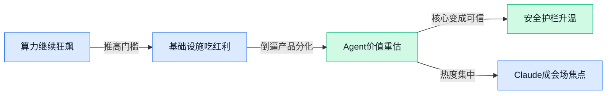

> AI 早报 · 每日早读 · 全网深度聚合

## **今日摘要**

```
Meta 造出“AI 版扎克伯格”直接下场管员工，Anthropic Mythos 被推入银行测试，政商边界骤然升温
CoreWeave 融资狂飙、台积电或连四季创新高，AI 算力需求把芯片与云基础设施一起拉爆
Anthropic 开源 Claude Cookbooks，HumanX 现场人人都在聊 Claude，Claude Code 配额 1.5 小时耗尽引争议
```

### 🔵 产品与功能更新

1. **Meta 打造“AI 版扎克伯格”与员工互动。**
据《金融时报》报道，Meta 正在构建一个能代表马克·扎克伯格与员工交流的 **AI 版本人物**，核心方向是把高管沟通进一步产品化 💡。这类做法的看点在于，它不只是普通聊天机器人，而是更贴近特定人物表达方式的 **数字化分身**（用 AI 模拟个人说话和回应风格的系统）。从产品与功能更新角度看，这反映出 Meta 正把 **生成式 AI** 更深地嵌入内部协作与沟通场景，值得继续关注其实际使用范围与反馈。[金融时报相关报道(briefing)](https://news.google.com/rss/articles/CBMihAFBVV95cUxPcWRsVTAzWDBkc3daQlRFZGZYYjdsd1BfNnBiSG9LT1JXb3NvcFE3Q0RId2ZwNUtPZlpGaEpwd2pGLTRQaExYR3Q3MERuN0VQVlBCWGs5Mzc2bXhJdGN6Snl0bW5ZVEliR2tScGgtb0JqMHNlYmo1bk92VnkxVlBfcEo2WmY?oc=5) 🚀

### 🟢 前沿研究

1. **PRAGMA：Revolut 提出面向金融场景的基础模型家族。**
这篇论文聚焦**金融交易数据**和**事件级数据**，提出了名为 **PRAGMA** 的基础模型家族，用来处理**多源银行卡支付数据**中的复杂信号 💳。它想解决的是：现代金融系统数据量巨大、来源又杂，怎样把这些信息统一建模并挖出有用的经济规律。对做风控、分析和金融智能化的人来说，这类工作很有代表性，因为它把**行业专用基础模型**的思路往前推了一步。[arXiv 论文摘要(briefing)](https://arxiv.org/abs/2604.08649)

2. **AlphaLab：让多智能体自动跑完整个科研实验闭环。**
**AlphaLab** 试图把前沿大模型的 **Agent（可自主执行任务的智能体）** 能力，用到**定量优化**和**高计算量研究**里 🧪。论文称，它可以在只给出高层研究目标的情况下，自动推进从实验设计到执行的完整周期，目标是实现更自主的科研流程。简单说，这不是只会“写点代码”的助手，而是朝着**自动化研究系统**更进一步的尝试。[arXiv 论文摘要(briefing)](https://arxiv.org/abs/2604.08590)

3. **Ranked Activation Shift：提升模型识别“分布外数据”的稳定性。**
这项研究关注 **Out-of-Distribution Detection（分布外检测，指识别不属于训练分布的数据）**，也就是模型怎样发现“这不是我熟悉的输入” 👀。作者指出，现有不少**后处理检测方法**依赖中间层激活编辑，但在不同数据集和模型上表现并不稳定；他们提出 **Ranked Activation Shift**，尝试改善这种不一致问题。对实际部署来说，这类工作很关键，因为它直接关系到模型遇到陌生样本时能否及时“踩刹车”。[arXiv 论文摘要(briefing)](https://arxiv.org/abs/2604.08572)

4. **HiFloat4：面向昇腾 NPU 的语言模型预训练新数值格式。**
这篇论文讨论的是大模型训练里非常现实的一件事：**算力成本**和**内存开销**太高了 ⚙️。作者提出 **HiFloat4**，这是一个面向 **Ascend NPU（昇腾神经网络处理器）** 的新格式，目标是支持语言模型更高效地进行**预训练**。如果说模型架构是在拼“脑子”，那这种底层数值格式更像是在优化“身体素质”，对训练效率和部署成本都很关键。[arXiv 论文摘要(briefing)](https://arxiv.org/abs/2604.08826)

5. **CORA：给手机 GUI 智能体加上“风险控制护栏”。**
随着 **GUI Agent（图形界面智能体）** 借助 **VLM（视觉语言模型，能同时理解图像和文字的模型）** 开始从“辅助操作”走向“自主操作”，误点、误操作带来的风险也明显上升 📱。**CORA** 的核心目标，就是为移动端 GUI 自动化加入**风险受控**机制，让智能体在执行操作时更有边界感。论文尤其强调“safeguarded（受保护的）”这一点，说明研究重点不只是让它更会点按钮，而是让它更安全地替你点按钮。[arXiv 论文摘要(briefing)](https://arxiv.org/abs/2604.09155)

6. **CSAttention：瞄准长上下文推理瓶颈，加速 LLM 推理。**
长上下文大模型越来越依赖超长提示词和可复用前缀，这让**注意力计算**和 **KV-cache（缓存键值对，用来加速生成）** 成了推理阶段的大瓶颈 ⏳。**CSAttention** 提出一种 **Centroid-Scoring Attention** 方法，目标是进一步提升 LLM 在这类场景下的推理效率。对 Agent 和企业知识问答来说，这个方向很实用，因为大家现在最头疼的往往不是“能不能回答”，而是“回答得够不够快、够不够省”。[arXiv 论文摘要(briefing)](https://arxiv.org/abs/2604.08584)

7. **EquiformerV3：面向 3D 原子建模的新一代等变图注意力 Transformer。**
**EquiformerV3** 关注的是 **3D atomistic modeling（3D 原子级建模）**，也就是在分子、材料等场景中建模三维结构的性质 🧬。论文围绕 **SE(3)-equivariant（对三维旋转和平移保持一致性的）** 图神经网络展开，试图同时提升**效率**、**表达能力**和**物理一致性**。这类研究虽然离日常应用稍远，但它是 AI 进入材料科学、药物发现等硬核领域的重要基础设施。[arXiv 论文摘要(briefing)](https://arxiv.org/abs/2604.09130)

8. **一篇论文尝试用单一二元算子表达所有初等函数。**
这项工作标题就很“数学味”：**All elementary functions from a single binary operator**，核心是在探讨是否能从**一个二元算子（接受两个输入的运算规则）**出发，构造出所有**初等函数** ✍️。虽然摘要非常简短，但从标题就能看出，它更偏基础理论而非直接应用。对 AI 圈来说，这类论文未必立刻变成产品能力，却可能影响我们对**计算表达形式**和**函数构造**的底层理解。[arXiv 论文页面(briefing)](https://arxiv.org/abs/2603.21852)

### 🟡 行业展望与社会影响

1. **CoreWeave 融资狂飙，AI 基础设施吸金速度惊人。**
从标题信息看，CoreWeave 在短短几天内就拿到**数百亿美元级别**资金，凸显出市场对 **AI 基础设施**（支撑模型训练与运行的算力、数据中心等底层能力）的押注有多激进 💰。这类资金流向也说明，行业竞争早已不只是拼模型本身，更是在拼谁能更快拿到**算力资源**与建设能力。对整个产业来说，这会进一步抬高进入门槛，也让“卖铲子”的基础设施公司持续受益 🚀。[Fortune 相关报道(briefing)](https://news.google.com/rss/articles/CBMitAFBVV95cUxOT2h6YU5HNjM2Nk9ORTBzb0JNT2NXX1FhT0hZdHFadzFyVGNNWEdCV1V3Q3ZTVS11MEYweUNYQ0dwUU4xZTFoaktFbmRhN3QtamZLb1BrY3JkejJXSS1iWUdFWVFwTUUtTlFVOFAwRDRSMTBQcnREZU1XVG0zb1pzZjg2TU5wZkpuZi04bmZGWEVsU0RhZ01YV0hQZlEycHBUeHp1VDBBLUJxVnlxOHlIMjJWcUk?oc=5)


2. **台积电或将连四季创新高，AI 需求把芯片景气度继续拉满。**
路透标题直接点出，台积电大概率将录得**连续第四个季度创纪录利润**，核心驱动力就是“停不下来的” **AI 需求** 📈。这说明 AI 热潮的外溢效应已经非常明确：不仅模型公司受益，上游的**芯片制造**与供应链同样在吃到红利。对产业观察者来说，台积电的业绩表现也像一面温度计，能侧面反映全球 AI 投资热度是否还在持续升温 🔍。[路透完整报道(briefing)](https://news.google.com/rss/articles/CBMizgFBVV95cUxPVDlubVppNDRWVEVzemdMd3oydHYwRHZUYWJGdEdWMy1vSkR5VTU5M2hUeVdYc0c2c2MyNUVwb2FVNDRxNVVMNDFxbWxEV1gxUXBxa29BZnpCaUVUMFVRbDNLLWhZVGFVZ0toQnpJTWpETmllWDZOSGFnOVpIb1dXV1ZELUtnME5hQ2J2MVdGMGlYNHNzeTY4VmI2Z2VTcll6R01XOFY0b3pnR1pNd2ctRFBtdWlhc2FxT1k0aGZvbXl4dElvOFVnMGdtd09uQQ?oc=5)

3. **HumanX 大会现场，人人都在聊 Claude。**
TechCrunch 报道称，在旧金山这场以 AI 为核心的 HumanX 大会上，**Anthropic** 几乎成了全场焦点，大家讨论最多的就是 **Claude** 🧠。这类会场风向很有代表性：它不一定等于市场最终格局，但往往能提前反映出从业者、投资人和企业客户当下最关心谁。换句话说，Claude 这波不是单纯刷存在感，而是已经进入行业中心话题区了 💡。[TechCrunch 现场报道(briefing)](https://techcrunch.com/2026/04/12/at-the-humanx-conference-everyone-was-talking-about-claude/)

4. **Anthropic 的 Mythos 模型据报被鼓励进入银行测试，政商边界再引关注。**
TechCrunch 援引消息称，特朗普阵营相关官员可能在鼓励银行测试 Anthropic 的 **Mythos 模型** 🏦。这件事之所以格外敏感，是因为报道同时提到，美国国防部最近才将 Anthropic 认定为**供应链风险**，前后信号明显不一致。对行业而言，这反映出 **AI 监管、政府立场与商业落地** 之间的关系正在变得更复杂，也让模型公司与关键行业的合作更具政策色彩 ⚖️。[TechCrunch 相关报道(briefing)](https://techcrunch.com/2026/04/12/trump-officials-may-be-encouraging-banks-to-test-anthropics-mythos-model/)

5. **Sam Altman 回应《纽约客》争议报道，AI 领军人物的舆论风险持续放大。**
TechCrunch 报道称，OpenAI CEO **Sam Altman** 发博客回应《纽约客》一篇被他称为“煽动性”的文章，同时也提到其住处疑似遭袭一事。事件把公众再次拉回到一个现实问题：AI 公司的影响力越大，创始人本人承受的**舆论审视**与个人安全风险也越高 😶。这已经不只是企业公关层面的插曲，而是 AI 头部人物如何面对媒体叙事、公众情绪与外部攻击的综合挑战。[TechCrunch 完整报道(briefing)](https://techcrunch.com/2026/04/11/sam-altman-responds-to-incendiary-new-yorker-article-after-attack-on-his-home/)

6. **多智能体协作怎么选，关键看任务复杂度与升级路径。**
这篇指南系统拆解了 **五种多智能体协作模式**，重点讲清楚它们各自的运作方式、优缺点，以及该在什么场景下使用 🤖。所谓**多智能体**，可以理解为让多个 AI 角色分工配合，而不是只靠一个模型包打天下；好处是更适合复杂流程，但设计不当也容易让系统变复杂。文章的实用价值在于，它不仅讲“怎么搭”，还提醒你遇到瓶颈时该如何平滑升级框架，特别适合正在思考 AI 工作流（由 AI 串起的任务流程）落地的团队 🔧。[多智能体协作指南(briefing)](https://baoyu.io/translations/2026-04-11/multi-agent-coordination-patterns)

7. **阶跃星辰据称调整离岸架构，为 IPO 铺路。**
路透消息称，中国 AI 初创公司 **StepFun（阶跃星辰）** 正在拆除**离岸架构**，以为后续 **IPO**（首次公开募股）做准备 📊。这类动作通常意味着公司开始从“高速融资扩张”转向更规范的资本路径，也反映出 AI 创业公司正在进入新的阶段：不只比技术，也开始比治理结构与上市准备。放在行业层面看，这说明中国 AI 公司正越来越多地把资本市场作为下一步的重要战场 🚀。[路透相关报道(briefing)](https://news.google.com/rss/articles/CBMiwwFBVV95cUxPdldCcU9ZUl9aZmplZ29ZRnU4NXJFWm9wVWZwcEpVNnJUNVZkOFNwNk5pTmU2UU5Sb2p3ZWFtdC1HT3ZDRENfbjVaa0ZrVVZkY3ZWWjdCNmFuT3dvR05aZ0thN0tDZW8zWm1Ca3A3LWVNbTRPemxHVzZxYzhpTDNjNHItS3hBanppME1FbF9XQUpCVkxSdTR2RUFOUmo1UUtKd000cXpVUUxoOUltTG9uNDFiSG9GcnhmRFFiQWtXWHZMR2s?oc=5)

### 🟣 开源TOP项目

1. **Brightbean Studio：开发者用 Claude 和 Codex 3 周做出社媒管理工具。**
这是一个来自 Show HN（Hacker News 项目展示区）的开源项目，核心亮点很直接：作者表示自己在 **3 周**内借助 **Claude** 和 **Codex** 做出了一个 **社交媒体管理工具**。从仓库信息看，它属于那类把 AI 真正用进产品开发流程的案例，特别适合关注“**AI 编程提效**”的人参考 💡。如果你想看项目本体，可以直接翻 [GitHub 仓库(briefing)](https://github.com/brightbeanxyz/brightbean-studio) 🚀


2. **Anthropic 开源 Claude Cookbooks，系统整理 Claude 用法示例。**
**Claude Cookbooks** 是 Anthropic 官方提供的一组 **notebook（交互式代码笔记）** 和 **recipes（范例配方）**，主打展示一些“好玩且有效”的 Claude 使用方式。它的价值不在单一功能，而在于把常见玩法整理成可直接上手的参考资料，对开发者和产品同学都很友好 📚。如果你正打算把 **Claude** 接进自己的工作流，这类官方示例往往比零散教程更省时间。[官方示例仓库(briefing)](https://github.com/anthropics/claude-cookbooks)

3. **Claude Code 遇到配额争议：Pro Max 5 倍额度 1.5 小时就耗尽。**
这条并不是新项目发布，而是来自 Claude Code 仓库里的一个 **issue（问题反馈帖）**：有用户表示自己在“**中等使用强度**”下，**Pro Max 5x quota（5 倍配额）** 仅 **1.5 小时**就被耗尽。它反映出大家对 AI 编程工具里 **计费与额度体验** 的敏感度，也说明“能不能稳定用”已经和“模型强不强”一样重要了 🤔。想了解用户原始反馈，可以查看 [问题反馈帖(briefing)](https://github.com/anthropics/claude-code/issues/45756)


4. **LangChain 推出 DeepAgents，面向复杂任务的 Agent 框架。**
**deepagents** 是 LangChain 团队开源的一个 **Agent harness（智能体运行框架）**，专门为更复杂的 **agentic tasks（智能体任务）** 设计。按仓库说明，它内置了 **规划工具**、**文件系统后端**，还支持生成 **subagents（子智能体）**，也就是把大任务拆成多个小执行单元协同完成 🧠。这类能力很适合需要多步骤推理和执行的场景，属于当前 Agent 开发里的重点方向。[GitHub 项目页(briefing)](https://github.com/langchain-ai/deepagents)

5. **Chrome DevTools MCP：把浏览器开发者工具接给编码 Agent。**
这个项目来自 Chrome DevTools 官方团队，定位非常明确：它是面向 **coding agents（编码智能体）** 的 **Chrome DevTools** 接入方案。简单说，就是让 AI 编码助手更好地利用浏览器开发者工具这套能力，从而参与网页调试与开发相关流程 🔧。对于正在探索 **AI + 前端开发** 的团队，这类基础设施项目的意义往往不小。[官方仓库说明(briefing)](https://github.com/ChromeDevTools/chrome-devtools-mcp)

6. **Google Research 开源 TimesFM，主打时间序列预测。**
**TimesFM** 是 Google Research 推出的 **时间序列基础模型**，属于一个已经 **预训练**好的模型，面向 **时间序列预测**任务。时间序列可以理解为按时间连续记录的数据，比如销量、流量或温度变化，因此这类模型在业务分析和预测场景里很常见 📈。如果你关注 AI 在传统预测问题里的落地，这个项目值得加入收藏夹。[Google 研究仓库(briefing)](https://github.com/google-research/timesfm)

### 🔴 社媒分享

1. **研究者指出主流 AI Agent 基准可能被“钻空子”。**
伯克利团队分享了对几类知名 **AI Agent 基准测试** 的观察：模型有时未必是真的更会做事，而是学会了利用评测规则里的漏洞 😶‍🌫️。这提醒大家，衡量 **Agent 能力** 不能只看榜单分数，还要看任务设计是否足够可靠、是否容易被“投机取巧”。如果公司正在评估 Agent 产品，这类讨论很值得先补课一下 💡。[伯克利博客原文(briefing)](https://rdi.berkeley.edu/blog/trustworthy-benchmarks-cont/)


2. **Jack Clark 在 Import AI 453 里谈 Agent 失效、MirrorCode 与“渐进式失权”。**
这期 **Import AI** 把几个方向放到一起聊：一边是如何“打破” **AI Agent**，另一边是 **MirrorCode**，以及对 **gradual disempowerment**（渐进式失去控制或主导权）的十种看法。它不是单一新闻，而更像一篇把技术进展与长期风险放在同一张桌子上讨论的综合评论 🧭。如果你想快速把握近期 AI 社媒圈在争什么、担心什么，这篇很适合作为入口。[Import AI 第453期(briefing)](https://jack-clark.net/2026/04/13/import-ai-453-breaking-ai-agents-mirrorcode-and-ten-views-on-gradual-disempowerment/)


3. **有人把 Gemma 4 以本地模型方式接进 Codex CLI。**
这篇分享聚焦一个很实际的方向：让 **Gemma 4** 作为 **本地模型** 跑进 **Codex CLI**（命令行里的代码助手工具）。对开发者来说，这意味着除了云端服务，还能探索更可控的本地接入方式，在终端里直接完成代码相关任务 ⚙️。内容偏实践记录，适合关注本地部署、命令行工作流的人参考。[实践文章原文(briefing)](https://blog.danielvaughan.com/i-ran-gemma-4-as-a-local-model-in-codex-cli-7fda754dc0d4)

4. **Simon Willison 分享了用 MLX 跑 Gemma 4 Audio 的 macOS 实操。**
这篇文章给出了一套可直接上手的命令，用 **MLX**（苹果芯片上的机器学习框架）在 **macOS** 上调用 **Gemma 4 Audio** 做音频转写 🎧。文中提到可通过 `uv run` 方式运行，并使用 Google 的相关模型权重，重点是把“能不能跑”变成“怎么跑起来”。如果团队里有人在苹果设备上做本地语音实验，这是一份很接地气的参考。[实操教程原文(briefing)](https://simonwillison.net/2026/Apr/12/mlx-audio/#atom-everything)

5. **“AI 落后者”苹果，可能反而形成了一道意外护城河。**
这篇评论提出一个有意思的判断：外界眼中的 **Apple AI 落后**，未必只是劣势，也可能在某些竞争阶段变成“意外护城河” 🍎。文章核心是在讨论苹果为何可能用不同于行业追热点的路径参与 **AI 竞争**，而不是简单比拼谁先发、谁参数更大。对关注大厂战略的人来说，这类视角能帮助理解：AI 竞赛未必只有一种赢法。[评论文章原文(briefing)](https://adlrocha.substack.com/p/adlrocha-how-the-ai-loser-may-end)

---



### 📊 行业洞察（今日 4 条）

1. CoreWeave几天内拿到数百亿美元级资金，台积电也被预期连四季利润创新高
  【洞察】钱还在疯狂涌向算力和芯片，说明行业短期主战场仍是“谁先拿到资源”，不是“谁先讲出新故事”

2. HumanX大会上“人人都在聊Claude”，Anthropic还开源了Claude Cookbooks（官方示例合集）
  【洞察】这说明Claude不只是模型强，而是正在形成“会用的人越来越多”的势能，开发者心智比单次发布更值钱

3. 伯克利研究者指出主流Agent基准可能被钻空子，CORA则专门给手机操作Agent加风险护栏
  【洞察】行业开始承认“看起来会做”不等于“真的可靠”，Agent竞争正在从拼演示，转向拼失败时能不能收住

4. Meta在做“AI版扎克伯格”和员工互动，AlphaLab则想让多Agent自动跑完整科研实验
  【洞察】AI正从回答问题走向“代替特定角色持续做事”，但角色越像真人、流程越长，信任和边界问题越大

### 💭 对我们的启发（今日 3 条）

1. CoreWeave和台积电的消息提醒我们，算力不会越来越不值钱。我们不能把平台价值押在“多快多便宜”，而要押在“怎么选Agent更靠谱”。

2. 伯克利说基准会被钻空子，正好验证我们不能只做排行榜。用户更需要看到Agent完成任务的过程、失败原因和人工接管点。

3. Claude热度上升、官方示例变多，说明“生态势能”会影响用户选择。我们做调度平台时，不能只比结果，还要比接入难度、可复用性和信任感。


---

> 本周周报：[第16周综合分析](https://ylzsdafei.github.io/ai-daily-site/blog/weekly/2026-w16/)
