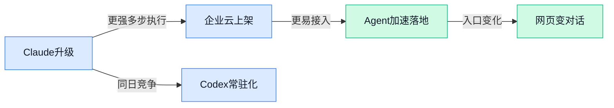

> AI 早报 · 每日早读 · 全网深度聚合

## **今日摘要**

```
Anthropic 连发 Claude Opus 4.7 并上线 Amazon Bedrock，主打更强编程与自动化安全防护
OpenAI 把 Codex 做成常驻式 coding agent，几乎无处不在推进更多工作流，编码助手全面升维
Chrome AI Mode 开始把浏览网页变成和网页对话，Qwen3.6-35B-A3B 画鹈鹕竟压过 Claude Opus 4.7
```

### 🔵 产品与功能更新

1. **Claude Opus 4.7（Anthropic 新发布的大模型版本）上线 Amazon Bedrock（亚马逊提供企业调用多家 AI 模型的云平台）。**
这次更新的关键信号很明确：**Anthropic** 不只发了新模型，还把它接入了 **Amazon Bedrock**，方便企业直接在现有云环境里调用，少走很多自建部署流程 💼。公开信息提到，**Claude Opus 4.7** 强化了**编码能力**，也就是更擅长理解、编写和修改程序代码，这对做内部工具、自动化流程、客服系统的团队都更实用。对非技术团队来说，这意味着企业以后买的可能不只是“一个聊天机器人”，而是能嵌进业务系统里的 AI 能力层。可参考 [AWS 上线说明(briefing)](https://news.google.com/rss/articles/CBMinAFBVV95cUxQejc2eWMwZ3Rhb3I2dHloOGRmdVVZeVNrdGJMSm5FSWFrd1U5ck55MkluM2kyRkhjVk9rdUoxRFAwUjVsUko3UVVDQ0UzaTdsSmhMdFlqS1kxaTJpYmtKU2hjVFFiSlpIZEI5dGx6Y3BLYWZCNzVIYW43d0YyTjZGdi1pb3hyNm40Wk40S2F2b1NzZU14d24tR2xYUHQ?oc=5)、[Anthropic 官方发布(briefing)](https://news.google.com/rss/articles/CBMiWkFVX3lxTE1rS2xYRnJxOV9fQjgxWkl0OHlJRFhxMktsVmtTdGV6dnhPTXQzSXcwRE5hQXhOUGdVMXNwVVBZb01wYTVlY0tCT3VKZTBVQzZtVXRGY25XME5rUQ?oc=5)

2. **Claude Opus 4.7（Anthropic 新发布的大模型版本）主打更强编程表现，并加入自动化安全防护。**
多家报道都指向同一个重点：这版模型把**编码能力**继续往前推，同时加入了自动化的**网络安全防护**，也就是在高风险场景下自动增加限制与防范措施 🔐。这里的网络安全不是普通用户改密码那种层面，而是指模型在处理可能涉及攻击、漏洞利用等内容时，会有更严格的保护机制。简单说，厂商现在越来越重视“模型更强”之外的另一件事：**模型别惹祸**。相关信息可见 [功能更新报道(briefing)](https://news.google.com/rss/articles/CBMiuwFBVV95cUxPdGtSWDdjeVVwd0p1emx1SVhHY1ZZclVUWEVEdFBDZVNpWFRuak9KMDVxSmJPSV9ISlVpMFhOR2tXcFhiZDdiRFF2QWdoUVVzdzJpVTk1SDhnTkxwZm5FOTBHQWNiT0JNaVE5b1Z3Y0Zxek84LV93Q245cnBzUl9OdDBaRFNrWE1yNV9VVGh5RlFwMXRYRFVHOTdOMFlVWXlNWkRvQ1Y2OXYta0pLemFuLV9sUnc0d2lqNHZr?oc=5)、[安全机制报道(briefing)](https://news.google.com/rss/articles/CBMid0FVX3lxTE9hcG1FLWZsa0U1cVB0Y3hiaWNZUTNFZzdxXzRBaHNjSFBvX2FEY3pfQUZoOWlTcXFhZXhTb1BOZTBMUkpHOFdGR0NnbklRYjktX3BTRDY0LTVzRWxBeHVXOEk3MXc1aS1SMV9CWThiUFVRRnZBLW1z?oc=5)

3. **Chrome 的 AI Mode（AI 模式，用自然语言帮你搜索和理解网页的新交互）开始把“浏览网页”变成“和网页对话”。**
Google 这次想改的不是搜索结果页的一点样式，而是大家**探索网页**的方式 🌐。所谓 **AI Mode**，可以理解成浏览器里更主动的 AI 助手：你不是只点链接、来回切页，而是能直接围绕问题继续追问、整理信息、理解内容。对日常办公场景尤其有感，比如查竞品、做资料汇总、看一堆网页后提炼重点，步骤可能会明显变少。更多细节可看 [Google 官方博客(briefing)](https://blog.google/products-and-platforms/products/search/ai-mode-chrome/)

4. **Codex 被 OpenAI 做成常驻式 coding agent（编程代理，能持续协助写代码和执行任务的 AI 助手）。**
这次更新最抓眼球的一点，是它变成了 **always-on（持续在线、随时待命）** 的编程助手，还会“看你的屏幕”，也就是能结合你当前界面内容来持续协作 👀。这里的 **coding agent** 不只是回答代码问题，而是更接近“盯着任务进展、随时接手下一步”的助手形态。对普通公司来说，这代表 AI 正从“你问一句它答一句”，走向“它能持续参与一整个工作流程”，以后这类产品可能不只用于程序员，也会逐步扩展到运营、分析、设计协作等场景。可参考 [完整报道(briefing)](https://the-decoder.com/openai-turns-codex-into-an-always-on-coding-agent-that-watches-your-screen/)

### 🟢 前沿研究

1. **C2（一种用“二选一偏好”训练奖励模型的新方法）尝试把 AI 评价标准做得更稳定。**
这篇论文关注的是**奖励模型**（用来给 AI 回答“打分”的模型，决定什么算好答案）怎么训练得更可靠。作者提出 **Rubric-Augmented Reward Modeling**（“评分细则增强”的奖励建模，也就是先给出明确评分标准，再让模型按标准判断），目标是避免只靠模糊“感觉”来评估回答质量。更关键的是，它强调从 **Binary Preferences**（二元偏好，也就是“在 A 和 B 里选一个更好”）这种更便宜的数据形式出发，去做**可扩展**训练，对大模型对齐很有实际意义 💡。想看原始论文可读 [arxiv 论文页(briefing)](https://arxiv.org/abs/2604.13618) 或 [HuggingFace 论文页(briefing)](https://huggingface.co/papers/2604.13618)。

2. **Dive into Claude Code（剖析 Claude Code 的研究文章）讨论今天和未来的 AI Agent 系统该怎么设计。**
这篇文章聚焦 **Claude Code**，并把它当成观察 **AI Agent Systems**（AI 智能体系统，也就是能自己拆解任务、调用工具、连续执行多步工作的 AI）设计空间的入口。标题里提到的 **Design Space**（设计空间，指一类系统有哪些关键设计选项、不同方案怎么取舍）很重要，因为它不只是讲一个产品，而是在讨论未来这类系统会如何演进。对非技术团队来说，这类研究的价值在于：以后我们看到的 AI 工具，可能不只是“问答助手”，而是更像会自己推进工作的“数字同事” 🚀。原文可见 [HuggingFace 论文页(briefing)](https://huggingface.co/papers/2604.14228)。

### 🟡 行业展望与社会影响

### 🟣 开源TOP项目

1. **impeccable（一套帮助 AI 生成更好设计稿的设计语言）想做“AI 设计审美外挂”。**
这个项目不是再造一个画图工具，而是提供一套更清晰的**设计语言**，帮助你在和 AI 协作做页面、海报或界面时，产出更统一、更像专业设计师作品的结果 🎨。对运营、市场、品牌同事来说，它的价值在于把“说不清想要什么”的需求，尽量变成 AI 更容易理解的视觉规则。换句话说，它更像给 AI 一份“审美说明书”，让生成结果少跑偏、少返工。[GitHub 项目页(briefing)](https://github.com/pbakaus/impeccable)


2. **Scrapling（自适应网页抓取框架, 能从单页采集扩展到整站爬取）把网页采集做得更省心。**
这个开源项目主打**自适应 Web Scraping（网页抓取, 自动从网站提取信息）**，既能处理一次性抓取，也能扩展到整站级别的**crawl（爬取网站多个页面, 像顺着链接一层层翻资料）** 🕷️。对需要做竞品监控、舆情整理、信息汇总的团队来说，这类工具的意义在于减少手工复制粘贴，让数据收集更自动化。它强调“从简单到复杂都能接住”，说明项目更偏实用型基础设施。[GitHub 仓库页(briefing)](https://github.com/D4Vinci/Scrapling)


3. **claude-hud（Claude Code 的可视化状态插件）让 AI 写代码时“在忙什么”一眼可见。**
这是一个给 **Claude Code** 配套的插件，会把模型当前的**context usage（上下文占用, 指 AI 已经用了多少可记忆的信息空间）**、正在调用的工具、运行中的 **agents（自动执行子任务的小助手）**，以及待办进度显示出来 👀。它解决的不是“AI 会不会写”，而是“AI 到底写到哪了、有没有卡住、是不是快超出容量”。对团队协作来说，这种透明度很重要，因为它能让使用者更放心地把复杂任务交给 AI。[GitHub 项目页(briefing)](https://github.com/jarrodwatts/claude-hud)

4. **GitNexus（纯浏览器运行的代码知识图谱工具）把代码仓库变成可交互的“关系地图”。**
GitNexus 主打 **Zero-Server（零服务器, 不用自己部署后端服务）**，所有处理都在浏览器本地完成，你只要丢进一个 GitHub 仓库或 ZIP 压缩包，就能生成可交互的**knowledge graph（知识图谱, 把文件、函数、模块之间关系画成网络图）**。它还内置 **Graph RAG Agent（图谱版 RAG 助手, 先查代码关系再回答问题）**，比单纯全文搜索更适合理解大型项目结构 💡。对非开发同事来说，可以把它理解成“给复杂代码自动生成导航图”，更容易看出一个项目由哪些部分组成、彼此怎么关联。[GitHub 仓库页(briefing)](https://github.com/abhigyanpatwari/GitNexus)

5. **daily_stock_analysis（大模型驱动的多市场股票分析系统）把行情、新闻和结论放进一个仪表盘。**
这个项目面向 **A/H/美股**，把多数据源行情、实时新闻、AI 分析和多渠道推送整合到一起，做成一个日常可运行的股票分析系统 📈。其中 **LLM（大语言模型, 能读新闻、做总结、给出分析判断的 AI）** 负责把分散信息整合成更容易读的结论，**仪表盘（可视化看板, 把关键指标集中展示）**则让用户快速看全局。对关注金融信息流的团队来说，这类项目的意义在于提高“收信息—做判断—发通知”的效率。[GitHub 项目页(briefing)](https://github.com/ZhuLinsen/daily_stock_analysis)

6. **last30days-skill（跨平台追踪近 30 天舆论热点的 AI 技能）适合做话题研究和趋势总结。**
这个项目会让 **AI agent（可自动执行研究任务的 AI 助手）**同时去 Reddit、X、YouTube、HN 和 Polymarket 等平台搜集近 30 天的相关信息，再整理成一份有依据的总结 🧠。这里的 **grounded summary（有信息来源支撑的总结, 不是凭空生成）** 很关键，意味着它更强调“先查再写”，而不是纯聊天式输出。对市场、内容、品牌团队来说，它很适合拿来快速了解某个话题最近在网上到底怎么发酵、大家在关注什么。[GitHub 仓库页(briefing)](https://github.com/mvanhorn/last30days-skill)

### 🔴 社媒分享

1. **Qwen3.6-35B-A3B（阿里通义千问的一款 350 亿参数模型）在笔记本上画出的鹈鹕，竟被认为比 Claude Opus 4.7 更好。**
这条社媒分享的看点，不是“谁绝对更强”，而是**本地运行**的大模型也开始在一些具体小任务上打出惊喜表现了 😮。作者拿一只“鹈鹕”做测试，比较了自己电脑上跑的 Qwen 模型和 Claude Opus 4.7 的输出，结果主观上更喜欢前者，这很能说明如今**轻量部署**（不用云端、直接在个人设备上运行）正在变得越来越实用。对公司同事来说，这意味着未来很多 AI 能力不一定非得依赖联网和高额调用成本，部分场景可能会走向“**个人电脑也能用得起**”的路线。原文可看 [作者实测分享(briefing)](https://simonwillison.net/2026/Apr/16/qwen-beats-opus/) 💡


2. **Claude Opus 4.7（Anthropic 新一代 Claude 大模型）正式发布。**
这是 Anthropic 官方放出的新品页，核心信息是 **Claude Opus 4.7** 作为新版本登场，属于 Claude 系列里更强的一档模型。虽然候选材料里没有展开更多细节，但它能和前一条社媒实测形成很有意思的对照：一边是**官方旗舰模型**，一边是本地设备上跑起来的开源模型，大家已经不只看“参数大不大”，而是更关心“**真实任务谁更好用**”。对业务团队来说，这类变化会直接影响后续选型：是追求最强云端能力，还是在成本、隐私、速度之间找平衡。官方信息见 [Anthropic 发布页(briefing)](https://www.anthropic.com/news/claude-opus-4-7) 🚀


3. **HuggingFace Transformers（最常用的大模型开发工具库）接入 MLX（Apple 芯片上的本地 AI 运行框架），让“本来你会自己提的代码修改”直接有人替你做好。**
这篇文章的标题很有社媒传播感，背后其实是在讲一个很实用的开发者协作故事：把 **Transformers** 和 **MLX** 打通后，开发者在苹果设备上跑模型会更顺手 🍎。其中 MLX（Apple 为自家芯片做的机器学习框架，方便模型直接利用 Mac 的硬件性能）对本地 AI 使用体验很关键，而 HuggingFace（全球最大 AI 模型共享社区）的生态接入，则意味着更多模型和工具能更自然地迁移过去。对非技术同事来说，可以把它理解成“AI 软件之间的兼容性更好了”，以后团队买 Mac 做轻量 AI 试验、演示和内部工具开发，会更方便。详情可见 [HuggingFace 博客原文(briefing)](https://huggingface.co/blog/transformers-to-mlx) ✨

4. **Codex 几乎无处不在，OpenAI 在把编码助手推向更多工作流。**
OpenAI 这篇内容传递出的信号很明确：**Codex** 不再只是一个“写代码的小工具”，而是在朝更广泛的任务协作方向延伸。这里的工作流（把一项工作拆成多个连续步骤并自动衔接）很重要，因为它意味着 AI 不是只回答一个问题，而是能参与更完整的执行过程。对企业来说，这会影响的不只是研发部门，后续可能连运营自动化、数据整理、内部知识处理等环节都能借鉴类似模式。官方介绍可看 [OpenAI 介绍页面(briefing)](https://openai.com/index/codex-for-almost-everything) 🚀

5. **Sentence Transformers（把文本或图片转成可比较“坐标”的模型工具）开始支持训练多模态 embedding（把文字和图片都变成可检索向量）与 reranker（二次重排模型，让搜索结果更准）。**
这条内容虽然偏技术，但其实和很多日常办公场景很相关：比如企业知识库搜索、图库找素材、商品图文匹配、简历和岗位描述匹配等，都离不开这类能力。多模态（同时处理文字和图片）意味着 AI 不再只会“读字”，还更会“看图”；而 reranker（先粗筛一批结果，再做更精准排序）则像是搜索系统里的“复试官”，能把更合适的结果顶上来。对做产品、运营、招聘和内容管理的同事来说，这类基础能力成熟后，内部搜索和推荐体验通常会明显提升。原文见 [训练方案详解(briefing)](https://huggingface.co/blog/train-multimodal-sentence-transformers) 🔍

6. **Cloudflare AI Platform（Cloudflare 的 AI 平台）主打 Agent 专用 inference layer（模型推理层，让 AI 请求更稳更快地跑起来）。**
这篇文章聚焦的是 AI 基础设施，但可以把它理解成：Cloudflare 想做 Agent 背后的“高速公路”和“调度中心” 🛣️。其中 inference（模型推理，让训练好的模型真正开始回答和执行任务）是 AI 从“学会”到“干活”的关键一步，而专门为 Agent 优化，说明行业正在从单次问答转向**持续执行、多步骤协作**。这对企业用户的意义是，未来真正可落地的 AI 产品，比拼的不只是模型本身，还包括调用稳定性、延迟、成本和编排能力。更多内容可看 [Cloudflare 官方博客(briefing)](https://blog.cloudflare.com/ai-platform/) 💡

---



### 📊 行业洞察（今日 4 条）

1. Anthropic发布 Claude Opus 4.7，并接入 Amazon Bedrock（亚马逊提供企业调用多家 AI 模型的云平台）
  【洞察】模型竞争已经不只是“谁更强”，而是“谁更容易被企业直接买来用”；一旦上云平台，落地速度往往比单纯提性能更重要

2. Claude Opus 4.7 一边主打更强编程和多步任务，一边加入自动化网络安全防护
  【洞察】厂商开始承认一个现实：Agent越能干，闯祸风险也越大；以后“能力”和“约束”会被一起卖，安全不再是可选项

3. OpenAI把 Codex 做成持续在线、还能结合屏幕内容协作的编程 agent（能持续协助写代码和执行任务的 AI 助手）
  【洞察】AI 正从“等你发问”变成“持续盯任务推进”；这说明未来竞争点会转向流程接管能力，而不是单轮回答漂不漂亮

4. Google 推出 Chrome 的 AI Mode（AI 模式，用自然语言帮你搜索和理解网页的新交互）
  【洞察】AI 的主战场正在从独立聊天框转向浏览器入口；谁占住用户日常工作入口，谁就更有机会变成默认助手

### 💭 对我们的启发（今日 3 条）

1. Claude Opus 4.7 上线 Amazon Bedrock 说明，大公司在把“模型能力”打包进现成采购体系。对我们来说，别假设用户愿意自己挑底层模型，平台要把选择成本吃掉。

2. Codex 常驻化和 claude-hud（Claude Code 的可视化状态插件，让用户看到 AI 正在做什么）一起看，验证了一个方向：用户想要的不只是结果，更想知道过程是否可控、是否卡住。

3. C2（用“二选一偏好”训练 AI 评分的新方法）和今天多条 Agent 新闻放一起看，提醒我们平台核心不只是调度，还要尽早建立“怎么评价一个 Agent 真的靠谱”的规则。


---

> 本周周报：[第16周综合分析](https://ylzsdafei.github.io/ai-daily-site/blog/weekly/2026-w16/)
