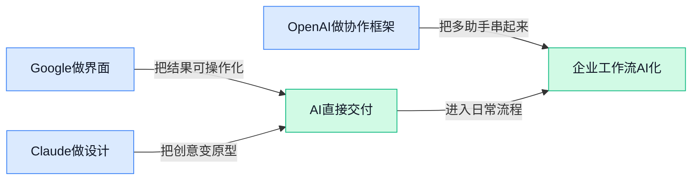

> AI 早报 · 每日早读 · 全网深度聚合

## **今日摘要**

```
OpenAI 高层与研究骨干接连离开还在收缩副线，开源 openai-agents-python 押注多 Agent 自救
Anthropic 连推 Claude Design 抢视觉协作，CEO 高喊规模化远未到头，Claude Code 生态加速成形
Google 一天连打三张牌，Gemini 上线个性化图片生成、推 Agent 界面标准、AI 直插旅行规划
```

### 🔵 产品与功能更新

1. **Gemini 新增“个性化图片生成”，能结合你的生活内容来出图。**
Google 这次把 Gemini 的图片生成功能往“更懂你”推进了一步：**Nano Banana 2**（Gemini 里用于生成图片的模型版本）现在可以调用**个人上下文**，还能够结合 **Google Photos**（Google 相册, 用来管理和搜索个人照片的服务）来生成更贴近用户真实生活的图片 ✨。这意味着以后做生日贺图、旅行回忆图、家庭风格海报时，AI 不只是“会画”，而是更可能画出“像你自己的内容”。对普通用户来说，门槛更低；对内容创作和个人表达场景，也更有想象空间 📷。[Google 官方介绍(briefing)](https://blog.google/innovation-and-ai/products/gemini-app/personal-intelligence-nano-banana/)


2. **Anthropic 推出 Claude Design，想让不懂设计的人也能快速做视觉稿。**
据报道，Anthropic 发布了 **Claude Design**，这是一个主打“快速做视觉内容”的新产品，目标用户包括创始人、产品经理这类**没有设计背景**的人 👀。它的核心价值不是替代专业设计师，而是让更多人能先把想法可视化，减少“脑子里有画面、但讲不出来”的沟通损耗。对业务、运营、产品同事来说，这类工具可能会让方案草图、页面想法、活动视觉雏形更快成型；也说明 AI 正在继续往“人人可用的创意生产工具”方向走 🎨。[TechCrunch 报道(briefing)](https://techcrunch.com/2026/04/17/anthropic-launches-claude-design-a-new-product-for-creating-quick-visuals/)

3. **Google 推出面向 AI Agent 的“生成式界面”标准。**
Google 发布了一套给 **AI Agent** 使用的**生成式界面标准**，目的是让 Agent 不只是吐文字答案，而是能动态生成更适合交互的界面 🧩。这里的“标准”可以理解为一套通用规则：不同系统里的 Agent 以后更容易用一致方式展示按钮、表单、卡片等内容，减少“每家都得自己重造一遍”的问题。对企业产品来说，这类底层规范很关键，因为它影响未来 AI 功能能不能更稳定地接进业务流程、做成真正可点可用的操作界面，而不只是聊天框里的建议 💡。[完整报道(briefing)](https://the-decoder.com/google-launches-generative-ui-standard-for-ai-agents/)

### 🟢 前沿研究

1. **研究称：对聊天机器人更友善，可能真的会带来更好的回答。**
这篇报道讨论了一个越来越多人有体感的问题：和聊天机器人互动时，**礼貌表达**不只是“做人习惯”，还可能影响模型输出的稳定性与合作感 🤝。文中把话题放进 **alignment（对齐，让模型行为更符合人类意图的训练过程）** 和 **interpretability（可解释性，帮助研究者看懂模型为什么会这样回答）** 的研究框架里看，意思是“语气”可能并非表面现象，而是会影响模型如何组织回应。对普通用户来说，这提醒我们：把 AI 当成“答案机器”之外，也要把它当成一种**对话界面**来使用，提问方式本身就是效果的一部分。[完整研究解读(briefing)](https://www.platformer.news/chatbot-emotion-research-anthropic-alignment-interpretability/)


2. **最新研究：只用十分钟把 AI 当“标准答案机”，解题能力就可能明显下滑。**
报道援引一项新研究指出，如果用户过快把 AI 当成直接给答案的工具，而不是辅助思考的伙伴，**问题解决能力**会出现可测量的下降 📉。这里的关键不在“能不能用 AI”，而在怎么用：如果省掉了自己分析、拆解和判断的过程，大脑就更容易进入“代办模式”。这对日常办公也很有现实意义——写方案、做汇报、整理思路时，AI 更适合做**草稿助手**和**陪练对象**，而不是一上来就全盘替你完成。[研究报道原文(briefing)](https://the-decoder.com/just-ten-minutes-of-using-ai-as-an-answer-machine-can-measurably-erode-problem-solving-skills-new-study-finds/)


3. **Raschka 分享理解大模型架构的工作流，把“看不懂模型图”这件事讲明白了。**
Sebastian Raschka 在这篇文章里系统介绍了自己如何拆解和绘制 **LLM（大语言模型，能理解和生成文字的大模型）架构**，帮助读者从复杂结构图里抓住重点 🧠。文章并不是单纯晒图，而是展示一套“先理解模块、再整理关系、最后可视化”的学习路径，适合想真正看懂模型差异的人。像 **architecture（模型架构，决定模型由哪些部分组成、彼此如何配合）** 这类常见术语，在他的工作流里被变成了更容易消化的图示语言。对于非技术同事来说，这类内容的价值在于：以后看到“某模型升级了结构”时，不会只停留在宣传词，而能理解那通常意味着能力边界和成本效率也在变。[作者工作流原文(briefing)](https://magazine.sebastianraschka.com/p/workflow-for-understanding-llms)


4. **新基准发现：图表一复杂，顶尖 AI 模型的表现也会掉近一半。**
这项新 **benchmark（基准测试，用统一题目衡量模型真实能力的标尺）** 关注的是 AI 读图表、理解坐标和把图形转成代码或结构化结果的能力，结论并不乐观：一旦图表变复杂，模型表现会明显下滑 📊。这说明 AI 在“看懂图”这件事上还远没达到人们想象中的稳定水平，尤其是面对多元素、复杂布局和细节关系时。对企业用户很重要的一点是，凡是涉及报表、分析图、业务示意图的场景，都不能因为 AI 能识图就默认它“看懂了”；复杂图表仍然需要人工复核。[基准测试报道(briefing)](https://the-decoder.com/even-the-best-ai-models-lose-about-half-their-performance-when-charts-get-complicated-new-benchmark-finds/)

### 🟡 行业展望与社会影响

1. **Anthropic CEO 继续押注规模化：AI 扩展还远没到尽头。**
Anthropic 首席执行官 Amodei 用“**彩虹没有尽头**”来形容 AI **scaling（规模化扩展，指通过更多数据、算力和训练投入持续提升模型能力）**的潜力，核心意思很明确：行业里最前沿的玩家，仍然相信“把模型做大、训练做深”这条路还没走完 🌈。这类表态对外界很关键，因为它不只是技术判断，也会影响资本、算力和人才接下来往哪里流动。对普通业务团队来说，这意味着未来一两年 AI 能力大概率还会继续抬升，很多今天看起来“不太稳”的工作流，后面可能会变得更可用、更自动化。[完整报道解读(briefing)](https://the-decoder.com/anthropic-ceo-amodei-declares-there-is-no-end-to-the-rainbow-for-ai-scaling/)


2. **OpenAI 高层与研究骨干离开，战略继续收缩“副线任务”。**
TechCrunch 报道称，Kevin Weil 和 Bill Peebles 将离开 OpenAI，而公司同时关闭 Sora、并将 science team（科学团队，偏前沿探索研究的内部团队）并入其他方向，信号非常直接：OpenAI 正在减少 side quests（副线项目，指暂时不直接服务核心业务的探索性项目）🧭。从原文信息看，这次调整指向的是更鲜明的 **enterprise AI（企业级 AI，面向公司采购和业务系统落地的产品）** 重心，而不是继续铺开更多消费者向“登月项目”。对行业来说，这说明头部公司也在重新算账：比起“看起来很酷”的功能，真正能持续带来收入和客户留存的企业场景，优先级正在上升。[TechCrunch 报道(briefing)](https://techcrunch.com/2026/04/17/kevin-weil-and-bill-peebles-exit-openai-as-company-continues-to-shed-side-quests/)


3. **Cursor 传出新一轮超大融资，企业市场增长把 AI 编程工具推上高估值。**
据报道，Cursor 正在洽谈一笔超过 20 亿美元的新融资，估值可能达到 500 亿美元，背后原因是其 **enterprise growth（企业客户增长，指大公司付费采购速度明显加快）** 持续走高 💼。Cursor 本质上是面向程序员的 AI 编码助手，但这条新闻的意义不只在“程序员爱不爱用”，而在于资本市场已经把 **AI 开发工具（帮助写代码、改代码、提效的软件）** 当成真正能做大的生意。对非技术岗位同事来说，可以把它理解为“办公软件 AI 化”在程序员世界的先行版：一旦企业愿意批量采购，估值和融资速度就会被迅速抬高。[融资传闻报道(briefing)](https://techcrunch.com/2026/04/17/sources-cursor-in-talks-to-raise-2b-at-50b-valuation-as-enterprise-growth-surges/)


4. **AI 芯片公司 Cerebras 申请上市，算力基础设施热度继续升温。**
Cerebras 已提交 IPO（首次公开募股，指公司申请在证券市场上市）文件，这说明 AI 热潮正在从模型公司外溢到更底层的 **chip（芯片，负责提供 AI 训练和运行算力的核心硬件）** 与基础设施赛道 📈。原文提到，Cerebras 近几个月先后宣布与 Amazon Web Services（亚马逊云服务平台，很多企业租用服务器和算力的地方）合作，把自家芯片放进亚马逊数据中心，并拿下据称价值超 100 亿美元的 OpenAI 合作。对行业观察者来说，这很能说明问题：AI 竞争早已不只是“谁模型更聪明”，而是“谁能把算力、云服务和客户订单一起串起来”。[上市消息报道(briefing)](https://techcrunch.com/2026/04/18/ai-chip-startup-cerebras-files-for-ipo/)

5. **Google 用 AI 重做暑期出行攻略，旅行规划正变成日常级 AI 场景。**
Google 介绍了 7 种借助自家工具更聪明安排行程的方法，重点围绕**旅行规划、比价和目的地探索**这几个高频需求展开 ✈️。这类更新看起来不像“底层技术突破”，但它代表了另一种更现实的行业趋势：AI 正从聊天工具慢慢变成 everyday utility（日常实用功能，像搜索、导航、比价一样自然融入生活）的组成部分。对公司内部做运营、行政或差旅管理的同事来说，这也很有启发——未来用户对“能直接帮我完成安排和决策”的 AI 期待，会比“只会回答问题”的工具更高。[Google 官方博客(briefing)](https://blog.google/products-and-platforms/products/search/summer-travel-tips-google-search-ai/)

### 🟣 开源TOP项目

1. **OpenAI 开源多 Agent 工作流框架 openai-agents-python。**
这是一个主打**轻量**但功能完整的多 Agent 框架，适合把一个复杂任务拆成多个 AI 分工协作来完成 💡。这里的多 Agent workflow（多智能体工作流，意思是让不同 AI 角色像团队成员一样协同处理任务）对企业做自动化流程、客服编排、内容生产都很有想象空间。相比“自己从零拼系统”，这类框架能让团队更快验证 AI 流程到底能不能落地 🚀。项目可见 [OpenAI 官方仓库(briefing)](https://github.com/openai/openai-agents-python)


2. **微软开源语音模型 VibeVoice，瞄准前沿 Voice AI。**
微软把 **VibeVoice** 放到 GitHub 上，定位是开源的前沿 Voice AI（语音 AI，能处理语音生成、理解或交互的一类模型）项目 🎙️。对普通业务团队来说，语音类开源模型的意义在于，未来客服、培训、播报、语音助手等场景会更容易低成本试水。Frontier（前沿级，通常指能力接近行业第一梯队）这个表述也说明，微软希望它不只是“能用”，而是要进入高水平竞争区间。项目入口见 [微软开源项目页(briefing)](https://github.com/microsoft/VibeVoice)


3. **claude-mem 让 Claude Code 自动“记住”你的开发上下文。**
这个插件会自动记录 Claude 在编程过程中的操作，再用 AI 做压缩整理，并把相关内容回注到后续会话里，相当于给 AI 配了一个长期记忆本 🧠。其中 plugin（插件，就是给现有工具追加能力的小模块）和 context（上下文，指当前任务相关的历史信息和背景）是提升连续协作体验的关键。对团队来说，这类工具能减少“每次都要重新解释项目背景”的重复劳动，让 AI 更像真正持续跟进工作的助手。详情可看 [项目仓库说明(briefing)](https://github.com/thedotmack/claude-mem)


4. **caveman 用“原始人式表达”帮 Claude Code 省下 75% token。**
这个项目的核心卖点非常直接：通过更精简的表达方式，减少 Claude Code 的 token（模型处理文本时切分的最小单位，可以理解为 AI 的“字数计费颗粒”）消耗 ⛏️。摘要里提到可削减 **75% token**，这对高频使用 AI 编程的团队尤其有吸引力，因为 token 直接关系到调用成本和响应效率。它本质上是在提醒大家：不是所有效果提升都靠更大模型，有时换一种沟通格式也能省钱提速。项目见 [节省 token 项目页(briefing)](https://github.com/JuliusBrussee/caveman)

5. **Hermes Agent 主打“会陪你一起成长”的 Agent 项目。**
NousResearch 的这个项目一句话定位很有记忆点：The agent that grows with you（会随着你一起成长的智能体）🌱。从名字和摘要来看，它强调的不是一次性执行，而是更长期、可持续演化的 Agent 使用体验。这里的 Agent（智能体，能自主调用工具、分步骤完成任务的 AI 助手）正在成为开源圈竞争热点，因为大家都在比谁更接近“能长期打工的数字同事”。项目入口见 [Hermes Agent 仓库(briefing)](https://github.com/NousResearch/hermes-agent)

6. **andrej-karpathy-skills 把 Andrej Karpathy 的实用能力做成可复用技能集。**
这个仓库从命名上看，核心是围绕 Andrej Karpathy 的工作风格整理出一套 skills（技能包，可重复调用的任务模板或能力模块）📦。这类项目在开源社区受欢迎，往往因为它把“高手经验”从零散帖子和演讲，变成了可以直接上手复用的资产。对不懂代码的同事也可以这样理解：它像把优秀员工的方法论沉淀成 SOP（标准作业流程，让别人更容易照着做）。项目地址见 [技能仓库主页(briefing)](https://github.com/forrestchang/andrej-karpathy-skills)

### 🔴 社媒分享

1. **美国教师改用打字机，直接对抗 AI 代写作业。**
一位大学教师为了减少**AI 代写**，把课堂写作重新拉回到**打字机**和线下完成的形式，这个做法在社交媒体上引发了不少讨论 📝。支持者觉得，这能逼学生重新练习独立表达；反对者则会担心它更像“回到过去”，未必真正解决问题。对普通职场人来说，这件事释放的信号很直接：当**生成式 AI**越来越容易代替“交差式写作”，学校和企业都会更重视“现场完成、过程可追踪”的能力。[事件报道原文(briefing)](https://sentinelcolorado.com/uncategorized/a-college-instructor-turns-to-typewriters-to-curb-ai-written-work-and-teach-life-lessons/)


2. **Claude Design 使用体验走红，AI 设计协作的边界再次被讨论。**
这篇分享围绕 Claude Design 展开，重点不是“它能不能画图”，而是它在真实设计流程里到底适不适合作为协作伙伴 🎨。文中讨论的核心，其实是**设计工作流**（从想法到成稿的一整套工作过程）里，AI 到底更擅长发散创意，还是更适合帮人整理与迭代。对业务、运营、品牌同事来说，这类讨论很有参考价值：未来大家用 AI 做设计，拼的未必只是出图速度，更是“能不能把反馈、语境和目标讲清楚”。[作者体验原文(briefing)](https://samhenri.gold/blog/20260418-claude-design/)


3. **Opus 4.6 和 Opus 4.7 的匿名 token 对比，被做成了公开排行榜。**
有人整理了 Opus 4.6 与 Opus 4.7 的匿名请求数据，专门比较它们在 **token**（模型处理文字时的最小计量单位，可理解为“按字词切分后的计费/计算颗粒”）消耗上的差异 📊。这类榜单看起来很技术，但其实和企业用 AI 的成本直接相关：同样一项任务，**token 开销**越低，意味着调用模型的费用和等待时间都可能更可控。对经常采购或评估 AI 工具的团队来说，这类“实际使用账单”式的数据，比单看官方宣传更接近落地效果。[对比排行榜页面(briefing)](https://tokens.billchambers.me/leaderboard)

4. **黄仁勋的“算力逻辑”再引争议：英伟达叙事为何让人越听越困惑。**
这篇文章聚焦英伟达 CEO 黄仁勋的公开表述，讨论他关于**算力**、需求和行业未来的逻辑为什么会让外界觉得有些“拧巴” 🤔。表面上看是人物观点分析，背后其实是在问一个更大的问题：当 AI 热潮推高市场预期后，企业到底该怎样判断基础设施投入是不是合理。对非技术岗位同事来说，这类内容的价值在于，它提醒大家别只盯着“故事讲得多大”，还要看商业判断是否经得起推敲。[评论分析原文(briefing)](https://www.bigtechnology.com/p/jensens-puzzling-logic)

5. **“服务器、卫星与星辰”一文串起了 AI、太空与大公司基础设施野心。**
这篇文章把**服务器**、**卫星**和更宏大的产业布局放到一起看，讨论科技巨头如何同时下注 AI 基础设施与太空网络 🌌。其中的卫星网络并不只是航天话题，它关系到全球连接能力、数据传输和未来服务覆盖范围，也就是企业怎么把技术能力铺到更广的市场。对普通读者来说，这篇内容的启发是：AI 竞争不只发生在聊天机器人界面里，背后拼的还是**基础设施**——谁能建更多服务器、连更多网络、触达更多用户。[原文完整分析(briefing)](https://stratechery.com/2026/servers-satellites-and-stars/)

---



### 📊 行业洞察（今日 4 条）

1. Google 发布 A2UI 0.9（生成式界面标准），让 AI Agent 可调用既有组件生成界面。  
  【洞察】这表明 Agent 正从对话层走向操作层；因标准先统一按钮、表单、卡片，接入更快，但生态若分裂，企业集成成本仍高。

2. Anthropic 推出 Claude Design，面向创始人和产品经理生成设计稿、原型与幻灯片。  
  【洞察】判断是 AI 创作正进入非专业人群；因产品瞄准表达门槛而非专业深度，机会在普及，风险是成果质量与版权边界难控。

3. OpenAI 开源 openai-agents-python，多 Agent workflow（多智能体协作流程）框架主打轻量完整。  
  【洞察】这说明多 Agent 已从概念转向工程化落地；因头部公司亲自下场提供框架，验证门槛降低，但平台差异化会更难做。

4. OpenAI 高层离开并收缩 Sora 等副线，重心转向 enterprise AI（企业级AI）相关方向。  
  【洞察】明确判断是头部厂商开始回到收入导向；因资源集中于可成交场景更利于商业化，但也可能压缩前沿探索与新叙事空间。

### 💭 对我们的启发（今日 3 条）

1. 参考 Google A2UI 0.9，我们的 Agent 平台应把“任务结果”升级为“可操作界面”。机会是更易进入业务流程，风险是若缺兼容规范，客户接入阻力会放大。

2. 参考 openai-agents-python，可把平台定位从“单一助手”扩到“多角色协作底座”。机会是提升复杂任务承接力，风险是同质化加剧，需强化评估与进化能力。

3. 参考 OpenAI 收缩副线与 Claude Design 破圈，我们应优先选高频、低门槛场景切入。机会是更快形成付费闭环，风险是过度追求通用化会稀释产品判断。


---

> 本周周报：[第16周综合分析](https://ylzsdafei.github.io/ai-daily-site/blog/weekly/2026-w16/)
