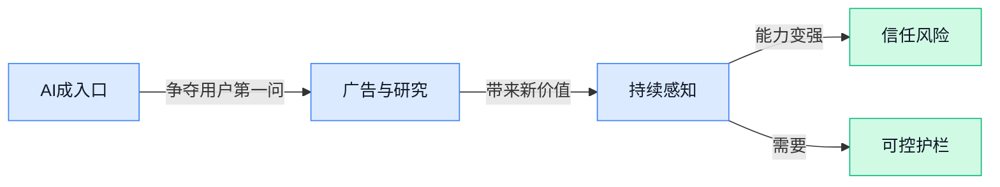

> AI 早报 · 每日早读 · 全网深度聚合

## **今日摘要**

```
OpenAI 连发 ChatGPT Images 2.0 与企业级 Codex Labs，内测对话广告，ChatGPT 要通吃创作与搜索
Amazon 再砸 330 亿美元加码 Anthropic，AI 基建绑定持续加深，巨头押注从模型战卷到云战
OpenAI 因 ChatGPT 涉枪击案遭刑事调查，Codex“看屏记忆”再掀隐私风暴，AI 责任线被逼到台前
```

### 🔵 产品与功能更新

1. **ChatGPT Images 2.0（OpenAI 最新图像生成模型）发布，图片细节理解更进一步。**
OpenAI 正式推出 **ChatGPT Images 2.0**，这是新一代**图像生成模型**（让 AI 按文字描述生成图片的模型）📷。从标题里提到的“**ham radio**（业余无线电设备，常见于复古通讯场景）浣熊”这类复杂提示词也能看出，新模型主打的是对细节、物体关系和画面要求的理解能力。Sam Altman 还在直播里专门介绍了这次更新，说明它不只是小修小补，而是 OpenAI 图像能力的一次明确迭代。想看原始发布与演示，可参考 [官方发布页(briefing)](https://openai.com/index/introducing-chatgpt-images-2-0/) 和 [直播介绍视频(briefing)](https://www.youtube.com/watch?v=sWkGomJ3TLI) 💡


2. **Amazon 再向 Anthropic 追加 330 亿美元，AI 基建绑定进一步加深。**
这条消息的重点不只是 **投资金额**，更在于 Anthropic 承诺把高达 **1000 亿美元** 花回 **AWS（Amazon Web Services，亚马逊的云计算平台，相当于企业租用的远程服务器与算力中心）** 🔁。这意味着大模型竞争已经不只是拼产品，也在拼**云基础设施**和长期算力合作；谁能稳定拿到海量计算资源，谁就更有机会持续训练和部署更强模型。对企业用户来说，这类绑定也可能影响未来 AI 服务跑在哪家云上、生态跟谁更深度整合。[完整报道(briefing)](https://the-decoder.com/amazon-pours-33b-into-anthropic-which-promises-to-spend-100b-right-back-on-aws/) 🚀


3. **OpenAI 推出 Codex Labs（帮助企业落地 Codex 的服务团队），加速 Codex 进入大企业研发流程。**
OpenAI 宣布成立 **Codex Labs**，并与埃森哲、普华永道、印孚瑟斯等伙伴合作，帮助企业在完整的**software development lifecycle（软件开发全流程，从写代码到测试再到上线维护）**中部署和扩展 **Codex**。这说明 Codex 正从“好用的 AI 编程助手”继续往企业级方案走，重点不只是个人提效，而是团队怎么把它真正接进日常流程。OpenAI 还提到 Codex 的 **WAU（周活跃用户数，用来看一周内有多少人在实际使用）** 已达到 400 万，也侧面说明企业采用速度在上升。对管理层来说，这类服务更像“把 AI 编程从试用阶段推向规模化使用”的配套工程。[OpenAI 官方说明(briefing)](https://openai.com/index/scaling-codex-to-enterprises-worldwide) 💼

### 🟢 前沿研究

1. **EasyVideoR1（一个让视频理解强化学习更容易落地的研究）尝试降低训练门槛。**
这项工作聚焦**视频理解**里的**强化学习**（让模型通过“做对有奖励、做错有惩罚”来学会判断）难题，核心意思是：别再用那么重、那么难调的训练流程，也许能更高效地把模型教会看视频 💡。对业务侧同事来说，这类研究的意义在于，未来 AI 看监控、看教学录像、看会议回放时，可能更容易学会“抓重点”和“理解过程”，而不只是看单帧图片。想看论文原文可直接翻 [论文条目页(briefing)](https://huggingface.co/papers/2604.16893) 🚀

2. **MathNet（一个面向数学推理与检索的全球多模态评测集）想把“会做题”和“会找资料”一起测清楚。**
这篇工作关注**多模态**（不只处理文字，还可能包含图片、公式、图表等多种信息）数学能力评估，不只是看模型会不会解题，还看它能不能先把相关内容找出来。这里的**检索**（让模型回答前先从资料库里找相关内容）很关键，因为很多真实工作并不是闭卷考试，而是“会查、会整合、会判断”。对企业应用来说，这类 benchmark（基准测试，用来统一比较不同模型水平的标准尺子）更接近实际办公场景，比如财务规则、合同条款、报表分析都需要“找得到 + 算得对”。更多细节可见 [论文介绍页(briefing)](https://huggingface.co/papers/2604.18584) 📘

3. **The Geometric Canary（用“表征稳定性”预测模型可控性与漂移的研究）盯上了大模型“越调越偏”的隐患。**
这项研究讨论**steerability**（可操控性，意思是模型能否稳定按人的要求改变输出风格或行为）和**drift**（漂移，模型在更新或长期使用后悄悄变样）之间的关系。作者提出从**representational stability**（表征稳定性，也就是模型内部“理解世界”的方式是否保持稳定）入手，提前预警模型会不会越来越难管。对公司来说，这类研究很实用：如果一个客服、审核或办公助手模型上线后慢慢“跑偏”，可能直接影响体验、合规甚至品牌风险。论文入口见 [HuggingFace 论文页(briefing)](https://huggingface.co/papers/2604.17698) 🔍

4. **MTR-DuplexBench（评测全双工语音大模型多轮对话能力的基准）补上了“能不能像人一样插话交流”的测试空白。**
这里的**full-duplex**（全双工，像人与人打电话时那样可以同时说和听，而不是你一句我一句轮流等）是重点，因为真实语音交流往往会打断、接话、确认和澄清。论文提出一个专门看**多轮对话**表现的 benchmark（基准测试），帮助研究者判断语音模型到底是真会聊天，还是只会“排队回答”。这对呼叫中心、语音客服、车载助手等场景尤其重要：如果模型不能自然处理连续对话，再聪明也会显得“木”。详情可看 [论文条目(briefing)](https://huggingface.co/papers/2511.10262) 🎙️

5. **Trace Rewriting（通过改写交互轨迹保护模型免遭未授权蒸馏的方法）瞄准大模型“被偷学”问题。**
这项研究要解决的是**distillation**（蒸馏，简单说就是别人通过大量观察你的模型输入输出，训练出一个“模仿版”模型）带来的知识泄露风险。作者提出 **trace rewriting**（轨迹改写，即对模型交互过程做改写处理），希望在不明显影响正常使用的前提下，降低他人复制模型能力的可能性。对企业来说，这很像“既要开放服务，又不能把核心能力白送出去”，尤其适合有自研模型、行业知识库或付费 API 的团队。原文可见 [论文页面(briefing)](https://huggingface.co/papers/2602.15143) 🛡️

6. **Symbolic Guardrails（用符号规则给垂直领域 Agent 加护栏的研究）想兼顾安全、合规和可用性。**
这里的 **guardrails**（护栏，指限制模型别乱说、别乱做的约束机制）不是只靠“多提醒几句”，而是加入**symbolic**（符号化规则，也就是明确写出来、可检查的规则约束）。论文聚焦**domain-specific agents**（垂直领域 Agent，指服务金融、医疗、法务等特定行业任务的 AI 助手），目标是在不牺牲实际效果的前提下，提高安全和安全防护保证。对业务团队来说，这意味着未来专业场景里的 AI 可能更像“守规矩的实习生”，既能干活，也更不容易踩红线。详情参考 [论文介绍(briefing)](https://huggingface.co/papers/2604.15579) ⚖️

7. **When Can LLMs Learn to Reason with Weak Supervision?（大模型在弱监督下何时能学会推理）直指“低成本训练”边界。**
所谓**weak supervision**（弱监督，指不给模型特别完整、特别精细的标准答案，而是用较粗糙、较便宜的标注方式训练）很有现实意义，因为高质量人工标注太贵、太慢。论文想回答的核心问题是：在什么条件下，LLMs（大语言模型）仍然能学会可靠推理，而不是只学到表面套路。对企业侧最直接的启发是，如果这条路跑通，很多行业数据不必全部精标，也可能训练出还不错的专用能力，从而明显降低落地成本。可查看 [论文详情页(briefing)](https://huggingface.co/papers/2604.18574) 🧠

8. **Agents Explore but Agents Ignore（研究发现大模型 Agent 缺乏环境好奇心）提醒我们：会行动不等于会主动发现问题。**
这篇论文讨论一个很有意思的现象：Agent 看似会“探索”，但其实常常忽略环境里重要线索，缺少真正的**curiosity**（好奇驱动，也就是主动寻找未知信息、验证猜测的倾向）。这意味着模型在复杂任务里可能只会机械执行步骤，却不会像人一样多问一句“这里是不是还有隐藏信息”。对真实工作场景来说，这很关键——无论是数据分析、流程排查还是客户支持，如果 AI 不主动发现异常，就容易把问题留到最后爆出来。原文入口见 [论文条目页(briefing)](https://huggingface.co/papers/2604.17609) 👀

### 🟡 行业展望与社会影响

1. **OpenAI 测试 ChatGPT 内置点击付费广告，AI 对话界面开始长出“搜索生意”。**
这条消息最值得关注的，不只是**广告**本身，而是 ChatGPT 可能从“聊天工具”进一步变成“流量入口” 💡。所谓 **cost-per-click（按点击付费的广告模式，只有用户点了广告主才付钱）**，本质上就是把搜索引擎那套成熟商业模式搬进 AI 对话框里；如果成真，未来大家在问产品、旅游、采购、软件建议时，看到的答案结构可能都会变化。对企业来说，这意味着**品牌曝光**、**内容投放**、**获客渠道**可能要从搜索引擎进一步转向 AI 助手，市场部门和运营团队得更早开始适应。[Digiday 报道原文(briefing)](https://news.google.com/rss/articles/CBMihwFBVV95cUxON1JUQUhuUFU0NGRLVlpDU0kwVHlCbmFVb0ktd2RTTDZiSERFc2p6a0NScUpmMmJ2SktvUGNvZC1sa2dqTVlBenRuTk9sTFVIVDhwZVRnMklsaExPNkEwdG52dGQwaHpWcWhEckVaMzBxSkkxNkxtT1A4M1lMNWh1V3BXbjZJN00?oc=5)

2. **OpenAI 因 ChatGPT 在枪击案中的角色遭遇刑事调查，AI 安全与责任边界被再次推到台前。**
原文聚焦的是一起严重社会事件后，监管与执法层面对 ChatGPT 使用情况的追查，这让“AI 只是工具”还是“平台也要担责”这个问题变得更尖锐 ⚠️。这里的 **criminal probe（刑事调查，指执法机构正式介入查明是否涉及违法责任）**，意味着外界已不再只讨论技术失误，而是在看平台治理、内容拦截与风险预警是否到位。对公司管理层来说，这类事件会持续推动更严格的**合规**、**内容审核**和高风险场景限制；对普通员工也有提醒：AI 不是“随便问都没事”的中性黑箱。[BBC 报道原文(briefing)](https://news.google.com/rss/articles/CBMiWkFVX3lxTFBtQzhxOThXRDlYNWI4TFJ2TFlsQlNhdG5kVm5Ta0M1YkxzLTdyNWcyeHB4aHlsWkF5TkliRXY2eDVWZ2NaeTQteGhzaUFBVzNLN1NNYzE4Y2FwUQ?oc=5) [华盛顿邮报细节报道(briefing)](https://news.google.com/rss/articles/CBMiiAFBVV95cUxPVGNpOHhxRVk4UTlMNEZTOXo3b0RINWFRX09ic0UtMTZtdEhYRm13dHVOWEdOQXpzWUxKZUxXSkZNc3ItblV2NE51cGpkeDg2ZURBbElZZmYzVlktSF9EdWI1T3VzeGUxazQ0bE5Cb0hld3p6TWFHbnZ1dXhKSzZObllObWtOT1lL?oc=5)

3. **ChatGPT Images 2.0（OpenAI 新一代图片生成模型）升级后，AI 画图开始更像“先思考再下笔”。**
多家报道都在强调，这次升级不只是画面更好看，而是生成前更有“推理感”——也就是先理解需求，再决定怎么出图 🎨。报道提到它加入了 **reasoning（推理能力，让模型先分析再作答）** 和 **web search（联网搜索，让模型先查资料再生成）**，这会让海报、示意图、信息图这类工作更接近真实办公需求，而不只是“抽象美图”。尤其值得一提的是，新模型在**文字生成**和**非拉丁文字**呈现上表现更好，这对中文、日文、韩文等多语言内容团队很重要，意味着 AI 制作宣传图、封面图、活动图时“字全错乱”的尴尬可能会少很多 🚀。[Axios 升级报道(briefing)](https://news.google.com/rss/articles/CBMibEFVX3lxTE5Nek15blk4YmxDY3NuN0dGTm1YcERSa0dxRGxjRmFiYXpURWY5c3NSZU8tSUEtWUJWVmQ2X2lQaHcxZ2FTTjNKeEhYOFhmNHBwRXpTZVp0NXJXb3M4YjZZTS1pSkM3OUtraGVlcw?oc=5) [The Decoder 深度解读(briefing)](https://the-decoder.com/openais-chatgpt-images-2-0-thinks-before-it-generates-adding-reasoning-and-web-search-to-image-creation/) [TechCrunch 实测报道(briefing)](https://techcrunch.com/2026/04/21/chatgpts-new-images-2-0-model-is-surprisingly-good-at-generating-text/)

4. **Codex 的“看屏记忆”功能引发新一轮隐私讨论，AI 助手正从“等你吩咐”走向“持续观察”。**
报道提到，OpenAI 的 Codex 新能力可以根据你的屏幕内容记住你正在做什么，相当于让 AI 不只听你输入，还能理解你的工作上下文 👀。这里的关键是 **screen watching（屏幕观察，让系统读取你当前界面信息来辅助任务）**，好处是减少重复解释、提升连续协作效率，但代价是用户会更敏感地关注**隐私**、**授权边界**和“它到底看到了什么”。对办公场景来说，这类能力很可能会提升写文档、做表格、处理项目时的效率；但对企业 IT、法务和行政管理而言，也意味着设备权限、数据保护和员工知情机制要更细致。[The Decoder 功能报道(briefing)](https://the-decoder.com/openais-codex-now-watches-your-screen-to-remember-what-youre-working-on/)

### 🟣 开源TOP项目

1. **career-ops（一套基于 Claude Code 的 AI 求职自动化系统）把找工作流程做成“半自动生产线”。**
这个项目主打 **AI 求职助手**，把岗位搜索、材料生成和批量处理串成一套完整流程，对正在海投的人很实用 💼。它基于 Claude Code，并提供 **14 种技能模式**，还带有 Go 仪表盘（Go 是一种常见编程语言，这里指项目自带的可视化管理后台）和 **PDF 生成**、**批处理**能力，意味着投递动作可以更系统化地管理。对普通用户来说，它的价值不在“会不会写代码”，而在于把重复劳动交给 AI，自己把精力放在筛选岗位和准备面试上。[GitHub 项目页(briefing)](https://github.com/santifer/career-ops)


2. **GenericAgent（一款让电脑自己操作桌面的 AI Agent）瞄准桌面自动化。**
这个项目定位很直接：做一个能在 **PC 桌面** 上持续执行任务的 AI Agent，也就是让 AI 像人一样盯着屏幕、一步步完成操作 🖥️。摘要提到它采用 **agent loop（Agent 循环执行机制，让 AI 根据当前结果不断决定下一步）** 来实现桌面自动化与智能任务执行，这类能力很适合处理重复、规则明确的软件操作。对企业办公场景来说，这类项目的想象空间在于“跨软件跑流程”，比如把多步点击、录入、整理这类动作逐渐交给 AI。[GitHub 仓库说明(briefing)](https://github.com/lsdefine/GenericAgent)


3. **Kronos（一款面向金融市场“语言”的基础模型）想让 AI 更懂金融数据。**
Kronos 的核心卖点是，它不是通用聊天助手，而是一个面向 **金融市场语言** 的 **基础模型**，也就是专门为金融场景理解和生成信息打底的大模型 📈。这里的“市场语言”可以理解为价格变化、交易序列等带有强时间规律的数据表达，不是普通人日常说话的“语言”。这意味着它更适合被拿来做金融研究、市场分析等专业任务，也反映出开源模型正在继续向 **垂直行业** 深挖。[GitHub 项目主页(briefing)](https://github.com/shiyu-coder/Kronos)


4. **omi（一款能看屏幕、听对话并给出提醒的 AI 助手）把“实时辅助”推到更激进的位置。**
这个开源项目的描述非常大胆：它能看到你的屏幕内容、听你正在进行的对话，然后告诉你下一步该做什么 🎧。从能力形态看，这是一种更接近 **多模态**（同时处理文字、声音、画面等多种信息）的个人 AI 助手，不再只是等你打字提问。对普通办公人群来说，这类产品代表一种新方向：AI 不只是“问答工具”，还可能变成持续陪伴式的工作副驾；当然它也天然会让人更关注 **隐私** 和使用边界。[GitHub 项目页(briefing)](https://github.com/BasedHardware/omi)

5. **openscreen（一款开源录屏演示制作工具）想用“免费无水印”挑战付费软件。**
openscreen 主打制作更好看的演示视频，而且强调 **开源**、**无订阅**、**无水印**、**可商用**，对经常做产品展示、培训讲解的人很有吸引力 🎬。它被描述为 Screen Studio（一个以精致录屏动效出名的演示视频工具）的替代方案，核心价值就是把“高质量 demo 制作”门槛拉低。对团队来说，这种工具能减少外包或后期修饰成本，让产品、运营、销售都能更快做出拿得出手的演示内容。[GitHub 仓库主页(briefing)](https://github.com/siddharthvaddem/openscreen)

6. **manifest（一套给个人 AI Agent 做智能模型分流的系统）主打省钱。**
manifest 关注的不是“再做一个模型”，而是做 **Smart Model Routing（智能模型路由，让系统自动把不同任务分配给最合适、最省钱的模型）** 🤖。它面向 **个人 AI Agent** 场景，核心卖点是可把成本最多降低 **70%**，本质上是在回答一个很现实的问题：不是每个任务都值得调用最贵的大模型。对做 AI 产品的人来说，这类项目很关键，因为它直接影响使用成本、响应速度和服务稳定性，是 AI 应用从“能用”走向“用得起”的基础能力。[GitHub 项目说明(briefing)](https://github.com/mnfst/manifest)

### 🔴 社媒分享

1. **QIMMA قِمّة（阿拉伯语大模型测评榜单）想做“质量优先”的阿拉伯语标准尺。**
这份榜单由 HuggingFace（全球最大 AI 模型共享社区）博客介绍，核心不是单看跑分高低，而是更强调**阿拉伯语能力**是否真的测得准、测得细 📏。对行业来说，这很重要，因为阿拉伯语本身存在大量方言、书面语差异，通用榜单往往容易“测不准”，而 **leaderboard（模型排行榜，用统一题目比较模型表现）** 做得越本地化，企业选型就越靠谱。对做出海、中东市场服务或多语言产品的团队来说，这类榜单能帮助判断模型到底适不适合真实业务场景，而不只是“看起来很强” 💡。[官方介绍博文(briefing)](https://huggingface.co/blog/tiiuae/qimma-arabic-leaderboard)


2. **Meta 被曝收集员工鼠标与键盘操作，用作 AI 训练数据。**
这则消息指出，Meta 正在捕捉员工的**鼠标移动**和**击键记录**，并将其用于 AI 训练相关用途，引发了外界对**隐私边界**和职场数据使用方式的关注 😮。对普通公司同事来说，这件事的意义不只在“AI 还能学这个”，更在于企业未来可能把更多**行为数据**当作训练素材——也就是 AI 不只是读文档、看图片，还可能学习“人怎么实际操作电脑”。如果这类做法扩大，企业内部关于授权、合规、知情范围的讨论只会更多，尤其会影响 HR、法务、行政和信息安全团队的管理方式。[完整报道(briefing)](https://economictimes.indiatimes.com/tech/technology/meta-to-start-capturing-employee-mouse-movements-keystrokes-for-ai-training-data/articleshow/130422612.cms?from=mdr)


3. **Google Cloud 的 NEXT（谷歌云年度大会）时刻，可能正在到来。**
这篇分析把焦点放在 Google Cloud 身上，认为它正迎来属于自己的关键窗口期：一边借 AI 热潮放大云业务价值，一边借大会释放更强的市场信号 🚀。这里的 **Cloud（云服务，企业把算力、存储和软件能力租用出去的模式）** 不只是技术基础设施，更是未来很多 AI 产品落地的“总水管”；而 **NEXT（Google Cloud 的年度发布与客户大会）** 则像它对外展示路线图的重要舞台。对企业用户来说，真正值得关注的是：Google 不只是做模型，也在争夺“谁来承接公司 AI 应用上线运行”这件事，这会直接影响后续采购、集成和成本判断。[深度分析原文(briefing)](https://www.bigtechnology.com/p/google-clouds-next-big-moment)


---



### 📊 行业洞察（今日 4 条）

1. OpenAI给ChatGPT加点击付费广告，Google又推Deep Research Max（Google 的自动研究 Agent）抢“研究入口”
  【洞察】AI 产品正从“回答工具”变成“分发入口”，谁控制用户第一问，谁就控制后面的推荐、交易和广告位

2. Codex Labs帮企业把Codex接进研发流程，Codex又开始“看屏记忆”，开源项目omi、GenericAgent也都在做持续观察
  【洞察】Agent 正从“等命令”变成“持续感知再行动”，但能力越强，隐私授权和责任边界就越容易先出事

3. ChatGPT Images 2.0加入推理和联网搜索，Google 的 Deep Research Max也强调跨网页与私有数据整合
  【洞察】新一代 AI 不再靠单次生成取胜，而是先找信息、再理解、再执行，真实任务能力开始胜过单点炫技

4. The Geometric Canary（预测模型会不会越用越跑偏的研究）、Symbolic Guardrails（给专业 Agent 加明确规则护栏的研究）加上枪击案调查
  【洞察】行业开始承认“能做事”不等于“能放心用”，未来竞争点会从效果跑分转向可控、可查、可追责

### 💭 对我们的启发（今日 3 条）

1. OpenAI做广告、Google抢研究入口，说明上游大厂会越来越像“超级分发平台”。我们不能只做模型转售，得把价值放在“选谁执行更靠谱”和结果信任上。

2. Codex看屏、omi听对话这类能力很强，但也很危险。我们如果做持续感知型 Agent，产品上必须默认“先授权、可暂停、可回看、可人工接管”。

3. 漂移研究、规则护栏研究再加上现实调查，说明平台如果不能解释 Agent 为什么这么做，就很难建立信任。我们应优先做过程记录、规则限制和高风险任务拦截。


---

> 本周周报：[第17周综合分析](https://ylzsdafei.github.io/ai-daily-site/blog/weekly/2026-w17/)
