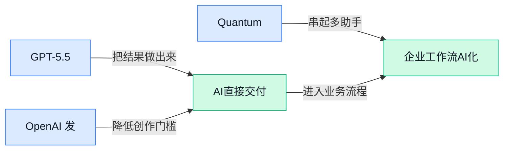

> AI 早报 · 每日早读 · 全网深度聚合

## **今日摘要**

```
OpenAI 连发 GPT-5.5、系统卡和生物安全悬赏，AI 大模型发布彻底变成软件周更
Google 自曝 75% 新代码由 AI 参与编写，TPU 负载继续加码，软件分工被改写
腾讯开源 Hy3 preview 预览版冲击 MoE 赛道，OpenAI 同步放出隐私过滤模型直指数据合规
```

### 🔵 产品与功能更新

1. **GPT-5.5 亮相，AI 模型发布越来越像软件版本更新。**
从 Fortune 的报道看，**GPT-5.5** 的推出再次强化了一个趋势：大模型正在从“每次都是大新闻”，慢慢变成更接近常规**版本迭代**的软件更新节奏 📦。这意味着今后大家面对 AI 产品时，可能更需要关注“这次具体增强了什么能力”，而不只是盯着模型名字本身。对公司内部使用者来说，这类变化也会直接影响日常办公工具里的写作、搜索和自动化体验，AI 正越来越像会持续升级的基础设施。[完整报道(briefing)](https://news.google.com/rss/articles/CBMiZkFVX3lxTFB2amVfdnJfTjhyMnZrUUw2VXFrZGxiYXNiSUdWUlV5TUs2Q09ZOGxjTmNlMkl1Y0k4OUhfc1g1Sl82aTlGOTk1VjVVaWV3Z3RZd08xWEN1eFhESnRCWF9IcVRnbllIUQ?oc=5)


2. **OpenAI 发布开源隐私过滤模型，可自动删除文本里的个人信息。**
OpenAI 推出了一款**开源模型**，核心用途是把文本中的**个人数据**识别并去掉，属于很实用的隐私保护更新 🔐。这类工具对要处理简历、客服记录、合同内容等文字材料的团队尤其重要，因为它能在共享、分析或训练前先做一层“脱敏”（把能识别到个人身份的信息移除）。对企业来说，这不只是技术优化，也是在为更合规地使用 AI 铺路，减少把敏感信息直接喂给模型的风险。[发布详情(briefing)](https://the-decoder.com/openai-releases-open-source-model-that-strips-personal-data-from-text/)

3. **Quantum Computing Inc. 推出 Photonic AI Platform（光子 AI 平台，用光而不是电来处理计算）的新平台。**
这家公司发布的 **Photonic AI Platform（光子 AI 平台，用光信号参与计算，目标是提升速度并降低部分能耗）**，瞄准的是 AI 计算底层硬件的新路线 💡。相比传统电子芯片，这类 **photonic（光子计算，利用光传播和调制来做信息处理）** 方案常被关注在高性能和效率上的潜力。虽然这类平台离普通办公用户还有距离，但它关系到未来 AI 基础设施能不能更快、更省资源，也会影响长期的算力成本和行业竞争格局。[简要报道(briefing)](https://news.google.com/rss/articles/CBMilAFBVV95cUxQYlpnYWlCWkNrMHdyeXZDajNVb0hVdHRZSHpPZER5V3laY2d3eU5UNlpGZmh3VW1OM2k3bmFXQUtpa0ZIZGhMSlJGY3otTHF1R016Z2hkX25EQmRWSkJvWndqSEZRM0NRREZKQWZsRThNeE54YmtRZTFlY2NRUEd6eFhNZ19fYkY1NERFTjRWWUFKYnlo?oc=5)

### 🟢 前沿研究

1. **Near-Future Policy Optimization（“近未来”策略优化，一种新的强化学习训练思路）提出让模型更稳地学会做决策。**
这篇工作聚焦 **强化学习**（让模型通过“试错+奖励”学会行动）里的训练稳定性问题，核心想法是让模型在更新策略时，不只盯着眼前一步，而是参考“近未来”的表现来做调整 💡。对普通读者来说，可以把它理解成：AI 不是只看“这一步做得对不对”，而是会多想几步，减少学偏或忽好忽坏的情况。这样的方向如果被后续验证有效，可能会影响 **Agent**、机器人控制和复杂任务自动化的训练方式。[论文条目页(briefing)](https://huggingface.co/papers/2604.20733)

2. **COMPASS（一种持续多语言微调框架）想解决 AI 越学新语言、越容易忘旧语言的问题。**
这篇论文讨论的是 **continual multilingual PEFT**（持续多语言参数高效微调，指用较少额外参数持续给模型补新语言能力）与 **adaptive semantic sampling**（自适应语义采样，让训练时更会挑“有代表性”的数据）📚。说白了，它关注的是：模型如果不断接触新语言、新任务，怎么避免“学了新的，忘了旧的”。这对做跨境业务、国际客服、全球内容运营的团队尤其有现实意义，因为未来多语言 AI 是否稳定，很大程度取决于这类底层训练方案。[论文条目页(briefing)](https://huggingface.co/papers/2604.20720)

3. **SAVOIR（一种让 AI 学习“社交分寸感”的训练方法）尝试把礼貌、得体和协作能力教给模型。**
论文标题里的 **social savoir-faire**（社交分寸感，指在多人互动里知道什么话该说、什么行为更得体）点出了它的目标：不是只让模型答对题，而是让它更会“做人” 🤝。作者使用 **Shapley-based reward attribution**（基于夏普利值的奖励归因，一种把“功劳”更公平分给各个行为或决策环节的方法），去分析哪些行为真正带来了更好的社交表现。对企业场景来说，这类研究很关键，因为未来 AI 不只是写文案、查资料，还会越来越多地参与客服、协作助手和多角色沟通。[论文条目页(briefing)](https://huggingface.co/papers/2604.18982)

4. **MMCORE（一种多模态连接框架）试图让文字、图像等不同信息更自然地对齐和互通。**
这里的 **multimodal**（多模态，指文字、图片、音频、视频等多种信息形式）是当前 AI 非常核心的方向，而 **representation aligned latent embeddings**（对齐后的潜在向量表示，可以理解成把不同类型的信息翻译到同一套“机器能懂的坐标系”里）是它的技术重点 🧠。如果这类方法更成熟，AI 在“看图说话”“文图搜索”“跨模态理解”上的表现会更稳定，也更适合做企业知识库、设计协作和内容生产。简单说，它是在补 AI “不同感官之间能不能顺畅沟通”的基础能力。[论文条目页(briefing)](https://huggingface.co/papers/2604.19902)

5. **Expert Upcycling（一种改造 MoE 的训练思路）瞄准更省算力地做大模型扩展。**
这篇论文聚焦 **MoE**（混合专家模型，把一个大模型拆成多个“分工专家”，每次只调用其中一部分来省计算）架构，并提出 **Expert Upcycling**（专家升级改造，强调在已有模型基础上重组和利用“专家”能力）🚀。按摘要信息，它想推动 **compute-efficient frontier**（算力效率边界，也就是“花同样资源能做得更强”）继续前移，这对当前大模型行业很现实，因为训练成本、电力成本和硬件压力都在快速上升。对企业决策者来说，这类研究的意义不是“参数更炫”，而是未来同等预算下，模型能力可能更划算。[论文条目页(briefing)](https://huggingface.co/papers/2604.19835) [arxiv 论文(briefing)](https://arxiv.org/abs/2604.19835)

6. **Convergent Evolution（“趋同进化”研究）发现不同大模型可能会学出相似的数字理解方式。**
这项工作研究 **language models**（语言模型，也就是今天各类聊天 AI 的底层模型）如何形成 **number representations**（数字表征，指模型脑海里“数字是什么、彼此关系如何”的内部理解方式）🔢。有意思的是，论文标题直接提出“不同模型会不会像生物进化一样，最后长出相似能力结构”这个问题。它的价值在于帮助研究者更好理解：为什么不同公司、不同架构训练出来的模型，可能在数学、推理或数字相关任务上表现出某些共性。[论文条目页(briefing)](https://huggingface.co/papers/2604.20817)

7. **Decoupled DiLoCo（一种大规模分布式训练方案）瞄准更抗波动、更易扩展的 AI 训练基础设施。**
Google DeepMind 这项工作关注 **distributed AI training**（分布式 AI 训练，把训练任务拆到很多机器上同时跑）在大规模场景下的稳定性与韧性。标题中的 **Decoupled DiLoCo**（一种解耦式训练框架，强调把不同训练环节拆开协调，减少彼此牵制）和 **resilient**（有韧性、抗故障）很关键，说明它重点不是单次跑得多快，而是大规模训练时更不容易被网络、机器状态或同步问题拖垮 ⚙️。这类研究虽然偏底层，但会直接影响未来大模型训练成本、效率，以及“能不能在更多数据中心稳定扩展”。[相关报道入口(briefing)](https://news.google.com/rss/articles/CBMiWkFVX3lxTE8yTFdVS0pQdVZYZjFRTk9sRVExME5vaHNFSWh3YXk1QlBBa2o0Z1ptU2kxRzlLLW02X0hOUEp3SnpiNHpab0EwOWJ3dkZJUWNGX2dwbFNWS241dw?oc=5)

### 🟡 行业展望与社会影响

1. **Google 解释 TPU（张量处理器，专门为 AI 训练和推理设计的芯片）如何扛起更重的 AI 负载。**
Google 用一支新视频介绍了 **TPU** 在 AI 时代为什么越来越重要：当模型更大、任务更复杂时，底层算力（也就是支撑 AI 跑起来的计算资源）就成了决定体验和成本的关键 💡。这条信息虽然偏基础设施，但对行业很有代表性——大家看到的 AI 功能升级，背后往往先是芯片和数据中心能力升级。对企业来说，这也意味着未来 AI 竞争不只是“谁会做产品”，更是“谁有能力把模型稳定、便宜、快速地跑起来” 🚀。可结合 [Google 官方介绍页(briefing)](https://blog.google/innovation-and-ai/infrastructure-and-cloud/google-cloud/what-is-a-tpu/) 了解原始说明。


2. **Google 称 75% 的新代码已由 AI 参与编写，软件行业分工正在被改写。**
据报道，Google 表示其 **75% 的新代码** 已经由 AI 生成或辅助完成，这说明 AI 在编程环节正从“帮忙补几行”走向更深度参与 😮。这里的重点不只是效率提升，更是工作流程变化：人类工程师可能越来越多负责审查、整合和决策，而不是从零逐字敲代码。对非技术岗位同事也有启发——AI 对白领工作的影响，很可能也会沿着这条路径演进：先辅助，再接管标准化重复任务，最后把人的精力释放到判断、协作和创意上。[完整报道(briefing)](https://the-decoder.com/google-says-75-percent-of-its-new-code-is-now-written-by-ai/)


3. **OpenAI 推出 GPT-5.5 Bio Bug Bounty（生物安全漏洞悬赏计划），主动邀请外部“挑刺”。**
OpenAI 发布了面向 **GPT-5.5** 的生物安全漏洞悬赏，重点是寻找 **universal jailbreak（通用越狱提示，让模型绕过安全限制的办法）**，尤其聚焦可能带来生物风险的场景。所谓 **red-teaming（红队测试，故意从攻击者角度找系统漏洞）**，本质上就是在问题真正发生前，先请外部高手把风险挖出来 🔍。这件事的行业信号很明确：越强的模型，越不能只拼能力，还要把安全治理、外部审计和奖励机制一起做起来。官方说明见 [OpenAI 悬赏计划页(briefing)](https://openai.com/index/gpt-5-5-bio-bug-bounty)。

4. **OpenAI 发布 GPT-5.5 System Card（系统卡，集中披露模型能力与风险的说明文件）。**
**System Card（系统卡，用来说明模型怎么测试、有哪些能力边界和风险控制）** 是大模型行业越来越重要的一类公开材料，它不只是技术文档，更像 AI 产品的“安全体检报告” 📄。OpenAI 这次单独发布 **GPT-5.5** 的系统卡，说明行业正在把“模型是否强大”与“模型是否可控”放到同等重要的位置。对企业用户和管理者来说，这类文件的意义在于帮助判断模型是否适合接入真实业务场景，尤其是涉及合规、内容安全和高风险使用的领域。可查看 [OpenAI 系统卡原文(briefing)](https://openai.com/index/gpt-5-5-system-card)。

### 🟣 开源TOP项目

1. **context-mode（一款给 AI 编码助手做上下文压缩的开源工具）主打把无关信息大幅“瘦身”。**
这个项目聚焦 **context window（上下文窗口，指模型一次性能看到并处理的内容范围）优化**，目标是让 AI 编码 Agent 在处理长任务时少被杂讯干扰 💡。项目介绍提到，它会对工具输出做 **sandbox（沙箱隔离，把外部工具返回内容先放进受控环境里处理）**，并宣称可带来 **98% reduction（98% 的上下文占用减少）**。对经常把 AI 用在写代码、查日志、调工具链的团队来说，这类项目的意义在于：同样的模型输入空间，能留给真正重要信息更多位置。[GitHub 项目页(briefing)](https://github.com/mksglu/context-mode)


2. **vercel-labs/skills（Vercel 推出的开源 Agent 技能工具）想把“能力插件化”这件事做简单。**
它的定位很直接，就是一个 **open agent skills tool（开源 Agent 技能工具，让 AI 助手按模块获得特定能力）**，并给出了 `npx skills` 这样的快速启动方式 🚀。这里的 **npx（Node.js 生态里可直接运行工具的命令，不必先完整安装）**，意味着开发者可以更轻量地试用和接入。对非技术同事来说，可以把它理解成“给 AI 助手装专用技能包”，方便团队把重复工作流程做成可复用能力。[GitHub 仓库(briefing)](https://github.com/vercel-labs/skills)


3. **RAG-Anything（一个“一站式”检索增强生成框架）瞄准更通用的资料接入能力。**
项目名里提到的 **RAG（检索增强生成，让 AI 回答前先去查资料，而不是只靠模型记忆）**，本质是在提升回答的依据感和可追溯性 📚。而它强调 **All-in-One Framework（一体化框架，把多种检索与生成流程尽量整合到一个体系里）**，说明目标不是单点功能，而是做成更完整的“查资料 + 生成答案”底座。对企业场景来说，这类项目通常更适合知识库问答、文档助手、客服辅助等需要“先查再答”的任务。[GitHub 项目页(briefing)](https://github.com/HKUDS/RAG-Anything)


4. **last30days-skill（一款帮 AI Agent 做近 30 天话题研究的技能）适合追踪热点与舆情。**
这个项目的亮点是能围绕任意主题，跨 **Reddit（海外社区论坛）、X（原 Twitter）、YouTube（视频平台）、HN（Hacker News，海外科技社区）、Polymarket（预测市场平台）** 以及网页内容做信息搜集，再输出 **grounded summary（有来源依据的总结，而非纯模型脑补）** 🧭。它更像一个“热点研究技能包”，适合做行业动态扫描、内容选题、竞品舆情整理。对运营、市场、品牌团队尤其有吸引力，因为它瞄准的是“多平台搜集后再统一归纳”这件很费时间的事。[GitHub 仓库(briefing)](https://github.com/mvanhorn/last30days-skill)

5. **Open-Generative-AI（一个可自托管的开源图像与视频生成工作室）把“模型大合集”作为卖点。**
项目介绍称它是多款生成式产品的 **open-source alternative（开源替代方案）**，支持 **self-hosted（自托管，部署在自己机器或服务器上，数据和控制权更多掌握在自己手里）**，并采用 **MIT licensed（MIT 开源许可，商用和二次开发限制相对较少）**。仓库还提到集成了 **200+ models（200 多个模型）**，覆盖图像与视频生成场景 🎨。对设计、内容团队来说，这类项目的意义在于把多个生成模型集中到一个工作台里，便于统一试用与管理；但摘要也明确写了 **No content filters（没有内容过滤）**，这意味着使用边界和合规风险需要团队自行把控。[GitHub 项目页(briefing)](https://github.com/Anil-matcha/Open-Generative-AI)

6. **CL4R1T4S（一个收集多家 AI 产品系统提示词的开源项目）主打“系统透明度”。**
项目摘要写得非常明确：它聚焦 **system prompts（系统提示词，决定 AI 助手基础行为和规则的隐藏指令）** 的公开整理，涉及 ChatGPT、Gemini、Claude、Cursor 等多个产品 🔍。所谓 **transparency（透明度）**，可以理解为让外界更清楚这些 AI 助手“默认被如何设定、被要求如何回答”。对普通使用者来说，这类项目有助于理解不同 AI 产品为何风格不同、边界不同，但它本身也属于对底层行为规则的观察和收集，信息敏感度相对更高。[GitHub 仓库(briefing)](https://github.com/elder-plinius/CL4R1T4S)

### 🔴 社媒分享

1. **Google Cloud CEO 谈 Agentic Moment（AI 从“回答问题”走向“主动做事”的阶段）。**
Google Cloud CEO Thomas Kurian 在这场访谈里，重点聊了企业为什么开始从“聊天式 AI”转向**Agent**，也就是能理解目标、调用工具、分步骤完成任务的 AI 助手 🤖。这类变化对公司内部最直接的意义是：未来很多跨系统、跨部门的流程，可能不只是“问答自动化”，而是进一步变成“任务自动化”。如果你想理解 Google 怎么看企业级 AI 落地、以及为什么大家都在谈“AI 能不能真正干活”，这篇访谈很值得一读。[Google Cloud 访谈全文(briefing)](https://stratechery.com/2026/an-interview-with-google-cloud-ceo-thomas-kurian-about-the-agentic-moment/) 💡


2. **GPT-5.5 发布，OpenAI 继续推进新一代模型迭代。**
OpenAI 正式发布 **GPT-5.5**，这是其最新一轮模型更新，已经通过官方渠道对外公布 📌。对普通用户和业务团队来说，模型代际更新通常意味着**回答质量**、**速度**或**任务完成能力**会继续提升，也会影响之后各类 AI 产品的默认体验。虽然官方发布页内容很简洁，但它本身已经释放出明确信号：OpenAI 仍在持续加快主力模型的更新节奏。[OpenAI 官方发布页(briefing)](https://openai.com/index/introducing-gpt-5-5/) 🚀

3. **Simon Willison 评价 GPT-5.5：快、稳、而且能力很强。**
知名独立开发者 Simon Willison 在体验后表示，**GPT-5.5** 是一个速度快、效果好、整体能力很强的模型，并提到它已进入 **Codex**，也正向付费 ChatGPT 用户逐步开放。这里的 Codex 指 OpenAI 的编程助手产品，适合写代码、改代码和处理开发任务；而“逐步开放”也意味着新模型会先在部分用户和产品中落地。对外部观察者来说，这类一线体验分享的价值在于：它能帮助大家更快判断新模型是不是“纸面升级”，还是已经到了可用性明显提升的阶段。[体验文章原文(briefing)](https://simonwillison.net/2026/Apr/23/gpt-5-5/#atom-everything) ✨


4. **腾讯放出 Hy3 preview（开源大模型预览版），主打 MoE（混合专家模型，让多个子模型分工协作）架构。**
这条社媒消息提到，腾讯发布了 **Hy3 preview**，并公开了模型权重（训练完成后的核心参数文件），定位是一个开源大模型预览版 🧠。其中最值得注意的是它采用 **MoE**（混合专家模型，让多个子模型像“分工部门”一样协作），总参数规模为 295B、激活参数为 21B，也就是模型很大，但每次真正调用的部分更精简，有机会兼顾能力和效率。原帖还给出了 HuggingFace（全球最大 AI 模型共享社区）上的模型页面，方便开发者进一步查看和试用。[Reddit 讨论帖(briefing)](https://www.reddit.com/r/LocalLLaMA/comments/1stk2mz/tencent_releases_hy3_preview_open_source_295b_21b/) [HuggingFace 模型页(briefing)](https://huggingface.co/tencent/Hy3-preview) 🚀

---



### 📊 行业洞察（今日 4 条）

1. GPT-5.5发布、Simon Willison称它“快稳强”，但官方暂未开放接口，且据报道价格还翻倍
  【洞察】模型升级已像软件发版，但最强能力不会立刻普惠；真正稀缺的不是模型名，而是能不能稳定接入、敢不敢大规模用

2. OpenAI一边发GPT-5.5系统卡（模型风险说明书）、生物安全漏洞悬赏，一边又推开源隐私过滤模型
  【洞察】这几件事放一起看，行业已从“只比谁更聪明”转向“谁更可控、更合规、更敢进真实业务”

3. Google称75%新代码由AI参与编写，Google Cloud又高调谈“Agent时刻”，Vercel还把技能插件开源化
  【洞察】AI正从聊天工具变成干活系统；下一轮竞争重点不是回答得多像人，而是谁能把任务拆解、调用工具并复用能力

4. Google讲TPU（专门跑AI的芯片）、Quantum Computing Inc.推光子AI平台，研究圈又在猛攻省算力训练
  【洞察】行业表面在卷模型，底层其实在卷成本；算力没有变便宜，只是大家都在拼命找更省钱的路

### 💭 对我们的启发（今日 3 条）

1. GPT-5.5更强却暂未开放接口，提醒我们别把平台绑死在单一模型上；调度层必须默认多模型替补，否则上层体验会被别人发版节奏卡住。

2. OpenAI连续强调系统卡、漏洞悬赏和隐私过滤，说明信任机制不是加分项而是入场券；我们要让用户看见Agent依据、步骤、风险提示和人工接管入口。

3. Google与Vercel都在证明“技能模块化”会加速普及，我们的价值不该只是接更多模型，而是建立技能评价、任务分发和优胜劣汰机制。


---

> 本周周报：[第17周综合分析](https://ylzsdafei.github.io/ai-daily-site/blog/weekly/2026-w17/)
