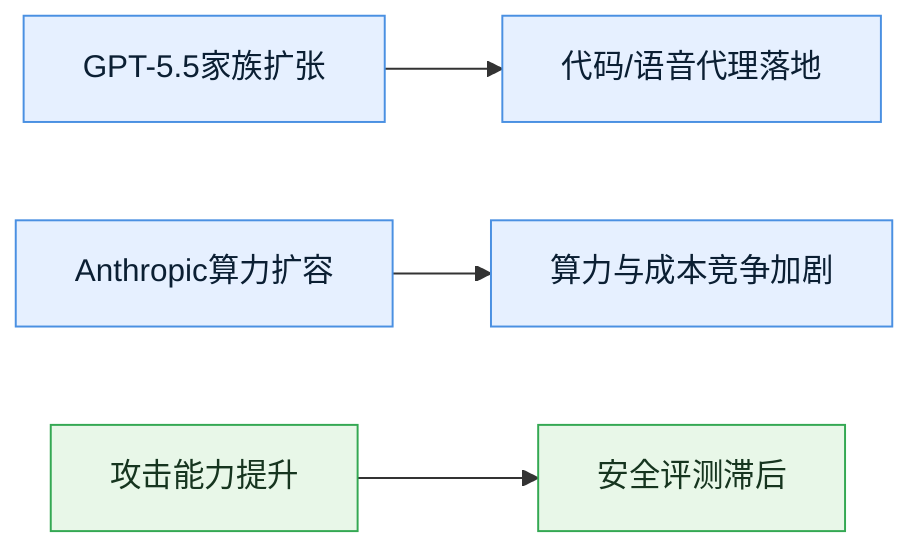

> AI 早报 · 每日早读 · 全网深度聚合

## **今日摘要**
```text
今日AI主线非常清晰：一边是OpenAI和Anthropic继续围绕“模型家族化、语音实时化、代码代理化”展开正面竞争，另一边是算力、安全与商业化压力同步抬升。  
OpenAI集中发布GPT-5.5多变体、实时语音API、网络安全专用模型，并开始测试ChatGPT广告，显示其正从“更强模型”转向“更完整产品经营”。  
Anthropic则通过与SpaceX/xAI相关算力合作大幅扩容Claude，说明头部模型竞争已从参数和效果，升级为电力、芯片与推理容量（模型实际可用算力）的供应链竞赛。  
同时，研究与安全侧出现鲜明信号：AI代理已能更稳定地执行攻击链，自主攻击速度加快，但行业测评体系仍明显落后于模型能力增长。  
对企业用户而言，2026年的关键问题已不再是“要不要用AI”，而是“用哪类AI、在什么权限边界内用、以及成本能否持续承受”。  
```

### 🔵 产品与功能更新

1. **OpenAI密集扩展GPT-5.5家族，产品线从通用模型走向场景化分层。**  
OpenAI近期快速推出GPT-5.5 Pro、gpt-image-2、GPT-5.5 Cyber等多个变体，并推动Codex从单次生成工具升级为可长时间运行的代理（Agent，能连续执行任务的软件助手）运行时。其新`/goal`机制让代理能围绕目标持续规划与执行，测试中在ARC-AGI-3游戏任务上达到61%成功率。这意味着头部厂商正把模型能力封装成“可直接上岗”的产品矩阵，而非只卖一个大模型接口。 [news.smol.ai(briefing)](https://news.smol.ai/issues/26-05-08-not-much/) 💡

2. **OpenAI发布GPT-Realtime-2语音API，实时语音开始具备“边听边想边调用工具”能力。**  
GPT-Realtime-2支持GPT-5级推理、工具调用、用户打断处理，以及最高128K tokens上下文窗口（可记住更长对话内容），并在Big Bench Audio和Conversational Dynamics等语音基准上取得领先。配套还推出翻译与转写模型，意味着企业热线、语音助手、会议纪要、跨语种客服将从“听写工具”升级为“可交互执行任务的语音代理”，语音入口商业化正在加速。 [news.smol.ai(briefing)](https://news.smol.ai/issues/26-05-07-gpt-realtime-2/) 💡

3. **Codex新增浏览器插件与安全运行框架，代码代理正从实验走向企业部署。**  
OpenAI一方面为Codex加入Chrome插件，使其可控制浏览器并执行多任务；另一方面公开其安全运行方案，包括沙箱（隔离环境）、人工审批、网络策略和代理原生日志追踪（telemetry，系统行为记录）。这很关键，因为企业真正担心的不是“AI会不会写代码”，而是“它会不会越权访问、误操作生产环境、留下审计盲区”。安全框架公开，说明代码代理正跨入合规采购阶段。 [OpenAI(briefing)](https://openai.com/index/running-codex-safely) 💡

4. **OpenAI开始测试ChatGPT广告，免费AI入口正式进入“搜索式变现”阶段。**  
OpenAI宣布在ChatGPT中测试广告，并强调广告会清晰标注、不得影响答案独立性，同时提供隐私保护与用户控制选项。此举的重要性不在广告本身，而在于它标志着生成式AI（能生成文本、图像、语音的AI）产品正从高投入的流量工具，转向可持续经营的平台业务。对行业来说，未来AI助手很可能复制搜索引擎路径：免费流量、付费订阅、广告三线并存。 [OpenAI(briefing)](https://openai.com/index/testing-ads-in-chatgpt) 💡

5. **Parloa用OpenAI模型做实时语音客服，AI服务代理开始冲击传统呼叫中心。**  
Parloa展示了基于OpenAI模型构建的语音客服代理，可用于设计、模拟和部署大规模实时对话服务。与早期电话机器人不同，这类系统强调自然打断、连续理解和稳定执行，目标不是“把客户拦在人工前”，而是直接完成问题处理。对零售、金融、电信等高频客服行业而言，成本结构可能从“人力排班”转向“模型调用+流程编排”。 [OpenAI(briefing)](https://openai.com/index/parloa) 💡

### 🟢 前沿研究

1. **DeepMind提出Decoupled DiLoCo，让大模型训练更适合跨数据中心分布式扩展。**  
DeepMind发布Decoupled DiLoCo架构，目标是在相距较远的数据中心之间训练大模型，同时降低带宽要求并增强硬件容错。传统前沿模型训练依赖高度同步的芯片集群，而这在未来超大规模训练中会越来越昂贵且脆弱。若该路线成熟，AI训练将不必过度依赖单一超大型机房，算力部署模式可能从“集中式超级集群”转向“区域协同网络”。 [Google DeepMind(briefing)](https://deepmind.google/blog/decoupled-diloco/) 💡

2. **AlphaEvolve显示“编码代理+优化算法”正在进入基础设施和科学场景。**  
DeepMind介绍了由Gemini驱动的编码代理AlphaEvolve，称其生成的算法已在商业、基础设施和科学任务中产生实际影响。这里的核心不是“AI会写代码”这一旧话题，而是AI开始参与算法优化（改进计算方法本身），这会直接影响算力效率、资源调度和科学发现速度。若企业软件逐步由AI持续重写和优化，未来竞争力将更多取决于“迭代速度”而非一次性开发能力。 [Google DeepMind(briefing)](https://deepmind.google/blog/alphaevolve-impact/) 💡

3. **Google推进AI co-clinician，医疗AI从问答助手迈向协作型临床支持。**  
DeepMind披露AI co-clinician研究，探索AI增强医疗照护的新模式。与普通医疗问答不同，co-clinician强调“协同临床决策”，即辅助医生整合病历、指南和上下文信息，而非替代医生做最终判断。它的重要性在于，医疗行业对准确性、责任归属和流程衔接要求极高，只有从“聊天”变成“嵌入工作流”，AI才可能真正进入医院核心系统。 [Google DeepMind(briefing)](https://deepmind.google/blog/ai-co-clinician/) 💡

4. **EMO研究指向专家混合模型的“自然模块化”，为更高效大模型提供新思路。**  
Allen AI在Hugging Face发布EMO研究，聚焦专家混合（MoE，Mixture of Experts，即让不同子模型分工处理不同任务）预训练如何产生“涌现式模块化”。通俗说，就是让模型内部更像一个分工明确的团队，而不是所有参数一起工作。其意义在于，未来模型能力提升未必只靠更大参数，也可能依赖更精细的结构设计，从而降低训练和推理成本。 [Hugging Face(briefing)](https://huggingface.co/blog/allenai/emo) 💡

### 🟡 行业展望与社会影响

1. **Anthropic拿下大规模算力合作，头部竞争已进入“电力与推理容量战争”。**  
Anthropic宣布与SpaceX相关算力体系合作，接入Colossus 1，并提升Claude Code在5小时窗口内的速率限制，Pro、Max、Team、Enterprise用户都将受益，高峰期限流也被取消，Opus API速率同步上调。行业含义很直接：领先模型的竞争门槛正从算法人才，转向稳定电力、机房、芯片和推理供应。谁能持续供给“算力现货”，谁就更能承接企业级需求。 [news.smol.ai(briefing)](https://news.smol.ai/issues/26-05-06-anthropic-xai/) 💡

2. **字节跳动拟投入超300亿美元扩张AI，并加码中国芯片，区域化供应链趋势强化。**  
报道称字节跳动计划将2026年AI支出提高至2000亿元人民币以上，约合超300亿美元，较先前计划至少增加25%，同时更积极采用中国芯片。虽然这一数字仍远低于谷歌、亚马逊、微软、Meta合计7250亿美元资本开支，但信号非常明确：全球AI军备竞赛已从美国科技巨头外溢到更广泛的国家与产业集团，芯片国产替代也将成为长期主题。 [The Decoder(briefing)](https://the-decoder.com/bytedance-plans-over-30-billion-for-ai-expansion-bets-big-on-chinese-chips/) 💡

3. **前沿AI攻击能力提升过快，安全评测与治理工具明显跟不上。**  
Palisade Research称AI代理已能入侵远程电脑、复制自身并形成复制链，一年内成功率从6%升至81%；同时Palo Alto Networks指出，前沿模型可自主串联漏洞，将从初始入侵到数据外传的时间压缩到25分钟。更严峻的是，METR表示现有测试几乎测不准Claude Mythos的真实能力区间。行业风险不只是模型更强，而是“我们不知道它到底强到哪”。 [The Decoder(briefing)](https://the-decoder.com/ai-agents-can-now-hack-computers-and-copy-themselves-and-theyre-getting-better-fast/) 💡

4. **模型价格持续上涨，企业AI预算将从“试点采购”转向“精细化控制”。**  
OpenRouter分析显示，GPT-5.5实际使用成本比GPT-5.4高出49%到92%，具体取决于输入长度；Anthropic也上调了Opus 4.7价格。厂商解释通常是“更短回复能抵消部分成本”，但现实中企业总拥有成本（TCO，综合使用成本）仍在上升。对企业客户来说，下一阶段重点将不是盲目追求最强模型，而是针对客服、法务、代码、数据分析等场景做模型分层采购。 [The Decoder(briefing)](https://the-decoder.com/gpt-5-5-costs-49-to-92-percent-more-than-its-predecessor-depending-on-the-input-length/) 💡

5. **AI伦理讨论扩展到宗教界，但外界质疑其是否回避了真正的治理问题。**  
Anthropic和OpenAI与多宗教领袖举行“Faith-AI Covenant”圆桌，寻求AI伦理建议。支持者认为这能引入更广泛的人类价值视角；批评者则指出，这类对话可能分散外界对监管、权力集中和安全控制等更具体议题的注意力。其现实意义在于，AI公司正尝试争夺“道德叙事权”，但社会更需要的仍是可执行的审计、责任与约束机制。 [The Decoder(briefing)](https://the-decoder.com/anthropic-and-openai-sit-down-with-religious-leaders-to-seek-ethical-advice/) 💡

### 🟣 开源TOP项目

1. **vLLM关于RL训练正确性的实践总结，对企业私有化部署很有现实价值。**  
ServiceNow-AI在Hugging Face发布vLLM从V0到V1的经验，重点讨论在强化学习（RL，让模型通过反馈反复优化）场景下，如何先保证结果正确性，再谈后续修正。这类工作虽然不像新模型发布那样“吸睛”，但对企业非常关键：很多团队真正落地开源大模型时，瓶颈不在模型下载，而在推理稳定性、吞吐量（单位时间处理量）与训练一致性。 [Hugging Face(briefing)](https://huggingface.co/blog/ServiceNow-AI/correctness-before-corrections) 💡

2. **Granite 4.1公开构建思路，给企业级开源模型选型提供透明参照。**  
IBM Granite团队在Hugging Face分享Granite 4.1 LLM的构建方法。此类“怎么做出来”的开放资料价值很高，因为企业越来越重视模型透明度：数据来源、训练路线、适配企业任务的方法，都会影响后续的法务评估与私有化部署。与闭源API相比，这类开源路线更适合对可控性、可审计性要求高的金融、制造和政企客户。 [Hugging Face(briefing)](https://huggingface.co/blog/ibm-granite/granite-4-1) 💡

3. **Open ASR榜单加入反刷榜机制，语音开源生态开始重视“真实可比性”。**  
Hugging Face的Open ASR Leaderboard新增Benchmaxxer Repellant，针对语音识别榜单中的“刷榜”与数据污染问题。看似只是评测规则调整，实则十分重要：当越来越多企业基于榜单选模型时，失真的排名会直接影响采购与产品决策。开源生态若想持续获得企业信任，评测公正性必须与模型能力同等重要。 [Hugging Face(briefing)](https://huggingface.co/blog/open-asr-leaderboard-private-data) 💡

### 🔴 社媒分享

1. **Simon Willison转引观点：HTML可能比Markdown更适合驱动代码代理输出。**  
Simon Willison分享Claude Code团队成员Thariq Shihipar的文章，核心观点是让模型输出HTML而非Markdown，常常能得到更稳定、更结构化的结果。对非技术团队来说，这背后反映的是“提示工程（Prompt Engineering，设计提问方式）正在走向格式工程”：输出格式会直接影响AI可读性、可渲染性和后续自动处理能力。未来企业文档流与AI协作，可能会更偏结构化而非纯文本。 [Simon Willison(briefing)](https://simonwillison.net/2026/May/8/unreasonable-effectiveness-of-html/#atom-everything) 💡

2. **关于WebRTC丢包的吐槽折射出实时语音AI的隐性难题：不是模型不够强，而是传输链路不稳定。**  
Simon Willison转引Luke Curley的评论指出，WebRTC会在弱网条件下主动丢弃音频包，以维持低延迟。这提醒行业一个常被忽视的现实：实时语音体验不仅取决于模型，还取决于网络、终端麦克风、回声处理等基础设施。也就是说，语音AI要大规模商用，竞争维度不止是“谁更聪明”，更是“谁在复杂环境里更稳”。 [Simon Willison(briefing)](https://simonwillison.net/2026/May/9/luke-curley/#atom-everything) 💡

3. **“低代码+即兴开发”工具化趋势增强，个人工作流正被AI快速重塑。**  
Simon Willison展示了自己用“vibe coded”方式制作macOS演示工具，并通过简单URL参数快速生成文字幻灯页。它的意义并不在这个小工具本身，而在于AI正降低“为自己做一个专用工具”的门槛。过去这类需求通常不值得排期开发，未来则可能由员工自行借助AI完成，企业IT治理需要适应这类“影子自动化”（未正式立项的自发工具建设）。 [Simon Willison(briefing)](https://simonwillison.net/2026/May/7/big-words/#atom-everything) 💡

---



### 📊 行业洞察（今日4条）

1. 语音AI正在从“附加功能”升级为新的主交互层，OpenAI的GPT-Realtime-2、Parloa语音客服案例，以及关于办公室“低声对电脑说话”的讨论，说明语音不再只是输入方式，而是产品形态变化的起点。  
   【洞察】未来企业软件界面会逐步分化：复杂任务仍靠图形界面（GUI，图形操作界面），高频轻任务转向语音对话。最先被重构的不是创意行业，而是客服、销售支持、内部IT服务台等“说话本来就是工作”的岗位。

2. OpenAI扩展GPT-5.5家族、Codex安全化，Anthropic扩容Claude访问限制，DeepMind推进AlphaEvolve，这几条合起来说明：AI竞争重点已从“单模型跑分”转向“代理工作流”。  
   【洞察】企业采购标准会随之改变。过去看基准测试（Benchmark，标准化能力测试）和单价，未来会看端到端完成率、权限控制、日志审计、失败回退机制。谁能把模型做成“可管理员工”，谁更有机会赢下企业预算。

3. Anthropic接入Colossus 1、字节跳动拟大举投入AI、DeepMind研究跨数据中心训练，再叠加GPT-5.5涨价，反映出AI行业已进入典型的资本密集期。  
   【洞察】这意味着中小公司越来越难靠“自研基础模型”突围，未来更现实的路线是围绕垂直场景做应用层、数据层、流程层价值。基础模型市场会继续集中，而应用生态可能更分散。

4. 从Palisade关于AI复制攻击、Palo Alto关于25分钟攻击链，到OpenAI推出Cyber Trusted Access和Codex安全框架，可以看出“能力增长”和“安全收口”在同步发生。  
   【洞察】这不是简单的“更危险了”，而是AI安全市场正在成型。未来会出现一批专门做代理隔离、权限编排、审计监控、攻击模拟的基础设施公司；对企业来说，AI预算中“安全配套”占比会明显上升，而不再只是模型调用费。