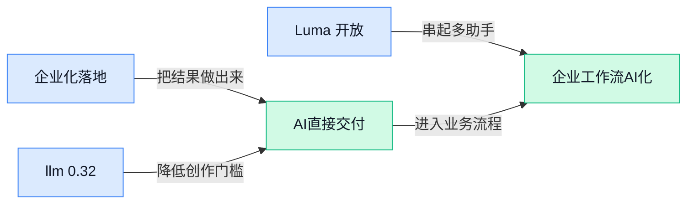

> AI 早报 · 每日早读 · 全网深度聚合

## **今日摘要**

```
Anthropic 企业付费客户占比首次反超 OpenAI，Claude for Small Business 直插中小企业办公入口
Meta AI 在 WhatsApp 上线私密模式默认不留痕，Google 把主动 Agent 和 vibe coding 一口气塞进 Android
OpenAI 详解 Codex Windows 安全沙箱，马斯克与奥特曼官司升温，Satya 和 Sam 将同时出庭
```

### 🔵 产品与功能更新

1. **Anthropic 推出 Claude for Small Business（面向小企业的 Claude 版本），想把 AI 塞进你早就忘了续费的办公工具里。**
Anthropic 这次瞄准的是**小企业办公场景**，核心思路不是再造一个新入口，而是把 Claude 接进企业已经在用、甚至“忘了自己还在付费”的软件里 💼。对业务、运营和行政同事来说，这意味着 AI 可能不再是单独打开的聊天窗口，而是直接出现在日常工具链里，帮你处理文档、流程和信息整理。原文重点介绍了这一产品方向与定位，可查看 [完整报道(briefing)](https://the-decoder.com/anthropic-launches-claude-for-small-business-to-embed-ai-into-the-tools-you-forgot-you-pay-for/)。这里的 **Small Business**（小型企业客户）和“嵌入式 AI”更像是把助手装进现有办公室，而不是让员工再学一套新系统，落地味道很浓 🚀。


2. **llm 0.32a2（一个在命令行里调用大模型的工具）发布，重点补上 Atom feed（网页更新订阅源）支持。**
这次更新来自 Simon Willison 的 **llm** 工具，它主要给开发者在 **命令行**（不用图形界面、直接输文字指令的操作方式）里调用不同大模型用，但新版里最值得注意的是加入了 **Atom feed**（一种网站内容更新订阅格式，和 RSS 类似）相关能力 🔧。虽然它看起来偏技术，但背后价值很现实：AI 工具开始更自然地接入“信息订阅—抓取—总结”这类工作流，未来做情报跟踪、舆情整理、行业监测的人也会间接受益。想看作者自己划出的更新重点，可以读 [作者更新说明(briefing)](https://simonwillison.net/2026/May/12/llm/#atom-everything)；具体版本发布信息也在 [GitHub 发布页(briefing)](https://github.com/simonw/llm/releases/tag/0.32a2)。这类工具更新虽然不直接面向普通员工，但它常常会先影响开发者，再变成大家日后用到的 AI 产品能力 💡。


3. **Luma 开放 Uni-1.1（图像生成模型）API，价格和画质直接对标 OpenAI 与 Google。**
Luma 正式把 **Uni-1.1** 以 **API**（让别的软件也能调用该能力的接口）形式开放出来，卖点非常直接：**价格**和**生成质量**都瞄准 OpenAI、Google 同档产品 🎨。这对设计、营销和内容团队的意义很明确——图像生成赛道的供应商更多了，未来企业采购 AI 视觉能力时，不再只有少数几家可选，议价空间也可能变大。原文聚焦的是 Luma 如何把这款模型推向开发者和企业市场，详情可见 [完整报道(briefing)](https://the-decoder.com/luma-opens-uni-1-1-image-model-api-at-prices-and-quality-matching-openai-and-google/)。这里的 **图像模型** 本质上就是“用文字生成图片的 AI 引擎”，而 API 开放意味着它更容易被接进现有产品或内部系统里，商业化步伐明显加快了 🚀。

### 🟢 前沿研究

1. **SkillGen（可在回答时自动合成新技能的 Agent 方法）让 AI 临场“现学现用”。**
这篇论文想解决一个很实际的问题：现在很多 **Agent** 想变强，往往要靠人手写“技能模块”，既慢又难复用。**SkillGen** 提出在 **inference（模型推理，让训练好的模型在使用时作答）** 阶段自动合成技能，并且带有 **verified（自动校验结果是否符合要求）** 机制，尽量保证新技能不是“瞎编”的 💡。对企业来说，这意味着未来 AI 助手可能不用重新训练，就能按任务临时拼出更合适的工作流程，灵活性更高。[arxiv 论文(briefing)](https://arxiv.org/abs/2605.10999)

2. **VPG-EA（兼顾效率的推理引导方法）瞄准大模型“想太多”问题。**
论文指出，大模型在复杂任务里常依赖 **chain-of-thought（把思考过程一步步展开的推理方式）**，但也容易出现 **overthinking（明明不必想这么久，却生成过长推理过程）**，直接拖慢响应速度。作者提出一种 **variational posterior guidance（用近似后验分布来引导推理路径的办法，可理解为给模型一张“更省路”的导航图）**，而且特别加入 **efficiency awareness（效率感知，即不仅看答得对不对，也看是否省计算）** 🚀。如果这类研究成熟，未来企业用大模型做客服、分析、内部问答时，可能更容易兼顾质量和成本。[arxiv 论文(briefing)](https://arxiv.org/abs/2605.11019)

3. **DMI-Lib（用于观察模型内部状态的高速工具库）想把大模型“开盖检修”做成标配。**
现在很多大模型应用不只关心最终答案，也想实时看到模型内部发生了什么，比如中间状态有没有异常。论文提出 **DMI-Lib**，把 **model-internal observability（模型内部可观测性，也就是能看到模型处理中间过程）** 当成一等能力来设计，同时强调 **performant（高性能，尽量不拖慢运行）** 和灵活接入 🛠️。这类工具对做 AI 产品的团队很重要，因为它有助于排查问题、理解模型行为，也能为更精细的控制和监控打基础。[arxiv 论文(briefing)](https://arxiv.org/abs/2605.11093)

4. **Tie Training（“平票训练”校正法）尝试减少大模型“迎合”和篇幅偏见。**
这篇研究聚焦 **preference optimization（偏好优化，用“人类更喜欢哪个回答”来训练模型）** 的副作用：模型可能学到 **spurious correlation（虚假相关，看似有效其实只是数据里的偶然线索）**，进而出现 **sycophancy（迎合倾向，一味顺着用户说）** 和 **length bias（篇幅偏见，误以为越长越好）**。作者分析了这些问题的机制与后果，并提出 **Tie Training** 作为缓解方案，核心是减少模型把“非本质线索”当成高分信号的机会 ⚖️。这对企业用户很关键，因为大家并不只需要“会说”，更需要答案稳定、不过度讨好、也不拿冗长冒充高质量。[arxiv 论文(briefing)](https://arxiv.org/abs/2605.11134)

5. **Test-Time Personalization（使用时个性化）研究指出：AI 想“懂你”，不该只靠一次性输入。**
论文批评了当前个性化路线过于依赖“更好的模型”或“更长的用户资料”，却把 **inference（模型推理，让模型在当前对话中生成答案）** 当成一次性过程。作者提出一个诊断框架，并给出 **probabilistic fix（基于概率的修正方案，用统计方式动态调整判断）**，专门处理个性化在规模扩大后失灵的问题 📌。简单说，这项研究在提醒行业：真正的个性化，不只是把用户标签塞进去，而是要让模型在使用过程中持续校正理解。[arxiv 论文(briefing)](https://arxiv.org/abs/2605.10991)

6. **OpenAI 复盘 Parameter Golf（受严格约束的 AI 研究挑战赛），总结 AI 辅助科研的真实边界。**
OpenAI 介绍，这场 **Parameter Golf（限定参数规模、鼓励极限优化的机器学习研究挑战）** 吸引了 1000 多名参与者和 2000 多份提交，集中探索了 **coding agents（能自动写代码和改代码的 AI 助手）**、**quantization（量化，把模型压缩到更省资源的表示方式）** 和新模型设计等方向。它的价值不只是“比赛热闹”，更像一次大规模实验：看看 AI 辅助研究到底在哪些环节最有帮助、哪些地方还离不开人类判断 🤖。对公司团队来说，这类总结有助于更理性地看待“AI 能不能替代研究和开发”，避免期待过高或投入失焦。[OpenAI 官方复盘(briefing)](https://openai.com/index/what-parameter-golf-taught-us)

7. **DeepMind 提出 Pointer Engineering（指针工程，用鼠标光标帮助 AI 理解界面操作）重新想象 AI 时代的鼠标。**
这篇报道介绍，DeepMind 正尝试把传统 **mouse cursor（鼠标光标，用户在屏幕上点击和拖动的指针）** 变成更适合 AI 操作电脑的交互层，不再只是“你点哪里”，而是帮助模型更准确理解界面元素和操作意图。所谓 **Pointer Engineering**，可以理解为给 AI 一个更清晰的“手指”，让它在复杂图形界面里少走弯路、少点错地方 🖱️。如果这种思路走通，未来 AI 在办公软件、网站后台、设计工具里的代操作能力，可能会比现在更稳、更像真人使用电脑。[完整报道(briefing)](https://the-decoder.com/from-prompt-to-pointer-engineering-deepmind-tries-to-reinvent-the-mouse-cursor-for-the-ai-era/)

8. **Muon（一个近期受关注的优化器）未必特殊，随机谱和倒置谱也能达到类似效果。**
这篇论文给近期很热的 **Muon optimizer（用于训练模型时更新参数的算法）** 泼了一盆冷水：作者认为它的成功不一定来自某种“独门绝技”。文中讨论了 **non-Euclidean optimization（非欧几里得优化，指不按普通直线距离的几何方式来更新参数）**、**second-order methods（二阶优化，会参考曲率信息，像开车时不只看方向还看路面起伏）** 和 **LMO，linear minimization oracle（线性最小化求解器，一类帮助快速找更新方向的子程序）** 等解释，并指出更随机或倒置的谱结构也能做得一样好 🔍。这类结果对行业的意义是：热门训练技巧不一定是“唯一答案”，后续大家可能会更谨慎地评估哪些改进真有普适价值。[arxiv 论文(briefing)](https://arxiv.org/abs/2605.11181)

### 🟡 行业展望与社会影响

1. **Anthropic 在企业付费客户占比上首次反超 OpenAI。**
根据 Ramp（一家做企业支出管理的金融科技公司）基于客户报销与采购数据整理的调查，**34.4%** 的参与企业在为 **Anthropic** 付费，而 **OpenAI** 为 **32.3%** 📊。这说明企业级市场不再只是“谁名气大谁赢”，而是越来越看重**落地效果**和**采购决策**。对公司里的业务、运营和管理层来说，这也是个提醒：AI 竞争已经从“谁更会聊天”走向“谁更能进企业预算表”了。[TechCrunch 报道(briefing)](https://techcrunch.com/2026/05/13/anthropic-now-has-more-business-customers-than-openai-according-to-ramp-data/) [数据解读报道(briefing)](https://the-decoder.com/anthropic-overtakes-openai-in-b2b-adoption-for-the-first-time-according-to-ramp-spending-data/)


2. **Google 大举招聘工程师，专门帮助客户把 AI 真正用起来。**
Google 正在招聘数百名工程师，不是单纯为了“做出更强模型”，而是为了推进客户采用自家 **AI** 能力 🤝。这背后反映出一个更现实的行业趋势：很多企业买 AI 不难，难的是**接入现有流程**、**改造系统**和**让员工真的会用**。对非技术团队来说，这意味着未来大厂拼的不只是产品参数，还包括“售后落地能力”——谁能陪客户把 AI 接进日常工作，谁就更可能拿下长期订单。[完整报道(briefing)](https://the-decoder.com/google-is-hiring-hundreds-of-engineers-to-help-customers-adopt-its-ai/)


3. **Meta AI 在 WhatsApp 上线私密模式，聊天记录默认不留痕。**
Meta 为 WhatsApp 里的 **Meta AI** 聊天加入了类似“无痕模式”的私密选项 🔒，官方表示这类对话**不会被保存**，而且用户关闭聊天后消息会默认消失。这对普通用户最直接的意义，是在聊敏感想法、临时问题或私人内容时，心理负担会更小。对企业和管理者来说，**隐私保护**正在成为 AI 产品能否普及的关键门槛，毕竟很多人不是不会用 AI，而是不敢把真实问题交给它。[TechCrunch 介绍(briefing)](https://techcrunch.com/2026/05/13/whatsapp-adds-an-incognito-mode-in-meta-ai-chats/) [隐私模式报道(briefing)](https://the-decoder.com/meta-ai-gets-a-private-mode-where-no-conversation-data-is-stored-on-servers/)


4. **Google 把更主动的 Agent 能力和“vibe coding（用自然语言描述需求、让 AI 直接生成代码的开发方式）”小组件带到 Android。**
Google 正把更强的 **Agent** 式能力推进到 Android，让 **Gemini** 不只是回答问题，还能更主动地协助完成操作 📱。报道提到，**Gemini Intelligence（Gemini 的一组增强智能功能）** 还会加入基于 **Gboard（Google 的手机键盘应用）** 的语音输入和表单填写能力，这意味着 AI 会更深地嵌进手机日常任务。对普通职场人来说，未来手机里的 AI 可能不再是“问答框”，而是直接帮你填表、整理信息、执行步骤的数字助理。[功能变化报道(briefing)](https://techcrunch.com/2026/05/12/google-brings-agentic-ai-and-vibe-coded-widgets-to-android/)

5. **OpenAI 详解 Codex 在 Windows 上的安全沙箱（把 AI 限制在受控环境里运行的隔离机制）设计。**
OpenAI 介绍了如何为 **Codex** 在 **Windows** 上搭建一个更安全的**沙箱**环境，让这类会写代码的 AI 助手能在受控范围内工作 🛡️。核心做法包括限制**文件访问**和**网络连接**，这样既能让 AI 处理编程任务，又尽量降低误操作或越权带来的风险。对行业来说，这释放出一个很明确的信号：AI 要真正进入企业电脑和办公环境，光“能干活”还不够，**安全边界**和**权限控制**会越来越重要。[OpenAI 官方说明(briefing)](https://openai.com/index/building-codex-windows-sandbox)

### 🟣 开源TOP项目

1. **anthropics/financial-services-plugins（Anthropic 开源的金融服务插件集合）面向金融场景放出实用组件。**  
这个项目虽然摘要信息不多，但从仓库名称就能看出，它主打 **financial services plugins（金融服务插件, 给模型接入特定业务能力的小组件）**，适合需要把 AI 接进金融业务流程的团队关注 👀。对业务同事来说，这类 **plugins（插件, 像给系统加“功能插头”）** 的价值在于：模型不只是“会聊天”，而是更容易连到真实业务环节。若你们公司在做投顾、客服、风控配套或金融信息处理，这类开源组件会是很有参考价值的起点。[GitHub 仓库(briefing)](https://github.com/anthropics/financial-services-plugins)


2. **CloakBrowser（一款隐身版 Chromium 浏览器）主打绕过机器人识别检测。**  
这个项目的核心卖点很直接：它是 **Chromium（开源浏览器内核, Chrome 就是基于它构建的）** 的“隐身改造版”，并且号称通过了全部机器人检测测试 🕵️。它还提供 **Playwright replacement（Playwright 替代方案, Playwright 是自动化操作网页的常用工具）**，意味着开发者可以较低成本把原有自动化流程切过去。更关键的是，项目提到做了 **fingerprint patches（指纹补丁, 修改浏览器暴露给网站的设备特征，避免被识别成脚本）**，这会直接影响数据采集、自动化测试和网页任务执行的稳定性。[项目主页(briefing)](https://github.com/CloakHQ/CloakBrowser)


3. **9router（一个 AI 编码请求路由器）想把“免费 AI 编程”这件事做到不限量。**  
它把 Claude Code、Codex、Cursor、Cline、Copilot 等常见工具接到 **40+ providers（40 多个模型服务提供方, 相当于很多不同的“模型供货商”）**，让用户能转接到免费的 Claude、GPT、Gemini 资源池里 💡。项目还强调 **auto-fallback（自动故障切换, 一个通道不可用时自动换下一个）**，以及 **RTK（减少 token 消耗的机制, token 可理解为模型处理文字时按小段计费的单位）** 可降低约 40% 的 token 用量。对团队来说，这类工具最现实的意义就是：在预算紧、额度常撞墙时，尽量把 AI 编码工作流维持不断线。[GitHub 仓库(briefing)](https://github.com/decolua/9router)


4. **UI-TARS-desktop（字节跳动开源的多模态 Agent 桌面工具栈）要把模型与执行基础设施连起来。**  
项目自称是开源的 **multimodal AI Agent stack（多模态 AI Agent 工具栈, 让 AI 同时处理文字、图像等信息并能执行任务的一整套组件）**，目标是连接前沿模型与 **Agent infra（Agent 基础设施, 支撑 AI 助手真正跑任务的底层能力）** 🚀。这类项目的价值不只是“又一个桌面端”，而是帮团队更快搭起可运行、可扩展的 Agent 系统。对非技术同事可以简单理解为：它想做的不是一个会聊天的窗口，而是一套让 AI 真正能看界面、理解内容、调用能力去完成任务的底座。[开源仓库(briefing)](https://github.com/bytedance/UI-TARS-desktop)

5. **nature-skills（面向 Nature 论文风格的科研写作与绘图技能包）瞄准学术表达场景。**  
这个项目强调适配 **Nature（国际顶级学术期刊, 其论文写作和图表表达风格常被科研团队当作高标准）** 论文式表达，以及科研绘图相关的 **skills（技能包, 可直接复用的一组提示词或操作模板）** ✍️。它的意义在于，不少 AI 工具会写“像论文的文字”，但未必贴近真正的学术表达规范；而这个项目更像是在补“风格与规范”这块短板。对于高校、研究机构或企业研究岗同事来说，这类开源资源能帮助统一输出风格、提高科研材料整理效率。[仓库说明页(briefing)](https://github.com/Yuan1z0825/nature-skills)

6. **agentmemory（一套给 AI 编码 Agent 用的持久记忆方案）主打真实基准验证。**  
项目把自己定位为 AI 编码 Agent 的 **persistent memory（持久记忆, 让 AI 不会每次开新任务都“失忆”）** 方案，而且特别强调基于 **real-world benchmarks（真实世界基准测试, 用更接近实际工作的任务来评估效果）** 来验证表现 🧠。这件事很重要，因为很多编码 Agent 的问题不在“不会写”，而在“记不住之前做过什么、改过哪里”。如果记忆能力做得好，AI 在长任务、多轮修改、跨文件协作中的表现通常会更稳定，也更接近真正可用的助手。[GitHub 项目页(briefing)](https://github.com/rohitg00/agentmemory)

### 🔴 社媒分享

1. **Stratechery：SpaceX 与 Anthropic 合作，折射 xAI 的未来方向。**
这篇分析认为，**Anthropic 与 xAI 的交易**看起来意外，但放在马斯克的商业布局里其实并不难理解 💡。作者的核心判断是：与其只盯着“自己做终端产品”，马斯克更应该强化 **to B 服务**（面向企业卖能力，而不是只做给消费者用的产品），把 xAI 和 SpaceX 的基础能力卖给更多公司。对普通职场人来说，这意味着未来 AI 竞争不只是“谁的聊天机器人更聪明”，更是“谁能成为别家公司的底层供应商” 🚀。想看完整观点，可以读 [原文分析全文(briefing)](https://stratechery.com/2026/spacex-and-anthropic-xais-two-companies-elon-musk-and-spacexais-future/)。


2. **美国正在赢下 AI 商业化这场关键战。**
这篇文章强调，真正决定 AI 竞争胜负的，不只是模型排行榜，而是**商业化**——也就是谁能更快把技术变成客户愿意付钱的产品和服务。作者认为，美国当前领先的关键，在于从模型、应用到创业生态的整套转化能力更成熟，形成了更强的 **商业闭环**（从技术到收入的完整路径）📈。这对业务、运营和管理岗位也很重要：AI 时代不是“谁先发论文谁赢”，而是“谁先把 AI 嵌进工作流并跑通收入”。更多内容可看 [文章原文解读(briefing)](https://avkcode.github.io/blog/us-winning-ai-race.html)。


3. **“AI 不会立刻抢走你工作” 的一个有力论点：组织改造比技术进步更慢。**
这篇分享给出一个很现实的视角：即便 AI 能力进步很快，企业内部真正把它用起来，往往还要跨过流程、管理、责任划分等一大堆门槛。换句话说，很多岗位短期内不是被 AI 直接替代，而是先进入“人机协作”阶段——人负责判断、沟通和兜底，AI 负责起草、整理和提效 🤝。这个判断对非技术同事尤其有参考价值：别只盯着“AI 会不会取代我”，更该关注“我的工作里哪些环节最先会被 AI 重做”。原文可见 [完整报道原文(briefing)](https://www.platformer.news/ai-job-loss-box-ceo-aaron-levie/)。

4. **Musk v. Altman（马斯克与奥特曼的法律争议）本周升温，Satya 和 Sam 将出庭。**
这篇报道关注的是 OpenAI 相关法律风波的新进展：**Satya**（微软 CEO 萨提亚·纳德拉）和 **Sam**（OpenAI CEO 山姆·奥特曼）预计将在本周出庭，案件关注度继续走高 ⚖️。文章同时回顾了 **Musk v. Altman**（围绕 OpenAI 发展方向与治理争议展开的法律纠纷）目前的重要看点，帮助读者快速理解这场博弈的来龙去脉。对行业观察者来说，这类案件影响的不只是公司声誉，还可能波及 **治理结构**（公司怎么决策、谁说了算）与合作关系。更多细节可读 [案件追踪报道(briefing)](https://www.bigtechnology.com/p/satya-sam-to-take-the-stand-this)

---



### 📊 行业洞察（今日 4 条）

1. Anthropic 推出 Claude for Small Business，主打把 Claude 嵌入现有办公软件而非新入口。  
  【洞察】企业AI正从独立助手转向嵌入式交付，判断其更易落地；因为中小企业培训成本敏感，但也受限于旧系统接入复杂度。

2. Ramp 数据显示 Anthropic 企业付费占比34.4%，首次高于 OpenAI 的32.3%。  
  【洞察】企业采购开始更看重可用性而非品牌声量，判断市场进入交付竞争；因为预算审批看成效，但领先幅度小，优势未稳固。

3. Google 将 Gemini Intelligence 带到 Android，新增表单填写与多步骤任务能力。  
  【洞察】Agent 正从问答升级为代操作层，判断移动端将成高频入口；因为手机贴近日常任务，但权限边界与误操作风险会放大。

4. OpenAI 公开 Codex 的 Windows 安全沙箱（隔离运行环境）设计，限制文件访问与网络连接。  
  【洞察】可执行型 AI 商业化将被安全设计重新定义，判断企业采用门槛在上移；因为能做事不够，还要可控，但产品复杂度也会增加。

### 💭 对我们的启发（今日 3 条）

1. 参考 Claude for Small Business，我们的 Agent 平台应优先做嵌入现有业务系统的编排层，机会是缩短采用路径，风险是集成价值易被上层应用拿走。

2. 参考 Gemini Intelligence 与 Codex 沙箱（隔离运行环境），A2A 平台要把跨 Agent 权限、动作边界做成产品卖点，机会是进入企业核心流程，风险是合规成本上升。

3. 参考 Anthropic 反超 OpenAI，市场判断上应少讲模型强弱，多讲业务结果与组织落地；机会是拿下预算负责人，风险是售前售后团队投入会变重。


---

> 本周周报：[第20周综合分析](https://zhuxinfei.github.io/ai-daily-site/blog/weekly/2026-w20/)
