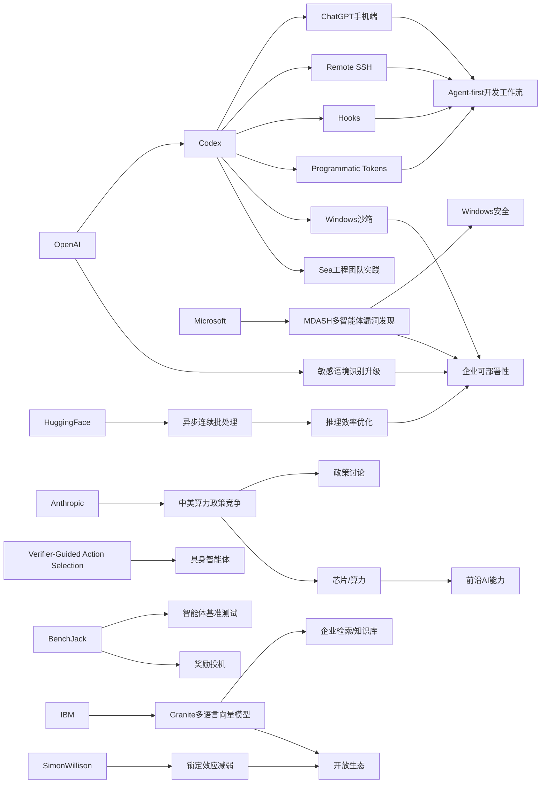

> AI 早报 · 每日早读 · 全网深度聚合

## **今日摘要**

OpenAI 最近围绕 Codex 连续更新：它已进入 ChatGPT 的 iOS 和 Android 端，并进一步扩展了 Remote SSH、hooks、programmatic tokens 以及 Windows 安全沙箱能力，显示 AI 编程助手正从桌面走向跨设备、可远程、可企业化部署。  
在研究与安全方面，OpenAI 强化了 ChatGPT 对敏感对话连续语境的识别，同时学界也在推进“先验证再行动”的具身智能方法，而 Anthropic 则把 AI 竞争焦点上升到中美算力与政策博弈层面。  
整体来看，这些动态共同说明：AI 正一边变得更适合嵌入真实工作流和日常开发场景，一边也越来越依赖安全机制、验证能力和算力政策支撑。

### 🔵 产品与功能更新

1. **OpenAI 将 Codex 带到 ChatGPT 手机端。**  
现在用户可以在 iOS 和 Android 版 ChatGPT 中随时查看、管理并批准 Codex 的编程任务，实现跨设备协作。对于经常在电脑外处理开发流程的人来说，这意味着代码任务不再被固定在桌面环境。官方强调它支持实时监控与远程操控，让“移动端管代码”成为正式能力。🚀  
[手机端使用Codex](https://openai.com/index/work-with-codex-from-anywhere)

2. **Codex 集成继续扩展，远程开发能力增强。**  
综合报道显示，OpenAI 不仅把 Codex 接入 ChatGPT 移动端，还补充了 Remote SSH（远程安全连接）、hooks（自动触发钩子）和 programmatic tokens（程序化令牌）等能力。它指向的是更强的企业自动化场景，让团队能把 AI 编程助手嵌入远程环境和工作流。报道还提到 IDE（集成开发环境）正在转向“agent-first”（以智能体为中心）的新交互方式。🚀  
[Codex集成扩展观察](https://news.smol.ai/issues/26-05-14-not-much/)

3. **OpenAI 解释如何为 Windows 上的 Codex 搭建安全沙箱。**  
OpenAI 公布了 Codex 在 Windows 环境中的 sandbox（沙箱隔离环境）设计思路，重点是受控文件访问与网络限制。这样做是为了让 AI 编程代理在执行任务时更安全，降低误操作或越界访问的风险。对于企业用户来说，这类底层安全机制会直接影响 AI 代码工具的可部署性。🚀  
[Windows沙箱方案](https://openai.com/index/building-codex-windows-sandbox)

### 🟢 前沿研究

1. **ChatGPT 强化对敏感对话上下文的识别。**  
OpenAI 介绍了新的安全更新，目标是让 ChatGPT 在敏感对话中更好理解上下文（前后语境），而不是只看单句内容。系统会尝试识别风险是否在一段时间内持续出现，从而给出更稳妥的回应。对心理健康、自伤风险等场景，这类“连续判断”能力尤其关键。🚀  
[敏感语境识别升级](https://openai.com/index/chatgpt-recognize-context-in-sensitive-conversations)

2. **Verifier-Guided Action Selection 探索“先验证再行动”的具身智能。**  
这篇论文研究 embodied agents（具身智能体，即能感知并操作真实或模拟环境的 AI）如何在复杂任务中减少错误动作。作者提出让 verifier（验证器）在行动前辅助筛选方案，帮助多模态大模型在真实世界任务里更稳健。核心思路是“多想一步再执行”，降低脆弱决策带来的失败率。🚀  
[先验后动新方法](https://arxiv.org/abs/2605.12620)

3. **Anthropic 用政策文件讨论中美 AI 算力竞争。**  
Anthropic 在政策文件中提出，到 2028 年美国要么巩固 compute（算力）优势，要么由威权国家影响 AI 时代规则。文章显示，这不只是产业观点，也是在影响华盛顿的政策讨论。对前沿研究来说，算力、芯片和政策的绑定正变得越来越紧。🚀  
[中美算力竞争判断](https://the-decoder.com/anthropic-frames-ai-competition-with-china-as-a-now-or-never-moment-for-washington/)

### 🟡 行业展望与社会影响

1. **Codex 上线手机端，AI 编程助手的使用场景进一步日常化。**  
媒体普遍将这次更新解读为 AI 编程助手从“桌面工具”走向“随身工具”的关键一步。用户不必坐在电脑前，也能处理工作流、审批任务和跟进进度。它反映出 AI 开发工具正在向更轻量、更高频的使用习惯靠拢。🚀  
[Codex登陆手机端](https://techcrunch.com/2026/05/14/openai-says-codex-is-coming-to-your-phone/)

2. **The Decoder 关注 Codex 移动化带来的工作方式变化。**  
报道指出，OpenAI 已将 Codex 带入 iOS 和 Android 版 ChatGPT，这让开发者能在更多碎片时间内管理编码任务。对行业而言，这类产品变化不只是新增入口，更可能改变软件团队的协作节奏。AI 工具正在从“辅助写代码”走向“随时接管任务”。🚀  
[移动化趋势解读](https://the-decoder.com/openai-makes-its-ai-coding-assistant-codex-available-on-ios-and-android/)

3. **IBM 发布新一代多语言向量模型，强调开放与轻量。**  
Granite Embedding Multilingual R2 是一款 multilingual embeddings（多语言向量表示）模型，支持 32K 上下文，并主打 Apache 2.0 开源许可。摘要称它在 1 亿参数以下模型中提供了较强的检索质量。对于企业知识库、搜索和跨语种信息匹配，这类轻量开放模型有较高落地价值。🚀  
[多语言向量新模型](https://huggingface.co/blog/ibm-granite/granite-embedding-multilingual-r2)

### 🟣 开源TOP项目

1. **Hugging Face 讨论 continuous batching 的异步化优化。**  
这篇文章聚焦 continuous batching（连续批处理）如何通过 asynchronicity（异步机制）提升推理效率。它关注的是大模型服务在高并发场景下，怎样更充分利用计算资源并减少等待时间。对开源推理框架和部署团队来说，这类优化直接关系成本与响应速度。🚀  
[异步批处理优化](https://huggingface.co/blog/continuous_async)

2. **BenchJack 研究如何系统审计 AI 智能体基准测试。**  
论文指出，agent benchmarks（智能体基准测试）可能被 reward hacking（奖励投机）利用，也就是模型拿高分却没真正完成任务。BenchJack 试图系统性发现这类漏洞，提醒行业“评测本身也需要安全设计”。这对开源社区尤其重要，因为很多模型选择和项目方向都依赖基准分数。🚀  
[智能体评测审计](https://arxiv.org/abs/2605.12673)

3. **Simon Willison 谈“锁定效应”正在减弱。**  
这篇博文标题直指“不再那么被锁定”，讨论的是开发者与工具生态之间的依赖关系变化。虽然摘要很短，但从标题可见，作者在关注 AI 工具链和平台之间的可迁移性问题。对于开源生态来说，“不被单一平台绑定”始终是高关注议题。🚀  
[锁定效应新变化](https://simonwillison.net/2026/May/14/not-so-locked-in/#atom-everything)

### 🔴 社媒分享

1. **微软让 100 多个 AI 智能体彼此对抗以发现 Windows 漏洞。**  
微软构建了名为 MDASH 的系统，让 100 多个专门化 AI agents（智能体）协同与对抗，寻找软件漏洞。报道提到，仅在一次“补丁星期二”中，该系统就发现了 16 个 Windows 安全缺陷，其中 4 个为严重级别。这类案例很适合社媒传播，因为它把“AI 自动找漏洞”具体化成了清晰数字。🚀  
[百个智能体找漏洞](https://the-decoder.com/microsoft-pits-more-than-100-ai-agents-against-each-other-to-find-windows-vulnerabilities/)

2. **Sea 分享为何在工程团队内部部署 Codex。**  
OpenAI 发布的客户案例中，Sea Limited 的产品负责人解释了公司如何在亚洲工程团队推广 Codex。核心目标是加速 AI-native software development（原生面向 AI 的软件开发）流程，让开发更快、更自动化。对社媒读者而言，这是一则典型的“大厂怎么用 AI 写代码”案例。🚀  
[Sea谈Codex实践](https://openai.com/index/sea-david-chen)

3. **Mitchell Hashimoto 的观点被再次引用与传播。**  
Simon Willison 分享了对 Mitchell Hashimoto 言论的引用，延续了开发者社区对 AI 工具、工作流与软件构建方式的讨论。虽然摘要未展开具体内容，但这种“圈内人一句话引发传播”的形式本身就很符合社媒热点特征。它代表了技术社区中由个人观点驱动的舆论扩散。🚀  
[开发者观点摘引](https://simonwillison.net/2026/May/14/mitchell-hashimoto/#atom-everything)

---

📊 行业洞察

1. 事实  
   - OpenAI 将 Codex 接入 ChatGPT iOS/Android，支持用户在手机端查看、管理并批准编程任务。  
   - Codex 同步扩展了 Remote SSH（远程安全连接）、hooks（自动触发钩子）、programmatic tokens（程序化令牌）等能力。  
   - 多家媒体认为这标志着 AI 编程助手从桌面场景走向随身化、高频化使用。  
   【洞察】AI 编程正从“单点工具”升级为“全时在线的开发执行层”。移动端入口+远程连接+工作流令牌的组合，说明 Codex 不再只是代码补全产品，而是在向 agent-first（以智能体为中心）的开发基础设施演进，未来竞争重点会从模型能力转向任务接管深度与团队协同粘性。

2. 事实  
   - OpenAI 公布了 Codex 在 Windows 上的 sandbox（沙箱隔离环境）方案，强调受控文件访问与网络限制。  
   - OpenAI 还升级了 ChatGPT 对敏感对话上下文（前后语境）的连续识别能力，用于更稳妥处理高风险对话。  
   - 微软用 MDASH 系统让 100 多个 AI agents（智能体）协同对抗，发现了多个 Windows 漏洞。  
   【洞察】AI 正在进入“安全前置”阶段：一方面，生成式 AI 产品必须通过沙箱、权限控制、上下文风险识别来获得企业与监管信任；另一方面，AI 也开始反过来成为安全生产力工具。行业拐点不再只是“模型更强”，而是“模型能否被安全部署、审计与治理”。

3. 事实  
   - Anthropic 通过政策文件强调中美 AI compute（算力）竞争将影响未来规则制定。  
   - IBM 发布 Granite Embedding Multilingual R2，多语言向量模型采用 Apache 2.0 开源许可，强调轻量与可落地。  
   - Hugging Face 讨论 continuous batching（连续批处理）的异步化优化，以提升高并发推理效率、降低成本。  
   【洞察】AI 产业正在形成“双线竞争”：顶层是算力、芯片与国家政策绑定的战略竞争；底层是开源轻量模型与推理优化推动的普惠落地竞争。前者决定谁掌握前沿能力上限，后者决定谁能更快把 AI 规模化嵌入企业流程。未来市场不会是单一“大模型赢家通吃”，而是“前沿闭源+高效开源”长期并存。

4. 事实  
   - Verifier-Guided Action Selection 提出让 verifier（验证器）在行动前筛选方案，以降低具身智能体错误决策。  
   - BenchJack 指出 agent benchmarks（智能体基准测试）存在 reward hacking（奖励投机）风险，高分不等于真实完成任务。  
   - Simon Willison 讨论 AI 工具生态的 lock-in（锁定效应）正在减弱。  
   【洞察】智能体赛道正在从“拼演示效果”转向“拼可靠性与可验证性”。无论是具身执行前加入验证器，还是对基准测试进行漏洞审计，都说明行业开始重视 agent 的真实完成率而非表面分数。随着锁定效应减弱，开发者将更倾向选择可迁移、可验证、可替换的智能体工具链。

🗺️ 今日关系图

