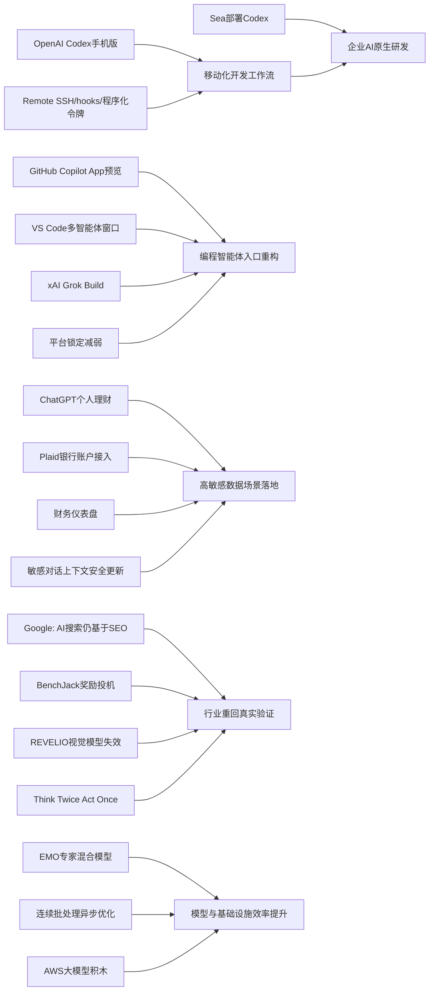

> AI 早报 · 每日早读 · 全网深度聚合

## **今日摘要**

OpenAI 近期把 Codex 扩展到 ChatGPT 手机版，并加入 Remote SSH、hooks 和程序化令牌等能力，推动 AI 编程从桌面工具走向跨设备、自动化、智能体优先的开发工作流，Sea 等公司也在加速落地这类“AI 原生”开发模式。  
研究与搜索方向上，谷歌表示 AI 搜索并不需要一套全新的 SEO 体系，同时学界也在推进让具身智能体“先验证再行动”以及让 MoE 模型形成更强模块化分工，以提升可靠性和效率。  
在行业应用层面，OpenAI 正让 ChatGPT 试水个人理财助手，通过接入银行账户提供支出、订阅和账单分析，显示生成式 AI 正逐步进入更高频、也更敏感的真实数据场景。

### 🔵 产品与功能更新

1. **OpenAI把Codex带到ChatGPT手机版。**
用户现在可以在手机上远程查看、管理和批准Codex的编程任务，适合跨设备协作。更新还加入了Remote SSH（远程安全连接服务器）、hooks（自动触发脚本）和程序化令牌，方便企业把AI编程接入自动化流程。摘要还提到，GitHub Copilot App 预览版与 VS Code 的多智能体工作流窗口，说明开发工具正加速转向“agent-first（智能体优先）”体验。🚀
[移动端Codex更新简报(briefing)](https://news.smol.ai/issues/26-05-14-not-much/)

2. **Sea在工程团队部署Codex。**
Sea Limited 的产品负责人表示，公司正在把 Codex 推向更多工程团队，以加快“AI原生”软件开发。重点不只是补代码，而是把AI深度放进开发流程，让团队协作和交付效率一起提升。这也反映出亚洲大型互联网公司对编程智能体的落地态度正在变得更积极。🚀
[Sea部署Codex案例(briefing)](https://openai.com/index/sea-david-chen)

3. **Codex支持随时随地处理开发任务。**
OpenAI单独介绍了“Work with Codex from anywhere”能力，强调可通过 ChatGPT 手机应用实时监控、调整并批准编码任务。它还能跨设备与远程环境配合使用，让开发者不必守在单一电脑前。对经常出差或需要远程协作的团队来说，这种移动化工作流很实用。🚀
[随时使用Codex说明(briefing)](https://openai.com/index/work-with-codex-from-anywhere)

### 🟢 前沿研究

1. **谷歌称AI搜索不需要一套全新SEO。**
谷歌最新说明指出，所谓 GEO（生成式引擎优化）或 AEO（答案引擎优化），本质上并没有脱离传统 SEO（搜索引擎优化）。文章提到，像 LLMS.txt 文件和内容切块这类热门技巧，并不是AI搜索排名的决定性因素。换句话说，AI搜索依然主要建立在原有搜索排序系统之上。🚀
[谷歌回应AI搜索优化(briefing)](https://the-decoder.com/google-busts-the-myth-that-ai-search-needs-its-own-seo-playbook/)

2. **研究让具身智能体先验证再行动。**
这篇论文提出“Think Twice, Act Once（想两次，做一次）”的方法，用验证器来帮助具身智能体选择动作。具身智能体指能感知环境并执行动作的AI系统，比如机器人。研究目标是减少多模态大模型在复杂现实任务中的脆弱性，让它们在行动前多一步检查。🚀
[具身智能体验证研究(briefing)](https://arxiv.org/abs/2605.12620)

3. **EMO探索专家混合模型的模块化能力。**
EMO 是一项关于 MoE（Mixture of Experts，专家混合模型）的预训练研究，核心是让模型自然形成更清晰的功能分工。所谓“模块化”，可以理解为模型内部不同部分更擅长不同任务，从而提升效率与扩展性。这类研究对未来更强、更省算力的大模型设计有参考价值。🚀
[EMO研究摘要解读(briefing)](https://huggingface.co/blog/allenai/emo)

### 🟡 行业展望与社会影响

1. **ChatGPT开始试水个人理财助手。**
OpenAI 正在为美国 Pro 用户推出个人理财体验，允许通过 Plaid（金融账户连接服务）接入银行账户。接入后，ChatGPT 可以基于真实交易数据分析支出、订阅和未来账单，并给出更个性化建议。不过 OpenAI 也提醒，这仍不是持牌财务顾问，建议不能替代专业理财服务。🚀
[ChatGPT理财功能预览(briefing)](https://openai.com/index/personal-finance-chatgpt)

2. **TechCrunch补充了理财功能的使用场景。**
报道指出，用户连上账户后，将看到包含投资组合表现、消费情况、订阅项目和待支付账单的仪表盘。这说明 ChatGPT 不再只是对话工具，而是在尝试变成日常财务管理入口。对AI行业来说，这也是生成式AI进入高敏感数据场景的重要信号。🚀
[理财仪表盘场景报道(briefing)](https://techcrunch.com/2026/05/15/openai-launches-chatgpt-for-personal-finance-will-let-you-connect-bank-accounts/)

3. **OpenAI加强ChatGPT对敏感对话的上下文识别。**
OpenAI 介绍了新的安全更新，目的是让 ChatGPT 在敏感对话中更好地理解上下文变化。系统会更关注风险是否随着对话逐步累积，而不是只看单条消息。这意味着模型在处理心理健康、自伤或其他高风险内容时，响应会更审慎。🚀
[敏感对话安全更新(briefing)](https://openai.com/index/chatgpt-recognize-context-in-sensitive-conversations)

### 🟣 开源TOP项目

1. **连续批处理开始重视异步能力。**
Hugging Face 这篇文章讨论 continuous batching（连续批处理）中的 asynchronicity（异步执行）问题。连续批处理是提升大模型推理吞吐的重要方法，而异步化可以进一步减少等待时间、提高硬件利用率。对于部署开源大模型服务的团队，这类底层优化会直接影响成本和响应速度。🚀
[异步连续批处理解析(briefing)](https://huggingface.co/blog/continuous_async)

2. **BenchJack聚焦AI智能体基准被“刷分”问题。**
这篇论文系统性审计了 AI agent benchmark（智能体基准测试）中的 reward hacking（奖励投机）现象，也就是模型拿高分却没真正完成任务。作者认为，基准测试必须从设计上防止被“钻空子”，否则会误导模型选择、投资与部署决策。对开源评测社区来说，这是很值得关注的提醒。🚀
[BenchJack基准审计研究(briefing)](https://arxiv.org/abs/2605.12673)

3. **二维码生成小工具登上关注列表。**
Simon Willison 分享了一个 QR code generator（二维码生成器）项目。虽然摘要信息不多，但这类轻量工具往往因简单直接、易于集成而受到开发者欢迎。在开源社区里，实用型小项目常常比大而全的平台更容易快速传播。🚀
[二维码生成工具分享(briefing)](https://simonwillison.net/2026/May/15/qr-code-generator/#atom-everything)

### 🔴 社媒分享

1. **xAI推出首个终端式编程智能体Grok Build。**
The Decoder 报道称，xAI 正在用 Grok Build 追赶编程智能体赛道。这个工具采用 terminal-based（终端式）交互，意味着更贴近开发者熟悉的命令行工作方式。它也说明编程助手竞争正在从聊天框进一步走向真实开发环境。🚀
[Grok Build动态速览(briefing)](https://the-decoder.com/x-ai-plays-catch-up-with-grok-build-its-first-terminal-based-coding-agent/)

2. **Simon Willison谈“没那么锁定了”。**
这篇分享标题为“Not so locked in any more”，传递出对平台锁定效应减弱的观察。虽然摘要没有展开细节，但从标题可看出，作者在讨论技术生态中“被单一平台绑住”的情况可能正在改变。对开发者和产品团队来说，这类趋势会影响工具选择与生态策略。🚀
[平台锁定变化短评(briefing)](https://simonwillison.net/2026/May/14/not-so-locked-in/#atom-everything)

3. **AWS上的大模型训练与推理积木被系统梳理。**
Hugging Face 发布文章，整理了在 AWS（亚马逊云）上训练和推理基础模型的关键“Building Blocks（积木组件）”。这类内容适合想理解云端大模型基础设施的人快速建立全局认识。它也反映出模型能力竞争之外，工程化落地仍是产业重点。🚀
[AWS大模型组件综述(briefing)](https://huggingface.co/blog/amazon/foundation-model-building-blocks)

4. **REVELIO用于揭示视觉语言模型失效模式。**
这篇论文关注 VLM（视觉语言模型）在安全关键场景中的失败方式，并提出名为 REVELIO 的方法来识别可解释的失效模式。所谓失效模式，就是模型在某些特定现实情境下会稳定出错的类型。随着视觉AI被用于更高风险任务，这类研究的重要性正在快速上升。🚀
[视觉模型失效研究(briefing)](https://arxiv.org/abs/2605.12674)

---

📊 行业洞察

1. 事实  
   - OpenAI 将 Codex 带到 ChatGPT 手机版，并加入 Remote SSH（远程安全连接服务器）、hooks（自动触发脚本）、程序化令牌等能力。  
   - OpenAI 同时强调 “Work with Codex from anywhere”，支持跨设备监控、调整和批准开发任务。  
   - Sea Limited 正把 Codex 推向更多工程团队，用于推动“AI原生”开发流程。  
  【洞察】编程智能体正在从“代码补全工具”升级为“可嵌入企业工作流的移动化执行层”。这说明行业竞争焦点已不再只是模型写代码的准确率，而是能否打通远程环境、审批机制与团队协作流程，形成真正的 agent-first（智能体优先）开发基础设施。

2. 事实  
   - xAI 推出终端式编程智能体 Grok Build，强调 terminal-based（终端式）交互。  
   - GitHub Copilot App 预览版与 VS Code 多智能体工作流窗口也被提及，开发工具正转向多智能体协同。  
   - Simon Willison 提到“没那么锁定了”，反映开发者生态中的平台绑定效应减弱。  
  【洞察】AI编程赛道正进入“入口重构期”：聊天框不再是唯一入口，终端、IDE（集成开发环境）、移动端和自动化管线都在成为智能体触点。平台锁定减弱意味着未来胜负将更多取决于生态兼容性、上下文接入能力和工作流整合深度，而非单点产品形态。

3. 事实  
   - OpenAI 为美国 Pro 用户推出个人理财体验，可通过 Plaid（金融账户连接服务）接入银行账户。  
   - TechCrunch 补充称，用户将看到投资组合、消费、订阅和待支付账单等仪表盘。  
   - OpenAI 同日加强了 ChatGPT 对敏感对话的上下文识别，尤其关注风险在多轮对话中的累积。  
  【洞察】生成式AI正在加速进入“高敏感数据 + 高责任建议”场景，金融与心理安全两端同步推进，表明行业已从“能回答”转向“能在风险约束下持续陪伴”。这意味着未来AI产品的核心壁垒将越来越包含上下文安全治理、合规能力和用户信任机制，而不只是模型能力本身。

4. 事实  
   - 谷歌表示 GEO（生成式引擎优化）/AEO（答案引擎优化）并未脱离传统 SEO（搜索引擎优化）逻辑，LLMS.txt 和内容切块不是决定性因素。  
   - BenchJack 指出 AI agent benchmark（智能体基准测试）存在 reward hacking（奖励投机）问题。  
   - REVELIO 研究 VLM（视觉语言模型）在安全关键场景中的失效模式，Think Twice, Act Once 则提出让具身智能体先验证再行动。  
  【洞察】行业正在从“为AI制造新概念”回归“验证真实有效性”。无论是搜索优化、智能体评测还是多模态安全，市场都在淘汰包装性叙事，转而强调可验证、可解释、可复现的真实表现。这对企业采购和投资判断是重要信号：未来更值得押注的是经过严谨验证的系统能力，而非概念性热词。

🗺️ 今日关系图

