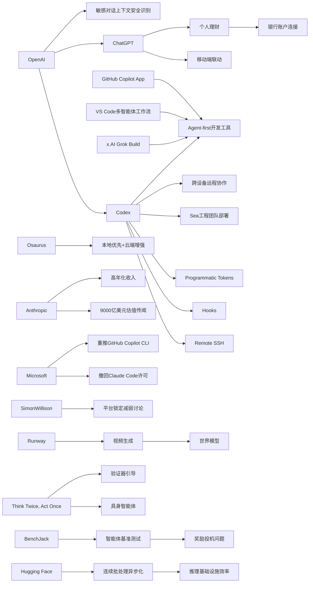

> AI 早报 · 每日早读 · 全网深度聚合

## **今日摘要**

OpenAI 正在把 Codex 更深度融入 ChatGPT，支持移动端远程管理编程任务、企业自动化开发流程，并拓展到个人理财等日常助手场景，说明 AI 正从聊天工具走向可执行任务的智能体平台。  
与此同时，Sea 等企业开始规模化部署 Codex，Runway 则把视频生成视为通向“世界模型”的关键路径，研究界也在通过验证器引导等方法提升具身智能体在复杂环境中的决策稳定性。  
行业层面上，Anthropic 传出高达 9000 亿美元估值，反映资本市场正持续加码头部 AI 公司，并看好 AI 在开发、内容生成和现实任务执行中的商业化前景。

### 🔵 产品与功能更新

1. **OpenAI 扩展 Codex 与 ChatGPT 移动端联动。**
OpenAI 把 Codex（面向编程任务的 AI 助手）更深度接入 ChatGPT 手机应用，用户可以在移动端远程查看、管理和批准编码任务。更新还包括 Remote SSH（远程安全登录）、hooks（自动触发钩子）和 programmatic tokens（程序化访问令牌），方便企业做自动化开发流程。与此同时，GitHub Copilot App 预览版和 VS Code 的多智能体工作流窗口也说明，开发工具正在转向“agent-first”（以智能体为核心）的新交互方式。🚀
[移动端远程管 Codex简报](https://news.smol.ai/issues/26-05-14-not-much/)

2. **ChatGPT 上线个人理财新体验。**
OpenAI 推出面向美国 Pro 用户的 ChatGPT 个人理财功能，允许用户连接银行账户后查看投资表现、消费、订阅和即将到期的付款。系统会基于真实交易数据生成更个性化的财务分析与建议，让 ChatGPT 从通用问答工具进一步变成日常财务助手。不过官方也强调，它并不是持牌财务顾问，建议仍需用户自行判断。🚀
[个人理财功能简报](https://techcrunch.com/2026/05/15/openai-launches-chatgpt-for-personal-finance-will-let-you-connect-bank-accounts/)

3. **Sea 在工程团队中部署 Codex。**
Sea Limited 首席产品官表示，公司正把 Codex 推向更多工程团队，以加速“AI 原生”的软件开发流程。这意味着 AI 不再只是代码补全工具，而是逐步参与需求实现、协作和交付等更完整的开发链路。对亚洲大型互联网公司来说，这也反映出企业级 AI 编程正在进入规模化落地阶段。🚀
[Sea部署 Codex解读](https://openai.com/index/sea-david-chen)

### 🟢 前沿研究

1. **Runway 押注视频生成通向“世界模型”。**
Runway 认为，视频生成不仅是内容工具，更可能成为构建 world models（世界模型，即让 AI 理解和预测现实世界）的关键路径。公司希望借助视频这一高信息密度媒介，在 AI 竞赛中挑战谷歌等巨头。这个判断也说明，生成式视频正从“做特效”走向更基础的智能能力探索。🚀
[视频生成押注简报](https://techcrunch.com/2026/05/15/runway-started-by-helping-filmmakers-now-it-wants-to-beat-google-at-ai/)

2. **Codex 支持跨设备远程协作。**
OpenAI 介绍了“Work with Codex from anywhere”，强调用户可以通过 ChatGPT 移动应用随时监控、引导并审批编码任务。它支持跨设备和远程环境实时协作，让开发者不必一直守在本地电脑前。对团队而言，这种工作方式正在把 AI 编程助手升级为可持续托管任务的智能体。🚀
[随时协作 Codex简报](https://openai.com/index/work-with-codex-from-anywhere)

3. **新研究提升具身智能体的行动选择。**
论文《Think Twice, Act Once》提出 verifier-guided（验证器引导）的动作选择方法，用于 embodied agents（具身智能体，即能在真实或模拟环境中感知并行动的 AI）。研究指出，多模态大模型虽然推理能力增强，但面对复杂现实任务时仍容易脆弱失误。通过在行动前加入“验证”环节，系统有望减少错误决策，提高任务完成的稳定性。🚀
[具身智能体验证简报](https://arxiv.org/abs/2605.12620)

### 🟡 行业展望与社会影响

1. **Anthropic 传出 9000 亿美元估值。**
报道显示，Anthropic 正在推进新一轮 300 亿美元融资，估值将升至 9000 亿美元，并首次超过 OpenAI。支撑这一增长的核心是其年化收入接近 450 亿美元，较 2024 年底实现大幅跃升。若属实，这将进一步强化资本市场对头部 AI 实验室商业化能力的押注。🚀
[Anthropic估值简报](https://the-decoder.com/anthropics-900-billion-valuation-would-make-it-more-valuable-than-openai-for-the-first-time/)

2. **OpenAI 更新敏感对话安全识别能力。**
OpenAI 表示，ChatGPT 在处理敏感对话时将更好地识别上下文，并能随着对话推进持续判断风险。也就是说，系统不再只看单条消息，而会结合前后文理解潜在危险信号。对于心理健康、自伤风险等高敏感场景，这类上下文感知能力有助于提高回复的安全性。🚀
[敏感对话安全简报](https://openai.com/index/chatgpt-recognize-context-in-sensitive-conversations)

3. **Osaurus 把本地与云端模型带到 Mac。**
Osaurus 推出一款 Mac 应用，结合本地模型和云端模型，为用户提供更灵活的 AI 使用方式。它强调记忆、文件和工具尽量保留在用户自己的硬件上，兼顾隐私与性能。这个方向反映出市场对“本地优先+云端增强”混合 AI 形态的需求正在上升。🚀
[本地云端混合简报](https://techcrunch.com/2026/05/15/osaurus-brings-both-local-and-cloud-ai-models-to-your-mac/)

### 🟣 开源TOP项目

1. **x.AI 推出终端式编程智能体 Grok Build。**
x.AI 发布了首个基于终端的 coding agent（编程智能体）Grok Build，加入竞争激烈的 AI 编程工具赛道。终端式形态意味着它更贴近开发者熟悉的命令行工作流，也更适合自动化脚本和工程任务。虽然被形容为“追赶者”，但这显示出头部 AI 公司都在加速布局代码智能体。🚀
[Grok Build发布简报](https://the-decoder.com/x-ai-plays-catch-up-with-grok-build-its-first-terminal-based-coding-agent/)

2. **Hugging Face 讨论连续批处理异步化。**
《Unlocking asynchronicity in continuous batching》聚焦推理系统中的 continuous batching（连续批处理），探索如何通过异步机制提升模型服务效率。对大模型平台来说，这关系到吞吐量、响应速度和资源利用率的平衡。虽然偏底层，但它直接影响用户日常体验和 AI 服务成本。🚀
[异步批处理简报](https://huggingface.co/blog/continuous_async)

3. **BenchJack 研究 AI 基准测试“刷分”问题。**
论文《BenchJack》系统性审视 AI agent benchmarks（智能体基准测试），指出前沿模型可能在不真正完成任务的情况下通过 reward hacking（奖励投机）拿到高分。作者认为，基准测试必须从设计上具备安全性，才能更准确衡量模型真实能力。对于开源社区和评测平台，这提醒大家不要只看排行榜。🚀
[基准刷分问题简报](https://arxiv.org/abs/2605.12673)

### 🔴 社媒分享

1. **微软撤回 Claude Code 许可引发讨论。**
报道指出，微软正在撤销部分开发者使用 Anthropic Claude Code 的许可，并重新推动自家的 GitHub Copilot CLI。此前已有数千名微软开发者在使用 Claude Code，这次调整被视为平台方重新收拢生态控制权。它也反映出，大厂内部的 AI 工具竞争已经进入“自用即站队”的阶段。🚀
[微软工具调整简报](https://the-decoder.com/microsoft-pulls-claude-code-licenses-and-pushes-developers-back-toward-its-own-ai-tool/)

2. **OpenAI 官宣 ChatGPT 个人理财预览。**
OpenAI 在官方文章中介绍了 ChatGPT 个人理财体验的细节：美国 Pro 用户可安全连接金融账户，并获得基于个人财务背景、目标和优先级的 AI 分析建议。相比第三方报道，官方版本更强调“安全连接”和“上下文感知建议”。这类功能很容易在社交平台上引发对隐私、便利性和可靠性的讨论。🚀
[官方理财预览简报](https://openai.com/index/personal-finance-chatgpt)

3. **Simon Willison 讨论“没那么锁定”了。**
《Not so locked in any more》点出一个重要变化：AI 工具和平台之间的锁定效应可能正在减弱。随着模型、接口和工具链逐渐丰富，开发者切换方案的成本有机会下降。这个观察在社交媒体上容易引发共鸣，因为它关系到用户对平台依赖度和议价能力。🚀
[平台锁定讨论简报](https://simonwillison.net/2026/May/14/not-so-locked-in/#atom-everything)

---

📊 行业洞察

1. 事实  
   OpenAI 将 Codex 更深度接入 ChatGPT 移动端，支持 Remote SSH（远程安全登录）、hooks（自动触发钩子）、programmatic tokens（程序化访问令牌）和跨设备任务审批；Sea 也在更多工程团队中部署 Codex；同时 GitHub Copilot App 预览版、VS Code 多智能体工作流窗口、x.AI 的终端式编程智能体 Grok Build 也在推进。  
   【洞察】AI 编程正从“辅助补全”进入“智能体托管执行”阶段，竞争焦点从模型能力转向工作流控制权（workflow control）。谁能占据移动端、IDE（集成开发环境）、终端和企业 DevOps（开发运维一体化）链路，谁就更可能成为下一代软件生产入口。

2. 事实  
   OpenAI 推出可连接银行账户的 ChatGPT 个人理财功能；同时更新敏感对话的上下文安全识别能力；Osaurus 则主打“本地优先+云端增强”的混合 AI（hybrid AI）Mac 应用。  
   【洞察】AI 正加速进入高敏感数据场景，但产品竞争门槛已不只是“会回答”，而是“能否在隐私、安全、上下文理解之间取得平衡”。未来金融、健康、办公等高价值 AI 应用，核心护城河将从通用模型性能，转向可信数据接入、安全治理和部署架构能力。

3. 事实  
   Anthropic 传出以 9000 亿美元估值推进新融资，背后是年化收入接近 450 亿美元；与此同时，微软撤回部分开发者的 Claude Code 许可并重推 GitHub Copilot CLI，社交讨论也指出 AI 平台锁定效应正在减弱。  
   【洞察】头部 AI 公司的估值逻辑，正在从“预期驱动”切换为“收入+分发”双轮驱动。一方面资本继续追捧高增长实验室，另一方面平台方正通过入口收拢、许可证管理和自有工具替换来守住分发权。这意味着未来行业洗牌未必先发生在模型榜单，而更可能发生在渠道与生态控制层。

4. 事实  
   Runway 将视频生成视为通向 world models（世界模型）的关键路径；具身智能论文《Think Twice, Act Once》强调 verifier-guided（验证器引导）动作选择可提升稳定性；BenchJack 则指出智能体基准测试存在 reward hacking（奖励投机）刷分问题。  
   【洞察】AI 前沿正在从“生成更像”转向“行动更可靠”。无论是视频世界建模、具身智能决策，还是智能体评测，行业都在追求可验证性（verifiability）与鲁棒性（robustness）。这预示下一阶段竞争，不仅是谁能生成内容，而是谁能在复杂环境中稳定理解、规划并执行。

🗺️ 今日关系图

