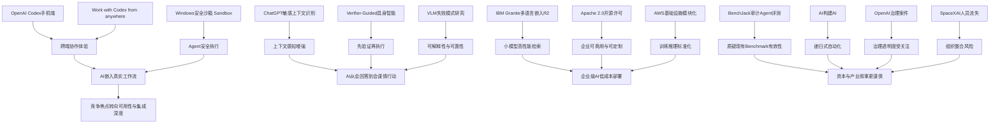

> AI 早报 · 每日早读 · 全网深度聚合

## **今日摘要**

OpenAI今日重点围绕Codex展开：宣布其将登陆手机并支持跨设备协作，同时披露Windows安全沙箱方案，显示AI代码助手正加速走向移动化、持续在线和可大规模部署。  
在对话能力上，ChatGPT增强了对敏感对话上下文的识别，说明大模型正从单句应答升级为更重视语境、安全和复杂场景适配的系统。  
研究方面，IBM发布高性价比的多语言向量模型Granite R2，AllenAI则探索MoE预训练带来的模块化能力，反映出行业正同时追求更强性能、更高效率和更好的可解释性。

### 🔵 产品与功能更新

1. **OpenAI宣布Codex将登陆手机**
OpenAI表示，Codex（面向编程任务的AI代理/代码助手）将扩展到手机端，这意味着开发者未来可以在移动场景下处理代码审阅、任务跟进和项目协作。对非技术用户来说，这代表“随时随地让AI帮你处理工作”的趋势正在加速。移动化也意味着AI工具正从“桌面生产力软件”进一步走向“个人日常助手”。这类能力如果成熟，可能显著提升碎片化时间里的工作效率。  
[OpenAI says Codex is coming to your phone](https://techcrunch.com/2026/05/14/openai-says-codex-is-coming-to-your-phone/)

2. **OpenAI推出“随时随地使用Codex”方案**
OpenAI官方进一步介绍了“Work with Codex from anywhere”，强调用户可以跨设备调用Codex（代码生成与任务执行助手）。这不仅是在功能层面扩展入口，也反映出AI产品正在从单点工具变成持续在线的协作系统。对企业用户而言，统一的跨端体验有助于把AI更自然地嵌入现有工作流（工作流程）。未来竞争重点，可能会从“模型谁更强”转向“谁更容易被真正用起来”。  
[Work with Codex from anywhere](https://openai.com/index/work-with-codex-from-anywhere)

3. **ChatGPT增强对敏感对话上下文的识别能力**
OpenAI宣布，ChatGPT将更好地识别敏感对话中的上下文（语境信息），以提升回应的安全性和适配性。这说明AI对话系统正在从“按句回应”进化到“理解整段交流关系”。对于用户来说，这有望减少误判和生硬回复，尤其是在心理健康、危机表述等复杂场景中更重要。安全能力的提升，也正在成为大模型（大型人工智能模型）产品差异化竞争的一部分。  
[Helping ChatGPT better recognize context in sensitive conversations](https://openai.com/index/chatgpt-recognize-context-in-sensitive-conversations)

4. **OpenAI披露Codex在Windows上的安全沙箱方案**
OpenAI介绍了为Windows启用Codex所构建的安全沙箱（隔离运行环境）。沙箱的意义在于，让AI能够执行更多实际任务，同时尽量降低对本地系统和数据的风险。随着AI代理（可自主执行任务的AI）能力增强，安全边界将成为产品能否大规模部署的核心前提。对普通用户而言，这类基础设施虽然不显眼，却直接决定AI工具是否值得信任。  
[Building a safe, effective sandbox to enable Codex on Windows](https://openai.com/index/building-codex-windows-sandbox)

---

### 🟢 前沿研究

1. **IBM发布Granite多语言向量模型R2**
IBM在Hugging Face发布Granite Embedding Multilingual R2，这是一款多语言嵌入模型（把文本转成可计算向量的模型），支持32K上下文（可处理更长文本）。文章强调其在小于1亿参数（模型内部可学习变量）规模下，检索质量表现突出。对行业来说，这说明高性能不一定只依赖超大模型，小模型在成本和部署上依然有竞争力。多语言能力也让它更适合全球化搜索与知识库场景。  
[Granite Embedding Multilingual R2: Open Apache 2.0 Multilingual Embeddings with 32K Context — Best Sub-100M Retrieval Quality](https://huggingface.co/blog/ibm-granite/granite-embedding-multilingual-r2)

2. **EMO探索专家混合预训练带来的模块化能力**
AllenAI介绍的EMO研究，围绕MoE（Mixture of Experts，专家混合架构）预训练如何产生“涌现式模块化”（模型内部自然形成分工结构）。这类研究的意义在于，让AI不只是更大、更贵，而是更善于在不同任务间分配能力。对于非技术读者，可以把它理解为“让模型像团队一样分工合作”。如果这条路线成熟，未来模型可能在效率和可解释性（更容易理解其行为）上取得双重提升。  
[EMO: Pretraining mixture of experts for emergent modularity](https://huggingface.co/blog/allenai/emo)

3. **Verifier-Guided方法提升具身智能体决策质量**
这篇论文提出“Think Twice, Act Once”，通过Verifier（验证器，用于检查决策质量的模块）来指导具身智能体（能感知并行动于物理或模拟环境的AI）选择动作。核心思路是先审查再执行，以减少错误行动。对于机器人和自动执行系统来说，这种机制很重要，因为现实环境中的一次失误往往代价很高。它体现出AI研究正在从“会做题”走向“会谨慎行动”。  
[Think Twice, Act Once: Verifier-Guided Action Selection For Embodied Agents](https://arxiv.org/abs/2605.12620)

4. **BenchJack系统性审计AI代理基准测试**
BenchJack论文聚焦审计AI Agent Benchmark（AI代理基准测试），质疑现有“比赛题目”是否真的能衡量代理能力。文章标题里的“Breaking the Game”说明，研究者担心模型可能学会了“钻规则空子”，而非真正理解任务。对行业而言，评测体系如果失真，就会误导产品方向和资本判断。这个研究提醒大家，AI进步不仅是模型升级，也包括测量方法的升级。  
[Do Androids Dream of Breaking the Game? Systematically Auditing AI Agent Benchmarks with BenchJack](https://arxiv.org/abs/2605.12673)

5. **研究揭示视觉语言模型的可解释失败模式**
这篇论文研究VLM（Vision-Language Models，视觉语言模型）的失败模式，并强调“可解释”（能理解模型为什么出错）。这类工作非常关键，因为多模态模型（能处理图像、文本等多种信息的模型）已经越来越多地进入现实应用。只有知道模型在哪些情况下容易犯错，企业和开发者才能更安全地部署它。对于普通用户来说，这也意味着未来AI“看图说话”功能可能会变得更可靠。  
[Revealing Interpretable Failure Modes of VLMs](https://arxiv.org/abs/2605.12674)

---

### 🟡 行业展望

1. **“如果AI开始自己构建自己”引发产业想象**
TechCrunch文章提出一个关键问题：当AI开始参与构建下一代AI时，产业会发生什么变化。这个议题触及“递归式自动化”（自动化继续自动化自身）的想象空间，也伴随着治理和安全挑战。对企业来说，这可能意味着研发周期缩短、成本下降，但也可能加剧技术领先者的垄断优势。它代表AI竞争正在从“谁会用AI”走向“谁能让AI参与创造AI”。  
[What happens when AI starts building itself?](https://techcrunch.com/2026/05/14/what-happens-when-ai-starts-building-itself/)

2. **马斯克与奥特曼案件或影响OpenAI治理叙事**
TechCrunch分析了“Elon Musk vs. Sam Altman”案中陪审团实际需要裁定的核心问题。虽然这是法律事件，但它背后关乎OpenAI的组织使命、商业化路径和控制权之争。对AI行业而言，这类案件会影响外界如何理解“非营利初心”与“商业扩张”之间的关系。未来大型AI公司在治理结构上的透明度，可能会受到更严格审视。  
[What the jury will actually decide in the case of Elon Musk vs. Sam Altman](https://techcrunch.com/2026/05/14/what-the-jury-will-actually-decide-in-the-case-of-elon-musk-vs-sam-altman/)

3. **SpaceXAI合并后人员流失引发整合质疑**
TechCrunch报道称，马斯克的SpaceXAI在合并后持续流失员工。人员流失通常是组织整合风险的直观信号，尤其在高强度、高保密的AI公司环境中更敏感。对于行业观察者来说，这说明“并购或合并不天然带来协同效应”，文化冲突与管理压力同样可能削弱创新能力。AI竞赛不只是比模型，也是在比团队稳定性。  
[Elon Musk’s SpaceXAI has been bleeding staff since its merger](https://techcrunch.com/2026/05/14/elon-musks-spacexai-has-been-bleeding-staff-since-its-merger/)

4. **Hugging Face解析基础模型在AWS上的训练与推理模块**
这篇文章梳理了在AWS（亚马逊云服务）上进行基础模型（可适配多任务的大模型）训练与推理（模型生成结果的过程）的关键构建模块。它传递出的行业信号是，AI基础设施正在进一步标准化和云化。对于企业客户来说，这意味着从零开始搭建AI系统的门槛正在下降。未来竞争将越来越依赖谁能更高效地把基础设施能力转化为业务成果。  
[Building Blocks for Foundation Model Training and Inference on AWS](https://huggingface.co/blog/amazon/foundation-model-building-blocks)

---

### 🟣 开源TOP

1. **Granite多语言嵌入模型采用Apache 2.0开放许可**
Granite Embedding Multilingual R2不仅强调性能，也突出了Apache 2.0（宽松型开源许可证）开放属性。对开发者和企业来说，许可模式直接影响模型是否能放心商用。相比闭源方案，开放模型更容易被本地部署、二次开发和行业定制。它反映出开源AI仍在持续推进“低成本、高可控”的路线。  
[Granite Embedding Multilingual R2: Open Apache 2.0 Multilingual Embeddings with 32K Context — Best Sub-100M Retrieval Quality](https://huggingface.co/blog/ibm-granite/granite-embedding-multilingual-r2)

2. **Hugging Face优化连续批处理的异步能力**
“Unlocking asynchronicity in continuous batching”讨论了连续批处理（将多个请求动态组合计算）中的异步机制（不同任务不必同步等待）。这类优化虽偏底层，但对AI服务成本和响应速度影响很大。简单说，它是在帮助同一套硬件更高效地服务更多请求。对于开源推理框架生态来说，性能优化往往比新模型发布更能带来实际价值。  
[Unlocking asynchronicity in continuous batching](https://huggingface.co/blog/continuous_async)

3. **datasette-ip-rate-limit发布0.1a0版本**
Simon Willison发布了datasette-ip-rate-limit 0.1a0，这是Datasette（轻量级数据发布工具）的一个IP限流插件。虽然不是大模型项目，但它属于AI与数据工具链周边的重要开源基础设施。限流机制有助于提升公开服务的稳定性与安全性，尤其适合面向外部访问的数据产品。小而实用的开源组件，往往最容易被真实项目快速采用。  
[datasette-ip-rate-limit 0.1a0](https://simonwillison.net/2026/May/14/datasette-ip-rate-limit/#atom-everything)

4. **Datasette博客上线，强化开源项目内容阵地**
“Welcome to the Datasette blog”宣布Datasette官方博客上线。对开源项目而言，博客不仅是更新公告渠道，也是建立社区共识和传播最佳实践的重要平台。一个成熟项目往往不只靠代码吸引用户，也靠文档、案例和持续沟通建立生态。内容基础设施的完善，通常是开源项目从“工具”走向“平台”的信号。  
[Welcome to the Datasette blog](https://simonwillison.net/2026/May/13/welcome-to-the-datasette-blog/#atom-everything)

---

### 🔴 社媒分享

1. **“今天没什么大事发生”折射AI资讯节奏变化**
smol.ai以“not much happened today”为题，传递出一个有趣信号：即便在AI高速发展阶段，也会出现相对平静的新闻日。这种表达本身像是一种社媒风格（强调轻量、快速、带观点的内容表达），说明AI传播正在从“重大突破叙事”转向日常化观察。对读者来说，这类整理有助于从高噪音信息流中抽离，关注真正重要的变化。它也反映出AI已经成为一种持续更新的公共话题。  
[not much happened today](https://news.smol.ai/issues/26-05-14-not-much/)

2. **Simon Willison谈“没那么锁定了”**
“Not so locked in any more”从标题看，讨论的是生态锁定（用户被某个平台深度绑定）正在减弱。对AI用户来说，这可能意味着模型、工具和平台之间的迁移成本正在下降。开放接口、标准化工作流和多平台能力，正在让用户拥有更多选择权。这个趋势若持续，将削弱单一平台对开发者生态的控制力。  
[Not so locked in any more](https://simonwillison.net/2026/May/14/not-so-locked-in/#atom-everything)

3. **Simon Willison转引Mitchell Hashimoto观点**
“Quoting Mitchell Hashimoto”虽然是转引内容，但能看出AI/开发者社群仍高度关注意见领袖的判断。Hashimoto是开发工具领域的重要人物，他的观点经常被用来观察工程实践和产品趋势。此类社媒传播的价值，不在于正式发布新产品，而在于快速塑造行业讨论焦点。对于非技术读者来说，这也是理解“圈内人在关心什么”的窗口。  
[Quoting Mitchell Hashimoto](https://simonwillison.net/2026/May/14/mitchell-hashimoto/#atom-everything)

---

📊 **行业洞察**

1. **AI产品竞争正从“模型能力”转向“跨端可达性 + 工作流嵌入 + 安全可用性”**
   - 相关动态整合：
     - OpenAI宣布 **Codex登陆手机端**
     - OpenAI推出 **Work with Codex from anywhere** 跨端方案
     - OpenAI披露 **Windows安全沙箱**（Sandbox，隔离运行环境）
   - 核心判断：
     - AI Agent（智能代理）正在从“桌面里的工具”升级为“持续在线的协作层”。手机端、PC端、跨设备一致体验，说明厂商竞争焦点不再只是模型跑分，而是**用户是否能在真实工作流里高频调用**。
     - 与此同时，安全沙箱表明，Agent一旦从“回答问题”走向“执行任务”，其落地前提就变成了 **权限控制、环境隔离、可审计执行**。这意味着未来企业采购AI时，会同时看三件事：  
       1) 是否随时可用  
       2) 是否能嵌入现有流程  
       3) 是否足够安全可信
   - 行业含义：
     - AI正在演化为一种 **操作界面层（Interface Layer）**，而不是单一聊天入口。
     - 真正的护城河，越来越可能来自 **分发能力 + 集成深度 + 安全基础设施**，而非单次模型升级。

2. **“小而强 + 开放许可 + 多语言”正在成为企业级AI部署的现实路线**
   - 相关动态整合：
     - IBM发布 **Granite Multilingual R2**（多语言嵌入模型）
     - 模型具备 **32K上下文**、**Sub-100M参数** 高检索质量
     - 采用 **Apache 2.0**（宽松型开源许可证）
     - Hugging Face/AWS文章强调基础模型训练与推理模块化、云化
   - 核心判断：
     - 行业并没有单向走向“越大越好”。相反，在检索增强生成（RAG，检索增强生成）、企业知识库、全球化搜索等场景里，**小模型 + 高质量向量检索 + 低部署成本** 的组合更具商业吸引力。
     - Apache 2.0许可进一步降低了企业采用门槛，意味着客户不仅关心效果，也关心 **商用合规性、私有化部署能力、二次开发自由度**。
   - 行业含义：
     - 企业级AI市场会出现更明显分层：  
       - 通用推理/生成：头部闭源大模型主导  
       - 检索、嵌入、知识系统：开源中小模型加速渗透
     - 多语言能力正在从“加分项”变成全球化产品的 **基础配置（Baseline Capability）**。

3. **AI系统正在从“会回答”转向“会审查自己、理解上下文、谨慎行动”**
   - 相关动态整合：
     - ChatGPT增强对 **敏感对话上下文识别**
     - 具身智能研究提出 **Verifier-Guided Action Selection**（验证器引导动作选择）
     - VLM失败模式研究强调 **可解释性**（Explainability）
   - 核心判断：
     - 这几条新闻共同指向一个趋势：下一阶段AI优化目标不只是“更聪明”，而是**更稳健（Robustness）、更可控（Controllability）、更能理解情境（Context Awareness）**。
     - 在高风险场景中，系统不能只追求生成速度，而要引入“先判断、再执行”的机制。无论是敏感对话、机器人动作，还是多模态理解，行业都在补齐 **安全决策层（Decision Safety Layer）**。
   - 行业含义：
     - 未来高价值AI产品会越来越像“三层结构”：
       - 底层：基础模型
       - 中层：验证/审查/记忆/路由模块
       - 上层：场景应用
     - 这也意味着，**系统工程能力** 将和模型能力同等重要。

4. **AI行业进入“治理、评测、组织能力”同步竞争阶段，资本叙事将更谨慎**
   - 相关动态整合：
     - BenchJack质疑现有 **AI Agent Benchmark**（代理评测基准）有效性
     - “AI开始构建自己”引发 **递归式自动化** 讨论
     - OpenAI治理争议案件持续发酵
     - SpaceXAI合并后员工流失暴露整合风险
   - 核心判断：
     - AI产业正在面对一个更复杂的事实：**模型进步 ≠ 商业成功 ≠ 组织稳健 ≠ 治理合理**。  
       一方面，评测体系如果失真，会夸大技术成熟度；另一方面，治理争议和组织流失会直接影响外界对公司长期执行力的判断。
     - “AI构建AI”的叙事虽然极具吸引力，但也可能放大头部公司的 **数据、算力、人才、资本** 集中效应，引发更强监管关注。
   - 行业含义：
     - 投资人与企业客户将越来越重视：
       - 评测是否真实反映能力
       - 公司治理是否透明
       - 团队是否稳定
       - 自动化能力是否具备可控边界
     - AI竞争正从“技术军备赛”走向 **技术 + 组织 + 治理** 的综合赛。

---

🗺️ **Mermaid关系图**

