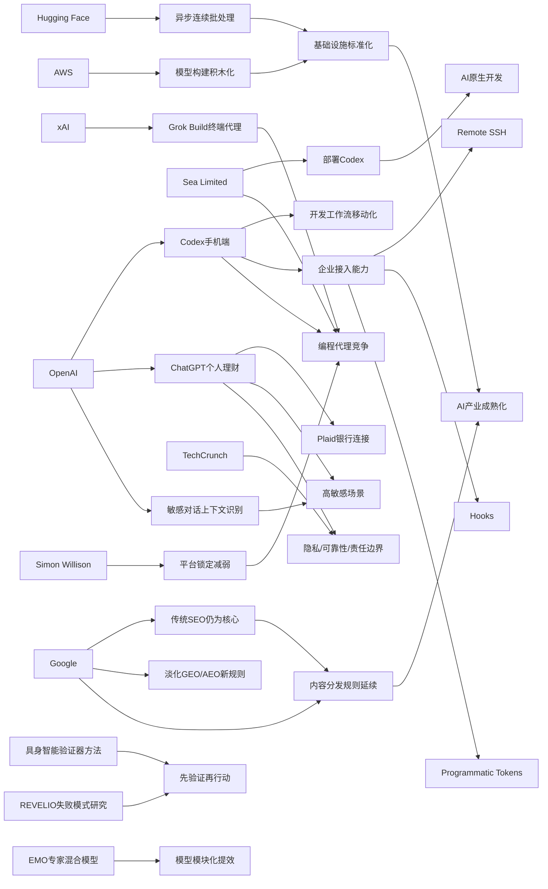

> AI 早报 · 每日早读 · 全网深度聚合

## **今日摘要**

OpenAI 正在把 Codex 从桌面编程助手升级为可在手机端远程管理、审批任务的“代理式”开发工具，并已开始在 Sea 等企业团队中规模化部署，显示 AI 编程正走向流程级协作与自动化。  
研究与平台层面，Google 强调 AI 搜索优化仍应回归传统 SEO 基础，同时具身智能和专家混合模型等新研究正推动 AI 在行动前验证、模块化分工和复杂任务稳定性上持续进步。  
在社会应用上，ChatGPT 已开始接入银行账户提供个人理财分析，带来更便捷的财务助手体验，也同步引发关于隐私、建议可靠性和责任边界的讨论。

### 🔵 产品与功能更新

1. **OpenAI把 Codex 带到 ChatGPT 手机端。**  
现在用户可以直接在 ChatGPT 移动应用里远程查看、管理和批准编程任务，不必一直守在电脑前。OpenAI 还同步加入了 Remote SSH（远程安全登录）、hooks（自动触发钩子）和 programmatic tokens（程序化令牌）等企业功能，方便团队把 AI 编程助手接入自动化流程。整体趋势也很明显：开发工具正从“补全代码”转向“代理优先”，让 AI 主动执行任务而不只是给建议。🚀  
[Codex移动端更新简报](https://news.smol.ai/issues/26-05-14-not-much/)

2. **Sea 在工程团队中部署 Codex。**  
Sea Limited 的产品负责人表示，公司正在把 Codex 推广到工程团队，用来加快“AI 原生”软件开发。这里的“AI 原生”指的是从开发流程一开始就把 AI 当作核心生产工具，而不是事后补充插件。这个案例说明，AI 编程助手正在从个人尝鲜走向大规模团队协作。🚀  
[Sea采用Codex案例](https://openai.com/index/sea-david-chen)

3. **ChatGPT 手机端支持随时处理 Codex 任务。**  
OpenAI 单独介绍了“Work with Codex from anywhere”功能，强调用户可跨设备实时监控、调整并批准编码任务。它特别适合需要连接远程开发环境的场景，让开发者在外出、通勤或会议间隙也能继续推进工作。对非技术团队来说，这意味着 AI 编程工具开始具备“任务管理器”属性，而不只是聊天机器人。🚀  
[随时使用Codex说明](https://openai.com/index/work-with-codex-from-anywhere)

### 🟢 前沿研究

1. **Google称 AI 搜索不需要另一套 SEO 规则。**  
Google 最新文档表示，所谓 GEO（生成式引擎优化）和 AEO（答案引擎优化）并不是全新的玩法，本质上仍然建立在传统 SEO（搜索引擎优化）体系上。它还点名淡化了 LLMS.txt 和内容切块等流行策略的重要性。对内容创作者来说，这意味着与其追逐新术语，不如继续做好高质量内容和基础网站建设。🚀  
[谷歌谈AI搜索优化](https://the-decoder.com/google-busts-the-myth-that-ai-search-needs-its-own-seo-playbook/)

2. **具身智能体开始学会“先验证，再行动”。**  
这篇论文提出一种“验证器引导动作选择”方法，用于具身智能体（能在真实或模拟环境中感知并行动的 AI 系统）。核心思路是让模型在执行动作前，多一步检查和筛选，减少因为判断失误导致的连锁错误。对于机器人、智能助手等场景，这类方法有望提升复杂任务下的稳定性。🚀  
[具身智能验证新方法](https://arxiv.org/abs/2605.12620)

3. **EMO 研究探索专家混合模型的新模块化能力。**  
AllenAI 介绍的 EMO 聚焦于 Mixture of Experts（专家混合模型），希望在预训练阶段形成更自然的模块分工。简单说，就是让不同“专家子模型”逐渐学会各自擅长的任务，而不是所有部分都做同样的事。这种结构有望提高模型效率，也可能让大模型更容易扩展和维护。🚀  
[EMO研究解读简报](https://huggingface.co/blog/allenai/emo)

### 🟡 行业展望与社会影响

1. **ChatGPT 试水个人理财，开始连接银行账户。**  
OpenAI 面向美国 Pro 用户推出个人理财体验，用户可通过 Plaid（金融账户连接服务）接入银行账户，查看支出、订阅和即将到期付款等信息。系统会基于真实交易记录给出个性化分析，但 OpenAI 也明确提醒：ChatGPT 不是持牌财务顾问。这标志着 AI 助手正进一步进入用户的高敏感度生活场景。🚀  
[ChatGPT理财功能预览](https://openai.com/index/personal-finance-chatgpt)

2. **媒体关注 AI 理财助手的便利与风险。**  
TechCrunch 报道指出，接入账户后，ChatGPT 将展示投资组合表现、消费情况、订阅服务和未来账单等仪表盘信息。对用户来说，这种“自动读懂财务生活”的体验门槛很低，但也会带来隐私、建议可靠性和责任边界问题。AI 从“会聊天”走向“会看钱”，社会接受度将成为关键考验。🚀  
[理财助手媒体观察](https://techcrunch.com/2026/05/15/openai-launches-chatgpt-for-personal-finance-will-let-you-connect-bank-accounts/)

3. **OpenAI 更新敏感对话中的上下文识别能力。**  
OpenAI 表示，ChatGPT 在处理敏感对话时将更重视“上下文连续性”，也就是不是只看单句，而是观察用户在一段时间内的风险信号。这样可以帮助系统在涉及心理危机、自伤或其他高风险话题时，做出更稳妥的回应。随着 AI 更深入私人沟通场景，安全能力正成为产品竞争力的一部分。🚀  
[敏感对话安全更新](https://openai.com/index/chatgpt-recognize-context-in-sensitive-conversations)

### 🟣 开源TOP项目

1. **异步连续批处理成为推理优化新重点。**  
Hugging Face 这篇文章讨论 continuous batching（连续批处理）如何通过引入 asynchronous（异步）机制提升模型推理效率。简单理解，就是让系统更灵活地安排不同请求，不必所有任务都同步等待。对部署大模型的开发者来说，这关系到响应速度、吞吐量和基础设施成本。🚀  
[异步批处理技术解读](https://huggingface.co/blog/continuous_async)

2. **AWS 训练与推理“积木化”方案被系统梳理。**  
Hugging Face 与 Amazon 的文章介绍了在 AWS 上训练和部署基础模型的关键构件，包括训练、推理和系统工程层面的组合方式。对非技术读者来说，可以把它理解为：云平台正在把搭建大模型服务变成更标准化的“拼装流程”。这会降低企业进入门槛，也让 AI 基础设施生态更成熟。🚀  
[AWS大模型构建指南](https://huggingface.co/blog/amazon/foundation-model-building-blocks)

3. **二维码生成小工具保持轻量实用。**  
Simon Willison 分享了一个 QR code generator（二维码生成器）项目，虽小但体现了独立开发者工具的一贯特点：功能单一、直接可用、低学习成本。相比宏大的 AI 平台，这类工具提醒我们，开源生态里仍然有大量“解决一个具体问题”的高价值项目。实用性往往就是它们最大的生命力。🚀  
[二维码工具项目页](https://simonwillison.net/2026/May/15/qr-code-generator/#atom-everything)

### 🔴 社媒分享

1. **xAI 推出首个终端式编程代理 Grok Build。**  
The Decoder 报道称，xAI 正在追赶编程代理热潮，发布了基于终端的工具 Grok Build。终端式意味着它更贴近开发者日常工作环境，而不是只停留在网页聊天界面。随着 OpenAI、GitHub、xAI 等相继入场，AI 编程助手竞争正在明显升温。🚀  
[xAI编程代理动态](https://the-decoder.com/x-ai-plays-catch-up-with-grok-build-its-first-terminal-based-coding-agent/)

2. **Simon Willison 谈“没那么锁定了”。**  
这篇短文标题直指“Not so locked in any more”，传达出开发工具或平台绑定度下降的观察。放在当下 AI 工具生态里，这类判断很有代表性：模型、IDE（集成开发环境）和代理工具之间的替代性正在变强。对用户来说，未来可能更容易在不同工具之间切换，而不必被单一平台深度绑定。🚀  
[工具锁定松动观察](https://simonwillison.net/2026/May/14/not-so-locked-in/#atom-everything)

3. **研究者开始系统审视视觉语言模型的失败模式。**  
这篇论文介绍了 REVELIO，用来揭示 VLM（视觉语言模型）在现实场景中的可解释失败模式。所谓“可解释”，就是不仅知道模型错了，还能更清楚地看到它为什么错。随着这类模型进入安全关键场景，找到并分类它们的典型失误，正成为社交平台和研究社区热议的重要方向。🚀  
[视觉模型失误研究](https://arxiv.org/abs/2605.12674)

---

📊 行业洞察

1. 事实  
   OpenAI 将 Codex 带到 ChatGPT 手机端，并加入 Remote SSH（远程安全登录）、hooks（自动触发钩子）、programmatic tokens（程序化令牌）等企业能力；同时 Sea Limited 已在工程团队中推广 Codex，用于加快“AI 原生”开发。  
   【洞察】AI 编程助手正从“个人效率插件”升级为“企业级软件生产代理”。移动端接入说明其使用场景已从固定工位延伸到全时段协同，而 Sea 的落地案例则验证了这类工具正在进入团队工作流、代码基础设施和审批链条，行业竞争焦点会从“模型会不会写代码”转向“能否安全接入企业开发系统并稳定执行任务”。

2. 事实  
   xAI 发布终端式编程代理 Grok Build；OpenAI 强调 Codex 可跨设备管理任务；Simon Willison 认为开发工具生态“没那么锁定了”。  
   【洞察】AI 开发工具市场正在进入“代理形态竞争 + 平台解绑增强”阶段。一方面，网页聊天、IDE（集成开发环境）插件、终端代理、移动任务面板等入口并存，说明厂商在争夺开发者工作流主入口；另一方面，用户对单一平台的依赖度下降，意味着未来胜负更取决于工具链兼容性、上下文迁移能力和自动化集成深度，而非单点产品体验。

3. 事实  
   OpenAI 推出可连接 Plaid（金融账户连接服务）的 ChatGPT 个人理财体验；TechCrunch 指出其便利性伴随隐私、建议可靠性与责任边界问题；OpenAI 同时更新了敏感对话中的上下文识别能力。  
   【洞察】AI 助手正在从“信息层”深入“高敏感决策层”，安全能力开始与功能能力同等重要。无论是理财、心理支持还是长期个性化建议，核心壁垒不再只是生成质量，而是对持续上下文、风险信号和责任边界的管理能力。谁能先建立“高信任交互框架”，谁就更可能占据下一阶段的个人 AI 助手入口。

4. 事实  
   Google 表示 AI 搜索不需要全新的 GEO（生成式引擎优化）/AEO（答案引擎优化）规则，基础仍是传统 SEO（搜索引擎优化）；同时，Hugging Face 讨论异步连续批处理（asynchronous continuous batching）提升推理效率，AWS 与 Hugging Face 也在推动大模型训练与推理“积木化”。  
   【洞察】AI 产业正同步走向“两端标准化”：上游基础设施在模块化、工程化，降低模型部署和服务成本；下游内容分发规则则没有被彻底重写，仍回归高质量内容与基础技术规范。这意味着行业短期内不会因新概念而全面洗牌，真正受益者更可能是能把既有互联网能力与新 AI 工程能力结合起来的企业。

🗺️ 今日关系图

