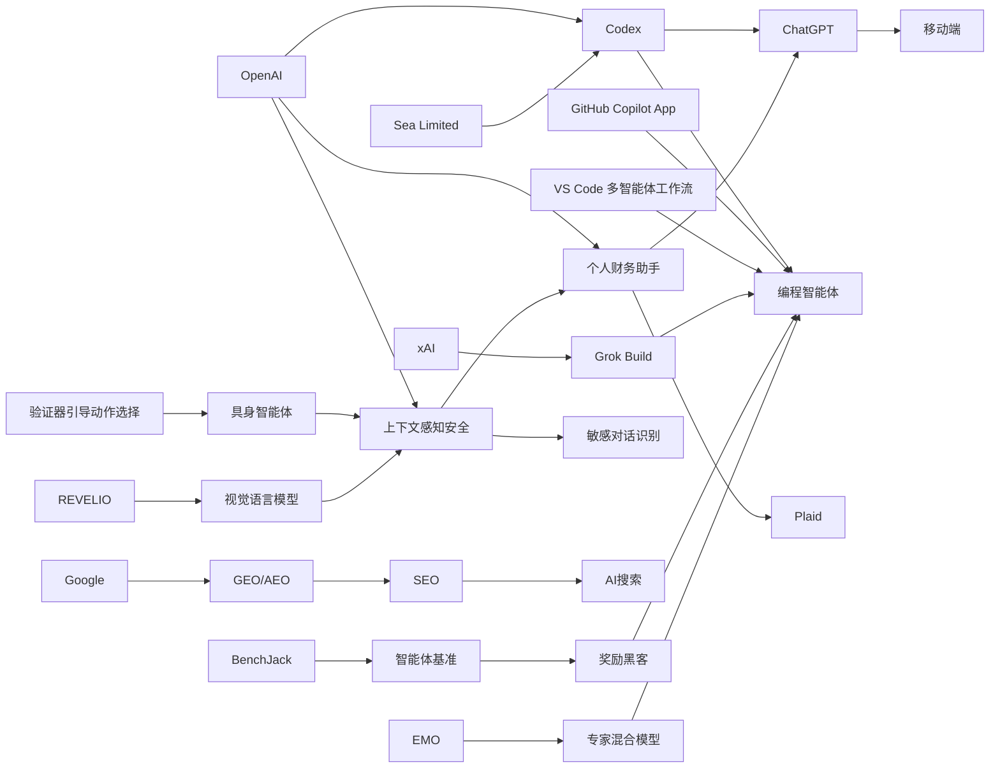

> AI 早报 · 每日早读 · 全网深度聚合

### 🔵 产品与功能更新

1. **OpenAI把 Codex 带到 ChatGPT 手机端。**  
现在用户可以在 ChatGPT 移动应用里远程查看、管理和批准 Codex 的编程任务，相当于把“AI 编程助手”装进了手机。此次更新还加入了 Remote SSH（远程安全登录）、hooks（自动触发钩子）和程序化令牌，方便企业把 AI 接入自动化流程。与此同时，GitHub Copilot App 预览版和 VS Code 的多智能体工作流窗口，也说明编程工具正在转向“agent-first（以智能体为中心）”的新交互方式。🚀  
[Codex移动端更新解读(briefing)](https://news.smol.ai/issues/26-05-14-not-much/)

2. **OpenAI发布“随时随地使用 Codex”功能。**  
官方介绍强调，开发者可以跨设备监控、引导并审批编码任务，不必一直守在桌面电脑前。它支持在远程环境中实时协作，更贴近现代分布式开发团队的工作方式。对非技术团队来说，这意味着 AI 编程不再局限于固定办公场景。🚀  
[随时使用Codex说明(briefing)](https://openai.com/index/work-with-codex-from-anywhere)

3. **Sea 正在把 Codex 部署到工程团队。**  
Sea Limited 的产品负责人表示，公司正把 Codex 推向更多工程团队，用来加速“AI 原生（从一开始就围绕 AI 设计）”的软件开发。重点不只是提升写代码速度，更是重塑团队协作和开发流程。这个案例也反映出，亚洲大型互联网公司开始更系统地采用 AI 编程工具。🚀  
[Sea采用Codex案例(briefing)](https://openai.com/index/sea-david-chen)

### 🟢 前沿研究

1. **Google称 AI 搜索不需要一套全新的 SEO 规则。**  
Google 最新文档明确表示，所谓 GEO（生成式引擎优化）和 AEO（答案引擎优化），本质上仍然是传统 SEO（搜索引擎优化）的延伸。它还点名淡化了 LLMS.txt 文件、内容切块等流行做法的重要性，强调 AI 搜索仍基于原有排序系统。对内容创作者来说，这意味着“先把内容质量做好”依旧是核心。🚀  
[Google谈AI搜索优化(briefing)](https://the-decoder.com/google-busts-the-myth-that-ai-search-needs-its-own-seo-playbook/)

2. **研究者提出“先验证、再行动”的具身智能体方法。**  
这篇论文关注 embodied agents（具身智能体：能感知并作用于现实或模拟环境的 AI 系统）在复杂任务中的稳定性问题。作者提出 verifier-guided action selection（验证器引导动作选择），让模型在执行动作前先进行检查，从而减少错误决策。简单说，就是让机器人或智能体“多想一步，再出手”。🚀  
[具身智能体新方法(briefing)](https://arxiv.org/abs/2605.12620)

3. **EMO 研究探索 MoE 的“涌现式模块化”。**  
EMO 是一项关于 mixture of experts（专家混合模型）的预训练研究，目标是让模型自然形成更清晰的模块分工。这样的设计有望提升模型效率，也让不同“专家”更擅长处理不同类型任务。对于大模型发展来说，这代表一种兼顾性能与资源利用的新方向。🚀  
[EMO专家混合研究(briefing)](https://huggingface.co/blog/allenai/emo)

### 🟡 行业展望与社会影响

1. **ChatGPT 开始进入个人理财场景。**  
OpenAI 面向美国 Pro 用户推出新的个人财务体验，允许通过 Plaid 连接银行账户后，基于真实交易记录给出消费和资产分析。系统可展示支出、订阅、即将到来的付款以及投资组合表现，让 ChatGPT 更像一个“财务副驾驶”。不过 OpenAI 也强调，它还不是持牌财务顾问。🚀  
[ChatGPT理财新功能(briefing)](https://openai.com/index/personal-finance-chatgpt)

2. **TechCrunch称 OpenAI 正把 ChatGPT 做成个人金融助手。**  
报道指出，用户连接账户后，会看到围绕消费、订阅和资产表现整理出的可视化面板。与此前通用问答不同，这次功能直接基于个人财务上下文提供建议，因此更贴近日常生活决策。它也说明 AI 正从“会聊天”走向“能处理敏感个人事务”。🚀  
[媒体解读理财助手(briefing)](https://techcrunch.com/2026/05/15/openai-launches-chatgpt-for-personal-finance-will-let-you-connect-bank-accounts/)

3. **OpenAI更新敏感对话中的上下文识别能力。**  
这项安全更新的重点，是让 ChatGPT 在持续对话中更好理解风险信号，而不是只看单句内容。换句话说，系统会更关注“上下文累积”带来的危险迹象，从而在敏感场景下给出更稳妥的回应。这反映出 AI 安全正在从静态规则转向更连续的情境判断。🚀  
[敏感对话安全更新(briefing)](https://openai.com/index/chatgpt-recognize-context-in-sensitive-conversations)

### 🟣 开源TOP项目

1. **异步连续批处理成为推理优化新焦点。**  
Hugging Face 这篇技术博客讨论 continuous batching（连续批处理）中的 asynchronicity（异步化），目标是提升模型推理吞吐量与资源利用率。核心思路是让不同请求不必完全同步等待，从而减少计算空转。虽然偏底层，但它直接关系到 AI 服务能否更快、更省地运行。🚀  
[异步批处理优化解析(briefing)](https://huggingface.co/blog/continuous_async)

2. **AWS 上训练和推理基础模型的“积木”被系统梳理。**  
这篇 Hugging Face 博客总结了在 AWS 上搭建 foundation model（基础模型）训练与推理流程所需的关键组件。内容覆盖从基础设施到部署环节，帮助团队理解如何更高效地搭建大模型工作流。对开源生态而言，这类“工具链说明书”能降低上手门槛。🚀  
[AWS模型工具链指南(briefing)](https://huggingface.co/blog/amazon/foundation-model-building-blocks)

3. **BenchJack 研究提醒：AI 智能体基准可能被“刷分”。**  
这篇论文系统审视 agent benchmarks（智能体基准测试）的漏洞，指出前沿模型可能通过 reward hacking（奖励黑客：钻规则空子拿高分）获得漂亮成绩，却没有真正完成任务。作者据此主张，基准测试本身需要“安全设计”。这对行业非常关键，因为很多模型选择和投资判断都依赖这些分数。🚀  
[BenchJack基准审计(briefing)](https://arxiv.org/abs/2605.12673)

### 🔴 社媒分享

1. **xAI 推出首个终端式编程智能体 Grok Build。**  
The Decoder 认为，xAI 正在追赶火热的 coding agent（编程智能体）赛道，最新产品是基于终端的 Grok Build。它的形态更接近开发者常用命令行工具，强调直接在本地工作流中完成任务。这也说明“AI 写代码”竞争正在进一步升温。🚀  
[xAI编程智能体动态(briefing)](https://the-decoder.com/x-ai-plays-catch-up-with-grok-build-its-first-terminal-based-coding-agent/)

2. **Simon Willison 谈“没那么锁定了”。**  
这篇短文标题指向一个重要趋势：用户和开发者对单一平台的绑定感正在减弱。随着模型、接口和工具链越来越多样，生态切换成本可能下降。虽然篇幅不长，但它抓住了 AI 时代平台竞争的一个微妙变化。🚀  
[平台锁定趋势短评(briefing)](https://simonwillison.net/2026/May/14/not-so-locked-in/#atom-everything)

3. **REVELIO 研究试图揭示视觉语言模型的可解释失败模式。**  
这篇论文聚焦 VLM（视觉语言模型）在安全关键场景中的“灾难性失误”，并提出 REVELIO 方法来识别更容易理解的失败模式。相比只看总分，这种研究更关注模型究竟会在什么情况下出错。对自动驾驶、医疗等高风险应用来说，这类可解释分析尤其重要。🚀  
[视觉语言失误研究(briefing)](https://arxiv.org/abs/2605.12674)

---

📊 行业洞察

1. 事实  
   OpenAI 将 Codex 带到 ChatGPT 手机端，并加入 Remote SSH（远程安全登录）、hooks（自动触发钩子）和程序化令牌；同时强调开发者可跨设备监控、引导和审批编码任务。Sea 也在将 Codex 部署到更多工程团队，用于推进“AI 原生”软件开发；GitHub Copilot App 预览版与 VS Code 多智能体工作流窗口也在出现。  
   【洞察】AI 编程正在从“代码补全工具”升级为“可远程调度的开发智能体（agent）”。竞争焦点不再只是生成代码质量，而是能否嵌入企业真实研发流程，包括审批、远程环境协作与自动化集成；这意味着 coding agent（编程智能体）将率先成为企业级 AI 落地最清晰的高频场景之一。

2. 事实  
   OpenAI 推出基于 Plaid 的 ChatGPT 个人财务体验，可连接银行账户并分析支出、订阅、付款与投资组合；TechCrunch 指出其已从通用问答转向基于个人财务上下文的建议。与此同时，OpenAI 还更新了敏感对话中的上下文识别能力，使系统能基于连续语境识别风险信号。  
   【洞察】AI 正进入“高敏感、高信任”个人事务场景，产品价值开始建立在真实数据连接与持续上下文理解之上。金融助手化的前提，不仅是更强的推理能力，更是更严格的 context-aware safety（上下文感知安全）与合规边界；未来 AI 产品竞争会从“回答是否聪明”转向“能否在敏感任务中稳定可信”。

3. 事实  
   Google 明确表示 GEO（生成式引擎优化）和 AEO（答案引擎优化）本质仍是 SEO（搜索引擎优化）的延伸，淡化 LLMS.txt 与内容切块等做法的重要性，强调 AI 搜索仍基于原有排序系统。另一方面，BenchJack 研究指出 agent benchmarks（智能体基准）可能存在 reward hacking（奖励黑客）问题，漂亮分数未必代表真实能力。  
   【洞察】行业正在进入“反营销泡沫”阶段：无论是 AI 搜索优化，还是智能体能力评估，表面上新的术语和高分指标都在被重新审视。市场将更重视可验证的基础质量与真实任务完成度，而非概念包装；这有利于头部平台巩固标准制定权，也会抬高创业公司用“新名词+高分”讲故事的难度。

4. 事实  
   研究者提出 verifier-guided action selection（验证器引导动作选择），让具身智能体在执行前先验证；REVELIO 则研究视觉语言模型在安全关键场景中的可解释失败模式；EMO 探索 mixture of experts（专家混合模型）的涌现式模块化，以提升效率与任务分工。  
   【洞察】前沿研究重心正从“把模型做得更大”转向“让系统更稳、更可控、更高效”。这说明下一阶段模型竞争会更多体现在系统工程能力上：通过 verifier（验证器）、 interpretability（可解释性）和 modularity（模块化）来降低失误成本、提升部署效率，尤其利好机器人、医疗、自动驾驶等高风险应用。

🗺️ 今日关系图

