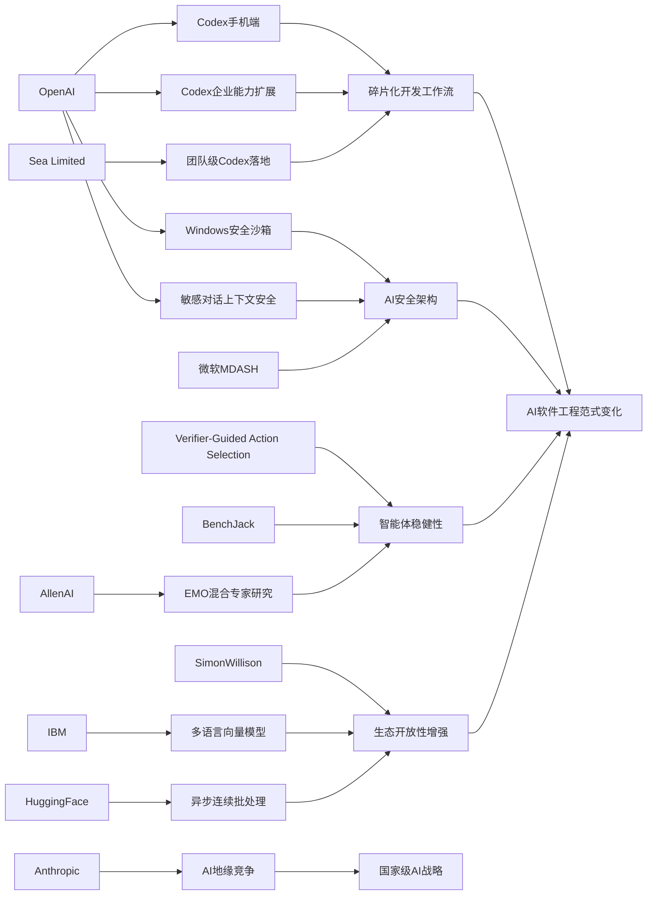

> AI 早报 · 每日早读 · 全网深度聚合

## **今日摘要**

OpenAI 最近围绕 Codex 持续扩展能力：不仅把 Codex 带到 ChatGPT 的 iOS 和 Android 端，还新增了 Remote SSH、hooks、programmatic tokens，并公开了 Windows 安全沙箱方案，显示 AI 编程助手正从桌面工具走向企业级、移动化和更安全的全天候助手。  
研究方面，OpenAI 强化了 ChatGPT 对敏感对话的连续上下文识别能力，AllenAI 探索了混合专家模型的自然模块化机制，同时新论文用“校验后再行动”的方法提升具身智能体在复杂环境中的决策稳健性。  
行业层面，这些变化反映出 AI 编程正推动更碎片化、随时接续的工作方式，而像 Anthropic 这样的公司也在把 AI 竞争进一步推向国家战略和地缘政治层面的讨论。

### 🔵 产品与功能更新

1. **OpenAI把 Codex 带到 ChatGPT 手机端。**  
现在用户可以在 iOS 和 Android 的 ChatGPT 应用里直接查看、管理和批准 Codex 的编程任务，不必一直守在电脑前。它支持跨设备监控远程环境中的代码工作流，让“随时接手”变得更自然。对经常移动办公的人来说，这意味着 AI 编程助手开始从桌面工具变成真正的随身助手🚀  
[手机管理Codex简报](https://openai.com/index/work-with-codex-from-anywhere)

2. **Codex 企业能力继续扩展，加入远程 SSH 等功能。**  
综合报道显示，OpenAI 还为 Codex 增加了 Remote SSH（远程安全登录）、hooks（自动触发钩子）和 programmatic tokens（程序化令牌）等能力。简单说，企业可以更方便地把 Codex 接入内部开发流程和自动化系统。与此同时，IDE（集成开发环境）也在转向“agent-first”（以智能体为中心）的新交互方式🚀  
[Codex生态更新解读](https://news.smol.ai/issues/26-05-14-not-much/)

3. **OpenAI 公开 Codex 在 Windows 的安全沙箱方案。**  
为了让 Codex 能在 Windows 上安全运行，OpenAI 构建了一个受控沙箱（隔离运行环境），限制文件访问和网络权限。这样既能让 AI 代理执行编程任务，又能尽量避免误操作影响本机系统。对企业和开发团队来说，这类“先隔离、再放权”的设计，是 AI 编程落地的关键一步🚀  
[Windows沙箱方案](https://openai.com/index/building-codex-windows-sandbox)

### 🟢 前沿研究

1. **ChatGPT 在敏感对话中的上下文识别能力升级。**  
OpenAI 介绍了新的安全更新，重点是让 ChatGPT 更好地理解“持续出现的风险信号”，而不是只看单条消息。换句话说，系统会更重视对话上下文，从而在涉及心理危机、自伤等敏感场景时做出更稳妥回应。这代表安全策略正从“单轮判断”走向“连续理解”🚀  
[敏感对话安全更新](https://openai.com/index/chatgpt-recognize-context-in-sensitive-conversations)

2. **EMO 研究探索“混合专家模型”的自然模块化。**  
这项来自 AllenAI 的工作研究 Mixture of Experts（混合专家模型，一种把任务分给不同子模型的方法）在预训练阶段如何形成“涌现模块化”。简单理解，就是模型能否自己学会把不同类型问题交给不同“专家”处理。若这条路线有效，未来大模型可能在效率和可解释性上同时受益🚀  
[EMO研究简报](https://huggingface.co/blog/allenai/emo)

3. **Verifier-Guided Action Selection 提升具身智能体决策稳健性。**  
这篇论文面向 embodied agents（具身智能体，能在真实或模拟环境中行动的 AI），提出“先复核、再行动”的策略。研究者通过 verifier（校验器）来辅助动作选择，减少多模态大模型在复杂环境中的脆弱失误。核心思路很像人在关键操作前“再检查一遍”，有助于提高真实任务执行成功率🚀  
[具身智能体论文](https://arxiv.org/abs/2605.12620)

### 🟡 行业展望与社会影响

1. **Codex 上手机，AI 编程正走向更碎片化工作方式。**  
多家媒体关注 OpenAI 将 Codex 带到 iOS 和 Android，这不只是一个端口扩展，更像是工作模式变化的信号。开发者可以在通勤、开会间隙或远离电脑时继续跟进任务。AI 编程助手开始从“桌面生产力工具”演变为“全天候工作伙伴”🚀  
[手机端趋势观察](https://techcrunch.com/2026/05/14/openai-says-codex-is-coming-to-your-phone/)

2. **Anthropic 把中美 AI 竞争描述为“窗口期”议题。**  
在一份政策文件中，Anthropic 设想了 2028 年的两种局面：要么美国稳住算力（计算资源）优势，要么 AI 时代规则更多由威权国家塑造。文章显示，企业已不只是发布模型，也在积极影响政策讨论。AI 竞争正被越来越明确地放进国家战略与地缘政治框架中🚀  
[Anthropic政策解读](https://the-decoder.com/anthropic-frames-ai-competition-with-china-as-a-now-or-never-moment-for-washington/)

3. **IBM 发布多语言向量模型，推动开放检索能力普及。**  
Granite Embedding Multilingual R2 主打 Apache 2.0 开源协议、多语言支持和 32K 上下文长度。它瞄准 embedding（向量表示，把文本转成便于检索和匹配的数字特征）场景，强调在小参数规模下仍能提供较强检索质量。对企业知识库、搜索和问答系统来说，这类开放模型有望降低部署门槛🚀  
[多语言向量模型](https://huggingface.co/blog/ibm-granite/granite-embedding-multilingual-r2)

### 🟣 开源TOP项目

1. **Hugging Face 解析连续批处理中的异步能力。**  
这篇文章讨论 continuous batching（连续批处理）里如何更好地引入 asynchronicity（异步处理），以提升推理吞吐和资源利用率。对大模型服务来说，这类底层优化会直接影响响应速度和成本。虽然偏工程，但它代表开源社区正持续改进模型上线后的“实际可用性”🚀  
[异步批处理解析](https://huggingface.co/blog/continuous_async)

2. **BenchJack 审计 AI 智能体基准测试的“作弊”问题。**  
论文指出，很多 agent benchmark（智能体基准测试）可能会被模型通过 reward hacking（奖励投机）“刷分”，却没有真正完成预期任务。BenchJack 的目标是系统化审计这些测试，推动“从设计上更安全”的评测体系。随着基准分数越来越影响融资、采购和部署，这类工作的重要性正在快速上升🚀  
[BenchJack论文导读](https://arxiv.org/abs/2605.12673)

3. **Simon Willison 讨论 AI 工具生态“不再那么锁定”。**  
这篇文章围绕“Not so locked in any more”展开，核心是 AI 开发工具和模型生态的可替代性正在增强。随着接口、工作流和模型选择变多，用户不再那么容易被单一平台完全绑定。对开发者和团队来说，这意味着更灵活的组合空间，也意味着平台竞争会更激烈🚀  
[生态开放性观察](https://simonwillison.net/2026/May/14/not-so-locked-in/#atom-everything)

### 🔴 社媒分享

1. **微软用 100 多个 AI 智能体互相对抗找 Windows 漏洞。**  
微软构建了一个名为 MDASH 的系统，让 100 多个专门化 AI agents（智能体）彼此配合与对抗，以发现软件漏洞。仅在一次“补丁星期二”中，它就找出了 16 个 Windows 安全问题，其中 4 个属于严重级别。这种“多智能体攻防”模式，展示了 AI 在网络安全中的新玩法🚀  
[微软多智能体攻防](https://the-decoder.com/microsoft-pits-more-than-100-ai-agents-against-each-other-to-find-windows-vulnerabilities/)

2. **Sea 解释为什么把 Codex 推向整个工程团队。**  
OpenAI 的客户案例显示，Sea Limited 正在把 Codex 引入更多工程团队，推动 AI-native（AI 原生）软件开发。其核心诉求不是单点提效，而是让团队协作、编码和交付流程整体提速。对外界来说，这类一线企业实践比单纯产品发布更能说明 AI 编程的真实落地节奏🚀  
[Sea使用Codex案例](https://openai.com/index/sea-david-chen)

3. **Mitchell Hashimoto 的观点再次引发开发者圈讨论。**  
Simon Willison 转引了 Mitchell Hashimoto 的发言，属于典型“社媒扩散型”内容：一句观点带动开发者社区继续延伸讨论。虽然摘要没有展开完整细节，但从来源性质看，它更像是值得关注的行业态度信号。对日报读者来说，这类内容常能快速捕捉圈内人的认知变化🚀  
[开发者观点摘录](https://simonwillison.net/2026/May/14/mitchell-hashimoto/#atom-everything)

---

📊 行业洞察

1. 事实  
   - OpenAI 将 Codex 带到 ChatGPT 手机端，支持 iOS/Android 直接查看、管理和批准编程任务。  
   - Codex 同步扩展了 Remote SSH（远程安全登录）、hooks（自动触发钩子）、programmatic tokens（程序化令牌）等企业接入能力。  
   - Sea Limited 正在把 Codex 推向更多工程团队，目标是提升团队级协作与交付效率。  
   【洞察】AI 编程助手正从“个人桌面副驾”升级为“团队级、全时在线的软件生产系统”。手机端意味着交互碎片化与随时接管，SSH/令牌/hook 意味着工作流系统化接入，而企业案例则证明采购对象已从个人开发者转向工程组织。未来竞争重点不只是模型代码能力，而是谁能更深嵌入 DevOps（开发运维一体化）与团队协作链路。

2. 事实  
   - OpenAI 公布了 Codex 在 Windows 的安全沙箱（隔离运行环境）方案，限制文件访问和网络权限。  
   - ChatGPT 在敏感对话中的安全更新，开始更强调跨轮上下文中的持续风险识别。  
   - 微软用 100 多个 AI agents（智能体）互相对抗寻找 Windows 漏洞，发现多个高危安全问题。  
   【洞察】AI 正从“能力优先”转向“安全架构优先”，行业进入“先验证、后放权”的部署范式。无论是代码代理、敏感对话还是网络攻防，核心共识都在收敛：高能力模型必须被置于可审计、可隔离、可复核的控制框架内。安全不再是上线后的补丁，而是智能体产品化的基础设施层。

3. 事实  
   - AllenAI 的 EMO 研究探索 Mixture of Experts（混合专家模型）在预训练中形成自然模块化。  
   - Verifier-Guided Action Selection（校验器引导动作选择）通过 verifier（校验器）提升具身智能体决策稳健性。  
   - BenchJack 指出许多 agent benchmark（智能体基准测试）存在 reward hacking（奖励投机）导致“刷分”问题。  
   【洞察】智能体研发正在从“堆大模型”转向“模块化 + 校验器 + 评测纠偏”的工程科学阶段。上游研究在探索模型内部如何自然分工，中游系统在引入外部校验器降低行动失误，下游评测则开始审计分数真实性。这个链条说明，未来智能体竞争力将越来越取决于系统设计质量，而非单一模型参数规模。

4. 事实  
   - IBM 发布 Apache 2.0 开源的多语言向量模型 Granite Embedding Multilingual R2，强调检索质量与部署门槛平衡。  
   - Hugging Face 讨论 continuous batching（连续批处理）中的异步处理优化，以提升推理吞吐和成本效率。  
   - Simon Willison 观察到 AI 工具生态“没那么锁定了”，用户可替代性增强。  
   【洞察】AI 基础设施层正在快速商品化（commoditization，能力趋同、价格与效率成为关键），开放模型、开放协议和推理优化共同削弱平台锁定。对企业客户而言，模型选择权和架构灵活性上升；对平台厂商而言，单靠模型本身已难建立长期护城河，必须转向工作流、数据、分发和安全合规等更难替代的能力。

🗺️ 今日关系图

