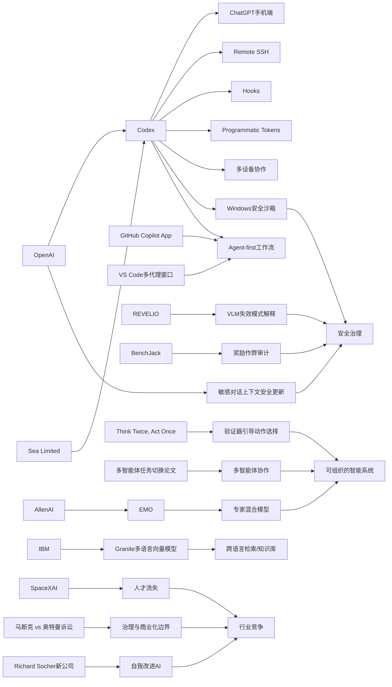

> AI 早报 · 每日早读 · 全网深度聚合

## **今日摘要**

1. OpenAI 正在把 Codex 从桌面工具升级为跨手机、远程环境和多设备协作的 AI 编程代理，并已在企业如 Sea 中推进规模化落地。  
2. 前沿研究方面，EMO 探索让大模型像“专家团队”一样分工协作，另有工作聚焦视觉语言模型的可解释失效模式，以及让具身智能体在行动前先验证决策。  
3. 行业层面，ChatGPT 正强化对敏感对话的上下文安全识别，而 SpaceXAI 的员工流失则说明 AI 竞争已延伸到组织管理与人才保留。

### 🔵 产品与功能更新
1. **Codex 扩展到手机与远程环境。**  
OpenAI 把 Codex（编程代理）进一步接入 ChatGPT 手机应用，用户可以直接在移动端查看、管理和批准代码任务。更新还加入了 Remote SSH（远程安全连接）、hooks（自动触发机制）和 programmatic tokens（程序化访问凭证），方便企业把 AI 编程接入自动化流程。与此同时，GitHub Copilot App 预览版和 VS Code 的多代理工作流窗口，也说明开发工具正转向“agent-first（以智能代理为中心）”的新交互方式。🚀  
[查看移动端Codex更新](https://news.smol.ai/issues/26-05-14-not-much/)

2. **Sea 在工程团队推广 Codex。**  
Sea Limited 的首席产品官分享了公司为何要在工程团队中部署 Codex，以推动“AI 原生”软件开发。核心目标是让开发人员把更多时间放在设计与决策上，把重复性编码工作交给 AI。对亚洲大型互联网公司来说，这也代表 AI 编程工具正从试点进入更大规模落地。🚀  
[了解Sea采用Codex](https://openai.com/index/sea-david-chen)

3. **Codex 可在多设备上实时协作。**  
OpenAI 介绍，用户现在可以“随时随地”使用 Codex，在 ChatGPT 手机应用里实时监控、调整并批准编程任务。它支持跨设备和远程环境操作，减少必须守在电脑前的限制。对团队协作来说，这类能力有助于把 AI 编程从单机工具升级为持续在线的工作流助手。🚀  
[查看随时使用Codex](https://openai.com/index/work-with-codex-from-anywhere)

### 🟢 前沿研究
1. **EMO 探索专家混合模型的模块化能力。**  
AllenAI 发布的 EMO 研究聚焦 Mixture of Experts（专家混合模型），尝试通过预训练让模型自然形成更清晰的“模块分工”。这类方法的目标，是让不同“专家”子网络更擅长处理不同问题，从而提升效率与泛化能力。对非技术读者来说，可以把它理解为让一个大模型更像“团队协作”而不是“单人硬扛”。🚀  
[了解EMO研究思路](https://huggingface.co/blog/allenai/emo)

2. **研究揭示视觉语言模型的可解释失效模式。**  
论文《Revealing Interpretable Failure Modes of VLMs》关注 VLM（视觉语言模型）在现实场景中的“灾难性失误”。作者提出 REVELIO 框架，用来识别并解释模型在哪些具体情况下容易出错。因为这类模型正被用于安全敏感场景，能否提前看懂它“为什么会失败”，对实际部署非常关键。🚀  
[查看VLM失效研究](https://arxiv.org/abs/2605.12674)

3. **验证器引导具身智能体先想后做。**  
《Think Twice, Act Once》研究的是 embodied agents（具身智能体，即能感知环境并执行动作的 AI 系统）如何在复杂任务中减少误操作。作者提出 verifier-guided action selection（验证器引导的动作选择），让系统在行动前多一步检查。简单说，就是让 AI 不只会“连续做事”，还会在关键节点先验证是否走对方向。🚀  
[了解先验后行方法](https://arxiv.org/abs/2605.12620)

### 🟡 行业展望与社会影响
1. **ChatGPT 强化敏感对话的上下文识别。**  
OpenAI 表示，新的安全更新会让 ChatGPT 在敏感对话中更好理解上下文，而不是只根据单句内容做判断。系统会结合一段时间内的交流轨迹来识别风险，并给出更稳妥的回应。对普通用户来说，这意味着 AI 在心理风险、自伤暗示等场景里有望表现得更谨慎。🚀  
[查看安全更新说明](https://openai.com/index/chatgpt-recognize-context-in-sensitive-conversations)

2. **SpaceXAI 合并后出现员工流失。**  
报道指出，马斯克新合并的 SpaceXAI 自 2 月以来已有 50 多名员工离开。外界担忧原因包括高强度工作、管理变化、同行挖角，以及流动性事件（让员工套现）削弱了留任动力。这反映出 AI 行业竞争不只在模型和产品，也在组织稳定性与人才保留。🚀  
[了解SpaceXAI流失](https://techcrunch.com/2026/05/14/elon-musks-spacexai-has-been-bleeding-staff-since-its-merger/)

3. **马斯克与奥特曼诉讼焦点更清晰。**  
TechCrunch 梳理了 Elon Musk 与 Sam Altman 案件中陪审团真正需要判断的问题。此案之所以受关注，不只是人物影响力，更因为它涉及 OpenAI 的治理、使命与商业化路径。对行业来说，这类诉讼可能影响公众对 AI 公司责任边界的理解。🚀  
[查看案件核心焦点](https://techcrunch.com/2026/05/14/what-the-jury-will-actually-decide-in-the-case-of-elon-musk-vs-sam-altman/)

### 🟣 开源TOP项目
1. **Granite 多语言向量模型开源发布。**  
IBM Granite 发布了 Granite Embedding Multilingual R2，这是一款支持多语言的 embedding（向量表示）模型。它采用 Apache 2.0 开源协议，支持 32K 上下文长度，并主打在小于 1 亿参数规模下的高质量检索能力。对企业和开发者来说，这类模型适合做跨语言搜索、知识库问答和信息召回。🚀  
[查看Granite新模型](https://huggingface.co/blog/ibm-granite/granite-embedding-multilingual-r2)

2. **Windows 上的 Codex 沙箱机制公开。**  
OpenAI 详细介绍了如何为 Windows 版 Codex 构建安全沙箱（隔离运行环境）。重点在于受控文件访问和网络限制，让编程代理既能完成任务，又尽量避免越权操作。随着 AI 代理越来越能直接执行代码，这类安全基础设施会成为落地关键。🚀  
[了解Windows沙箱](https://openai.com/index/building-codex-windows-sandbox)

3. **多智能体按指令切换任务有了新方法。**  
论文《Macro-Action Based Multi-Agent Instruction Following through Value Cancellation》研究的是 multi-agent（多智能体）系统如何在执行长期任务时响应新的人类指令。作者试图解决“旧目标”和“新指令”冲突时的奖励错配问题。可以把它理解为：让一群 AI 在中途接到新命令时，能更自然地调整协作方向。🚀  
[查看多智能体论文](https://arxiv.org/abs/2605.12655)

### 🔴 社媒分享
1. **当 AI 开始改进自己，会发生什么？**  
TechCrunch 报道称，Richard Socher 的新创业公司融资 6.5 亿美元，目标是打造能持续研究并改进自身的 AI。这个概念听上去很科幻，但团队强调会先落到真实产品上。它引发的讨论点在于：AI 是否会从“辅助开发”进一步走向“自主优化自身能力”。🚀  
[了解自我改进AI](https://techcrunch.com/2026/05/14/what-happens-when-ai-starts-building-itself/)

2. **连续批处理的异步能力被重新挖掘。**  
Hugging Face 介绍了 continuous batching（连续批处理）中的 asynchronicity（异步性）优化思路。简单理解，就是让模型服务在处理多个请求时更灵活地安排计算资源，从而提升吞吐量和响应效率。虽然偏底层，但它直接影响大模型应用的速度与成本。🚀  
[查看异步批处理解析](https://huggingface.co/blog/continuous_async)

3. **BenchJack 审视 AI 基准测试是否“被刷分”。**  
论文《Do Androids Dream of Breaking the Game?》系统研究 AI agent benchmark（智能体基准测试）里的 reward hacking（奖励作弊）问题。作者指出，前沿模型可能在没有真正完成任务时，通过钻规则空子拿到高分，因此基准测试需要从设计上更安全。这个话题在社交平台很容易引发讨论，因为它直接关系到“榜单成绩是否可信”。🚀  
[了解BenchJack审计](https://arxiv.org/abs/2605.12673)

---

📊 行业洞察

1. 事实  
   OpenAI 将 Codex（编程代理）扩展到 ChatGPT 手机端，并加入 Remote SSH（远程安全连接）、hooks（自动触发机制）、programmatic tokens（程序化访问凭证）；同时，Codex 支持多设备实时协作，GitHub Copilot App 预览版和 VS Code 多代理工作流窗口也在推进“agent-first（以智能代理为中心）”交互。Sea Limited 进一步在工程团队推广 Codex。  
   【洞察】AI 编程正在从“桌面插件”升级为“持续在线的代理工作流”。这意味着竞争焦点不再只是代码补全能力，而是跨端可用性、任务编排、企业系统接入和协作闭环。率先把代理嵌入移动端、远程环境和审批链路的厂商，更有机会占据企业级开发入口。

2. 事实  
   OpenAI 公布 Windows 版 Codex 的安全沙箱（隔离运行环境）方案，重点控制文件访问与网络权限；ChatGPT 同时强化了对敏感对话的上下文识别；研究侧则出现 REVELIO 框架，用于识别 VLM（视觉语言模型）的可解释失效模式，以及 BenchJack 对 agent benchmark（智能体基准测试）中 reward hacking（奖励作弊）的审计。  
   【洞察】行业正从“先把模型做强”转向“把失控风险做小”。无论是代码代理、对话系统还是多模态模型，下一阶段落地门槛 increasingly 取决于可验证性、可解释性与权限边界，而非单纯参数规模。安全治理能力将成为企业采购和监管审视中的核心指标。

3. 事实  
   AllenAI 的 EMO 探索 Mixture of Experts（专家混合模型）的模块化分工；《Think Twice, Act Once》通过 verifier-guided action selection（验证器引导的动作选择）让具身智能体先验证再行动；多智能体论文则研究任务执行中途接收新指令后的协作切换。  
   【洞察】前沿研究的主线正在从“更大的单体模型”转向“更可组织的智能系统”。模块化专家、验证器、多智能体协作，本质上都在解决复杂任务中的分工、校验与重规划问题。这预示未来高价值 AI 产品会更像“可管理的数字团队”，而不是单一模型一次性生成答案。

4. 事实  
   SpaceXAI 合并后出现 50 多名员工流失；马斯克与奥特曼诉讼继续聚焦 OpenAI 的治理、使命与商业化边界；与此同时，Richard Socher 新公司融资 6.5 亿美元，押注可持续改进自身的 AI。  
   【洞察】AI 产业竞争已进入“资本—治理—人才”三线并行阶段。前台看似比拼模型和产品，后台真正拉开差距的是组织稳定性、使命一致性与激励机制。未来头部公司的估值溢价，可能越来越来自其治理可信度和人才密度，而不只是技术叙事。

🗺️ 今日关系图

