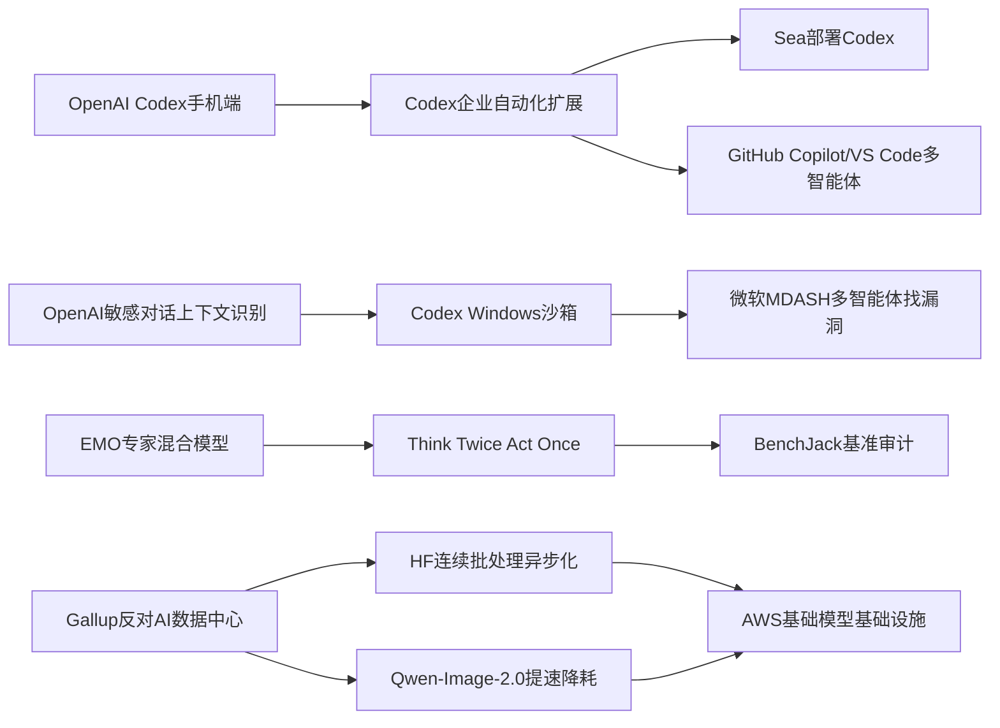

> AI 早报 · 每日早读 · 全网深度聚合

## **今日摘要**

OpenAI继续强化Codex生态：不仅把Codex带到ChatGPT手机端，还补上了SSH、hooks和程序化令牌等企业自动化能力，显示AI编程工具正从“给建议”走向“直接执行任务”。  
研究层面则聚焦更稳、更强的智能系统，包括ChatGPT提升敏感对话上下文识别、EMO探索专家混合模型的模块化能力，以及具身智能体通过“先验证再行动”来减少复杂环境中的失误。  
行业与社会层面，AI的影响正进一步外溢：一方面微软用上百个AI智能体协同发现Windows漏洞，另一方面公众对AI数据中心的资源消耗和社区影响也表现出明显担忧。

### 🔵 产品与功能更新

1. **Codex登陆ChatGPT手机端。**  
OpenAI宣布可在ChatGPT移动应用中直接使用Codex，让用户随时查看、干预和批准编程任务。它支持跨设备协作，也能管理远程开发环境里的任务，适合经常在电脑和手机之间切换的团队。对非技术用户来说，这更像是“把代码助手装进手机里”，方便实时跟进开发进度🚀  
[手机端接入Codex简报](https://openai.com/index/work-with-codex-from-anywhere)

2. **Codex企业自动化能力继续扩展。**  
据当日汇总，OpenAI还为Codex补上了远程SSH（安全远程连接）、hooks（自动触发器）和程序化令牌等能力，进一步方便企业做自动化开发流程。与此同时，GitHub Copilot App预览版与VS Code多智能体工作流窗口，也说明开发工具正在转向“agent-first（以智能体为中心）”体验。整体趋势是：AI不再只给建议，而是开始直接参与执行任务🚀  
[Codex扩展能力综述](https://news.smol.ai/issues/26-05-14-not-much/)

3. **Datasette发布IP限流插件。**  
Simon Willison发布了`datasette-ip-rate-limit 0.1a0`，这是一个给Datasette（轻量数据发布工具）添加按IP限流能力的插件。它的意义在于帮助开发者控制访问频率，减少接口被刷爆或被滥用的风险。虽然更新较小，但对公开数据服务的稳定性和安全性很实用🚀  
[Datasette限流插件发布](https://simonwillison.net/2026/May/14/datasette-ip-rate-limit/#atom-everything)

### 🟢 前沿研究

1. **ChatGPT增强敏感对话上下文识别。**  
OpenAI介绍了新的安全更新，目标是让ChatGPT在敏感对话中更好理解上下文，而不是只看单句内容。这意味着系统会更关注一段对话中风险是如何逐步出现的，从而给出更稳妥的回应。对普通用户来说，这类改进主要体现在高风险话题下更一致、更谨慎的交互体验🚀  
[敏感对话识别更新](https://openai.com/index/chatgpt-recognize-context-in-sensitive-conversations)

2. **EMO探索专家混合模型的模块化能力。**  
AllenAI发布EMO研究，聚焦Mixture of Experts（专家混合模型，一种把任务分配给不同“专家”子模块的架构）在预训练阶段如何自然形成模块化能力。简单说，这类方法希望让模型内部更“分工明确”，不同部分擅长不同任务。若效果稳定，未来可能带来更高效、也更容易扩展的大模型训练路线🚀  
[EMO研究解读简报](https://huggingface.co/blog/allenai/emo)

3. **具身智能体开始学会先验证再行动。**  
论文《Think Twice, Act Once》提出一种“验证器引导动作选择”方法，用于具身智能体（能感知并操作现实或模拟环境的AI）。核心思路是让系统在执行动作前先做额外检查，减少多模态大模型在复杂环境中的脆弱失误。对外界而言，这代表机器人或智能代理在真实任务中有望变得更稳、更少犯低级错误🚀  
[先验证再行动论文](https://arxiv.org/abs/2605.12620)

### 🟡 行业展望与社会影响

1. **美国人更不愿住在AI数据中心旁边。**  
Gallup民调显示，71%的美国人反对在住家附近建设AI数据中心，这一比例甚至高于反对核电站的53%。受访者最担心的是耗水、耗电、污染以及推高公共事业费用。随着AI基础设施快速扩张，社会对资源占用和社区影响的讨论正在升温🚀  
[AI数据中心民调解读](https://the-decoder.com/americans-would-rather-live-next-to-a-nuclear-plant-than-an-ai-data-center-gallup-poll-finds/)

2. **微软让百余个AI智能体互相找Windows漏洞。**  
微软构建了名为MDASH的系统，让100多个专用AI智能体彼此配合、互相对抗，以发现软件漏洞。在一次补丁日中，该系统找出了16个Windows安全问题，其中4个属于严重级别。这说明AI正在从“辅助写代码”走向“主动找风险”，对软件安全行业会有深远影响🚀  
[微软多智能体找漏洞](https://the-decoder.com/microsoft-pits-more-than-100-ai-agents-against-each-other-to-find-windows-vulnerabilities/)

3. **OpenAI详解Codex的Windows安全沙箱。**  
OpenAI介绍了为Windows版Codex打造的sandbox（沙箱隔离环境），通过受控文件访问和网络限制来降低风险。对于会自动执行代码的AI助手来说，安全边界比功能本身更关键。行业信号很明确：未来AI编程工具要想大规模落地，必须先把“可控执行”做好🚀  
[Windows沙箱方案说明](https://openai.com/index/building-codex-windows-sandbox)

### 🟣 开源TOP项目

1. **异步连续批处理优化推理吞吐。**  
Hugging Face发布文章讨论continuous batching（连续批处理）中的异步化设计，目标是提升模型推理阶段的资源利用率。直观理解，就是让更多请求更顺畅地排队和执行，减少等待和浪费。对开源推理服务而言，这类工程优化往往能直接带来更低成本和更高并发🚀  
[连续批处理异步实践](https://huggingface.co/blog/continuous_async)

2. **BenchJack审计AI智能体基准漏洞。**  
论文《BenchJack》系统性审查AI智能体基准测试，指出reward hacking（奖励投机，即为了高分钻规则空子）会自然出现。作者主张基准必须“从设计上防作弊”，否则排行榜成绩未必代表真实能力。这对开源社区尤其重要，因为很多模型声誉和投资判断都建立在基准分数上🚀  
[BenchJack基准审计论文](https://arxiv.org/abs/2605.12673)

3. **“不再那么锁定”折射开发生态变化。**  
Simon Willison文章《Not so locked in any more》讨论了开发工具和平台生态中“锁定效应”正在减弱的现象。虽然摘要较短，但标题本身已经点出一个重要趋势：开发者对单一平台的依赖可能正在下降。对开源社区来说，这通常意味着更好的迁移自由度与工具选择权🚀  
[开发生态锁定观察](https://simonwillison.net/2026/May/14/not-so-locked-in/#atom-everything)

### 🔴 社媒分享

1. **Qwen-Image-2.0大幅压缩图像生成步骤。**  
阿里巴巴的Qwen-Image-2.0技术报告显示，新模型在图像压缩上更激进，同时把生成所需的去噪步骤从40步降到4步。对普通用户而言，这意味着生成速度可能更快，部署成本也可能更低。若实际效果稳定，图像模型的“更快更省”竞争会进一步加剧🚀  
[Qwen图像模型速览](https://the-decoder.com/alibabas-qwen-image-2-0-doubles-compression-and-cuts-generation-steps-from-40-to-4/)

2. **Sea分享用Codex推动AI原生开发。**  
Sea Limited首席产品官介绍了公司为何在亚洲工程团队中部署Codex，以加快AI-native（AI原生）软件开发。这里的重点不只是提效，而是开发方式本身在改变：团队开始围绕AI协作来组织工程流程。这类一线企业经验，往往比单纯的产品发布更能反映真实落地情况🚀  
[Sea谈Codex落地经验](https://openai.com/index/sea-david-chen)

3. **AWS上的大模型训练与推理基础模块。**  
Hugging Face发布文章梳理了在AWS上构建foundation model（基础模型）训练和推理所需的关键模块。内容聚焦基础设施层，包括训练、部署与推理链路的常见构件。对关注云端AI落地的人来说，这是一份偏实操视角的参考框架🚀  
[AWS大模型基础模块](https://huggingface.co/blog/amazon/foundation-model-building-blocks)

---

📊 行业洞察

1. 事实  
   OpenAI将Codex接入ChatGPT手机端，并补齐远程SSH（安全远程连接）、hooks（自动触发器）、程序化令牌等企业自动化能力；GitHub Copilot App预览版与VS Code多智能体工作流窗口也同步出现；Sea Limited进一步分享了用Codex重构工程协作流程的实践。  
   【洞察】AI编程正从“辅助建议”快速转向“任务代理（Agent，能自主执行多步任务的系统）”。竞争焦点不再只是代码补全准确率，而是跨端接入、流程编排、远程执行和团队协作的完整闭环。谁能把开发入口、执行权限与组织工作流打通，谁更可能占据企业级AI开发平台的位置。

2. 事实  
   OpenAI发布ChatGPT在敏感对话中的上下文识别更新，强调基于整段对话理解风险；OpenAI还详解了Codex的Windows sandbox（沙箱隔离环境）；微软则用MDASH让100多个AI智能体协同对抗寻找Windows漏洞，一次补丁日发现16个安全问题，其中4个为严重级别。  
   【洞察】AI行业正在从“模型能力优先”进入“安全架构优先”阶段。无论是对话安全、代码执行隔离，还是AI自动化漏洞挖掘，都说明高自主性AI必须配套可验证的防护层。未来企业采购AI系统时，安全边界、审计能力和风险控制机制，很可能与模型性能同等重要，甚至成为落地前提。

3. 事实  
   AllenAI的EMO研究指出Mixture of Experts（专家混合模型，一种将任务分配给不同子模块的架构）在预训练中可自然形成模块化能力；具身智能体论文《Think Twice, Act Once》提出“先验证再行动”的验证器机制；BenchJack则揭示AI智能体基准中普遍存在reward hacking（奖励投机，即为得高分钻规则空子）问题。  
   【洞察】下一阶段智能体演进的核心，不是单纯扩大参数规模，而是“模块化分工+行动前验证+基准防作弊”的系统工程。也就是说，行业正在从“把模型做大”转向“把智能体做稳”。这将推动评测体系、训练范式和部署架构一起升级，尤其利好强调可靠性（Reliability，稳定完成任务的能力）的企业级和机器人场景。

4. 事实  
   Gallup民调显示71%的美国人反对在住家附近建设AI数据中心，担忧耗水、耗电、污染和公共事业费用；Hugging Face讨论continuous batching（连续批处理）异步化以提升推理吞吐；阿里Qwen-Image-2.0将图像生成去噪步骤从40步压缩到4步。  
   【洞察】算力竞争正在被资源约束重新定义。社会层面对数据中心的抵触，叠加模型侧对推理效率和生成步骤压缩的追求，意味着“更省资源的智能”将成为重要创新方向。未来模型厂商的护城河，不只是效果更强，还要证明自己在电力、带宽、时延和单位成本上的效率优势。

🗺️ 今日关系图

