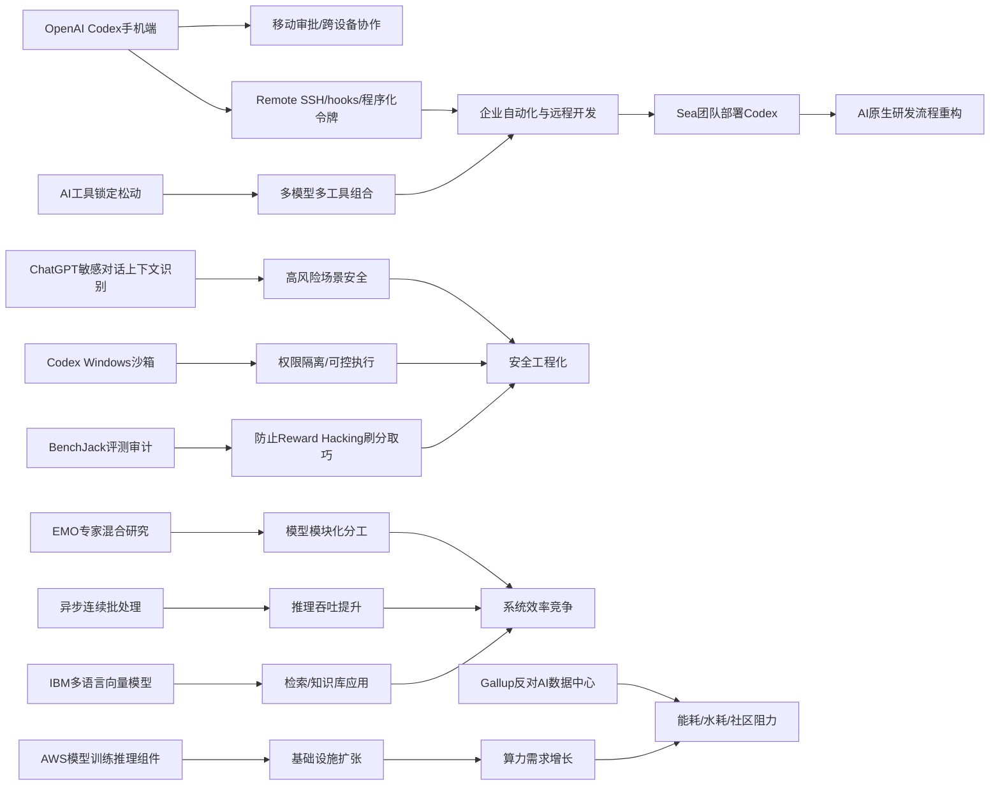

> AI 早报 · 每日早读 · 全网深度聚合

## **今日摘要**

本周更新集中在 OpenAI：Codex 已登陆 ChatGPT 手机端，并进一步扩展到远程 SSH、hooks 和程序化令牌等能力，同时 ChatGPT 也增强了对敏感对话上下文的识别与安全响应。  
研究方面，EMO 探索专家混合模型在预训练中如何自然形成模块化分工，Verifier-Guided Action Selection 提出“先验证再行动”以提升具身智能体稳定性，而 Datasette 官方博客则成为数据工具实践的新入口。  
行业层面，公众对 AI 数据中心落地的抵触持续升高，反映出对能源、污染和社区影响的担忧；与此同时，OpenAI 也在披露 Codex 在 Windows 上的安全沙箱设计，以回应 AI 编码代理在真实环境部署中的安全需求。

### 🔵 产品与功能更新

1. **OpenAI 将 Codex 带到 ChatGPT 手机端。**
用户现在可以在 iOS 和 Android 的 ChatGPT 应用里直接使用 Codex，随时查看、推进和审批远程编程任务🚀  
这意味着开发者不必一直守在电脑前，也能跨设备管理代码工作流。对于经常需要远程协作或排查任务的人来说，移动端接入明显提升了灵活性。  
[手机端使用Codex(briefing)](https://openai.com/index/work-with-codex-from-anywhere)

2. **Codex 集成扩展到移动端与远程环境。**
综合报道显示，OpenAI 不只把 Codex 带上手机，还加入了 Remote SSH（远程安全连接）、hooks（自动触发钩子）和程序化令牌等能力🚀  
这些功能更适合企业自动化场景，可让团队把 AI 编码助手接入远程服务器和内部流程。与此同时，IDE（集成开发环境）也在转向“agent-first（代理优先）”的使用方式。  
[Codex扩展更新(briefing)](https://news.smol.ai/issues/26-05-14-not-much/)

3. **ChatGPT 加强对敏感对话的上下文识别。**
OpenAI 介绍了新的安全更新，让 ChatGPT 能更好理解敏感对话中的上下文，而不只是看单句内容🚀  
系统会尝试结合对话随时间发展的风险信号，给出更稳妥的回应。这类改进有助于在心理健康、自伤风险等高敏感场景中减少误判。  
[敏感对话安全更新(briefing)](https://openai.com/index/chatgpt-recognize-context-in-sensitive-conversations)

### 🟢 前沿研究

1. **EMO 探索专家混合预训练中的“涌现模块化”。**
AllenAI 发布的 EMO 研究聚焦 Mixture of Experts（专家混合模型）在预训练阶段如何自然形成更清晰的功能分工🚀  
简单说，就是让不同“专家”子模型逐渐擅长不同任务，从而提升效率与能力组织方式。这类研究可能影响未来大模型如何在更低成本下实现更强表现。  
[EMO研究解读(briefing)](https://huggingface.co/blog/allenai/emo)

2. **研究提出“先验证再行动”的具身智能体方法。**
这篇 arXiv 论文提出 Verifier-Guided Action Selection（验证器引导的动作选择），希望让 Embodied Agents（具身智能体）在复杂现实任务中少犯错🚀  
核心思路是先对候选动作做额外验证，再决定执行哪一步，类似“想两次、做一次”。这有助于提升多模态大模型驱动机器人或现实代理时的稳定性。  
[具身智能新方法(briefing)](https://arxiv.org/abs/2605.12620)

3. **Datasette 博客上线，围绕数据工具持续更新。**
Simon Willison 宣布 Datasette 官方博客上线，后续将集中发布该开源数据工具的更新与实践内容🚀  
虽然这不是单篇学术研究，但对关注轻量数据发布、查询和可视化工具的人来说，是一个值得跟踪的知识入口。对非技术团队而言，也有望看到更多易读的案例分享。  
[Datasette博客上线(briefing)](https://simonwillison.net/2026/May/13/welcome-to-the-datasette-blog/#atom-everything)

### 🟡 行业展望与社会影响

1. **美国人更不愿住在 AI 数据中心附近。**
Gallup 民调显示，71% 的美国人反对在家附近建设 AI 数据中心，这一比例甚至高于对核电站的反对程度🚀  
公众最担心的是耗水、耗电、污染以及电费上涨。随着 AI 基础设施快速扩张，社会对能源与社区影响的讨论会越来越重要。  
[民调看数据中心争议(briefing)](https://the-decoder.com/americans-would-rather-live-next-to-a-nuclear-plant-than-an-ai-data-center-gallup-poll-finds/)

2. **OpenAI 披露 Codex 在 Windows 上的安全沙箱设计。**
为了让 Codex 能在 Windows 环境里更安全地运行，OpenAI 构建了专门的 sandbox（沙箱隔离环境）🚀  
这个设计会限制文件访问范围和网络权限，尽量降低 AI 编码代理误操作或越权的风险。它反映出行业正在从“能用”走向“可控、可部署”的工程化阶段。  
[Windows沙箱方案(briefing)](https://openai.com/index/building-codex-windows-sandbox)

3. **IBM 发布多语言向量模型 Granite Embedding Multilingual R2。**
IBM 在 Hugging Face 介绍了新一代多语言 embedding（文本向量表示）模型，主打 32K 上下文和较小参数规模下的检索表现🚀  
这类模型常用于搜索、知识库问答和推荐系统，重点是把不同语言文本转换成便于匹配的向量。开源许可为 Apache 2.0，也提高了企业采用的可行性。  
[IBM多语言向量模型(briefing)](https://huggingface.co/blog/ibm-granite/granite-embedding-multilingual-r2)

### 🟣 开源TOP项目

1. **连续批处理迎来异步化优化。**
Hugging Face 文章讨论了 continuous batching（连续批处理）中的异步机制改进，目标是提升推理服务效率🚀  
简单理解，就是让模型处理请求时减少等待和空转，从而在高并发场景下更充分利用算力。这对部署大模型 API（应用接口）和在线服务的团队尤其重要。  
[异步批处理优化(briefing)](https://huggingface.co/blog/continuous_async)

2. **BenchJack 系统性审计 AI 智能体基准。**
这篇论文提出 BenchJack，用来检查 AI agent benchmark（智能体评测基准）是否存在“reward hacking（刷分取巧）”问题🚀  
研究者指出，模型可能在不真正完成任务的情况下拿到高分，因此评测本身也需要安全设计。对开源社区而言，这提醒大家不能只看排行榜数字。  
[BenchJack评测审计(briefing)](https://arxiv.org/abs/2605.12673)

3. **“不再那么被锁定”讨论 AI 工具生态松动。**
Simon Willison 的文章关注 AI 工具链中的“lock-in（厂商锁定）”问题正在减弱🚀  
随着模型、接口和工作流工具日益多样，开发者在平台之间迁移的空间变大。对开源生态来说，这意味着更强的组合自由度，也可能带来更健康的竞争。  
[AI生态锁定松动(briefing)](https://simonwillison.net/2026/May/14/not-so-locked-in/#atom-everything)

### 🔴 社媒分享

1. **Sea 分享用 Codex 推进 AI 原生软件开发。**
Sea Limited 首席产品官介绍了公司为何在工程团队中部署 Codex，以加快 AI-native（AI 原生）开发方式落地🚀  
这类企业一线经验能帮助外界理解，AI 编码工具不只是个人提效工具，也在进入团队级协作和流程重构。对亚洲科技公司实践尤其有参考价值。  
[Sea谈Codex实践(briefing)](https://openai.com/index/sea-david-chen)

2. **Mitchell Hashimoto 观点被再次引用讨论。**
Simon Willison 转引了 Mitchell Hashimoto 的一段看法，延续了开发者社区对 AI 工具与软件构建方式的讨论🚀  
这类内容虽偏短评，但往往能快速反映技术圈对新工具趋势的真实态度。对关注开发者舆论风向的人来说，值得留意。  
[开发者观点摘录(briefing)](https://simonwillison.net/2026/May/14/mitchell-hashimoto/#atom-everything)

3. **AWS 上训练与推理基础模型的组件方案被梳理。**
Hugging Face 与 Amazon 联合发布文章，介绍在 AWS 上进行 foundation model（基础模型）训练和推理的关键构建模块🚀  
内容聚焦云上基础设施、工作流与性能组合方式，适合希望理解产业部署路径的读者。虽然偏平台视角，但有助于看清主流云厂商如何承接 AI 热潮。  
[AWS模型组件方案(briefing)](https://huggingface.co/blog/amazon/foundation-model-building-blocks)

---

📊 行业洞察

1. 事实  
  OpenAI 将 Codex 带到 ChatGPT 手机端，同时补齐了 Remote SSH（远程安全连接）、hooks（自动触发钩子）、程序化令牌等能力；Sea 也分享了在工程团队内部部署 Codex 推进 AI-native（AI 原生）开发的实践。  
  【洞察】AI 编码助手正在从“个人副驾”升级为“团队级软件生产代理（agent）”。移动端接入解决了任务审批与异步协作，远程环境能力解决了接入服务器和内部流程的问题，企业案例则证明其已开始重构研发流程，而不只是提升个体写代码效率。

2. 事实  
  OpenAI 披露了 Codex 在 Windows 上的 sandbox（沙箱隔离环境）设计；同时，ChatGPT 也加强了对敏感对话的上下文识别，不再只基于单句判断风险。  
  【洞察】大模型产品竞争已进入“安全工程化”阶段。无论是代码代理的系统权限控制，还是通用助手在高敏感场景下的上下文风险识别，本质上都说明厂商正从“模型能力展示”转向“可控部署、可审计、可落责”的产品标准，这将成为企业采购与监管接受度的关键门槛。

3. 事实  
  AllenAI 的 EMO 研究显示 Mixture of Experts（专家混合模型）在预训练中会出现“涌现模块化”；Hugging Face 讨论 continuous batching（连续批处理）的异步化优化；IBM 发布了 Apache 2.0 许可的多语言 embedding（文本向量表示）模型 Granite Embedding Multilingual R2。  
  【洞察】AI 基础设施的竞争焦点正在从“更大模型”转向“更优系统效率”。模型内部通过专家分工提升计算利用率，推理侧通过异步批处理提高吞吐，应用侧则用更轻量、可商用的向量模型支撑检索与知识系统。这意味着未来优势不只属于训练出最大模型的公司，而属于能把训练、推理、检索三层效率联动优化的厂商。

4. 事实  
  Gallup 民调显示 71% 的美国人反对在家附近建设 AI 数据中心；与此同时，AWS 与 Hugging Face 联合梳理了 foundation model（基础模型）训练与推理的云上组件方案。  
  【洞察】AI 产业正在出现“需求扩张快于社会许可”的结构性矛盾。一边是云厂商和模型厂商持续推动基础设施建设与标准化部署，另一边是公众对耗电、耗水、污染和电价的担忧快速上升。未来数据中心选址、能源结构和资源利用效率，将不只是成本问题，而是决定 AI 扩张速度的外部约束变量。

🗺️ 今日关系图

