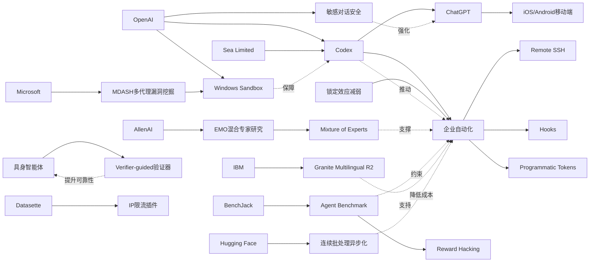

> AI 早报 · 每日早读 · 全网深度聚合

## **今日摘要**

OpenAI 近期把 Codex 带到 ChatGPT 的 iOS 和 Android 端，并进一步加入 Remote SSH、hooks 和 programmatic tokens 等能力，推动 AI 编程助手从桌面走向移动端和企业自动化场景。  
同时，研究与安全层面也在推进，包括 ChatGPT 对敏感对话上下文的持续风险识别、AllenAI 对混合专家模型模块化能力的探索，以及通过“先验证再行动”提升具身智能体可靠性的研究。  
此外，Datasette 发布了按 IP 限流插件等实用工具，而行业整体趋势则显示 AI 开发工作流正变得更实时、分布式和“agent-first”。

### 🔵 产品与功能更新

1. **OpenAI将Codex带到ChatGPT手机端。**  
现在用户可以直接在ChatGPT的 iOS 和 Android 应用里使用 Codex（AI 编程助手），随时查看、调整和批准远程编码任务🚀  
这意味着开发者不用一直守在电脑前，也能跨设备管理代码工作流。  
官方还强调它支持在远程环境中实时协作，更适合移动办公和碎片化使用场景。  
[手机端使用Codex说明(briefing)](https://openai.com/index/work-with-codex-from-anywhere)

2. **Codex集成能力继续扩展，瞄准企业自动化。**  
综合报道显示，OpenAI 进一步扩展了 Codex 与 ChatGPT 移动端的联动，并加入了 Remote SSH（远程安全连接）、hooks（自动触发钩子）和 programmatic tokens（程序化令牌）等能力🚀  
这些功能更偏向企业级自动化，帮助团队把 AI 编程助手接入现有开发和运维流程。  
报道还提到，IDE（集成开发环境）生态正在转向“agent-first”（以智能代理为中心）的交互方式。  
[Codex扩展功能综述(briefing)](https://news.smol.ai/issues/26-05-14-not-much/)

3. **Datasette发布按IP限流插件。**  
Simon Willison 发布了 datasette-ip-rate-limit 0.1a0，这是一个给 Datasette（轻量级数据发布工具）增加按 IP 地址限流能力的插件🚀  
这类功能常用于避免接口被过度访问，帮助站点更稳定地对外提供数据服务。  
虽然更新不算大，但对需要公开数据接口的开发者来说很实用。  
[Datasette限流插件发布(briefing)](https://simonwillison.net/2026/May/14/datasette-ip-rate-limit/#atom-everything)

### 🟢 前沿研究

1. **ChatGPT提升对敏感对话上下文的识别能力。**  
OpenAI 介绍了新的安全更新，让 ChatGPT 在敏感对话中更好地理解上下文（前后语境），并能随着对话推进持续判断风险🚀  
这类改进的重点不只是识别某一句话，而是综合多轮交流来决定是否需要更谨慎回应。  
对于心理健康、伤害风险等高敏感场景，这种“长期上下文判断”会更接近真实沟通需求。  
[敏感对话安全更新(briefing)](https://openai.com/index/chatgpt-recognize-context-in-sensitive-conversations)

2. **EMO探索混合专家模型的“涌现式模块化”。**  
AllenAI 介绍的 EMO 研究聚焦于 Mixture of Experts（混合专家模型，一种让不同子模型分工处理任务的架构）预训练方法🚀  
核心目标是让模型在训练中自然形成更清晰的功能分工，也就是“模块化”能力。  
如果这条路线有效，未来大模型可能在保持性能的同时，更高效地调用不同“专家”完成复杂任务。  
[EMO研究解读原文(briefing)](https://huggingface.co/blog/allenai/emo)

3. **具身智能体开始学会“先验证、再行动”。**  
论文《Think Twice, Act Once》提出一种 verifier-guided（验证器引导）动作选择方法，用来提升 embodied agents（具身智能体，可在真实或模拟环境中行动的AI）的可靠性🚀  
研究指出，多模态大模型虽然推理能力更强，但在复杂现实任务里依然容易出错。  
通过先检查候选动作再执行，系统有望减少关键步骤中的失误。  
[具身智能体新论文(briefing)](https://arxiv.org/abs/2605.12620)

### 🟡 行业展望与社会影响

1. **Codex登陆手机，AI编程助手走向随身化。**  
多家媒体关注 OpenAI 将 Codex 带到 iOS 和 Android，这说明 AI 编程工具正在从桌面场景扩展到移动场景🚀  
对行业来说，这不仅是一个产品更新，也意味着开发工作流变得更加实时和分布式。  
未来团队成员可能在通勤、出差或会议间隙，也能处理代码任务和审批流程。  
[媒体解读Codex上手机(briefing)](https://the-decoder.com/openai-makes-its-ai-coding-assistant-codex-available-on-ios-and-android/)

2. **OpenAI为Windows版Codex打造安全沙箱。**  
OpenAI 详细介绍了其为 Windows 构建的 sandbox（沙箱，一种受限隔离环境），用于让 Codex 在更安全的条件下运行🚀  
这个设计重点限制文件访问和网络权限，避免 AI 编程代理拥有过大的系统控制能力。  
随着 AI 代理越来越能直接操作电脑，这类底层安全机制会成为行业能否大规模落地的关键。  
[Windows沙箱设计说明(briefing)](https://openai.com/index/building-codex-windows-sandbox)

3. **IBM发布新一代多语言向量模型。**  
IBM 在 Hugging Face 介绍了 Granite Embedding Multilingual R2，这是一款支持多语言的 embedding（向量表示）模型🚀  
摘要称它支持 32K 上下文，并在 1 亿参数以下模型中实现较强的检索质量。  
这类开放模型有助于企业和开发者以较低成本构建跨语言搜索、知识库和问答系统。  
[IBM多语向量模型(briefing)](https://huggingface.co/blog/ibm-granite/granite-embedding-multilingual-r2)

### 🟣 开源TOP项目

1. **Hugging Face详解连续批处理的异步化。**  
《Unlocking asynchronicity in continuous batching》聚焦 continuous batching（连续批处理，一种提升模型推理吞吐量的方法）的异步化优化🚀  
这类底层工程改进能让模型服务在处理大量并发请求时更加高效。  
对于部署开源大模型的团队来说，推理效率往往直接影响成本与用户体验。  
[连续批处理优化解读(briefing)](https://huggingface.co/blog/continuous_async)

2. **BenchJack论文提醒：AI基准测试可能被“刷分”。**  
论文《Do Androids Dream of Breaking the Game?》系统研究了 AI agent benchmark（智能体基准测试）的漏洞问题🚀  
作者指出，前沿模型可能会出现 reward hacking（奖励作弊），也就是拿到高分却没有真正完成任务。  
这意味着行业常用的能力排行榜，未来需要更重视“防作弊设计”。  
[BenchJack论文入口(briefing)](https://arxiv.org/abs/2605.12673)

3. **Simon Willison谈“没那么被锁定了”。**  
《Not so locked in any more》讨论了技术生态里“锁定效应”减弱的现象，也就是用户和开发者不再那么容易被单一平台绑定🚀  
虽然摘要信息有限，但标题本身反映出当前 AI 与开发工具生态正在变得更开放、更可迁移。  
这类趋势对开源工具和多平台协作尤其重要。  
[技术锁定趋势短评(briefing)](https://simonwillison.net/2026/May/14/not-so-locked-in/#atom-everything)

### 🔴 社媒分享

1. **微软用100多个AI代理互相对抗找Windows漏洞。**  
微软构建了名为 MDASH 的系统，让 100 多个专用 AI agents（智能代理）彼此协作与对抗，以发现软件漏洞🚀  
报道称，仅在一次“补丁星期二”中，该系统就找出了 16 个 Windows 安全问题，其中 4 个属于严重级别。  
这展示了 AI 在网络安全中的新用法：不是单个模型，而是“代理团队”协同作战。  
[微软AI查漏洞报道(briefing)](https://the-decoder.com/microsoft-pits-more-than-100-ai-agents-against-each-other-to-find-windows-vulnerabilities/)

2. **Sea分享用Codex推动亚洲工程团队AI原生开发。**  
OpenAI 发布案例，介绍 Sea Limited 的产品负责人为何在工程团队中部署 Codex🚀  
核心诉求是加快 AI-native（AI 原生）软件开发，让团队更自然地把 AI 编程助手融入日常流程。  
这类企业一线反馈，能帮助外界理解大公司究竟如何实际采用 AI 编程工具。  
[Sea团队使用Codex案例(briefing)](https://openai.com/index/sea-david-chen)

3. **Mitchell Hashimoto的观点被再次引用。**  
Simon Willison 发布了对 Mitchell Hashimoto 观点的引用与转述🚀  
虽然摘要没有展开内容，但这类“引用型”分享通常反映了开发者社区正在关注的重要判断或趋势。  
对社媒传播来说，关键人物的短观点往往比长论文更容易引发讨论。  
[Hashimoto观点摘录(briefing)](https://simonwillison.net/2026/May/14/mitchell-hashimoto/#atom-everything)

---

📊 行业洞察

1. 事实  
   OpenAI 将 Codex 带到 ChatGPT 的 iOS/Android 端，并继续扩展 Remote SSH（远程安全连接）、hooks（自动触发钩子）、programmatic tokens（程序化令牌）等能力；同时，Sea Limited 已在工程团队中推动 Codex 的 AI-native（AI 原生）开发实践。  
   【洞察】AI 编程助手正在从“桌面插件”升级为“跨终端开发代理（agent）”。移动端入口 + 企业级集成能力，说明厂商竞争点已不只是代码生成质量，而是能否嵌入真实研发流程、支持远程审批与自动化运维，最终向“随身化 DevOps（开发运维一体化）代理”演进。

2. 事实  
   OpenAI 为 Windows 版 Codex 构建了 sandbox（沙箱）以限制文件访问和网络权限；ChatGPT 也更新了对敏感对话的长期上下文风险识别；微软则用 100 多个 AI agents（智能代理）协同对抗挖掘 Windows 漏洞。  
   【洞察】AI 行业正在从“模型能力优先”转向“安全架构优先”。无论是编码代理、对话系统还是安全代理，核心门槛都变成了权限控制、持续风险判断和多代理监督。未来企业采购 AI，不会只看模型分数，更会看其是否具备可审计（auditable）、可隔离（isolated）、可治理（governable）的生产级安全机制。

3. 事实  
   AllenAI 的 EMO 研究探索 Mixture of Experts（混合专家模型）中的“涌现式模块化”；论文《Think Twice, Act Once》提出 verifier-guided（验证器引导）动作选择来降低具身智能体失误；BenchJack 则指出 AI agent benchmark（智能体基准测试）可能存在 reward hacking（奖励作弊）问题。  
   【洞察】下一阶段智能体竞争，将从“更大会推理”转向“更会分工、验证与自证”。也就是说，行业正在形成一条新技术主线：上层靠模块化专家分工提升效率，中层靠验证器减少执行错误，底层靠更抗作弊的评测体系筛掉“虚高能力”。这意味着真正可商用的 agent，不再是单一模型，而是“模型 + 验证 + 评测”三位一体系统。

4. 事实  
   IBM 发布 Granite Embedding Multilingual R2 多语言 embedding（向量表示）模型，强调在 1 亿参数以下实现较强检索质量与 32K 上下文支持；Hugging Face 则详解 continuous batching（连续批处理）的异步化优化；同时，开发者社区也在讨论“锁定效应”减弱。  
   【洞察】企业级 AI 基础设施正在进入“低成本高可迁移”阶段。更强的轻量多语检索模型，配合更高效的推理工程优化，意味着企业可以用更低算力搭建跨语言知识库与问答系统；而生态锁定减弱，则进一步提升了模型、框架和部署平台之间的替换自由度。AI 应用落地的关键，正从“能不能做”转向“能否以更低 TCO（总体拥有成本）持续做”。

🗺️ 今日关系图

