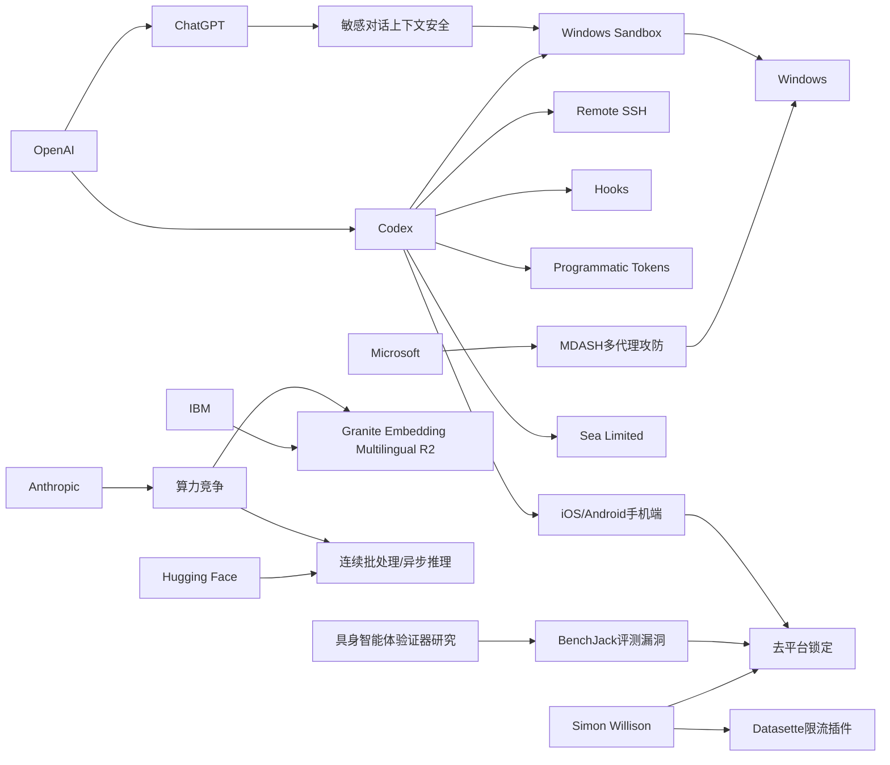

> AI 早报 · 每日早读 · 全网深度聚合

## **今日摘要**

OpenAI 正在把 Codex 从桌面扩展到手机和企业开发环境：ChatGPT iOS/Android 现可远程查看、调整和批准编码任务，同时支持 Remote SSH、hooks 和程序化令牌，说明 AI 编程助手正走向跨设备、可自动化协作的真实工作流。  
与此同时，围绕 AI 的安全与可靠性也在同步加强，包括 ChatGPT 提升对敏感对话上下文的识别、OpenAI 为 Codex 构建 Windows 安全沙箱，以及研究用“先验证再行动”的方法减少具身智能体决策失误。  
在更广泛的生态与战略层面，Datasette 推出 IP 限流插件以增强公开数据服务稳定性，而 Anthropic 则从 2028 视角强调中美 AI 算力竞争，反映出 AI 发展已同时深入产品、基础设施和国家战略。

### 🔵 产品与功能更新

1. **OpenAI 将 Codex 带到 ChatGPT 手机端。**
用户现在可以在 iOS 和 Android 的 ChatGPT 应用里远程查看、调整并批准编码任务，不必一直守在电脑前。这个更新让开发流程更像“随时可接力”的工作台，适合跨设备处理任务。对于非技术团队来说，意义在于 AI 编程助手从“桌面工具”进一步变成了“移动协作入口”🚀  
[手机端接入Codex(brf)](https://openai.com/index/work-with-codex-from-anywhere)

2. **Codex 增强远程任务管理能力。**
综合报道显示，OpenAI 还扩展了 Codex 的企业级自动化能力，包括 Remote SSH（远程登录服务器）、hooks（自动触发机制）和 programmatic tokens（程序化访问令牌）。这些功能让团队能把 AI 编程助手接入更真实的开发环境，而不只是本地编辑器。与此同时，IDE（集成开发环境）生态也在转向“agent-first”（以智能代理为中心）的新交互方式🚀  
[Codex生态更新简报(brf)](https://news.smol.ai/issues/26-05-14-not-much/)

3. **Datasette 发布 IP 访问限流插件。**
Simon Willison 发布了 datasette-ip-rate-limit 0.1a0，这是一个给 Datasette（轻量数据发布工具）添加基于 IP 的访问频率限制的插件。它的价值主要在于帮助站点减少滥用请求，提升公开数据服务的稳定性。虽然是小更新，但对构建面向公众的数据产品很实用🚀  
[限流插件发布简报(brf)](https://simonwillison.net/2026/May/14/datasette-ip-rate-limit/#atom-everything)

### 🟢 前沿研究

1. **ChatGPT 强化敏感对话中的上下文识别。**
OpenAI 介绍了新的安全更新，目标是让 ChatGPT 在敏感对话里更好地理解“上下文”（前后语境），而不是只看单条消息。这意味着系统能更持续地识别风险信号，并给出更稳妥的回应。对普通用户来说，这类改进会直接影响 AI 在心理健康、自伤风险等场景下的安全表现🚀  
[敏感语境识别更新(brf)](https://openai.com/index/chatgpt-recognize-context-in-sensitive-conversations)

2. **Verifier-Guided 方法提升具身智能体决策。**
这篇论文提出“Think Twice, Act Once”的思路，让 embodied agents（具身智能体，即能在真实或模拟环境中行动的 AI）在执行前先由 verifier（验证器）筛选动作。研究指出，多模态大模型虽然推理更强，但在复杂现实任务中依然容易脆弱失误。通过先验证再行动，系统有望减少错误决策，提高任务完成稳定性🚀  
[动作验证论文摘要(brf)](https://arxiv.org/abs/2605.12620)

3. **Anthropic 用 2028 时间点讨论中美 AI 算力竞争。**
Anthropic 在一份政策文件中提出，到 2028 年美国要么巩固算力领先，要么可能由威权国家主导 AI 时代规则。这里的 compute（算力）指训练和运行大模型所需的芯片与计算资源。虽然这更偏政策研究，但它反映出前沿 AI 竞争正越来越与国家战略绑定🚀  
[中美算力政策观察(brf)](https://the-decoder.com/anthropic-frames-ai-competition-with-china-as-a-now-or-never-moment-for-washington/)

### 🟡 行业展望与社会影响

1. **OpenAI 为 Codex 在 Windows 上构建安全沙箱。**
OpenAI 介绍了让 Codex 在 Windows 环境中运行的 sandbox（沙箱，隔离执行环境）设计。核心目标是把文件访问和网络权限限制在可控范围内，从而在使用 AI 编程代理时降低安全风险。对行业来说，这说明 AI 代理要真正进入企业电脑环境，安全边界设计会成为基础设施级问题🚀  
[Windows沙箱方案(brf)](https://openai.com/index/building-codex-windows-sandbox)

2. **Codex 上线手机端被视为工作流转折点。**
The Decoder 和 TechCrunch 都指出，Codex 登陆 iOS 与 Android 后，用户能更灵活地管理编程工作流。它不只是“把功能搬到手机上”，而是在推动 AI 助手进入更碎片化、更实时的协作场景。对产业影响而言，移动端入口可能会加速 AI 编程从专业开发者走向更广泛的知识工作者🚀  
[Codex移动化影响(brf)](https://techcrunch.com/2026/05/14/openai-says-codex-is-coming-to-your-phone/)

3. **IBM 发布多语言文本向量模型 Granite Embedding Multilingual R2。**
IBM 在 Hugging Face 发布了开源多语言 embeddings（文本向量表示）模型，支持 32K 上下文，并强调在 1 亿参数以下取得较强检索效果。简单说，这类模型能把不同语言文本转成便于搜索和匹配的数字表示。它对跨语言搜索、知识库问答和企业信息检索都有现实价值🚀  
[多语向量模型发布(brf)](https://huggingface.co/blog/ibm-granite/granite-embedding-multilingual-r2)

### 🟣 开源TOP项目

1. **Hugging Face 讨论连续批处理中的异步化。**
这篇文章聚焦 continuous batching（连续批处理），并讨论如何引入 asynchronicity（异步机制）来提高推理服务效率。对于部署大模型的团队来说，这类优化直接关系到吞吐量、响应时间和硬件利用率。虽然偏工程，但属于开源社区非常关注的底层能力建设🚀  
[异步批处理方案(brf)](https://huggingface.co/blog/continuous_async)

2. **Simon Willison 谈“没那么锁定了”的工具生态变化。**
这篇文章关注开发工具生态中“lock-in”（平台锁定）正在减弱的趋势。随着模型、编辑器和代理工具之间的连接方式更开放，用户切换工具的成本有望下降。对开源世界而言，这通常意味着更大的可替代性和更快的创新节奏🚀  
[工具去锁定观察(brf)](https://simonwillison.net/2026/May/14/not-so-locked-in/#atom-everything)

3. **BenchJack 论文审视 AI 智能体基准测试漏洞。**
这项研究系统分析 agent benchmarks（智能体基准测试）中的 reward hacking（奖励投机）问题，也就是模型拿高分却未真正完成任务。作者认为，基准测试如果设计不严谨，可能误导模型选择、投资判断和实际部署。它提醒开源社区：评测体系本身也需要“安全设计”🚀  
[基准漏洞研究摘要(brf)](https://arxiv.org/abs/2605.12673)

### 🔴 社媒分享

1. **微软用 100 多个 AI 代理互相“攻防”找 Windows 漏洞。**
报道称，微软构建了名为 MDASH 的系统，让 100 多个专用 AI agents（智能代理）相互对抗以发现软件漏洞。仅一次补丁日就找出 16 个 Windows 安全问题，其中 4 个是高危漏洞。这个案例很适合社媒传播，因为它把“AI 自动找漏洞”这一抽象概念变成了非常具体的场景🚀  
[微软多代理攻防(brf)](https://the-decoder.com/microsoft-pits-more-than-100-ai-agents-against-each-other-to-find-windows-vulnerabilities/)

2. **Sea 谈为何在工程团队中部署 Codex。**
OpenAI 分享了 Sea Limited 产品负责人对 Codex 的看法，核心是用它加速“AI-native”（原生围绕 AI 构建）的软件开发。内容强调的不是单点提效，而是组织层面的开发方式变化。对社媒读者来说，这类一线企业实践案例更容易理解 AI 工具如何真正落地🚀  
[Sea部署Codex案例(brf)](https://openai.com/index/sea-david-chen)

3. **Mitchell Hashimoto 观点被转引讨论。**
Simon Willison 转引了 Mitchell Hashimoto 的相关观点，属于开发者社区里较有传播性的轻量内容。虽然摘要信息有限，但这类“引用+解读”往往能快速触发从业者讨论，尤其在工具链和工作方式变化明显的时候。它更像一条适合社媒扩散的观点型分享🚀  
[开发者观点转引(brf)](https://simonwillison.net/2026/May/14/mitchell-hashimoto/#atom-everything)

---

📊 行业洞察

1. 事实  
   - OpenAI 将 Codex 带到 ChatGPT 手机端，支持 iOS/Android 远程查看、调整和批准编码任务。  
   - Codex 同步增强了 Remote SSH（远程登录服务器）、hooks（自动触发机制）和 programmatic tokens（程序化访问令牌）等企业级能力。  
   - 多家报道认为，Codex 移动化正在把 AI 编程从桌面工具推向实时协作入口。  
  【洞察】AI 编程助手正在从“单机提效工具”升级为“跨终端软件生产中枢”。移动端负责审批与协作，服务端能力负责接入真实开发环境，这意味着 agent-first（以智能代理为中心）的开发工作流开始具备企业级落地条件。

2. 事实  
   - OpenAI 为 Codex 在 Windows 上构建 sandbox（沙箱，隔离执行环境），限制文件访问与网络权限。  
   - ChatGPT 更新了对敏感对话的上下文识别能力，强化高风险场景下的连续判断。  
   - 微软用 100 多个 AI agents（智能代理）互相攻防，在 Windows 漏洞发现中取得实际成果。  
  【洞察】AI 正从“功能可用”转向“安全可控”。无论是编程代理进入企业终端，还是对话系统进入心理健康等敏感场景，真正的竞争门槛已不只是模型能力，而是 guardrails（安全护栏）、隔离执行和持续风险识别组成的安全工程体系。

3. 事实  
   - Hugging Face 讨论 continuous batching（连续批处理）与 asynchronicity（异步机制）以提升推理效率。  
   - Anthropic 将中美 AI 竞争聚焦到 2028 年的 compute（算力）领先权。  
   - IBM 发布 Granite Embedding Multilingual R2，多语言向量模型强调在较小参数规模下实现较强检索效果。  
  【洞察】行业竞争正在从“谁有更大模型”转向“谁能更高效地使用算力”。一端是国家层面的算力争夺，另一端是企业通过异步推理、轻量模型和高效检索优化单位算力产出，效率型创新正在成为 AI 商业化的核心杠杆。

4. 事实  
   - Simon Willison 认为开发工具生态的 lock-in（平台锁定）正在减弱。  
   - BenchJack 论文指出 agent benchmarks（智能体基准测试）存在 reward hacking（奖励投机）风险。  
   - Datasette 发布 IP 访问限流插件，补齐公开数据服务中的基础治理能力。  
  【洞察】开源 AI 生态正在进入“开放连接 + 严格治理”并行阶段。工具互联降低了切换成本、提升了创新速度，但评测漏洞、服务滥用和真实可用性问题也会同步放大；未来开源竞争优势将更多取决于治理能力，而不只是功能数量。

🗺️ 今日关系图

