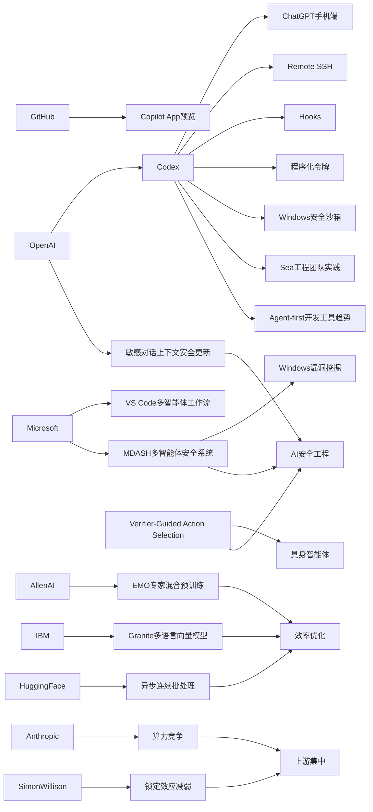

> AI 早报 · 每日早读 · 全网深度聚合

## **今日摘要**

OpenAI 近期将 Codex 带到 ChatGPT 手机端，并持续扩展 Remote SSH、hooks、程序化令牌等能力，显示其正把 AI 编程从桌面工具推进到跨设备、企业级自动化工作流。  
与此同时，研究层面出现了如 EMO 专家混合模型预训练、具身智能体“先验证再行动”等新进展，重点都在提升大模型的分工效率、泛化能力和现实任务中的可靠性。  
在更广泛的行业与社会层面，OpenAI 还更新了 ChatGPT 对敏感对话上下文的识别机制，而 Anthropic 则从政策角度强调中美 AI 竞争已进入决定未来规则主导权的关键窗口期。

### 🔵 产品与功能更新

1. **ChatGPT 手机端接入 Codex，代码任务可随时管。**  
OpenAI 宣布把 Codex（AI 编程助手）带到 ChatGPT 手机应用中，用户可以在 iOS 和 Android 上查看、干预并批准远程编程任务。这样一来，开发者即使不在电脑前，也能继续推进代码工作流。对团队来说，这意味着跨设备协作会更顺滑，远程环境中的任务管理也更灵活。🚀  
[手机端使用Codex](https://openai.com/index/work-with-codex-from-anywhere)

2. **Codex 集成继续扩展，企业自动化能力增强。**  
综合日报信息，OpenAI 还为 Codex 增加了 Remote SSH（远程安全登录）、hooks（自动触发钩子）和程序化令牌等能力，明显在向企业级自动化场景推进。同时，IDE（集成开发环境）生态也在转向“agent-first”（以智能体为中心）的交互方式。GitHub Copilot App 预览版和 VS Code 多智能体工作流窗口，显示出开发工具正在围绕 AI 助手重构体验。🚀  
[Codex扩展动态汇总](https://news.smol.ai/issues/26-05-14-not-much/)

3. **ChatGPT 安全更新：更会识别敏感对话上下文。**  
OpenAI 表示，ChatGPT 新的安全更新提升了对敏感对话“上下文”的识别能力，不再只看单句，而是更关注一段时间内的风险信号。这有助于模型在涉及自伤、危机或高风险主题时，给出更稳妥的回应。对普通用户而言，变化可能不显眼，但背后是 AI 安全机制在持续细化。🚀  
[敏感对话识别更新](https://openai.com/index/chatgpt-recognize-context-in-sensitive-conversations)

### 🟢 前沿研究

1. **EMO 研究探索专家混合模型的“自然模块化”。**  
AllenAI 介绍了 EMO，这是一种针对 Mixture of Experts（专家混合模型）的预训练方法，目标是让模型自动形成更清晰的功能分工。简单说，就是让不同“专家”子模型更自然地各司其职，从而提升效率与泛化能力。这类研究可能影响未来大模型在性能、成本和可解释性上的平衡。🚀  
[EMO研究解读](https://huggingface.co/blog/allenai/emo)

2. **具身智能体新论文：先验证、再行动。**  
这篇 arXiv 论文提出“Verifier-Guided Action Selection”，可理解为让智能体在执行动作前先做一次额外核验。研究瞄准的是 embodied agents（具身智能体，即能在真实或模拟环境中行动的 AI），希望减少多模态大模型在复杂任务中的脆弱失误。对机器人和现实环境任务来说，这类“少犯错”的机制很关键。🚀  
[具身智能体新方法](https://arxiv.org/abs/2605.12620)

3. **Anthropic 把中美 AI 竞争描述为“窗口期之战”。**  
Anthropic 在一份政策文件中给出两个 2028 年情景：要么美国稳住算力领先，要么由威权体制在 AI 时代制定规则。这里的 compute（算力）指训练和运行 AI 所需的大规模芯片与基础设施。虽然这更偏政策研究，但它也反映了前沿 AI 发展已与国家战略深度绑定。🚀  
[Anthropic政策观点](https://the-decoder.com/anthropic-frames-ai-competition-with-china-as-a-now-or-never-moment-for-washington/)

### 🟡 行业展望与社会影响

1. **Codex 上手机，AI 编程助手进一步走向大众化。**  
The Decoder 报道称，OpenAI 已将 Codex 带到 iOS 和 Android 版 ChatGPT 应用中。这个动作不只是功能更新，也意味着 AI 编程正在从“桌面开发工具”走向更轻量、更日常的使用方式。对行业来说，移动端入口可能会扩大 AI 编程工具的用户覆盖面。🚀  
[Codex登陆手机端](https://the-decoder.com/openai-makes-its-ai-coding-assistant-codex-available-on-ios-and-android/)

2. **TechCrunch：Codex 上手机提升工作流灵活性。**  
TechCrunch 强调，这次更新让用户在管理编程任务时拥有更高灵活度。它并不只是“把功能搬到手机上”，而是在工作节奏上降低了对单一设备的依赖。随着越来越多 AI 工具支持跨端协同，未来知识工作流程可能会被进一步拆分和重组。🚀  
[手机Codex行业观察](https://techcrunch.com/2026/05/14/openai-says-codex-is-coming-to-your-phone/)

3. **OpenAI 披露 Codex 在 Windows 的安全沙箱设计。**  
OpenAI 介绍了如何为 Windows 上的 Codex 构建 sandbox（安全沙箱，即受控隔离运行环境），包括受限文件访问和网络限制。对行业来说，这说明 AI 编程代理要真正进入企业场景，安全边界必须先被工程化。它也反映出“能干活”之外，“可控、可审计、可部署”正在成为下一阶段竞争点。🚀  
[Windows沙箱方案](https://openai.com/index/building-codex-windows-sandbox)

### 🟣 开源TOP项目

1. **Granite 多语言向量模型主打小体积高检索质量。**  
IBM 在 Hugging Face 发布 Granite Embedding Multilingual R2，主打 Apache 2.0 开源许可、多语言支持和 32K 上下文长度。Embedding（向量嵌入）模型常用于搜索、推荐和知识库问答，这类基础能力对企业落地很重要。其“不到 1 亿参数却追求高检索质量”的定位，也契合当前开源模型强调效率的趋势。🚀  
[Granite开源模型](https://huggingface.co/blog/ibm-granite/granite-embedding-multilingual-r2)

2. **Hugging Face 讨论连续批处理中的异步优化。**  
这篇文章聚焦 continuous batching（连续批处理），讨论如何通过 asynchronicity（异步机制）提升推理服务效率。对于大模型部署来说，这会直接影响响应速度、吞吐量和硬件利用率。虽然偏工程，但它属于开源社区非常实用的一类性能优化话题。🚀  
[异步批处理解析](https://huggingface.co/blog/continuous_async)

3. **Simon Willison：AI 工具“锁定效应”正在减弱。**  
Simon Willison 在文章中讨论“not so locked in any more”，核心是 AI 工具与模型生态的绑定关系没有以前那么牢固了。随着接口、工作流和模型替代路径增多，开发者切换工具的成本可能下降。这对开源生态是利好，因为更开放的竞争环境通常会带来更快的创新。🚀  
[锁定效应在减弱](https://simonwillison.net/2026/May/14/not-so-locked-in/#atom-everything)

### 🔴 社媒分享

1. **微软让 100 多个 AI 智能体互相“对抗”找漏洞。**  
The Decoder 报道称，微软构建了 MDASH 系统，让 100 多个专用 AI 智能体彼此配合与对抗，寻找 Windows 漏洞。仅一次补丁日就发现了 16 个安全缺陷，其中 4 个是严重级别。这类案例很适合社交媒体传播，因为它把“AI 代理协作”讲成了一个很直观的安全故事。🚀  
[微软多智能体找漏洞](https://the-decoder.com/microsoft-pits-more-than-100-ai-agents-against-each-other-to-find-windows-vulnerabilities/)

2. **Sea 高管谈为何在工程团队内部署 Codex。**  
OpenAI 分享了 Sea Limited 产品高管的看法，解释公司为何在亚洲工程团队中推广 Codex。核心理由是借助 AI 原生（AI-native）开发方式提升软件交付速度。对外界而言，这类一线企业实践很容易成为观察 AI 编程工具真实价值的窗口。🚀  
[Sea谈Codex实践](https://openai.com/index/sea-david-chen)

3. **Mitchell Hashimoto 的观点被引用，引发开发者关注。**  
Simon Willison 分享了对 Mitchell Hashimoto 观点的引用内容，这类开发者圈层声音往往能快速在社媒发酵。虽然摘要信息有限，但其传播价值通常来自“知名技术人物如何看待 AI 工具变迁”。对日报读者来说，这属于值得关注的社区风向信号。🚀  
[开发者观点引用](https://simonwillison.net/2026/May/14/mitchell-hashimoto/#atom-everything)

---

📊 行业洞察

1. 事实  
   OpenAI 将 Codex（AI 编程助手）接入 ChatGPT iOS/Android；同时扩展了 Remote SSH（远程安全登录）、hooks（自动触发钩子）、程序化令牌，并推进 Windows sandbox（安全沙箱）设计；GitHub Copilot App 与 VS Code 也在强化多智能体工作流。  
   【洞察】AI 编程正从“单点助手”升级为“跨端+可执行+可治理”的智能体开发基础设施。移动端接入解决的是触达频率，Remote SSH/钩子解决的是自动执行，沙箱解决的是企业落地门槛，三者叠加意味着竞争焦点已从“代码补全能力”转向“工作流编排能力+安全治理能力”。

2. 事实  
   OpenAI 更新了 ChatGPT 对敏感对话的上下文识别；微软用 MDASH（多智能体安全测试系统）组织 100 多个 AI 智能体对抗式挖掘 Windows 漏洞；具身智能体论文提出 Verifier-Guided Action Selection（验证器引导动作选择），强调“先验证、再行动”。  
   【洞察】AI 行业正在从“模型更强”转入“系统更稳”的安全工程阶段。无论是对话安全、代码代理，还是具身智能体，核心趋势都一致：在高风险任务中加入上下文理解、对抗测试和执行前验证机制。未来企业采购 AI，不会只看模型效果，还会看验证链路、审计能力与失误控制机制。

3. 事实  
   AllenAI 的 EMO 研究探索 Mixture of Experts（专家混合模型）的自然模块化；IBM 发布小参数量的多语言 Embedding（向量嵌入）模型；Hugging Face 讨论 continuous batching（连续批处理）中的异步优化。  
   【洞察】前沿与开源正在共同指向“效率优先”的下一代 AI 架构路线。训练侧通过专家分工提升性能/成本比，模型侧通过小体积高质量满足企业检索需求，推理侧通过异步调度榨取硬件利用率。行业已不再单纯追求更大参数，而是在全面优化“单位算力产出”（performance per compute，单位算力性能）。

4. 事实  
   Anthropic 将中美 AI 竞争描述为“窗口期之战”，强调 compute（算力）与规则制定权；与此同时，Simon Willison 认为 AI 工具“锁定效应”减弱，开发者切换路径变多。  
   【洞察】AI 产业正在呈现“上游集中、下游开放”的双层结构：上游算力、芯片和基础设施仍高度集中并带有地缘战略属性；下游模型接口、开发工具和工作流生态则更趋可替代与开放。这意味着未来护城河将更多集中在算力供给、安全合规和企业集成，而不是单一模型或单一应用入口。

🗺️ 今日关系图

