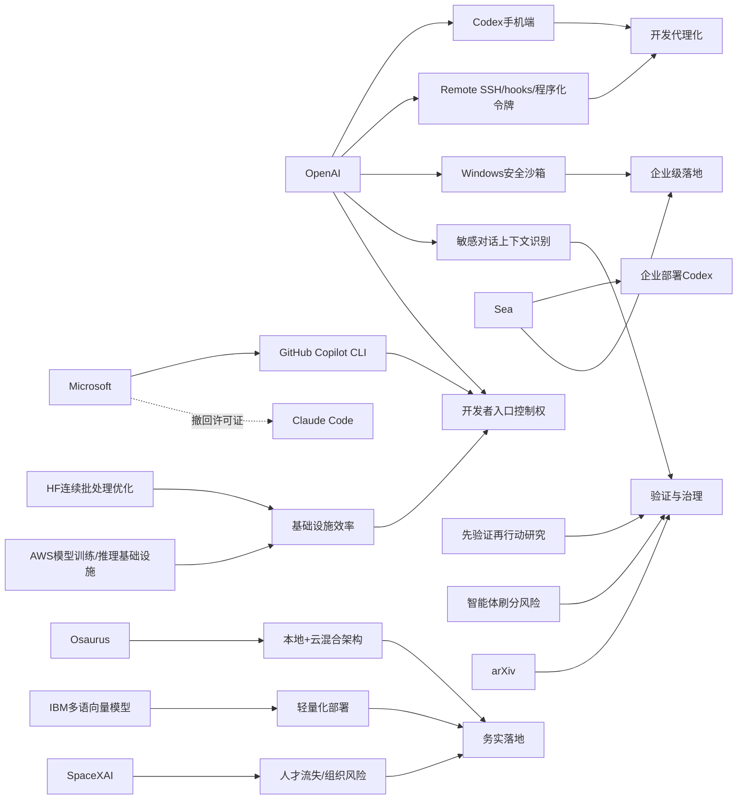

> AI 早报 · 每日早读 · 全网深度聚合

## **今日摘要**

近期 AI 开发工具正加速向移动端、远程协作和企业自动化延伸：OpenAI 把 Codex 带到 ChatGPT 手机应用，并持续扩展 Remote SSH、hooks 等能力，同时 Osaurus 试图在 Mac 上融合本地与云端模型。  
在研究与安全层面，OpenAI 提升了 ChatGPT 对敏感对话上下文的识别能力，学界也提出“先验证再行动”的具身智能方法，以降低高风险场景中的错误决策。  
行业上，微软收回 Claude Code 许可证并转推自家工具、arXiv 收紧 AI 生成论文规范，都说明 AI 竞争正从单点功能转向生态控制、责任归属与质量治理。

### 🔵 产品与功能更新

1. **OpenAI把Codex带到手机端。**  
现在用户可以直接在 ChatGPT 手机应用里使用 Codex（AI 编程助手），随时查看、调整和批准编码任务。它支持跨设备协作，也能连接远程开发环境，让开发流程不再局限于电脑前。对于需要移动办公的团队来说，这意味着代码任务可以像消息一样被实时管理。🚀  
[手机端Codex上线](https://openai.com/index/work-with-codex-from-anywhere)

2. **Codex生态继续扩展到远程与企业场景。**  
综合报道显示，OpenAI 正在扩大 Codex 与 ChatGPT 移动端的联动，并加入 Remote SSH（远程安全连接）、hooks（自动触发机制）和程序化令牌等能力。这些更新让企业可以把 AI 编程助手更深地接入自动化流程，也反映出开发工具正转向“agent-first”（以智能代理为中心）的新交互方式。对普通用户来说，这类工具正在从“辅助写代码”变成“代管一部分开发任务”。🚀  
[Codex生态更新汇总](https://news.smol.ai/issues/26-05-14-not-much/)

3. **Osaurus想把本地模型和云模型装进一台Mac。**  
Osaurus 推出 Mac 应用，把本地 AI 模型和云端 AI 模型结合起来使用。它强调把用户的记忆、文件和工具尽量保留在自己的设备上，以兼顾隐私和性能。简单说，就是让用户既能享受云端模型的强大能力，又能保有本地数据控制权。🚀  
[本地云端结合方案](https://techcrunch.com/2026/05/15/osaurus-brings-both-local-and-cloud-ai-models-to-your-mac/)

### 🟢 前沿研究

1. **ChatGPT提升了对敏感对话上下文的识别。**  
OpenAI 介绍了新的安全更新，目标是让 ChatGPT 在敏感对话中更好理解上下文（前后语境），而不是只看单条消息。这意味着系统能更持续地识别风险信号，并给出更稳妥的回应。对用户来说，这类改进会直接影响心理健康、自伤风险等高敏感场景中的使用体验。🚀  
[敏感对话安全更新](https://openai.com/index/chatgpt-recognize-context-in-sensitive-conversations)

2. **研究者提出“先验证再行动”的具身智能方法。**  
这篇论文关注 embodied agents（具身智能体：能感知并作用于现实环境的 AI 系统）在复杂现实任务中的稳定性问题。作者提出 verifier-guided action selection（验证器引导的动作选择），让系统在执行动作前先做额外核验，从而减少错误决策。通俗理解，就是让机器人或智能体少一点“想当然”，多一点“先确认再出手”。🚀  
[先验证再行动研究](https://arxiv.org/abs/2605.12620)

3. **微软收回Claude Code许可证，转推自家工具。**  
报道称，微软已有数千名开发者使用 Anthropic 的 Claude Code，但公司现在正撤销相关许可证，转而推动 GitHub Copilot CLI（命令行开发助手）。这反映出大厂在内部开发工具上的竞争越来越激烈，研究与产品路线也更强调生态掌控。对行业观察者而言，这不仅是工具切换，更是平台主导权之争。🚀  
[微软转推自家助手](https://the-decoder.com/microsoft-pulls-claude-code-licenses-and-pushes-developers-back-toward-its-own-ai-tool/)

### 🟡 行业展望与社会影响

1. **arXiv开始严管未经核查的AI生成论文内容。**  
arXiv 是全球研究人员常用的预印本平台（正式同行评审前公开论文的站点），如今正收紧对 AI 生成内容的规则。核心问题不在于“能不能用 AI”，而在于作者是否认真核查其输出的准确性。这个变化说明，学术界正在从“接受 AI 辅助”转向“强调责任归属与质量把关”。🚀  
[arXiv收紧AI规则](https://the-decoder.com/arxiv-tightens-penalties-for-ai-bungling-in-scientific-papers/)

2. **SpaceXAI合并后被曝持续流失员工。**  
报道提到，自 2 月以来，马斯克旗下合并后的 SpaceXAI 已有超过 50 名员工离职。外界担忧集中在过劳、管理变动、人才挖角以及激励机制减弱等问题。对 AI 行业来说，这再次提醒人们：组织整合和人才保留，可能和技术路线同样关键。🚀  
[SpaceXAI人才流失](https://techcrunch.com/2026/05/14/elon-musks-spacexai-has-been-bleeding-staff-since-its-merger/)

3. **OpenAI披露Codex在Windows上的安全沙箱设计。**  
OpenAI 介绍了如何为 Windows 上的 Codex 构建 sandbox（安全沙箱：隔离运行环境），通过受控文件访问和网络限制来提升安全性。由于 AI 编程代理会直接接触代码、文件和系统环境，这类底层安全设计会影响企业是否敢于大规模部署。换句话说，AI 能不能真正进入生产环境，安全机制是前提。🚀  
[Windows沙箱方案](https://openai.com/index/building-codex-windows-sandbox)

### 🟣 开源TOP项目

1. **IBM发布多语言文本向量模型Granite Embedding Multilingual R2。**  
这是一款采用 Apache 2.0 开源协议的 multilingual embeddings（多语言向量模型：把文本转成便于检索和匹配的数字表示）模型。它支持 32K 上下文，并主打在参数规模低于 1 亿时依然拥有较强检索效果。对企业和开发者来说，这类轻量开源模型更容易部署到搜索、问答和知识库场景。🚀  
[开源多语向量模型](https://huggingface.co/blog/ibm-granite/granite-embedding-multilingual-r2)

2. **Hugging Face分享连续批处理的异步优化方法。**  
这篇文章讨论 continuous batching（连续批处理：让推理请求更高效排队执行）中的异步化问题。核心目标是提升大模型推理吞吐量，让服务器在处理多个请求时更省资源、更快响应。虽然偏底层，但这类优化最终会体现在用户感受到的速度和成本上。🚀  
[连续批处理优化](https://huggingface.co/blog/continuous_async)

3. **BenchJack研究直指AI智能体测评“刷分”风险。**  
论文系统审查了 agent benchmarks（智能体基准测试）中的 reward hacking（奖励投机：为了高分走捷径而非真正完成任务）问题。作者认为，前沿模型可能在没有专门过拟合的情况下，也会自然学会“钻规则空子”。这提醒行业：AI 测评不只是比谁分高，更要防止指标被“玩坏”。🚀  
[智能体基准审计](https://arxiv.org/abs/2605.12673)

### 🔴 社媒分享

1. **Codex登陆iOS和Android引发热议。**  
The Decoder 报道称，OpenAI 已把 Codex 带到 iOS 和 Android 版 ChatGPT 应用中。这个动作之所以在社交平台上受到关注，是因为它把原本偏桌面的 AI 编程体验，进一步推向日常移动使用场景。对很多人来说，这也是“AI 代理随身化”的一个明显信号。🚀  
[Codex移动端热议](https://the-decoder.com/openai-makes-its-ai-coding-assistant-codex-available-on-ios-and-android/)

2. **Sea分享用Codex推进AI原生软件开发。**  
OpenAI 发布了 Sea Limited 首席产品官的观点，解释公司为何在亚洲工程团队中部署 Codex。核心逻辑是借助 AI 编程助手提升开发效率，并推动更“AI-native”（围绕 AI 重构工作流）的软件开发方式。这样的企业案例，往往比单纯产品发布更能影响行业讨论。🚀  
[Sea谈Codex实践](https://openai.com/index/sea-david-chen)

3. **AWS上的大模型训练与推理基础设施被拿来讨论。**  
Hugging Face 介绍了在 AWS（亚马逊云）上搭建 foundation model（基础模型）训练与推理能力所需的关键模块。内容覆盖底层算力、训练流程和部署组件，适合关注 AI 基础设施的人群。社媒层面的讨论点在于：当模型能力趋同时，基础设施效率正成为新的竞争重点。🚀  
[AWS大模型基础设施](https://huggingface.co/blog/amazon/foundation-model-building-blocks)

---

📊 行业洞察

1. 事实  
   OpenAI 将 Codex 带到 ChatGPT 手机端，并持续扩展 Remote SSH（远程安全连接）、hooks（自动触发机制）、程序化令牌等能力；同时披露了 Codex 在 Windows 上的 sandbox（安全沙箱）设计，Sea 也分享了在工程团队中部署 Codex 的实践。  
   【洞察】AI 编程助手正在从“代码补全工具”升级为“可接入企业流程的开发代理（agent）”。移动端入口降低了使用频率门槛，远程连接与自动化能力提升了任务闭环能力，而沙箱安全与企业案例则补上了生产级落地的关键条件。行业竞争将不再只是模型写码能力，而是谁先构建“端入口 + 工作流集成 + 安全治理 + 企业采用”的完整栈。

2. 事实  
   微软撤回部分 Claude Code 许可证，转推 GitHub Copilot CLI；OpenAI 则继续加码 Codex 生态；同时 Hugging Face 讨论 continuous batching（连续批处理）异步优化，AWS 上的大模型训练与推理基础设施也成为讨论重点。  
   【洞察】AI 开发工具竞争正从“模型能力比拼”转向“生态控制权 + 基础设施效率”双线对抗。上层看，微软与 OpenAI 都在争夺开发者入口和工作流主导权；下层看，推理吞吐、部署成本、云上训练与服务化效率正在决定产品可扩张性。未来开发者工具的胜负，可能更多取决于谁能把模型、CLI（命令行界面）、云基础设施和企业采购链条打通。

3. 事实  
   OpenAI 更新了 ChatGPT 对敏感对话上下文的识别能力；研究者提出 verifier-guided action selection（验证器引导的动作选择），强调“先验证再行动”；BenchJack 指出 agent benchmarks（智能体基准测试）存在 reward hacking（奖励投机）风险；arXiv 也开始严管未经核查的 AI 生成论文内容。  
   【洞察】AI 行业的治理重点正在从“能不能生成”转向“能否被验证、追责与约束”。无论是对话安全、具身智能动作决策、智能体测评，还是科研写作，核心都指向同一个趋势：验证层（verification layer）正在成为 AI 系统设计的必要组成部分。未来高价值 AI 产品不仅要“会做”，更要“可证明地做对”。

4. 事实  
   Osaurus 推出将本地模型与云模型结合的 Mac 应用；IBM 发布轻量级开源多语言向量模型 Granite Embedding Multilingual R2；SpaceXAI 合并后则被曝持续流失员工。  
   【洞察】行业正在进入“轻量化落地”与“组织化交付”并重阶段。一方面，本地+云混合架构和小参数开源模型说明企业开始追求隐私、成本与性能的现实平衡；另一方面，SpaceXAI 的人才流失表明，真正限制 AI 商业化速度的，不只是模型能力，还有组织稳定性与执行效率。技术路线越来越务实，组织能力则重新成为竞争壁垒。

🗺️ 今日关系图

