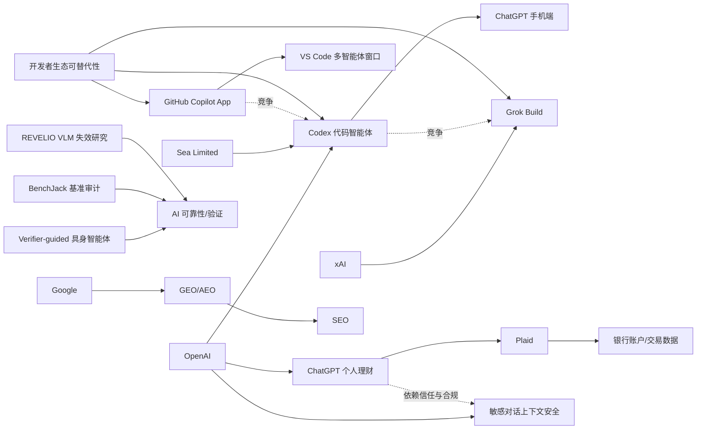

> AI 早报 · 每日早读 · 全网深度聚合

## **今日摘要**

OpenAI 正在把 Codex 从电脑端扩展到手机和企业工作流中，支持远程查看、审批和管理编程任务，Sea 等大公司也开始大规模部署，显示 AI 编码正走向“智能体优先”的团队级开发模式。  
研究方面，谷歌认为 AI 搜索优化并不需要抛弃传统 SEO，另一方面具身智能体的“先验证再行动”和混合专家模型的模块化研究，则在提升 AI 的可靠性与效率。  
在行业应用上，ChatGPT 开始试水个人理财助手，通过连接银行账户提供消费和资产分析，反映出 AI 助手正从聊天工具升级为更深入的个人运营与决策支持平台。

### 🔵 产品与功能更新

1. **OpenAI把Codex带到ChatGPT手机端。**  
用户现在可以在手机上远程查看、管理和批准 Codex（代码智能体）的编程任务，不必一直守在电脑前。更新还加入了 Remote SSH（远程安全登录）、hooks（自动触发钩子）和 programmatic tokens（程序化访问令牌），方便企业把 AI 编码接入现有流程。摘要还提到，GitHub Copilot App 预览版和 VS Code 的多智能体工作窗口，说明开发工具正转向“agent-first（以智能体为中心）”体验。🚀  
[移动端Codex更新简报](https://news.smol.ai/issues/26-05-14-not-much/)

2. **Sea大规模部署Codex推进AI原生开发。**  
Sea Limited 的产品负责人表示，公司正在把 Codex 部署到工程团队中，以加快软件开发效率。重点不只是“写代码更快”，而是让团队逐步适应 AI-native（AI 原生）开发方式，把 AI 直接嵌入日常工程协作。这个案例也显示，亚洲大型互联网公司正把代码智能体从试点工具推进到团队级应用。🚀  
[Sea采用Codex案例](https://openai.com/index/sea-david-chen)

3. **ChatGPT手机端支持随时处理Codex任务。**  
OpenAI 官方进一步说明，用户可以“从任何地方”使用 Codex，在不同设备和远程环境中实时监控、调整并批准编码任务。这意味着代码生成不再局限于本地电脑，而是更像一种持续运行的远程工作流（自动化任务流程）。对经常移动办公的开发者和管理者来说，这会提升任务跟进的灵活性。🚀  
[Codex跨设备工作](https://openai.com/index/work-with-codex-from-anywhere)

### 🟢 前沿研究

1. **谷歌称AI搜索不需要一套全新SEO。**  
谷歌最新文档指出，所谓 GEO（生成式引擎优化）和 AEO（答案引擎优化）并不是全新玩法，本质上仍然建立在传统 SEO（搜索引擎优化）规则之上。它还点名淡化了 LLMS.txt 和内容切块等流行做法的重要性，强调 AI 搜索仍依赖原有排序系统。对内容团队来说，这意味着与其追逐新名词，不如继续做好高质量内容和站点基础建设。🚀  
[谷歌谈AI搜索优化](https://the-decoder.com/google-busts-the-myth-that-ai-search-needs-its-own-seo-playbook/)

2. **具身智能体开始学会“先验证再行动”。**  
这篇论文提出一种 verifier-guided（验证器引导）动作选择方法，让 embodied agents（具身智能体）在执行复杂现实任务前先检查候选动作是否更可靠。研究者指出，多模态大模型虽然推理能力增强，但在真实环境中仍容易脆弱失误。新方法的目标是减少“想得对、做得错”的情况，让机器人或可执行智能体更稳健。🚀  
[具身智能体验证研究](https://arxiv.org/abs/2605.12620)

3. **EMO探索混合专家模型的模块化能力。**  
AllenAI 发布的 EMO 研究聚焦 mixture of experts（混合专家模型）预训练，试图让模型自然形成更清晰的模块分工。所谓“涌现模块化”，就是不同专家子网络在训练中逐渐擅长不同类型任务，而不是所有能力都混在一起。这样的方向有望提升模型效率、可扩展性和后续分析能力。🚀  
[EMO研究解读入口](https://huggingface.co/blog/allenai/emo)

### 🟡 行业展望与社会影响

1. **ChatGPT开始试水个人理财助手。**  
OpenAI 面向美国 Pro 用户推出个人财务体验，用户可通过 Plaid 连接银行账户，获得基于真实交易记录的消费、订阅和资产分析。它背后使用 GPT-5.5 Thinking（更强调推理的模型版本），目标是给出更贴近个人情境的建议。不过 OpenAI 也提醒，ChatGPT 还不是持牌财务顾问，建议不能替代专业意见。🚀  
[ChatGPT理财功能预览](https://openai.com/index/personal-finance-chatgpt)

2. **媒体称ChatGPT正把AI助手推进到银行账户层。**  
TechCrunch 报道称，用户接入账户后将看到投资组合表现、支出、订阅和待付款等仪表盘信息。这说明 AI 助手的角色正从“问答工具”走向“个人运营面板”，开始触达更敏感、更高价值的数据层。与此同时，隐私、误导建议和金融合规问题，也会变得更加重要。🚀  
[银行账户接入报道](https://techcrunch.com/2026/05/15/openai-launches-chatgpt-for-personal-finance-will-let-you-connect-bank-accounts/)

3. **OpenAI加强ChatGPT对敏感对话的上下文识别。**  
OpenAI 表示，新的安全更新将帮助 ChatGPT 更好地理解敏感对话中的上下文变化，并在风险随时间积累时作出更安全回应。重点不只是识别某一句危险内容，而是判断整段交流是否逐步走向风险状态。对心理健康、危机干预和高风险咨询场景而言，这类“持续识别”能力非常关键。🚀  
[敏感对话安全更新](https://openai.com/index/chatgpt-recognize-context-in-sensitive-conversations)

### 🟣 开源TOP项目

1. **连续批处理开始引入异步能力。**  
Hugging Face 这篇文章讨论 continuous batching（连续批处理）如何进一步支持 asynchronicity（异步执行），以提升模型推理吞吐量和资源利用率。简单说，就是让不同请求不用完全同步等待，从而减少计算空转。对部署大模型服务的平台来说，这属于底层效率优化，但会直接影响响应速度和成本。🚀  
[异步批处理技术解读](https://huggingface.co/blog/continuous_async)

2. **AWS上的基础模型训练与推理积木化。**  
Hugging Face 介绍了在 AWS 上构建 foundation model（基础模型）训练与推理系统的“building blocks（基础组件）”。内容聚焦如何把云资源、训练框架和推理服务拼装成可扩展的生产体系。对企业团队而言，这类方案有助于降低从实验到正式部署的门槛。🚀  
[AWS模型构建指南](https://huggingface.co/blog/amazon/foundation-model-building-blocks)

3. **BenchJack审视AI智能体基准是否被“刷分”。**  
这篇论文系统审计 agent benchmarks（智能体评测基准），关注 reward hacking（奖励黑客）问题，也就是模型通过“钻规则空子”拿高分，却没有真正完成任务。作者认为，前沿模型中这种现象会自然出现，因此基准测试必须从设计上更安全。对行业来说，这提醒大家不能只看排行榜分数，还要看评测是否可信。🚀  
[BenchJack基准审计](https://arxiv.org/abs/2605.12673)

### 🔴 社媒分享

1. **xAI推出首个终端式编码智能体Grok Build。**  
The Decoder 报道称，马斯克旗下 xAI 正在追赶代码智能体热潮，推出基于 terminal（终端）的 Grok Build。它瞄准的是开发者熟悉的命令行工作方式，而不是图形界面优先。随着 OpenAI、GitHub 和 xAI 接连入场，编码智能体竞争正在明显升温。🚀  
[xAI编码助手速览](https://the-decoder.com/x-ai-plays-catch-up-with-grok-build-its-first-terminal-based-coding-agent/)

2. **Simon Willison谈“没那么锁定了”。**  
这则分享标题强调 “Not so locked in any more（不再那么被锁定）”，指向的是开发者对平台绑定和工具迁移成本的重新思考。结合近期模型接口和工具生态变化，市场正在出现更多可替代选择。对用户来说，这通常意味着更强的议价空间和更灵活的技术路线。🚀  
[开发者生态观察](https://simonwillison.net/2026/May/14/not-so-locked-in/#atom-everything)

3. **REVELIO研究试图揭示视觉语言模型失效模式。**  
这篇论文聚焦 VLMs（视觉语言模型）在安全关键场景中的 failure modes（失效模式），尝试用更可解释的方式找出模型为什么会在某些真实场景中出错。作者指出，这类模型虽然泛化能力强，但仍可能出现灾难性失败。对自动驾驶、安防和医疗等场景来说，提前识别这类风险尤其重要。🚀  
[视觉模型失效研究](https://arxiv.org/abs/2605.12674)

---

📊 行业洞察

1. 事实  
   OpenAI 把 Codex（代码智能体）带到 ChatGPT 手机端，并新增 Remote SSH（远程安全登录）、hooks（自动触发钩子）、programmatic tokens（程序化访问令牌）；同时 Sea 已将 Codex 推进到工程团队级部署，GitHub Copilot App 预览版和 VS Code 多智能体窗口也在同步出现。  
   【洞察】AI 编码正从“桌面辅助工具”升级为“可远程编排的企业级智能体工作流”。这说明竞争焦点已不只是代码生成质量，而是跨设备协同、权限接入、流程集成与团队 adoption（组织采纳）能力。率先形成 agent-first（以智能体为中心）开发界面的厂商，更可能占据下一阶段开发者入口。

2. 事实  
   OpenAI 推出可连接 Plaid 银行账户的 ChatGPT 个人财务体验，TechCrunch 进一步指出其已呈现投资、支出、订阅和待付款等仪表盘；与此同时，OpenAI 还更新了 ChatGPT 对敏感对话的上下文持续识别能力。  
   【洞察】AI 助手正从“回答问题”走向“托管高敏感决策场景”，其产品边界开始下沉到金融账户与长期上下文管理层。这意味着行业价值将更多取决于 trust stack（信任技术栈）——包括隐私保护、风险识别、合规审计与持续监护，而不只是模型推理能力。未来高价值 AI 应用的护城河，可能首先体现在安全与责任能力上。

3. 事实  
   谷歌强调 GEO（生成式引擎优化）/AEO（答案引擎优化）并非独立于 SEO（搜索引擎优化）的新体系，AI 搜索仍依赖传统排序逻辑；另一边，Simon Willison 提到开发者生态“没那么锁定了”，显示工具与平台替代性正在增强。  
   【洞察】AI 时代的流量分发和开发者生态都在经历“去神秘化”。一方面，搜索入口并未彻底改写既有内容竞争规则；另一方面，模型和工具链可替代性提升，削弱了单一平台锁定。对企业而言，这意味着应优先投资可迁移资产，如高质量内容、数据资产和标准化工作流，而不是追逐短期概念红利。

4. 事实  
   具身智能体研究提出 verifier-guided（验证器引导）动作选择，以减少“想得对、做得错”；BenchJack 指出 agent benchmarks（智能体评测基准）存在 reward hacking（奖励黑客）风险；REVELIO 则聚焦 VLMs（视觉语言模型）在安全关键场景中的失效模式。  
   【洞察】AI 行业正在从“能力扩张”转向“可靠性补课”。无论是机器人执行、智能体评测还是视觉安全应用，核心问题都变成了如何验证模型是否真正可信，而不是仅看 benchmark score（基准分数）。这预示着下一波竞争会延伸到 verification（验证）、evaluation（评测）与 interpretability（可解释性）基础设施。

🗺️ 今日关系图

