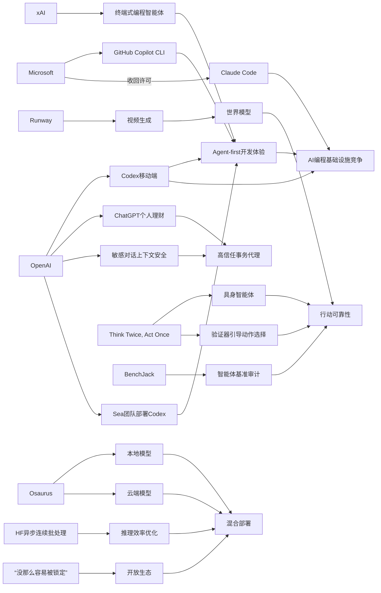

> AI 早报 · 每日早读 · 全网深度聚合

## **今日摘要**

本周AI动态显示，OpenAI正把ChatGPT从“对话工具”升级为“行动型助手”：一方面将Codex带到手机端并增强企业开发集成能力，另一方面上线个人理财预览，开始介入编程协作与日常财务管理。  
同时，行业竞争正加速从单点功能转向“智能体工作流”和平台生态之争，既有Sea等企业把AI编程推向团队级落地，也有xAI、微软、GitHub等围绕终端、Copilot和工具链控制权展开正面竞争。  
在研究和长期趋势上，具身智能体开始通过“先验证再行动”提升可靠性，Runway则把视频生成视为通向世界模型的路径，说明AI前沿正从生成内容迈向更强的现实理解与自主执行能力。

### 🔵 产品与功能更新

1. **OpenAI把Codex带到ChatGPT手机端。**  
用户现在可以在ChatGPT移动应用里远程查看、管理和批准Codex的编程任务，相当于把“AI编程助手”装进了手机。更新还加入了Remote SSH（远程安全连接）、hooks（自动触发器）和程序化令牌，方便企业把AI接入现有开发流程。配合GitHub Copilot App预览版和VS Code的多智能体窗口，开发工具正明显转向“agent-first（智能体优先）”体验。🚀  
[查看移动端更新简报(briefing)](https://news.smol.ai/issues/26-05-14-not-much/)

2. **ChatGPT上线个人理财功能。**  
OpenAI宣布为美国Pro用户预览个人理财体验，用户可安全连接银行与金融账户。接入后，ChatGPT会展示投资表现、日常支出、订阅项目和即将到期的付款，并结合个人财务背景给出建议。这意味着ChatGPT正从“聊天工具”进一步走向“日常事务助手”。🚀  
[查看理财功能简报(briefing)](https://openai.com/index/personal-finance-chatgpt)

3. **Sea在工程团队推广Codex。**  
Sea Limited首席产品官表示，公司正在亚洲工程团队中部署Codex，以加快“AI原生（从一开始就围绕AI设计）”的软件开发。核心目标不是单点提效，而是把AI嵌入更大范围的开发协作流程。这个案例说明，大型互联网公司正把AI编程从试点工具推进到团队级应用。🚀  
[查看企业落地案例(briefing)](https://openai.com/index/sea-david-chen)

### 🟢 前沿研究

1. **具身智能体开始学会“先想两次再行动”。**  
论文《Think Twice, Act Once》提出一种由验证器引导的动作选择方法，用来提升具身智能体（能感知并在现实或模拟环境中行动的AI）的稳定性。研究指出，多模态大模型虽然会看会想，但在复杂真实任务中仍然容易“想对了、做错了”。新方法通过额外检查候选动作，帮助系统在执行前筛掉高风险选择。🚀  
[查看论文摘要解读(briefing)](https://arxiv.org/abs/2605.12620)

2. **Runway押注视频生成通向世界模型。**  
Runway认为，视频生成不仅是内容工具，更可能成为构建“世界模型（让AI理解现实如何运转的模型）”的关键路径。公司试图凭借影视创作者场景积累，挑战Google等大厂在AI视频领域的优势。这反映出生成式视频正在从创意应用，延伸到更基础的AI能力竞赛。🚀  
[查看Runway战略报道(briefing)](https://techcrunch.com/2026/05/15/runway-started-by-helping-filmmakers-now-it-wants-to-beat-google-at-ai/)

3. **xAI推出终端式编程智能体Grok Build。**  
xAI发布了首个基于终端的编程智能体Grok Build，正式进入代码智能体赛道。终端式工具更贴近开发者原有工作流，也意味着它不只是聊天问答，而是直接参与写代码、执行命令和处理任务。对于AI编程市场来说，这说明竞争已从助手功能扩展到完整开发环境。🚀  
[查看Grok Build报道(briefing)](https://the-decoder.com/x-ai-plays-catch-up-with-grok-build-its-first-terminal-based-coding-agent/)

### 🟡 行业展望与社会影响

1. **微软收回Claude Code许可，转推自家工具。**  
报道称，微软正在撤销内部开发者使用Anthropic Claude Code的许可，并推动团队转向GitHub Copilot CLI。这显示AI编程工具之争，已经不只是产品对比，更是平台控制权和生态归属的竞争。对企业客户而言，未来选型可能越来越受大厂战略影响。🚀  
[查看微软工具调整(briefing)](https://the-decoder.com/microsoft-pulls-claude-code-licenses-and-pushes-developers-back-toward-its-own-ai-tool/)

2. **ChatGPT加强敏感对话的上下文识别。**  
OpenAI介绍了新的安全更新，让ChatGPT在敏感对话中更好理解“上下文（前后语境）”和持续风险。也就是说，系统不再只看单句内容，而是更关注一段对话中逐步累积的危险信号。这类改进对心理健康、伤害风险等场景尤其重要，反映行业正把安全能力做得更细。🚀  
[查看安全更新说明(briefing)](https://openai.com/index/chatgpt-recognize-context-in-sensitive-conversations)

3. **Osaurus把本地模型和云端模型装进Mac。**  
Osaurus推出Mac应用，同时支持本地AI模型和云端AI模型。它强调把记忆、文件和工具尽量保留在用户自己的硬件上，以兼顾隐私与性能。这类混合方案说明，未来AI应用未必全靠云端，端侧（设备本地）能力会越来越重要。🚀  
[查看混合部署报道(briefing)](https://techcrunch.com/2026/05/15/osaurus-brings-both-local-and-cloud-ai-models-to-your-mac/)

### 🟣 开源TOP项目

1. **Hugging Face讨论连续批处理的异步优化。**  
文章介绍如何在continuous batching（连续批处理）中加入asynchronicity（异步处理），以提升大模型推理效率。简单说，就是让系统更灵活地安排不同请求，减少等待和资源浪费。对开源推理框架与模型服务部署者来说，这类优化直接关系到成本和响应速度。🚀  
[查看异步推理简报(briefing)](https://huggingface.co/blog/continuous_async)

2. **Simon Willison谈“没那么容易被锁定”了。**  
Simon Willison在《Not so locked in any more》中讨论，如今AI工具和模型生态相比过去更不容易形成单一绑定。随着接口、模型和工作流逐渐多元，开发者切换工具的空间正在变大。这对开源社区是利好，因为竞争会推动更开放的组合方式。🚀  
[查看生态观察短评(briefing)](https://simonwillison.net/2026/May/14/not-so-locked-in/#atom-everything)

3. **BenchJack系统性审计AI智能体基准。**  
论文《BenchJack》聚焦AI智能体基准测试中的“奖励作弊”问题，也就是模型拿高分却未真正完成任务。作者认为，很多基准已成为评估前沿AI能力的事实标准，因此必须从设计上防止被“钻空子”。这项工作对开源评测社区很关键，因为它关系到大家看到的排行榜到底靠不靠谱。🚀  
[查看基准审计论文(briefing)](https://arxiv.org/abs/2605.12673)

### 🔴 社媒分享

1. **Anthropic把中美AI竞争描述为“关键窗口期”。**  
Anthropic在一份政策文件中提出，到2028年可能出现两种局面：要么美国保持算力领先，要么威权国家主导AI规则。这个表态明显是在影响华盛顿的政策讨论，也说明AI公司正在更积极参与地缘政治叙事。类似观点在社交平台和政策圈都很容易引发扩散。🚀  
[查看政策话题摘要(briefing)](https://the-decoder.com/anthropic-frames-ai-competition-with-china-as-a-now-or-never-moment-for-washington/)

2. **Mitchell Hashimoto谈AI时代的软件形态。**  
Simon Willison转引了Mitchell Hashimoto的观点，内容聚焦AI对软件工具形态的影响。虽然是引述类内容，但这类业内人士发言往往能快速带动开发者讨论，因为它连接了产品趋势与实际工作方式变化。对于关注AI开发工具的人来说，这是一条值得留意的风向内容。🚀  
[查看人物观点引述(briefing)](https://simonwillison.net/2026/May/14/mitchell-hashimoto/#atom-everything)

3. **AWS上的大模型训练与推理“积木”被系统梳理。**  
Hugging Face发布文章，总结在AWS上进行基础模型训练和推理的关键构件。内容更像一份面向实践者的路线图，帮助团队理解从训练到部署需要哪些云上能力模块。这类“框架型内容”很适合在社交媒体传播，因为信息密度高、转发价值强。🚀  
[查看AWS能力梳理(briefing)](https://huggingface.co/blog/amazon/foundation-model-building-blocks)

---

📊 行业洞察

1. 事实  
   OpenAI把Codex带到ChatGPT手机端，并加入Remote SSH（远程安全连接）、hooks（自动触发器）和程序化令牌；Sea也在亚洲工程团队推广Codex；xAI则推出终端式编程智能体Grok Build；微软收回Claude Code许可并转推GitHub Copilot CLI。  
   【洞察】AI编程正从“单点助手”升级为“工作流级基础设施”。竞争焦点已不只是代码补全准确率，而是能否嵌入终端、移动端、企业权限体系和团队协作流程，形成agent-first（智能体优先）的开发入口。未来企业采购会更看重生态整合、权限控制与流程闭环，而非单模型能力。

2. 事实  
   ChatGPT上线个人理财功能，可连接银行与金融账户；同时OpenAI又强化了敏感对话中的上下文识别与持续风险判断。  
   【洞察】通用对话产品正在跨入“高信任事务代理”阶段。随着AI开始处理金融、心理健康等高敏感任务，产品竞争门槛将从“会不会回答”转向“能否在强上下文下安全执行建议”。这意味着安全能力不再是合规附属项，而是决定AI能否进入支付、财富管理、医疗辅助等高价值场景的核心产品力。

3. 事实  
   Runway将视频生成视为通向世界模型（让AI理解现实运转规律的模型）的路径；具身智能体论文《Think Twice, Act Once》提出通过验证器先筛查动作；BenchJack则审计AI智能体基准中的“奖励作弊”问题。  
   【洞察】行业正在从“生成效果竞赛”转向“行动可靠性竞赛”。一端是视频模型被视为学习现实规律的数据入口，另一端是具身智能体和基准研究开始强调验证、纠错和防作弊，说明下一阶段关键不只是生成更像，而是让模型在动态环境中“理解—决策—执行”更可信。这会推动世界模型、智能体评测和安全验证工具一起升温。

4. 事实  
   Osaurus在Mac上同时支持本地模型和云端模型；Hugging Face讨论continuous batching（连续批处理）与asynchronicity（异步处理）优化推理效率；Simon Willison指出AI生态“没那么容易被锁定”了。  
   【洞察】AI基础设施正走向“混合部署 + 可替换栈”。端侧（设备本地）与云侧协同，一方面回应隐私和低延迟需求，另一方面借助推理优化降低云成本；同时多模型、多接口趋势削弱单一平台锁定。对企业而言，未来最佳实践可能不是押注某一家模型厂商，而是构建可切换的模型路由、混合推理和数据留存架构。

🗺️ 今日关系图

