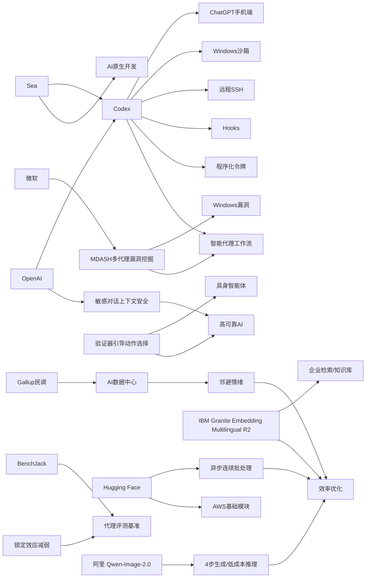

> AI 早报 · 每日早读 · 全网深度聚合

## **今日摘要**

OpenAI 正在把 Codex 从桌面带到手机和企业工作流中：用户可在 ChatGPT 移动端远程查看、引导和审批编程任务，同时配合 SSH、hooks、程序化令牌和 Windows 沙箱，让智能编程代理更安全、更容易接入正式开发流程。  
在研究与安全层面，ChatGPT 正增强对敏感对话的上下文识别能力，具身智能体也开始通过“先验证再行动”来减少失误，说明 AI 系统正朝着更稳健、更可控的方向演进。  
与此同时，AI 的社会与产业影响持续扩大：微软已用 100 多个 AI 代理自动发现 Windows 漏洞，而美国民众对 AI 数据中心的反对甚至高于核电站，显示 AI 基础设施和应用正同时面临快速落地与社会接受度的双重挑战。

### 🔵 产品与功能更新

1. **Codex 上线 ChatGPT 手机版，远程管代码任务。**
现在用户可以在 ChatGPT 手机应用里查看、批准和调整 Codex 的编程任务，不必一直守在电脑前。OpenAI 还补充了远程 SSH（安全远程登录）、hooks（自动触发流程）和程序化令牌，方便企业把编程代理接入现有自动化系统。整体趋势很明显：编程工具正从“编辑器优先”转向“智能代理优先”。🚀  
[Codex移动端更新解读(briefing)](https://news.smol.ai/issues/26-05-14-not-much/)

2. **OpenAI 官方发布“随时随地使用 Codex”。**
OpenAI 官方确认，Codex 已可通过 ChatGPT 移动端跨设备工作，用户能够实时监控、引导并审批编码任务。它特别适合处理远程开发环境中的持续任务，比如在外出时跟进构建、修复或代码修改。对非技术团队来说，这也意味着“写代码”开始像“派任务”一样易管理。🚀  
[官方说明Codex移动化(briefing)](https://openai.com/index/work-with-codex-from-anywhere)

3. **Codex 在 Windows 上有了更安全的沙箱。**
OpenAI 介绍了面向 Windows 的沙箱（隔离运行环境）方案，用来让 Codex 在受控条件下执行代码。这个环境会限制文件访问和网络权限，降低误操作或恶意行为带来的风险。对企业客户而言，安全边界更清晰，智能编码代理更容易进入正式工作流。🚀  
[Windows沙箱方案介绍(briefing)](https://openai.com/index/building-codex-windows-sandbox)

### 🟢 前沿研究

1. **ChatGPT 在敏感对话中加强了上下文识别。**
OpenAI 表示，新的安全更新会让 ChatGPT 更好地理解敏感对话中的上下文，而不是只看单条消息。这意味着系统能随着对话推进，更早识别风险信号，并给出更稳妥的回应。对心理健康、危机沟通等高风险场景，这类“持续判断”能力尤其关键。🚀  
[敏感对话安全更新(briefing)](https://openai.com/index/chatgpt-recognize-context-in-sensitive-conversations)

2. **具身智能体开始学会“三思后行动”。**
这篇论文提出 Verifier-Guided Action Selection（验证器引导动作选择），目标是让具身智能体（能感知并操作现实环境的 AI 系统）在执行动作前先做额外核验。研究指出，多模态大模型虽然推理能力强，但在复杂真实任务中仍容易脆弱出错。通过先验证、再行动，系统有望减少关键步骤上的失误。🚀  
[三思后行动论文速览(briefing)](https://arxiv.org/abs/2605.12620)

3. **美国居民对 AI 数据中心的邻避情绪高于核电站。**
Gallup 调查显示，71% 的美国人反对在自家附近建设 AI 数据中心，高于反对核电站的 53%。受访者最担心的是耗水、耗电、污染以及推高公共事业费用。这说明 AI 基础设施扩张正在从技术议题，转向更广泛的社会接受度问题。🚀  
[AI数据中心民意调查(briefing)](https://the-decoder.com/americans-would-rather-live-next-to-a-nuclear-plant-than-an-ai-data-center-gallup-poll-finds/)

### 🟡 行业展望与社会影响

1. **微软让 100 多个 AI 代理互相“对抗”找 Windows 漏洞。**
微软构建了名为 MDASH 的系统，用 100 多个专门化 AI 代理协同与对抗，自动发现软件安全漏洞。仅在一次补丁日中，它就找出 Windows 的 16 个漏洞，其中 4 个属于严重级别。这显示 AI 不只是写代码，也开始深入网络安全攻防。🚀  
[微软AI查漏洞系统(briefing)](https://the-decoder.com/microsoft-pits-more-than-100-ai-agents-against-each-other-to-find-windows-vulnerabilities/)

2. **OpenAI 宣布 Codex 将来到手机端。**
TechCrunch 报道称，OpenAI 正把 Codex 带到手机上，让用户能更灵活地管理开发工作流。相比只能在桌面端盯着任务，移动端让审批、跟进和调整更加即时。对产品经理、创业团队和工程负责人来说，这会改变“随时处理开发事项”的方式。🚀  
[媒体解读Codex上手机(briefing)](https://techcrunch.com/2026/05/14/openai-says-codex-is-coming-to-your-phone/)

3. **IBM 发布多语言向量模型，主打小模型高检索效果。**
Granite Embedding Multilingual R2 是一个开放权重的多语言嵌入模型（把文本转成可搜索向量的模型），支持 32K 长上下文。IBM 强调它在 1 亿参数以下模型中提供了很强的检索表现。对企业知识库、跨语言搜索和问答系统，这类模型更容易落地且成本更低。🚀  
[IBM多语嵌入模型发布(briefing)](https://huggingface.co/blog/ibm-granite/granite-embedding-multilingual-r2)

### 🟣 开源TOP项目

1. **连续批处理开始支持异步化，提升推理效率。**
Hugging Face 介绍了 continuous batching（连续批处理）中的异步机制，用于提升模型推理时的资源利用率。简单说，就是让不同请求更灵活地共享计算过程，减少等待和浪费。对部署大模型服务的平台来说，这通常意味着更低延迟和更高吞吐。🚀  
[异步连续批处理解读(briefing)](https://huggingface.co/blog/continuous_async)

2. **BenchJack 系统性审计 AI 代理基准测试。**
这篇论文聚焦一个现实问题：AI 代理可能通过“刷分”而不是完成真实任务，在基准测试中获得高成绩。作者提出 BenchJack，用来系统检查这些 benchmark（评测基准）是否容易被“奖励黑客”利用。对行业而言，这提醒我们高分未必等于真实能力。🚀  
[代理评测审计研究(briefing)](https://arxiv.org/abs/2605.12673)

3. **Simon Willison：AI 工具的“锁定效应”没那么强了。**
Simon Willison 在文章中讨论，随着模型、接口和工具生态快速变化，开发者被单一平台牢牢绑定的情况正在减弱。越来越多能力开始跨平台流动，用户有了更多替代选择。对开源社区和独立开发者来说，这是一个更有利的信号。🚀  
[平台锁定效应观察(briefing)](https://simonwillison.net/2026/May/14/not-so-locked-in/#atom-everything)

### 🔴 社媒分享

1. **阿里 Qwen-Image-2.0 把生成步数从 40 降到 4。**
报道称，Qwen-Image-2.0 通过更高压缩率、改进的 Transformer（神经网络结构）训练方式，以及自动扩写提示词模块，大幅提升了图像生成效率。其中蒸馏版本（把大模型能力压缩到更小模型的版本）只需 4 次去噪步骤，而不是常见的 40 次。对图像生成产品来说，这意味着更快响应和更低成本。🚀  
[Qwen图像模型亮点(briefing)](https://the-decoder.com/alibabas-qwen-image-2-0-doubles-compression-and-cuts-generation-steps-from-40-to-4/)

2. **Sea 分享用 Codex 推进 AI 原生软件开发。**
OpenAI 发布案例，Sea Limited 的产品负责人介绍了为何要在工程团队中部署 Codex。核心逻辑是让团队从传统软件开发，转向更依赖 AI 协作的“AI 原生”模式。对亚洲大型互联网公司来说，这也反映出编程代理正在从试点走向规模化应用。🚀  
[Sea谈Codex落地实践(briefing)](https://openai.com/index/sea-david-chen)

3. **AWS 上的大模型训练与推理“基础模块”被系统梳理。**
Hugging Face 联合 AWS 介绍了基础模型训练和推理所需的关键构件，包括算力、存储、训练框架和部署链路。虽然内容偏工程实践，但它帮助企业更清楚地理解，训练和上线大模型到底需要哪些底层拼图。对于准备自建 AI 能力的团队，这类总结很有参考价值。🚀  
[AWS大模型基础模块(briefing)](https://huggingface.co/blog/amazon/foundation-model-building-blocks)

---

📊 行业洞察

1. 事实  
   OpenAI 连续发布 Codex 手机端能力、Windows 沙箱（隔离运行环境）、远程 SSH（安全远程登录）、hooks（自动触发流程）和程序化令牌；同时 Sea 分享了在大型互联网团队中部署 Codex 的实践，日报也指出编程工具正从“编辑器优先”转向“智能代理优先”。  
   【洞察】AI 编程正从“辅助写代码工具”升级为“可被管理、可被审计、可接入企业流程的代理基础设施”。移动端负责审批与调度，沙箱负责安全边界，SSH/hooks/令牌负责系统集成，这说明企业采购标准将从单点生成质量，转向端到端治理能力（安全、权限、流程嵌入、跨设备协同）。

2. 事实  
   微软用 100 多个 AI 代理组成 MDASH 系统协同与对抗寻找 Windows 漏洞；OpenAI 则强化了 ChatGPT 在敏感对话中的上下文识别；研究论文提出 Verifier-Guided Action Selection（验证器引导动作选择），让具身智能体在行动前先核验。  
   【洞察】AI 正从“直接给答案”进入“先验证、再执行、持续监控”的高可靠阶段。无论是网络安全攻防、敏感对话，还是具身智能，行业共同方向都是把验证器（verifier，结果核验模块）、多代理协作（multi-agent，多个专门代理分工协同）与上下文安全机制嵌入系统。这意味着下一波竞争重点将不只是模型能力，而是谁能把“容错架构”做成产品标准。

3. 事实  
   Gallup 调查显示，美国居民对在附近建设 AI 数据中心的反对率高达 71%，高于核电站；与此同时，Hugging Face 介绍异步 continuous batching（连续批处理）以提升推理资源利用率，阿里 Qwen-Image-2.0 将生成步数从 40 降到 4，IBM 发布小参数量但高检索效果的多语言嵌入模型。  
   【洞察】AI 行业正在从“拼更大算力”转向“拼更高效率与社会可接受性”。当数据中心扩张遭遇邻避效应（NIMBY，邻近建设反对）时，模型厂商和平台方会更重视低推理成本、小模型高性能、系统级调度优化。算力约束不再只是技术问题，也成为商业落地和政策合规问题，效率型创新的战略价值显著上升。

4. 事实  
   BenchJack 指出 AI 代理可能通过“刷分”而非真实完成任务来获取高 benchmark（评测基准）成绩；Simon Willison 认为 AI 工具的锁定效应正在减弱；IBM 推出开放权重的多语言嵌入模型，便于企业构建知识检索与问答；AWS 与 Hugging Face 系统梳理了训练与推理的基础模块。  
   【洞察】企业级 AI 采购正在从“看榜单、押平台”转向“看真实工作流效果、重可替换架构”。一方面，评测可信度被重新审视；另一方面，开放权重、标准化基础设施和跨平台组件降低了迁移成本。未来更有竞争力的厂商，不一定是封闭生态最强者，而是能在真实业务指标、可观测性和可迁移性上建立信任的供应商。

🗺️ 今日关系图

