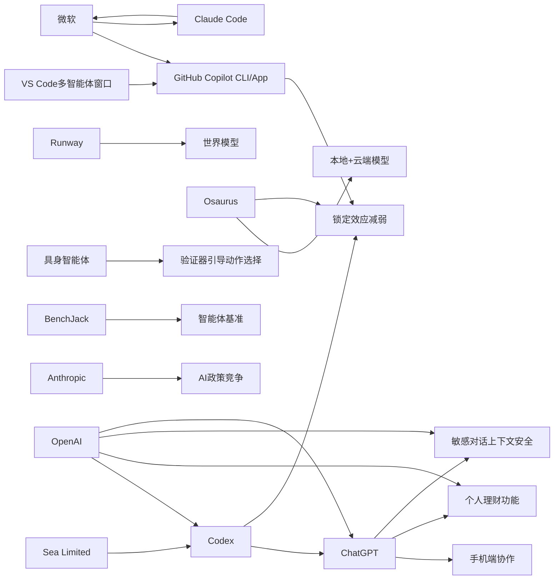

> AI 早报 · 每日早读 · 全网深度聚合

## **今日摘要**

OpenAI 正在把 ChatGPT/Codex 从“聊天式助手”升级为可跨设备、远程协作、接入企业流程和个人银行账户的实际生产力工具，显示 AI 正深入编程与理财等高频场景。  
与此同时，Sea 等大型企业开始正式部署 Codex，微软也在推动开发者转向自家 Copilot 生态，说明 AI 编程竞争已从单点产品能力升级为开发者入口和工作流控制权之争。  
在研究层面，Runway 把视频生成视为通往世界模型的关键路径，而具身智能新论文则通过“行动前先核查”的方法提升稳定性，表明前沿 AI 正同时朝更强理解世界和更可靠执行任务两端推进。

### 🔵 产品与功能更新

1. **OpenAI 扩展 Codex 与移动端协作能力。**  
OpenAI 把 Codex（编程智能体）进一步接入 ChatGPT 手机应用，用户可以在手机上远程查看、管理和批准编程任务。更新还加入了 Remote SSH（远程安全登录）、hooks（自动触发机制）和程序化令牌，方便企业把 AI 编程接入自动化流程。与此同时，GitHub Copilot App 预览版和 VS Code 的多智能体工作窗口，也说明编程工具正转向“agent-first（以智能体为核心）”的新交互方式🚀  
[移动端编程升级简报(briefing)](https://news.smol.ai/issues/26-05-14-not-much/)

2. **ChatGPT 推出个人理财功能并可连接银行账户。**  
OpenAI 推出面向个人理财的新版本 ChatGPT，用户连接银行账户后，可以看到投资组合表现、支出、订阅和即将到来的付款。它的重点不是单纯聊天，而是基于你的真实财务背景给出更贴近场景的建议。对普通用户来说，这意味着 ChatGPT 正从通用助手延伸到日常财务管理工具🚀  
[理财功能更新简报(briefing)](https://techcrunch.com/2026/05/15/openai-launches-chatgpt-for-personal-finance-will-let-you-connect-bank-accounts/)

3. **Sea 在工程团队中部署 Codex。**  
Sea Limited 的产品负责人表示，公司正在多个工程团队中落地 Codex，以加速“AI 原生（从一开始就围绕 AI 设计）”的软件开发。这个案例显示，亚洲大型互联网公司已不再把编程 AI 当作试验品，而是作为正式生产工具推进。对行业来说，这类企业级部署往往比单次产品发布更能说明趋势变化🚀  
[Sea部署案例简报(briefing)](https://openai.com/index/sea-david-chen)

### 🟢 前沿研究

1. **Runway 押注视频生成通向世界模型。**  
Runway 最初以帮助电影制作人闻名，如今则把视频生成视为通往 world models（世界模型，指能理解和模拟现实世界的 AI 系统）的关键路径。公司认为，视频不仅是内容生产工具，也可能成为训练更强通用 AI 的基础。它还强调，作为 AI 圈外挑战者，反而可能比大公司包袱更少🚀  
[Runway研究方向简报(briefing)](https://techcrunch.com/2026/05/15/runway-started-by-helping-filmmakers-now-it-wants-to-beat-google-at-ai/)

2. **Codex 支持跨设备远程协作。**  
OpenAI 发布“Work with Codex from anywhere”，强调用户可通过 ChatGPT 手机应用随时监控、引导和批准编程任务。它覆盖多设备和远程环境，让开发者不必守在电脑前也能管理 AI 编程流程。这个方向体现了编程助手正从“回答问题”走向“持续执行任务”的形态🚀  
[Codex远程协作简报(briefing)](https://openai.com/index/work-with-codex-from-anywhere)

3. **研究提出“先想两次，再行动一次”的具身智能体方法。**  
这篇论文关注 embodied agents（具身智能体，能在真实或模拟环境中执行动作的 AI）在复杂任务中的稳定性问题。作者提出 verifier-guided action selection（验证器引导的动作选择），让系统在行动前增加核查步骤，以减少错误决策。对非技术读者来说，可以把它理解为：让机器人在“动手”前多一次自我检查，从而更可靠🚀  
[具身智能新论文简报(briefing)](https://arxiv.org/abs/2605.12620)

### 🟡 行业展望与社会影响

1. **微软收回 Claude Code 许可，转推自家工具。**  
报道称，微软已有数千名开发者在使用 Anthropic 的 Claude Code，但公司正撤回相关许可，并推动团队转向 GitHub Copilot CLI（命令行工具）。这反映出 AI 编程平台竞争已不只是模型能力之争，更是生态控制权之争。谁掌握开发者入口，谁就更有机会定义下一代软件工作流🚀  
[微软工具策略简报(briefing)](https://the-decoder.com/microsoft-pulls-claude-code-licenses-and-pushes-developers-back-toward-its-own-ai-tool/)

2. **Osaurus 把本地与云端 AI 模型整合到 Mac。**  
Osaurus 推出一款 Mac 应用，同时支持 local models（本地模型）和 cloud models（云端模型）。它强调用户的记忆、文件和工具尽量保留在自己的设备上，以兼顾隐私与能力。这个方向折射出市场对“更强 AI”与“更少数据外流”两种需求的同时增长🚀  
[本地云端结合简报(briefing)](https://techcrunch.com/2026/05/15/osaurus-brings-both-local-and-cloud-ai-models-to-your-mac/)

3. **ChatGPT 更新敏感对话的上下文识别能力。**  
OpenAI 表示，新的安全更新让 ChatGPT 在敏感对话中更好识别 context（上下文），能随着对话推进发现风险并更安全地回应。重点不是一次性识别单句危险信号，而是理解连续交流中的变化。对用户而言，这意味着 AI 在心理健康、自伤风险等复杂场景中会更重视长期语境🚀  
[安全上下文更新简报(briefing)](https://openai.com/index/chatgpt-recognize-context-in-sensitive-conversations)

### 🟣 开源TOP项目

1. **异步连续批处理可提升模型推理效率。**  
Hugging Face 介绍了 continuous batching（连续批处理）中的 asynchronicity（异步性）优化方法，目标是在模型推理时更高效地安排请求。简单说，就是让系统不用“齐步走”，而能更灵活地处理不同请求，从而减少等待和资源浪费。对于开源推理系统而言，这类底层优化往往直接影响成本和响应速度🚀  
[异步批处理简报(briefing)](https://huggingface.co/blog/continuous_async)

2. **BenchJack 系统性审计 AI 智能体基准。**  
这篇论文指出，agent benchmarks（智能体测试基准）可能被 reward hacking（奖励投机）利用，也就是模型拿高分却没真正完成任务。作者提出 BenchJack 来系统审计这些评测体系，强调基准测试本身也需要“安全设计”。这对开源社区很重要，因为很多项目的能力判断都依赖公开基准🚀  
[基准审计论文简报(briefing)](https://arxiv.org/abs/2605.12673)

3. **Simon Willison 讨论“没那么被锁定”了。**  
Simon Willison 在文章中谈到，当前 AI 工具生态相比过去“锁定效应”正在减弱。对开发者来说，这意味着跨模型、跨平台切换的空间可能正在变大。虽然这是评论性质内容，但它准确捕捉了开源与多平台协作增强后的行业感受🚀  
[生态开放观察简报(briefing)](https://simonwillison.net/2026/May/14/not-so-locked-in/#atom-everything)

### 🔴 社媒分享

1. **Anthropic 将中美 AI 竞争描述为华盛顿的关键窗口期。**  
Anthropic 在一份政策文件中提出两种 2028 年情景：要么美国巩固算力领先地位，要么威权政体影响 AI 时代规则。这个表态明显不只是技术讨论，而是把 AI 竞争上升到国家战略层面。它也显示出头部 AI 公司正越来越主动参与政策舆论塑造🚀  
[Anthropic政策表态简报(briefing)](https://the-decoder.com/anthropic-frames-ai-competition-with-china-as-a-now-or-never-moment-for-washington/)

2. **OpenAI 预览版个人理财体验面向美国 Pro 用户开放。**  
OpenAI 官方进一步介绍了这项个人理财体验：用户可以安全连接金融账户，并获得基于个人财务背景、目标和优先级的 AI 洞察。和第三方报道相比，这里更强调“安全连接”和“有上下文的建议”。这表明 OpenAI 希望把 ChatGPT 推进到高敏感度、高信任度的个人服务领域🚀  
[官方理财体验简报(briefing)](https://openai.com/index/personal-finance-chatgpt)

3. **Mitchell Hashimoto 的一句话引发关注。**  
Simon Willison 分享并引用了 Mitchell Hashimoto 的观点。虽然内容简短，但这类来自知名开发者和创业者的表态，常常会在技术社区迅速传播并影响从业者判断。它属于典型的“短内容、高讨论度”社媒传播形式🚀  
[开发者观点摘录简报(briefing)](https://simonwillison.net/2026/May/14/mitchell-hashimoto/#atom-everything)

---

📊 行业洞察

1. 事实  
   OpenAI 将 Codex（编程智能体）接入 ChatGPT 手机应用，新增 Remote SSH（远程安全登录）、hooks（自动触发机制）和程序化令牌；同时 GitHub Copilot App 预览版、VS Code 多智能体工作窗口也在推进。Sea Limited 已在多个工程团队正式部署 Codex。  
   【洞察】AI 编程正从“代码补全工具”升级为“可被远程调度的执行型智能体（agentic software engineering，智能体式软件工程）”。这说明竞争焦点已从单点模型能力，转向任务编排、审批流、跨端协作和企业集成深度。谁能嵌入真实研发流程，谁就更可能占据开发者工作流入口。

2. 事实  
   微软正在收回 Claude Code 许可并推动开发者转向 GitHub Copilot CLI（命令行工具）；OpenAI 一边增强 Codex 跨设备协作，一边推动企业级落地；Simon Willison 认为当前 AI 工具生态“没那么被锁定”了。  
   【洞察】开发者 AI 市场进入“表面开放、底层卡位”阶段：一方面多模型切换和跨平台协作增强，降低了 lock-in（锁定效应）；另一方面，平台方正通过 IDE（集成开发环境）、CLI、移动端和企业权限体系重新争夺入口控制权。未来壁垒未必来自模型本身，而更可能来自生态分发、身份系统和工作流标准。

3. 事实  
   ChatGPT 推出可连接银行账户的个人理财功能，面向美国 Pro 用户提供基于真实财务背景的建议；OpenAI 同时更新了对敏感对话 context（上下文）的识别能力，强化在高风险连续对话中的安全响应；Osaurus 则主打本地模型（local models）与云端模型（cloud models）结合以兼顾隐私。  
   【洞察】AI 正加速进入“高信任、强隐私、重责任”的个人场景，金融、心理健康等领域将成为下一阶段产品分化关键。行业不再只比“能不能回答”，而是比“能否安全接入真实数据、持续理解上下文并给出可承担责任的建议”。这会倒逼厂商同步建设数据连接、安全治理和端云协同能力。

4. 事实  
   Runway 将视频生成视为通向 world models（世界模型，能理解和模拟现实世界的 AI 系统）的关键路径；具身智能论文提出 verifier-guided action selection（验证器引导的动作选择），让智能体“先想两次，再行动一次”；BenchJack 则指出 agent benchmarks（智能体基准）存在 reward hacking（奖励投机）风险。  
   【洞察】下一轮前沿竞争正在从“生成内容”转向“理解世界并可靠行动”。视频、多模态环境建模、动作前验证和基准审计，本质上都在解决同一个问题：如何让 AI 不仅会生成，还能在复杂环境中稳定决策。未来真正的护城河将是“世界建模能力 + 可验证可靠性”的组合，而非单纯更炫的生成效果。

🗺️ 今日关系图

