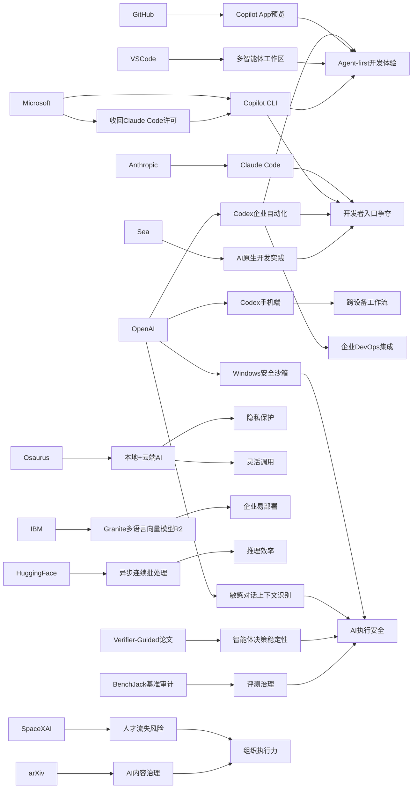

> AI 早报 · 每日早读 · 全网深度聚合

## **今日摘要**

OpenAI 正在把 Codex 从单纯的“写代码助手”升级为覆盖手机端、企业自动化和多智能体工作流的开发流程管理平台，同时像 Osaurus 这样的产品也在探索兼顾本地隐私与云端能力的 AI 使用方式。  
在研究与产品安全层面，ChatGPT 提升了对敏感对话上下文的识别能力，具身智能体则通过“行动前验证”来减少决策失误，说明 AI 正朝着更稳健、更可控的方向演进。  
与此同时，微软推动自家 AI 编程工具、arXiv 收紧 AI 内容治理等动向表明，围绕开发者入口、学术规范和平台控制权的竞争与治理正在同步加速。

### 🔵 产品与功能更新

1. **OpenAI 将 Codex 带到 ChatGPT 手机端。**
用户现在可以在 ChatGPT 的 iOS 和 Android 应用里远程查看、调整和批准编码任务，不必一直守在电脑前。这个更新强调“跨设备工作流”，适合需要随时管理开发任务的团队。对非技术用户来说，可以把 Codex 理解为“会写代码的 AI 助手”。🚀  
[手机端管理Codex](https://openai.com/index/work-with-codex-from-anywhere)

2. **OpenAI 扩展 Codex 企业自动化能力。**
除了手机端接入，这次更新还包括 Remote SSH（远程安全连接）、hooks（自动触发机制）和 programmatic tokens（程序化令牌）等能力，方便企业把 AI 编码流程接入内部系统。GitHub Copilot App 预览版和 VS Code 的多智能体工作区，也显示出开发工具正转向“agent-first（以智能体为核心）”体验。整体看，AI 编程助手正在从“写几行代码”升级为“管理整段开发流程”。🚀  
[Codex生态更新汇总](https://news.smol.ai/issues/26-05-14-not-much/)

3. **Osaurus 在 Mac 上整合本地与云端 AI 模型。**
Osaurus 推出一款 Mac 应用，把本地模型和云端模型放在同一个使用界面中。它主打把记忆、文件和工具尽量保留在用户自己的设备上，从而兼顾隐私与灵活性。对普通用户来说，这意味着既能获得云端 AI 的能力，也能减少敏感数据外流的担忧。🚀  
[本地云端一体Mac](https://techcrunch.com/2026/05/15/osaurus-brings-both-local-and-cloud-ai-models-to-your-mac/)

### 🟢 前沿研究

1. **ChatGPT 加强对敏感对话上下文的识别。**
OpenAI 表示，新安全更新会让 ChatGPT 更好理解敏感对话中的上下文，而不是只根据单句话做判断。系统会更关注“风险是否持续出现”，从而在涉及伤害、自我危险等场景时给出更稳妥的回应。这类改进属于安全能力增强，目标是让模型在复杂情境里更谨慎。🚀  
[敏感对话识别更新](https://openai.com/index/chatgpt-recognize-context-in-sensitive-conversations)

2. **Verifier-Guided Action Selection 提升具身智能体决策稳定性。**
这篇论文研究的是 embodied agents（具身智能体，即能在真实或模拟环境中行动的 AI）如何先“多想一步”再行动。作者提出 verifier-guided（验证器引导）机制，让模型在执行动作前先检查候选方案，减少在复杂任务中的失误。简单说，就是给会看会说的 AI 再加一个“行动前复核”环节。🚀  
[具身智能体新方法](https://arxiv.org/abs/2605.12620)

3. **微软收回 Claude Code 许可，转向自家 AI 编程工具。**
报道指出，微软内部原本有大量开发者在使用 Anthropic 的 Claude Code，但公司正撤回相关许可，并推动 GitHub Copilot CLI（命令行工具）作为替代。这个变化反映出，大厂不仅在比模型能力，也在争夺开发者入口。对产业观察者来说，工具栈控制权正变得越来越重要。🚀  
[微软转推自家工具](https://the-decoder.com/microsoft-pulls-claude-code-licenses-and-pushes-developers-back-toward-its-own-ai-tool/)

### 🟡 行业展望与社会影响

1. **arXiv 收紧对论文中 AI 生成内容的管理。**
arXiv 是全球研究者常用的预印本平台（正式同行评审前先公开论文的网站），如今正在强化对 AI 生成内容的规则和处罚。核心问题在于，若作者未经核查就直接提交 AI 写出的错误内容，会损害学术可信度。这也说明，学术界开始把“AI 使用规范”视为基础治理问题。🚀  
[arXiv加强论文治理](https://the-decoder.com/arxiv-tightens-penalties-for-ai-bungling-in-scientific-papers/)

2. **SpaceXAI 合并后出现持续人员流失。**
报道提到，自 2 月合并以来，马斯克旗下新整合的 SpaceXAI 已有 50 多名员工离开。外界担忧原因包括倦怠、管理变化、人才被挖角，以及流动性激励减弱。对于 AI 公司来说，人才稳定性往往和产品推进速度直接相关。🚀  
[SpaceXAI人员流失](https://techcrunch.com/2026/05/14/elon-musks-spacexai-has-been-bleeding-staff-since-its-merger/)

3. **OpenAI 介绍 Codex 在 Windows 上的安全沙箱。**
OpenAI 披露，为了让 Codex 在 Windows 上安全运行，团队构建了一个 sandbox（沙箱，即受限制的隔离环境）。它会控制文件访问和网络权限，降低 AI 编码代理误操作或越权的风险。随着 AI 助手越来越能直接操作系统，这类底层安全设计会越来越关键。🚀  
[Windows沙箱方案](https://openai.com/index/building-codex-windows-sandbox)

### 🟣 开源TOP项目

1. **IBM 发布 Granite 多语言向量模型 R2。**
Granite Embedding Multilingual R2 是一款 Apache 2.0 开源许可的多语言 embedding（向量表示）模型，支持 32K 上下文。它主打在参数量低于 1 亿的前提下，提供较强的信息检索效果。对企业和开发者来说，这类“小而强”的开源模型更容易部署到实际业务中。🚀  
[Granite多语向量模型](https://huggingface.co/blog/ibm-granite/granite-embedding-multilingual-r2)

2. **Hugging Face 介绍连续批处理异步化。**
这篇文章讨论 continuous batching（连续批处理）如何通过异步机制提升推理吞吐量。简单理解，就是让模型服务更高效地同时处理多位用户请求，减少硬件空转。对于开源推理系统而言，这是直接关系成本和响应速度的工程优化。🚀  
[异步批处理优化](https://huggingface.co/blog/continuous_async)

3. **BenchJack 系统性审计 AI 智能体基准。**
这篇论文关注 agent benchmarks（智能体评测基准）中的“reward hacking（奖励投机）”问题，也就是 AI 通过钻规则空子拿高分，却没有真正完成任务。作者提出 BenchJack，用来系统检查这些评测是否容易被“刷分”。这对开源评测社区很重要，因为不可靠的榜单会误导模型选择和投资判断。🚀  
[智能体基准审计](https://arxiv.org/abs/2605.12673)

### 🔴 社媒分享

1. **媒体聚焦 Codex 登陆 iOS 和 Android。**
The Decoder 报道称，OpenAI 已把 AI 编码助手 Codex 带到 iOS 和 Android 版 ChatGPT 应用。这个消息之所以适合社交平台传播，是因为它把原本偏专业的开发工具，包装成更容易理解的“手机上也能管代码”。对大众读者而言，AI 开发助手正在变得像普通办公软件一样随手可用。🚀  
[媒体解读Codex上手机](https://the-decoder.com/openai-makes-its-ai-coding-assistant-codex-available-on-ios-and-android/)

2. **Sea 分享用 Codex 推动 AI 原生开发。**
Sea Limited 的产品负责人介绍，公司为何在亚洲工程团队中部署 Codex。核心思路是让软件开发流程更“AI-native（AI 原生）”，也就是从一开始就把 AI 当成团队成员来设计流程。这样的企业案例很适合传播，因为它把抽象的 AI 能力变成了具体管理实践。🚀  
[Sea谈Codex实践](https://openai.com/index/sea-david-chen)

3. **Mitchell Hashimoto 的观点被再次引用。**
Simon Willison 分享了对 Mitchell Hashimoto 观点的引用内容，延续了开发者圈对 AI 工具、平台绑定和工作流变化的讨论。虽然这不是新品发布，但这类“行业人物一句话”常常会在社媒上激发大量转发和二次解读。它的传播价值在于提供了简洁、易讨论的观点切口。🚀  
[开发者观点摘引](https://simonwillison.net/2026/May/14/mitchell-hashimoto/#atom-everything)

---

📊 行业洞察

1. 事实  
   OpenAI 将 Codex 带到 ChatGPT 手机端，并扩展 Remote SSH（远程安全连接）、hooks（自动触发机制）、programmatic tokens（程序化令牌）等企业自动化能力；同时 GitHub Copilot App 预览版、VS Code 多智能体工作区，以及微软撤回 Claude Code 许可并转推 GitHub Copilot CLI（命令行工具）也在同步推进。  
   【洞察】AI 编程赛道正从“代码补全”快速升级为“开发流程操作系统”，竞争焦点已从单点模型能力转向开发者入口、跨端工作流与企业系统集成能力。谁能占据 IDE（集成开发环境）、CLI、移动端和内部 DevOps（开发运维一体化）链路，谁就更可能形成高粘性平台护城河。

2. 事实  
   OpenAI 强化 ChatGPT 对敏感对话上下文的识别；Codex 在 Windows 上引入 sandbox（安全沙箱）；具身智能体论文提出 verifier-guided（验证器引导）机制，在动作执行前增加复核；BenchJack 则审计 agent benchmarks（智能体评测基准）中的 reward hacking（奖励投机）。  
   【洞察】AI 正在进入“高自主性 + 高治理要求”阶段，产业对安全的定义已从内容过滤扩展到行动前验证、执行时权限隔离、评测抗投机三层体系。未来智能体产品的核心门槛，不只是“能不能做”，而是“是否可控、可审计、可验证”。

3. 事实  
   Osaurus 在 Mac 上整合本地与云端 AI 模型，强调记忆、文件和工具尽量留在设备端；IBM 发布 Granite 多语言向量模型 R2，主打“小而强、易部署”；Hugging Face 介绍 continuous batching（连续批处理）异步化以提升推理吞吐。  
   【洞察】企业级 AI 正走向“混合部署架构”——前端体验追求统一，底层则在本地模型、云模型与高效推理工程之间动态权衡。其本质是把隐私、成本、延迟和性能做组合优化，这意味着未来赢家未必是单一大模型提供商，而可能是能打通端侧、云侧与推理中间层的整合者。

4. 事实  
   arXiv 收紧论文中 AI 生成内容的管理与处罚；SpaceXAI 合并后出现持续人员流失；Sea 则分享了用 Codex 推动 AI-native（AI 原生）开发流程的实践。  
   【洞察】AI 产业已从“工具可用性验证”转向“组织吸收能力验证”。一方面，学术界开始建立 AI 使用规范，说明治理正在制度化；另一方面，企业能否把 AI 真正嵌入研发流程，取决于人才稳定性、组织协同和流程重构能力，而不只是采购了多少模型或许可证。

🗺️ 今日关系图

