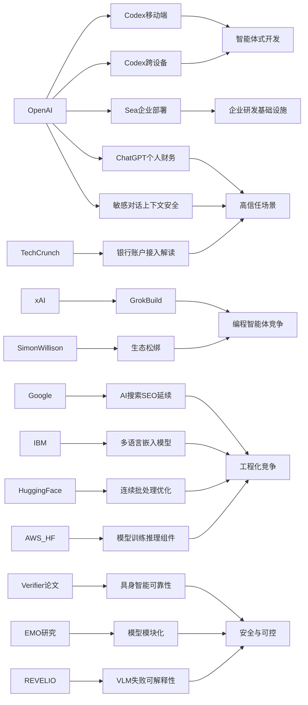

---
linkTitle: "05-15 AI资讯"
title: "AI资讯日报 2026/5/15"
weight: 15
breadcrumbs: false
comments: false
description: "## **今日摘要**  OpenAI 正在把 Codex 从桌面扩展到移动端和跨设备场景，新增 Remote SSH、hooks 和程序令牌等能力，并已在 Sea 等企业中加速落地，显示 AI 编程助手正从试点走向日常研发基础设施。   ..."

> AI 早报 · 每日早读 · 全网深度聚合

## **今日摘要**

OpenAI 正在把 Codex 从桌面扩展到移动端和跨设备场景，新增 Remote SSH、hooks 和程序令牌等能力，并已在 Sea 等企业中加速落地，显示 AI 编程助手正从试点走向日常研发基础设施。  
研究与搜索领域方面，Google 认为 AI 搜索优化本质上仍是传统 SEO 的延伸，而具身智能体的验证器决策方法和 EMO 的自然模块化研究，则分别探索了提升 AI 行动可靠性与模型效率/可解释性的方向。  
同时，ChatGPT 也开始进入个人财务管理场景，可连接银行账户分析支出、订阅和现金流，但这类更深度的现实应用也让隐私、责任边界和建议可靠性问题更加突出。

### 🔵 产品与功能更新

1. **OpenAI把 Codex 带到 ChatGPT 手机端。**  
现在用户可以在手机里远程查看、管理和批准编码任务，不用一直守在电脑前。此次更新还加入了 Remote SSH（远程安全登录）、hooks（自动触发流程）和 programmatic tokens（程序调用令牌）等能力，更适合企业自动化开发。整体趋势也很明显：开发工具正从“代码编辑器优先”转向“智能体优先”的交互方式。🚀  
[Codex移动端更新解读](https://news.smol.ai/issues/26-05-14-not-much/)

2. **OpenAI发布“随时随地使用 Codex”。**  
官方进一步说明，Codex 现在可以跨设备工作，用户能在移动端实时监控、调整并审批编程任务。它也支持连接远程环境，让开发流程不再局限于本地机器。对经常在路上的工程团队来说，这会明显提升协作灵活性。🚀  
[Codex跨设备使用说明](https://openai.com/index/work-with-codex-from-anywhere)

3. **Sea 在亚洲工程团队中部署 Codex。**  
Sea Limited 的产品负责人表示，公司正把 Codex 推向更多工程团队，用来加快“AI 原生”软件开发。重点不是把 AI 当插件，而是把它直接嵌进日常研发流程里。这个案例说明，企业级 AI 编程助手正在从试点走向更大规模落地。🚀  
[Sea部署Codex案例](https://openai.com/index/sea-david-chen)

### 🟢 前沿研究

1. **Google称 AI 搜索不需要一套全新的 SEO 玩法。**  
Google 最新说明认为，所谓 GEO（生成式引擎优化）或 AEO（答案引擎优化），本质上仍是传统 SEO（搜索引擎优化）的延伸。它还点名淡化了 LLMS.txt 和内容切块等热门做法，强调 AI 搜索依旧建立在原有排序系统上。对内容团队来说，这意味着不必为 AI 搜索完全重做方法论。🚀  
[Google谈AI搜索优化](https://the-decoder.com/google-busts-the-myth-that-ai-search-needs-its-own-seo-playbook/)

2. **Verifier-Guided Action Selection 提升具身智能体决策。**  
这篇论文聚焦 embodied agents（具身智能体），也就是能在现实或模拟环境中行动的 AI 系统。作者提出“先多想一次、再执行一次”的思路，用 verifier（验证器）帮助模型在行动前筛选更可靠的方案。它试图缓解多模态大模型在复杂真实任务中“会推理但容易出错”的问题。🚀  
[具身智能体验证新论文](https://arxiv.org/abs/2605.12620)

3. **EMO 探索混合专家模型的“自然模块化”。**  
AllenAI 介绍的 EMO 研究，围绕 Mixture of Experts（混合专家模型）展开，目标是在预训练阶段让模型自然形成更清晰的功能分工。简单说，就是让不同“专家”子模块各自擅长不同任务，而不是所有能力都混在一起。这样的设计有望提升大模型效率与可解释性。🚀  
[EMO模块化研究介绍](https://huggingface.co/blog/allenai/emo)

### 🟡 行业展望与社会影响

1. **ChatGPT开始试水个人财务助手。**  
OpenAI 面向美国 Pro 用户推出新的个人财务体验，支持通过 Plaid（金融数据连接服务）接入银行账户。接入后，ChatGPT 可以基于真实交易记录分析支出、订阅和现金流情况，给出更贴近个人背景的建议。OpenAI 也明确提醒，它还不是持牌财务顾问。🚀  
[ChatGPT财务功能预览](https://openai.com/index/personal-finance-chatgpt)

2. **TechCrunch详解 ChatGPT 连接银行账户的新能力。**  
报道指出，用户完成账户连接后，可以看到投资组合表现、日常支出、订阅项目和待支付账单等仪表盘信息。相比泛泛而谈的理财建议，这一步让 AI 助手开始进入更具体的个人财务管理场景。不过这也会把隐私、责任边界和建议可靠性的问题推到台前。🚀  
[银行账户接入功能解读](https://techcrunch.com/2026/05/15/openai-launches-chatgpt-for-personal-finance-will-let-you-connect-bank-accounts/)

3. **OpenAI更新 ChatGPT 敏感对话的上下文识别能力。**  
这次安全更新强调，模型会更好地理解一段对话在持续过程中的风险变化，而不是只看单条消息。换句话说，系统希望通过更完整的上下文判断，在敏感场景中给出更稳妥的回应。这反映出 AI 安全正在从“单轮拦截”走向“连续理解”。🚀  
[敏感对话安全更新](https://openai.com/index/chatgpt-recognize-context-in-sensitive-conversations)

### 🟣 开源TOP项目

1. **IBM开源多语言嵌入模型 Granite Embedding Multilingual R2。**  
这是一类 embedding（文本向量表示）模型，可把不同语言内容转换成便于检索和匹配的数字表示。IBM 强调它在 32K 上下文和较小参数规模下取得了不错的检索效果，适合多语言搜索与知识库场景。对希望低成本部署多语种 AI 检索的团队来说，这是个值得关注的开源选择。🚀  
[IBM多语嵌入模型](https://huggingface.co/blog/ibm-granite/granite-embedding-multilingual-r2)

2. **Hugging Face 介绍连续批处理的异步化优化。**  
文章讨论 continuous batching（连续批处理）如何通过异步机制提升模型推理吞吐量。简单理解，就是让模型服务在处理不同请求时更少“空等”，从而更高效地利用算力。对于部署大模型 API 或推理服务的开发者，这类底层优化非常实用。🚀  
[连续批处理优化解析](https://huggingface.co/blog/continuous_async)

3. **AWS 与 Hugging Face总结基础模型训练和推理组件。**  
这篇文章梳理了在 AWS 上进行 foundation model（基础模型）训练与推理的关键构建模块。内容覆盖基础设施、部署方式和工程组合思路，适合团队理解从训练到上线的完整路径。对于希望在云上搭建 AI 能力的组织，这是一份偏实战的参考。🚀  
[AWS模型构建指南](https://huggingface.co/blog/amazon/foundation-model-building-blocks)

### 🔴 社媒分享

1. **xAI 推出首个终端式编程智能体 Grok Build。**  
这款工具主打 terminal-based（终端式）使用方式，意味着开发者可以直接在命令行环境中与 AI 协作写代码。报道认为，xAI 正在追赶当前火热的 coding agent（编程智能体）赛道。它也说明“AI 写代码”竞争正从聊天窗口扩展到更贴近开发者工作流的界面。🚀  
[xAI编程智能体动态](https://the-decoder.com/x-ai-plays-catch-up-with-grok-build-its-first-terminal-based-coding-agent/)

2. **Simon Willison 谈“没那么锁定了”。**  
这篇分享围绕 AI 工具生态中的“锁定效应”变化展开，标题直接点出如今用户不再像过去那样容易被单一平台绑住。背后反映的是模型、工具和接口逐渐开放后，迁移成本开始下降。对用户和开发者来说，这通常意味着更多选择权。🚀  
[AI生态锁定变化观察](https://simonwillison.net/2026/May/14/not-so-locked-in/#atom-everything)

3. **REVELIO 研究关注视觉语言模型的可解释失败模式。**  
论文讨论 Vision-Language Models（视觉语言模型）在关键场景里可能出现的灾难性失误，并尝试把这些失败模式更清晰地揭示出来。相比只看总体分数，这类研究更关心模型会“在哪些情况下出事、为什么出事”。这对安全要求高的应用领域尤其重要。🚀  
[视觉语言模型失误研究](https://arxiv.org/abs/2605.12674)

📊 行业洞察

1. 事实  
   OpenAI 连续发布 Codex 移动端、跨设备协作、Remote SSH（远程安全登录）、hooks（自动触发流程）、programmatic tokens（程序调用令牌）等能力；Sea 也已在亚洲工程团队中扩大部署 Codex，用于“AI 原生”研发流程。  
   【洞察】AI 编程助手正从“个人提效工具”升级为“企业级研发基础设施”。其竞争焦点已不只是代码补全，而是围绕多端协同、远程环境接入、自动化工作流和组织级落地能力，向 agentic development（智能体式开发）平台演进。

2. 事实  
   xAI 推出 terminal-based（终端式）编程智能体 Grok Build；与此同时，Simon Willison 提到 AI 工具生态“没那么锁定了”，表明模型、接口和工具链的迁移成本在下降。  
   【洞察】编程智能体赛道正在进入“入口重构+生态松绑”阶段：一方面，聊天框、IDE（集成开发环境）、终端三类入口并行竞争；另一方面，用户对单一平台的依赖减弱，未来胜负更取决于工作流整合深度、环境控制能力与开发者体验，而非单纯模型品牌。

3. 事实  
   OpenAI 开始让 ChatGPT 通过 Plaid（金融数据连接服务）接入银行账户，提供支出、订阅、账单和投资组合分析；同时，OpenAI 更新了 ChatGPT 对敏感对话的上下文识别能力，强调基于连续上下文进行风险判断。  
   【洞察】AI 助手正加速进入高信任、高责任场景，而“能力扩张”必须与“风险感知升级”同步推进。金融助手类应用说明，行业下一阶段不再只是展示模型会不会回答问题，而是比拼真实数据接入、上下文安全控制、责任边界设计三项综合能力。

4. 事实  
   Google 表示 GEO（生成式引擎优化）/AEO（答案引擎优化）本质仍是 SEO（搜索引擎优化）的延伸；IBM 开源多语言 embedding（文本向量表示）模型，Hugging Face 讨论 continuous batching（连续批处理）异步优化，AWS 与 Hugging Face 则梳理基础模型训练与推理组件。  
   【洞察】AI 产业正在从“概念创新”回落到“工程现实”：上层流量规则并未被彻底改写，下层基础设施却在持续优化。对企业而言，真正的竞争优势将更多来自检索、推理效率、多语言能力和部署体系，而不是追逐每一个新概念标签。

🗺️ 今日关系图

