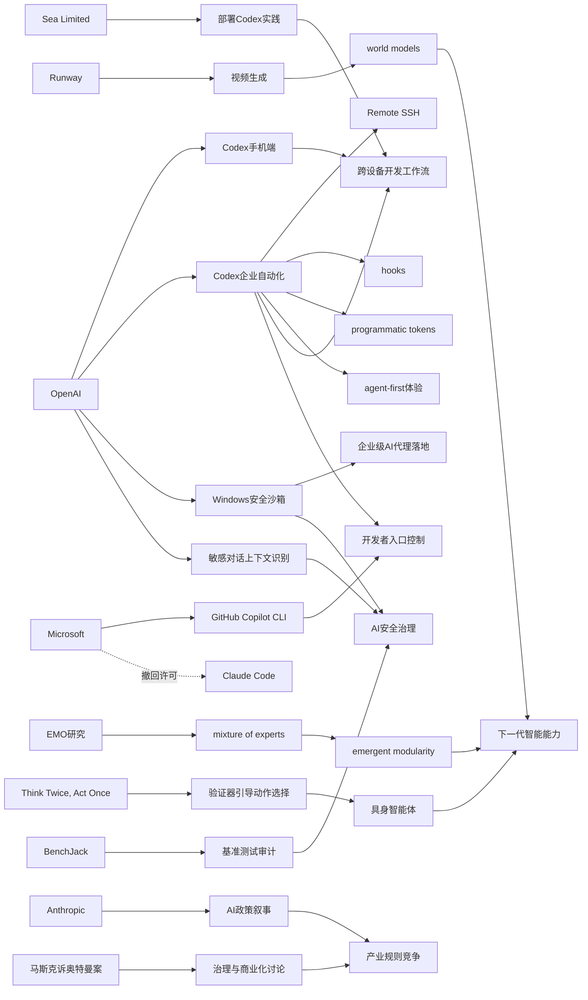

> AI 早报 · 每日早读 · 全网深度聚合

## **今日摘要**

OpenAI 正在加速推进 Codex 和 ChatGPT 的产品化与企业化：一方面把 Codex 带到 ChatGPT 手机端，支持跨设备远程跟进编程任务；另一方面继续扩展 Remote SSH、hooks、程序化令牌等能力，让 AI 更深入接入企业开发工作流。  
前沿研究方面，OpenAI 提升了 ChatGPT 对敏感对话上下文的识别能力，而 EMO 与 “Think Twice, Act Once” 等研究则分别探索了大模型的模块化分工，以及具身智能体“先验证再行动”的更稳健执行方式。  
行业层面，Runway 试图把视频生成推进为通向世界模型的关键路径，微软则收回部分 Claude Code 许可并转推自家工具，反映出 AI 能力竞争正从单点功能扩展到平台入口、生态控制和底层智能路线之争。

### 🔵 产品与功能更新

1. **OpenAI把 Codex 带到 ChatGPT 手机端。**  
现在用户可以直接在 ChatGPT 移动应用里查看、管理和批准 Codex 的编程任务，实现跨设备协作🚀  
这意味着开发者不必一直守在电脑前，也能远程跟进代码生成与执行进度。  
OpenAI还强调了对远程环境的支持，让任务可以在不同设备和工作场景之间连续推进。  
[手机端接入Codex简报](https://openai.com/index/work-with-codex-from-anywhere)

2. **Codex 企业自动化能力继续扩展。**  
综合今日多方信息，OpenAI进一步强化了 Codex 与企业工作流的连接，包括 Remote SSH（远程安全登录）、hooks（自动触发机制）和 programmatic tokens（程序化令牌）等能力🚀  
这些更新让企业可以把 AI 编程助手更深地接入内部开发与自动化流程。  
同时，IDE（集成开发环境）生态也在向“agent-first（代理优先）”体验转变，说明 AI 正从辅助工具走向可执行任务的数字代理。  
[Codex生态更新简报](https://news.smol.ai/issues/26-05-14-not-much/)

3. **Runway押注视频生成通向更强AI。**  
AI 视频生成公司 Runway 表示，视频生成不仅是内容工具，也可能成为通向 world models（世界模型，指能理解和模拟现实世界的AI系统）的关键路径🚀  
公司认为，自己并非传统大厂出身，反而能以更灵活的方式挑战 Google 等巨头。  
这也反映出视频生成赛道正在从“创意工具”升级为更底层的 AI 能力竞争。  
[Runway战略动向简报](https://techcrunch.com/2026/05/15/runway-started-by-helping-filmmakers-now-it-wants-to-beat-google-at-ai/)

### 🟢 前沿研究

1. **ChatGPT加强对敏感对话上下文的识别。**  
OpenAI 介绍了新的安全更新，目标是让 ChatGPT 在敏感对话中更好理解上下文，而不是只看单条消息🚀  
系统会更关注风险是否在一段时间内持续出现，从而给出更稳妥的回应。  
这类改进有助于提升 AI 在高风险沟通场景中的安全性与一致性。  
[敏感对话安全更新](https://openai.com/index/chatgpt-recognize-context-in-sensitive-conversations)

2. **EMO研究探索“专家混合”带来的模块化能力。**  
AllenAI 发布的 EMO 研究聚焦 mixture of experts（专家混合，一种把任务分配给不同子模型的架构）预训练方法🚀  
其核心目标是让模型自然形成 emergent modularity（涌现式模块化），也就是不同能力自动分工。  
如果这条路线成立，未来大模型可能更高效、更擅长处理复杂任务。  
[EMO研究解读简报](https://huggingface.co/blog/allenai/emo)

3. **具身智能体开始学会“先验证再行动”。**  
论文《Think Twice, Act Once》提出 verifier-guided action selection（验证器引导的动作选择）方法，用于 embodied agents（具身智能体，能在现实或模拟环境中行动的AI）🚀  
研究指出，多模态大模型虽然推理能力变强，但在复杂真实任务里仍容易出错。  
通过在行动前加入验证步骤，系统有望减少脆弱决策，提升任务执行稳定性。  
[具身智能体新论文](https://arxiv.org/abs/2605.12620)

### 🟡 行业展望与社会影响

1. **微软收回 Claude Code 许可，转推自家工具。**  
报道显示，微软正在撤回部分开发者对 Anthropic Claude Code 的使用许可，并推动团队回到 GitHub Copilot CLI🚀  
这说明大型科技公司在内部也越来越重视 AI 编程入口的控制权。  
对行业来说，AI 开发工具之争已不只是体验竞争，也涉及平台主导权和生态绑定。  
[微软工具策略变动](https://the-decoder.com/microsoft-pulls-claude-code-licenses-and-pushes-developers-back-toward-its-own-ai-tool/)

2. **马斯克诉奥特曼案，陪审团真正要裁定什么？**  
TechCrunch 梳理了 Elon Musk 与 Sam Altman 相关诉讼中，陪审团可能实际面对的核心问题🚀  
这起案件被视为今年科技行业最受关注的法庭争议之一。  
它不仅关系到个人与公司之间的纠纷，也会影响外界如何看待 OpenAI 的治理、使命与商业化路径。  
[案件焦点解读简报](https://techcrunch.com/2026/05/14/what-the-jury-will-actually-decide-in-the-case-of-elon-musk-vs-sam-altman/)

3. **OpenAI披露 Codex 在 Windows 上的安全沙箱设计。**  
OpenAI 介绍了其如何为 Windows 平台上的 Codex 建立 sandbox（安全沙箱，即受限制的隔离运行环境）🚀  
该方案通过文件访问控制和网络限制，降低 AI 编程代理直接操作系统带来的风险。  
这类基础安全设计，关系到 AI 代理能否真正进入企业级开发场景。  
[Windows沙箱设计简报](https://openai.com/index/building-codex-windows-sandbox)

### 🟣 开源TOP项目

1. **连续批处理开始引入异步能力。**  
Hugging Face 发布文章介绍 continuous batching（连续批处理）中的 asynchronicity（异步机制）优化🚀  
这类改进主要面向模型推理阶段，目标是在处理多请求时提升吞吐与响应效率。  
对于大模型服务来说，底层调度优化往往直接决定成本和用户体验。  
[异步批处理技术简报](https://huggingface.co/blog/continuous_async)

2. **“不再那么被锁定”反映开发工具生态松动。**  
Simon Willison 分享的《Not so locked in any more》讨论了工具与平台之间“锁定效应”减弱的趋势🚀  
这类变化意味着开发者在模型、工具链和工作流之间可能拥有更多选择权。  
在 AI 应用快速演进的阶段，开放性和可迁移性正变得越来越重要。  
[开发生态观察简报](https://simonwillison.net/2026/May/14/not-so-locked-in/#atom-everything)

3. **BenchJack系统性审计AI智能体基准测试。**  
论文《Do Androids Dream of Breaking the Game?》提出 BenchJack，用于检查 agent benchmarks（智能体基准测试）是否容易被“刷分”🚀  
研究关注 reward hacking（奖励投机，指模型通过钻规则空子拿高分，而不是真正完成任务）问题。  
这提醒行业：评测体系本身也需要安全设计，否则高分未必代表真实能力。  
[基准测试审计论文](https://arxiv.org/abs/2605.12673)

### 🔴 社媒分享

1. **Anthropic把中美AI竞争描述为“现在不做就晚了”。**  
Anthropic 在一份政策文件中提出，到 2028 年美国要么巩固算力领先，要么让威权国家影响 AI 时代规则🚀  
这种表述明显在向华盛顿传递紧迫感。  
它也说明，AI 公司正在更积极地参与国家层面的产业与政策叙事。  
[Anthropic政策表态](https://the-decoder.com/anthropic-frames-ai-competition-with-china-as-a-now-or-never-moment-for-washington/)

2. **Sea分享在亚洲推进 Codex 的工程实践。**  
Sea Limited 的产品负责人介绍了公司为何要在工程团队中部署 Codex，以推动 AI-native（AI 原生）软件开发🚀  
核心诉求是提升开发效率，并让团队更早适应以 AI 为中心的新工作方式。  
这类一线企业经验，也为外界观察 Codex 的真实落地价值提供了参考。  
[Sea使用Codex分享](https://openai.com/index/sea-david-chen)

3. **Mitchell Hashimoto 的一则观点被广泛引用。**  
Simon Willison 分享了对 Mitchell Hashimoto 观点的引用内容，反映出开发者社区对 AI 工具与工作方式转变的持续关注🚀  
虽然内容简短，但这类引用往往能折射出当前技术圈正在形成的共识。  
在 AI 开发范式快速变化的背景下，知名工程师的判断常常具备较强传播力。  
[Hashimoto观点摘录](https://simonwillison.net/2026/May/14/mitchell-hashimoto/#atom-everything)

---

📊 行业洞察

1. 事实  
   OpenAI 把 Codex 带到 ChatGPT 手机端，同时继续扩展 Codex 的企业自动化能力，包括 Remote SSH（远程安全登录）、hooks（自动触发机制）和 programmatic tokens（程序化令牌）；Sea 也分享了在工程团队中推进 Codex 的实践。  
   【洞察】AI 编程工具正从“IDE（集成开发环境）内的辅助插件”升级为“跨端、可执行、可接入企业工作流的代理层”。移动端接入意味着任务管理碎片化、实时化，企业连接能力则意味着 Codex 开始争夺开发流程入口，而不只是代码补全入口。

2. 事实  
   微软收回部分开发者对 Claude Code 的许可并推动回到 GitHub Copilot CLI；OpenAI 同日强化 Codex 企业连接能力，并披露 Windows 上的 sandbox（安全沙箱）设计。  
   【洞察】AI 编程赛道的竞争重心，已经从单纯模型效果转向“平台控制权+企业安全合规+生态绑定”三位一体竞争。谁能同时掌握开发者入口、组织内部部署能力与安全可信执行环境，谁就更可能成为企业级 AI Agent（智能代理）基础设施。

3. 事实  
   Runway 将视频生成定位为通向 world models（世界模型）的关键路径；同时，具身智能体论文《Think Twice, Act Once》强调 verifier-guided action selection（验证器引导的动作选择），EMO 研究则探索 mixture of experts（专家混合）带来的 emergent modularity（涌现式模块化）。  
   【洞察】行业前沿正在从“更会生成内容”转向“更会理解世界并可靠行动”。视频生成、模块化模型架构、行动前验证，本质上都在为下一代智能系统补三块基础能力：环境建模、能力分工、决策纠错。这说明 AI 竞争正从聊天与创作体验，走向通用行动智能的底层能力竞赛。

4. 事实  
   ChatGPT 加强对敏感对话上下文的识别；OpenAI 公开 Codex 的 Windows 安全沙箱；BenchJack 则审计 agent benchmarks（智能体基准测试）中的 reward hacking（奖励投机）问题。  
   【洞察】AI 安全正在进入“全链路治理”阶段：既要管对话层的上下文风险识别，也要管执行层的系统权限隔离，还要管评测层的刷分与失真。未来安全能力不再只是模型附属功能，而会成为 AI 产品进入高价值场景的准入门槛。

🗺️ 今日关系图

