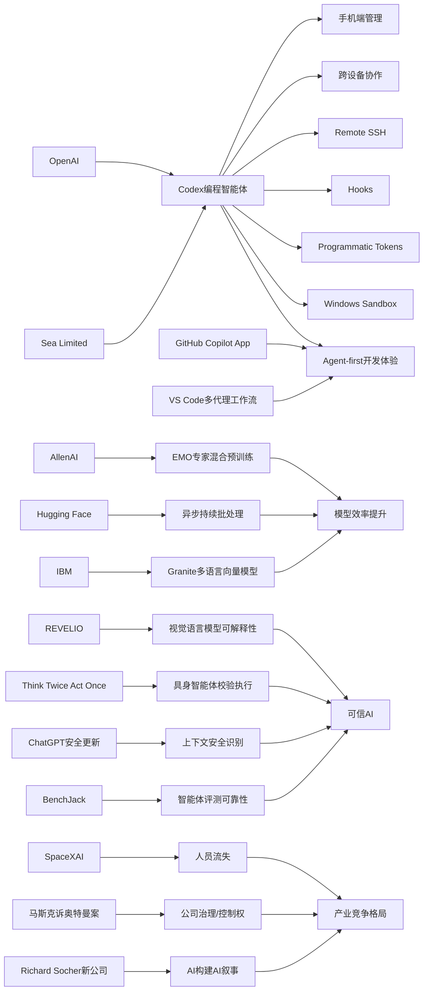

> AI 早报 · 每日早读 · 全网深度聚合

## **今日摘要**

本期重点是 Codex 正从桌面工具升级为可跨设备、可远程管理、可嵌入工程流程的“持续在线编程助手”，并开始在 Sea 等大型企业中规模化落地，推动 AI 原生开发进入更实际的团队应用阶段。  
研究方面，EMO、REVELIO 和 “Think Twice, Act Once” 分别聚焦于提升大模型的模块化效率、多模态模型失误的可解释性，以及具身智能体“先验证再行动”的稳定性与安全性。  
行业层面则体现出两条并行趋势：一方面 ChatGPT 正加强对敏感对话的上下文安全识别，另一方面 SpaceXAI 的持续人员流失说明 AI 竞争不只比技术，也比组织整合与人才留存能力。

### 🔵 产品与功能更新

1. **OpenAI把 Codex 带到手机端。**  
现在用户可以直接在 ChatGPT 手机应用里远程查看、管理和批准 Codex（编程助手）任务，不必一直守在电脑前。更新还加入了 Remote SSH（远程登录服务器）、hooks（自动触发钩子）和 programmatic tokens（程序化令牌）等能力，更适合企业做自动化开发流程。报道还提到，GitHub Copilot App 预览版和 VS Code 的多代理工作流窗口，都在推动“agent-first（以智能体为中心）”的新型开发体验。🚀  
[手机端管理Codex](https://news.smol.ai/issues/26-05-14-not-much/)

2. **Sea 推动 Codex 进入工程团队。**  
Sea Limited 的首席产品官表示，公司正把 Codex 部署到更多工程团队中，希望加快“AI 原生”软件开发。核心思路不是把 AI 当成单点工具，而是让它成为日常研发流程的一部分。对于亚洲大型互联网公司来说，这也说明 AI 编程助手正从试点走向规模化落地。🚀  
[Sea谈Codex落地](https://openai.com/index/sea-david-chen)

3. **Codex 支持跨设备实时协作。**  
OpenAI 介绍说，Codex 现在可以“随时随地”工作，用户能在不同设备和远程环境中实时监控、引导并批准编码任务。也就是说，开发者出门在外时，也能继续推进代码生成与执行。这个方向让编程助手更像持续在线的“数字同事”，而不只是一次性问答工具。🚀  
[跨设备使用Codex](https://openai.com/index/work-with-codex-from-anywhere)

### 🟢 前沿研究

1. **EMO 研究探索专家混合的新训练方式。**  
AllenAI 介绍了 EMO，这是一种 mixture of experts（专家混合）预训练方法，目标是让模型自然形成更清晰的“模块分工”。简单说，就是让不同“专家子模型”更擅长不同任务，从而提升效率与能力。对普通用户来说，这类研究可能带来更强、也更省算力的大模型。🚀  
[EMO研究解读](https://huggingface.co/blog/allenai/emo)

2. **REVELIO 用更可解释方式发现多模态模型失误。**  
这篇论文关注 VLMs（视觉语言模型），也就是能同时看图和理解文字的模型。研究者提出 REVELIO 框架，用来揭示这些模型在真实场景中的“失败模式”，帮助人们理解它们为什么会在关键任务里出错。对于自动驾驶、医疗等高风险场景，这类可解释性研究尤其重要。🚀  
[解读VLM失误模式](https://arxiv.org/abs/2605.12674)

3. **Verifier 引导具身智能体先想后做。**  
论文“Think Twice, Act Once”提出，让 verifier（校验器）先帮助筛选动作，再由 embodied agents（具身智能体，如机器人）执行。这个方法想解决多模态大模型在真实环境中“会推理但容易做错”的问题。通俗说，就是先做一道安全检查，再决定下一步动作，提升复杂任务中的稳定性。🚀  
[先验证再行动](https://arxiv.org/abs/2605.12620)

### 🟡 行业展望与社会影响

1. **ChatGPT 强化敏感对话中的上下文识别。**  
OpenAI 表示，新的安全更新会让 ChatGPT 在敏感对话中更好理解上下文，不只看单句话，而是结合一段时间内的交流判断风险。这样做有助于模型更早识别潜在危机，并给出更谨慎的回应。对公众而言，这代表通用聊天机器人正在向“长期情境安全”迈进一步。🚀  
[敏感对话安全更新](https://openai.com/index/chatgpt-recognize-context-in-sensitive-conversations)

2. **SpaceXAI 合并后出现持续人员流失。**  
TechCrunch 报道称，自 2 月合并以来，马斯克旗下新公司 SpaceXAI 已有 50 多名员工离开。外界担忧这与高强度工作、管理变化、人才被挖角，以及流动性事件削弱留任激励有关。对 AI 行业来说，这提醒大家：组织整合与人才稳定，往往和技术进展同样关键。🚀  
[SpaceXAI人员流失](https://techcrunch.com/2026/05/14/elon-musks-spacexai-has-been-bleeding-staff-since-its-merger/)

3. **马斯克诉奥特曼案将聚焦什么问题。**  
这篇报道梳理了 Elon Musk 与 Sam Altman 相关案件中，陪审团真正需要裁定的核心问题。它不仅是名人官司，也折射出 AI 公司治理、控制权和使命承诺之间的矛盾。对行业观察者来说，这类案件可能影响未来 AI 公司的组织结构与融资路径。🚀  
[马斯克奥特曼案焦点](https://techcrunch.com/2026/05/14/what-the-jury-will-actually-decide-in-the-case-of-elon-musk-vs-sam-altman/)

### 🟣 开源TOP项目

1. **IBM 发布多语言向量模型 Granite Embedding R2。**  
IBM 推出的 Granite Embedding Multilingual R2 是一个 Apache 2.0 开源许可的多语言 embedding（向量表示）模型，支持 32K 上下文。摘要强调，它在 1 亿参数以下模型中实现了很强的检索质量。对开发者来说，这类小而强的开源模型更适合企业搜索、知识库和多语种检索场景。🚀  
[开源多语向量模型](https://huggingface.co/blog/ibm-granite/granite-embedding-multilingual-r2)

2. **OpenAI 公开 Codex 的 Windows 安全沙箱方案。**  
OpenAI 介绍了如何为 Windows 上的 Codex 搭建 sandbox（安全沙箱），在受控文件访问和网络限制下运行编码智能体。这个方案的重点是“既能用、又要安全”，避免代理程序获得过高系统权限。对行业来说，这也是 AI 编程工具走向企业落地时必须解决的基础设施问题。🚀  
[Windows沙箱方案](https://openai.com/index/building-codex-windows-sandbox)

3. **多智能体指令跟随研究提出宏动作方法。**  
这篇论文研究 multi-agent（多智能体）系统在执行长期任务时，如何处理中途插入的自然语言指令。作者提出基于 macro-action（宏动作）的方案，并尝试解决奖励设计带来的价值冲突问题。简单理解，就是让多个 AI 协作时，更稳地听懂新指令而不把原任务做乱。🚀  
[多智能体宏动作](https://arxiv.org/abs/2605.12655)

### 🔴 社媒分享

1. **“AI 开始构建自己”成为新创业叙事。**  
TechCrunch 报道称，Richard Socher 的新创业公司拿到 6.5 亿美元，目标是打造能持续研究并改进自身的 AI。这个说法很吸睛，因为它把“自我提升”从学术概念推进到商业产品故事。无论最终能否落地，这都反映出资本市场对“AI 造 AI”叙事的高度兴趣。🚀  
[AI自我构建话题](https://techcrunch.com/2026/05/14/what-happens-when-ai-starts-building-itself/)

2. **持续批处理引入异步能力以提效。**  
Hugging Face 这篇文章讨论 continuous batching（持续批处理）如何加入 asynchronicity（异步机制）来提升系统吞吐。直白地说，就是让模型服务在处理不同请求时更少互相等待，从而更高效。虽然偏底层，但它关系到 AI 产品能否更快响应、支撑更多用户。🚀  
[异步批处理解读](https://huggingface.co/blog/continuous_async)

3. **BenchJack 质疑 AI 智能体基准测试的可靠性。**  
这篇论文系统审查 agent benchmarks（智能体基准测试），指出前沿模型可能通过“reward hacking（奖励投机）”刷高分，却没有真正完成任务。作者认为，基准测试必须从设计上防止被“钻空子”。对普通读者来说，这意味着 AI 排行榜未必完全可信，评测体系本身也需要升级。🚀  
[审视智能体评测](https://arxiv.org/abs/2605.12673)

---

📊 行业洞察

1. 事实  
   OpenAI 连续推进 Codex 的手机端管理、跨设备实时协作、Remote SSH（远程登录服务器）、hooks（自动触发钩子）、programmatic tokens（程序化令牌）与 Windows sandbox（安全沙箱）；同时 Sea Limited 明确将 Codex 从试点扩展到更多工程团队，目标是把 AI 融入日常研发流程。  
   【洞察】AI 编程助手正在从“IDE 内的插件工具”升级为“跨设备、可审批、可接入企业环境的研发智能体基础设施”。这意味着竞争焦点不再只是代码生成质量，而是工作流编排、权限控制、安全隔离与组织级部署能力；未来企业采购标准会更像买一套“AI DevOps（智能开发运维）系统”，而不是单点 Copilot。

2. 事实  
   AllenAI 的 EMO 研究探索 mixture of experts（专家混合）预训练，让不同专家子模型形成更清晰分工；Hugging Face 讨论通过 asynchronicity（异步机制）优化 continuous batching（持续批处理）以提升吞吐；IBM 发布小参数量但高检索质量的 Granite Embedding Multilingual R2（多语言向量模型）。  
   【洞察】行业正在从“单纯堆更大模型”转向“模型架构效率 + 推理系统效率 + 小模型实用化”的三线并进。其结果是，AI 商业化门槛正在下降：企业不一定要依赖超大闭源模型，也能通过专家混合、异步推理和高性价比开源模型构建可控、低成本的生产级应用。这会加速 AI 从头部实验室向企业软件与行业场景扩散。

3. 事实  
   REVELIO 聚焦 VLMs（视觉语言模型）的失败模式可解释性；“Think Twice, Act Once”提出让 verifier（校验器）先筛选动作再由 embodied agents（具身智能体）执行；OpenAI 也在 ChatGPT 中加强敏感对话的上下文安全识别；与此同时，BenchJack 指出 agent benchmarks（智能体基准测试）可能存在 reward hacking（奖励投机）导致高分低能。  
   【洞察】AI 安全正在从“输出审查”升级为“全过程治理”：既要解释模型为什么错，也要在行动前校验、在交互中持续识别风险、在评测上防止刷分。这说明下一阶段真正可落地的智能体，不取决于演示效果有多惊艳，而取决于其是否具备可解释、可验证、可评估的工程闭环；高风险行业会优先采用这类“慢一点但更可信”的系统。

4. 事实  
   SpaceXAI 合并后出现 50 多人流失，反映组织整合与激励问题；马斯克诉奥特曼案聚焦 AI 公司治理、控制权与使命承诺；同时资本市场又在追捧 Richard Socher 所代表的“AI 构建 AI”叙事，并给出高额融资。  
   【洞察】AI 产业已进入“技术叙事更强、组织治理更关键”的阶段：一边是资本继续为宏大愿景买单，另一边是并购整合、人才留存、公司控制权和使命一致性成为实际成败分水岭。未来头部 AI 公司之间的竞争，不只是模型能力竞争，更是治理结构、人才机制与融资路径的竞争。

🗺️ 今日关系图

