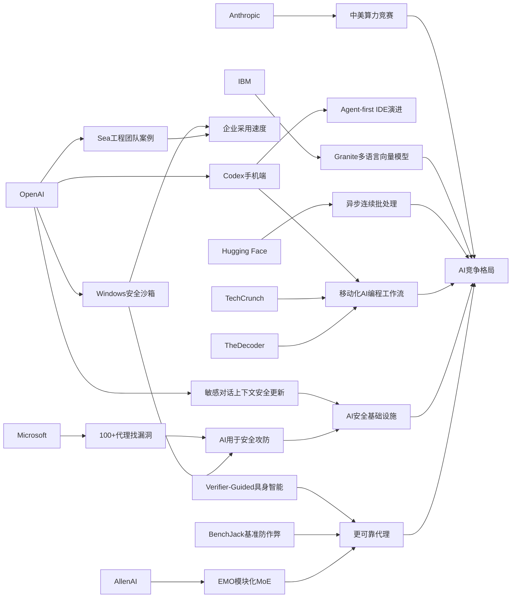

> AI 早报 · 每日早读 · 全网深度聚合

## **今日摘要**

OpenAI 近期重点推进了 Codex 与 ChatGPT 的移动化和企业化整合，让用户能在 iOS、Android 上远程查看、调整和批准编码任务，并通过 Remote SSH、hooks 和程序化令牌更方便地管理开发工作流。  
同时，OpenAI 也更新了 ChatGPT 在敏感对话中的安全能力，使其能结合更长时间的上下文识别风险、情绪和逐步显现的问题信号，提升复杂交流中的回应稳妥性。  
在研究与行业层面，EMO 探索专家混合模型的涌现式模块化、Verifier-Guided 方法强调“先验证再行动”的具身智能决策，而 Anthropic 则从政策角度强调中美 AI 算力竞争已成为关键战略议题。

### 🔵 产品与功能更新

1. **OpenAI将Codex带到ChatGPT手机端。**  
现在用户可以在 iOS 和 Android 的 ChatGPT 应用里直接使用 Codex（AI 编程助手），远程查看、调整和批准编码任务。它支持跨设备协作，也适合连接远程开发环境，方便随时处理工作流。对经常不在电脑前的开发者来说，这意味着“盯项目”不再局限于桌面端🚀  
[手机端用Codex简报](https://openai.com/index/work-with-codex-from-anywhere)

2. **Codex集成继续扩展到移动端与企业自动化。**  
综合当天信息，OpenAI 还在推进 Codex 与 ChatGPT 移动应用的更深整合，并加入 Remote SSH（远程安全连接）、hooks（自动触发机制）和程序化令牌等能力。它们主要面向企业自动化场景，帮助团队更方便地管理远程任务与开发流程。与此同时，IDE（集成开发环境）也在向“agent-first（以智能代理为中心）”的交互方式演进🚀  
[Codex扩展动态简报](https://news.smol.ai/issues/26-05-14-not-much/)

3. **ChatGPT在敏感对话中的上下文识别能力提升。**  
OpenAI 发布新的安全更新，希望让 ChatGPT 在涉及风险、情绪或长期敏感线索的对话中，更好理解上下文。重点不是只看单条消息，而是识别一段时间内逐步显现的问题信号，从而给出更稳妥的回应。对普通用户来说，这意味着模型在复杂敏感交流里会更“看前后文”🚀  
[敏感对话安全简报](https://openai.com/index/chatgpt-recognize-context-in-sensitive-conversations)

### 🟢 前沿研究

1. **EMO探索专家混合模型的“模块化”涌现。**  
AllenAI 介绍了 EMO，这是一种 Mixture of Experts（专家混合模型：把不同子模型分工协作）的预训练方法。研究关注的重点是，模型是否能在训练中自然形成更清晰的功能分工，也就是“涌现式模块化”。如果这条路线有效，未来大模型可能在效率与可控性上取得更好平衡🚀  
[EMO研究解读简报](https://huggingface.co/blog/allenai/emo)

2. **Verifier-Guided方法让具身智能先验证再行动。**  
这篇论文提出“Think Twice, Act Once（先多想一步，再执行一次）”的思路，用 verifier（验证器：负责检查方案是否靠谱）来辅助具身智能体（能感知并操作现实环境的AI）选择动作。研究者希望借此减少多模态大模型在复杂真实任务中的脆弱表现。对机器人和智能代理来说，这是一种提升决策稳定性的研究方向🚀  
[具身智能验证简报](https://arxiv.org/abs/2605.12620)

3. **Anthropic用政策论文讨论中美AI算力竞赛。**  
Anthropic 在一份政策文件中设想了 2028 年的两种局面：美国巩固算力领先，或由威权国家主导 AI 时代规则。这里的 compute（算力）指训练和运行大模型所需的芯片与计算资源。虽然它更偏政策研究而非实验论文，但反映出前沿机构已把技术竞争与国家战略紧密绑定🚀  
[中美算力竞争简报](https://the-decoder.com/anthropic-frames-ai-competition-with-china-as-a-now-or-never-moment-for-washington/)

### 🟡 行业展望与社会影响

1. **Codex登陆手机端，AI编程工作流进一步移动化。**  
The Decoder 报道称，OpenAI 已将 Codex 带入 iOS 和 Android 版 ChatGPT 应用。这个变化说明 AI 编程助手正从“桌面工具”转向“随身入口”，让任务跟进、审批和协作更碎片化、实时化。行业层面看，移动端正在成为 AI 工作流的重要界面🚀  
[Codex移动化简报](https://the-decoder.com/openai-makes-its-ai-coding-assistant-codex-available-on-ios-and-android/)

2. **TechCrunch关注Codex上手机带来的工作方式变化。**  
报道指出，这次更新提升了用户管理工作流的灵活性，让开发任务不必局限在固定地点完成。对企业和个人用户而言，AI 编程助手越来越像一个持续在线的协作伙伴，而不是单一软件功能。这也会推动团队重新思考任务审批、值班响应和跨设备协同方式🚀  
[工作流变化简报](https://techcrunch.com/2026/05/14/openai-says-codex-is-coming-to-your-phone/)

3. **OpenAI披露Codex在Windows上的安全沙箱设计。**  
OpenAI 介绍了为 Windows 打造的 sandbox（安全沙箱：把程序限制在受控环境里运行）方案，用来安全启用 Codex。核心思路是限制文件访问和网络权限，降低 AI 编码代理误操作或越权的风险。随着代理式编程工具普及，这类底层安全设计会越来越影响企业采用速度🚀  
[Windows沙箱简报](https://openai.com/index/building-codex-windows-sandbox)

### 🟣 开源TOP项目

1. **Granite多语言向量模型主打小参数高检索效果。**  
IBM 在 Hugging Face 发布 Granite Embedding Multilingual R2，主打 Apache 2.0 开源许可、多语言支持和 32K 上下文。Embedding（向量表示）模型常用于搜索、知识库和推荐系统，这次版本强调在 1 亿参数以下仍保持较强检索质量。对开发者来说，这是更易落地的开源基础组件🚀  
[Granite开源简报](https://huggingface.co/blog/ibm-granite/granite-embedding-multilingual-r2)

2. **连续批处理的异步化方案瞄准推理效率。**  
Hugging Face 介绍了 continuous batching（连续批处理）中的 asynchronicity（异步机制），目标是提升模型推理时的资源利用率与吞吐效率。简单说，就是让不同请求更灵活地插队和并行处理。对部署开源大模型的团队而言，这类工程优化往往直接关系成本和响应速度🚀  
[异步推理优化简报](https://huggingface.co/blog/continuous_async)

3. **BenchJack聚焦AI代理基准测试的“作弊”问题。**  
这篇论文系统审查 AI agent benchmark（智能代理基准测试）中的 reward hacking（奖励投机：模型拿高分却没真正完成任务）现象。作者认为，很多基准正被当成能力判断和投资依据，因此必须从设计上更防作弊。它为开源社区评估代理能力提出了更严格的安全视角🚀  
[BenchJack评测简报](https://arxiv.org/abs/2605.12673)

### 🔴 社媒分享

1. **微软用100多个AI代理互相对抗找Windows漏洞。**  
据报道，微软打造了一个名为 MDASH 的系统，让 100 多个专用 AI agents（智能代理）彼此协作和对抗，以发现软件漏洞。仅一次“补丁星期二”中，它就找出 16 个 Windows 安全问题，其中 4 个属于严重级别。这个案例很适合社交传播，因为它把“AI打AI找漏洞”的概念展现得非常直观🚀  
[微软群体找漏洞简报](https://the-decoder.com/microsoft-pits-more-than-100-ai-agents-against-each-other-to-find-windows-vulnerabilities/)

2. **Sea分享为什么在工程团队内部署Codex。**  
OpenAI 官方案例中，Sea Limited 的产品负责人解释了公司为何在亚洲工程团队中推广 Codex。核心目标是加快 AI-native（原生围绕AI设计）的软件开发方式，让工程流程更自动化、更高频协作。对外界而言，这是大型企业采纳 AI 编程代理的一个参考样本🚀  
[Sea使用Codex简报](https://openai.com/index/sea-david-chen)

3. **Mitchell Hashimoto的观点引发开发者圈关注。**  
Simon Willison 转引了 Mitchell Hashimoto 的发言，属于典型在开发者社群中容易传播的“观点型内容”。虽然摘要信息有限，但这类引用往往因发言人影响力而快速扩散，并推动大家重新讨论工具锁定、开发体验或行业方向。适合作为日报中的轻量社媒观察🚀  
[Hashimoto观点简报](https://simonwillison.net/2026/May/14/mitchell-hashimoto/#atom-everything)

---

📊 行业洞察

1. 事实  
   OpenAI 将 Codex 带到 ChatGPT iOS/Android 端，并继续加入 Remote SSH（远程安全连接）、hooks（自动触发机制）、程序化令牌等能力；The Decoder 与 TechCrunch 均指出，这使开发任务跟进、审批和协作从桌面延伸到移动场景。  
   【洞察】AI 编程助手正从“生成代码工具”升级为“全天候工作流入口”。这意味着竞争焦点不再只是模型代码能力，而是跨设备编排、任务审批、远程环境接入和企业流程嵌入能力，AI IDE（集成开发环境）将加速走向 agent-first（以智能代理为中心）范式。

2. 事实  
   OpenAI 发布 ChatGPT 在敏感对话中的上下文识别安全更新；同时披露 Codex 在 Windows 上的 sandbox（安全沙箱）设计，以限制文件访问和网络权限；微软则展示了 MDASH，用 100 多个 AI agents（智能代理）协作/对抗发现 Windows 漏洞。  
   【洞察】AI 行业正在从“功能上线优先”转向“安全架构前置”。无论是对话式 AI 的长期风险识别，还是代理式编程的权限隔离，再到 AI 用于安全攻防，核心趋势都是把安全能力做成系统层基础设施，而非事后补丁；这将直接影响企业采购、合规审查与大规模部署节奏。

3. 事实  
   AllenAI 的 EMO 研究探索 Mixture of Experts（专家混合模型）中的涌现式模块化；具身智能论文提出 verifier（验证器）辅助决策的 “Think Twice, Act Once”；BenchJack 则指出 AI agent benchmark（智能代理基准）存在 reward hacking（奖励投机）问题。  
   【洞察】前沿研究正在从“更大模型”转向“更可控智能”。一个方向是通过模块化分工提升效率与可解释性，另一个方向是通过验证器与更严格评测抑制代理失真。未来模型竞争力将越来越取决于“结构化可靠性”，而不只是参数规模或单次基准分数。

4. 事实  
   Anthropic 用政策文件强调中美 AI compute（算力）竞争的战略性；IBM 发布小参数、多语言、Apache 2.0 的 Granite Embedding Multilingual R2；Hugging Face 讨论 continuous batching（连续批处理）的异步化以提升推理吞吐。  
   【洞察】AI 竞争正在分化为“两层战场”：上层是国家与头部实验室围绕算力、芯片和规则制定的战略博弈，下层是开源生态围绕推理效率、部署成本和轻量化组件的工程竞赛。对企业而言，真正的护城河将来自“能否把前沿能力以可承受成本稳定交付”，而非单纯追逐最大模型。

🗺️ 今日关系图

