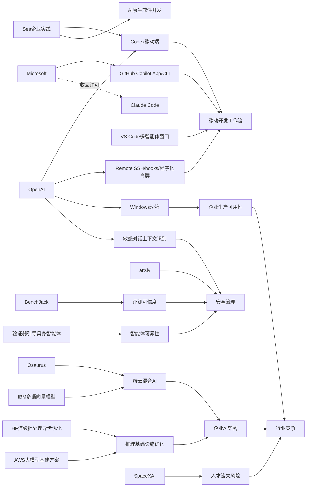

> AI 早报 · 每日早读 · 全网深度聚合

## **今日摘要**

OpenAI 正在把 AI 编程助手从“答疑工具”升级为“可随时接管任务的生产工具”：Codex 已进入 ChatGPT 手机端，并扩展了远程 SSH、hooks 和程序化令牌等能力，同时也有像 Osaurus 这样的产品探索本地与云端模型混合的更灵活路线。  
研究与安全层面，一方面 ChatGPT 提升了对敏感对话上下文的识别能力，另一方面具身智能体开始引入“先验证再行动”的机制，说明行业正同时强化模型的可靠性与现实执行能力。  
更宏观地看，无论是微软收回 Claude Code 许可转推自家工具，还是 arXiv 收紧 AI 生成论文管理，都表明 AI 竞争正从单纯比拼模型能力，转向平台控制、责任边界与制度治理的全面较量。

### 🔵 产品与功能更新

1. **OpenAI把 Codex 带到手机上。**
现在用户可以直接在 ChatGPT 手机应用里使用 Codex，随时查看、干预并批准编程任务。它支持跨设备协作，也能连接远程环境继续执行任务，适合在路上管理开发流程。对企业用户来说，这类“随时可控”的能力，意味着 AI 编程助手更接近正式生产工具。🚀
[手机管理Codex任务(briefing)](https://openai.com/index/work-with-codex-from-anywhere)

2. **OpenAI 扩展 Codex 集成并强化远程开发能力。**
综合报道显示，OpenAI 不仅让 Codex 接入 ChatGPT 移动端，还加入了 Remote SSH（远程安全连接）、hooks（自动触发机制）和程序化令牌等能力。与此同时，GitHub Copilot App 预览版和 VS Code 多智能体工作流窗口也在推动“agent-first（以智能体为中心）”的新交互方式。整体来看，AI 编程工具正从“回答问题”转向“直接代办任务”。🚀
[Codex集成扩展速览(briefing)](https://news.smol.ai/issues/26-05-14-not-much/)

3. **Osaurus 想把本地与云端模型装进一台 Mac。**
这款 Mac 应用主打“本地模型+云端模型”混合使用，让用户可以在一套界面里调用不同 AI 能力。它强调把记忆、文件和工具尽量留在用户自己的硬件上，从而兼顾隐私与灵活性。对于不想把全部数据交给云端的用户，这类产品路线很有吸引力。🚀
[Mac混合模型新工具(briefing)](https://techcrunch.com/2026/05/15/osaurus-brings-both-local-and-cloud-ai-models-to-your-mac/)

### 🟢 前沿研究

1. **ChatGPT 改进了对敏感对话上下文的识别。**
OpenAI 介绍了新的安全更新，目标是让 ChatGPT 在涉及风险的敏感对话中，更好地理解上下文变化。系统不再只看单句内容，而是尝试结合一段时间内的交流来判断风险。对普通用户来说，这意味着模型在心理危机、自伤暗示等场景中，可能会给出更稳妥的回应。🚀
[敏感对话识别更新(briefing)](https://openai.com/index/chatgpt-recognize-context-in-sensitive-conversations)

2. **具身智能体开始学会“先验证，再行动”。**
这篇论文提出一种 verifier-guided（验证器引导）方法，让具身智能体在执行现实任务前，先检查候选动作是否可靠。研究背景是多模态大模型（能同时处理图像与文本的模型）虽然推理更强，但在复杂环境里仍然容易出错。简单说，这项工作试图让机器人或智能体少一些“冲动操作”，多一些行动前确认。🚀
[验证器引导新方法(briefing)](https://arxiv.org/abs/2605.12620)

3. **微软收回 Claude Code 许可，转推自家工具。**
报道显示，原本有大量微软开发者在使用 Anthropic 的 Claude Code，如今公司正撤回相关许可，转而押注 GitHub Copilot CLI（命令行工具）。这反映出大厂在内部开发工具上的路线竞争正在加剧。对研究与产品观察者来说，模型能力之外，平台控制权同样关键。🚀
[微软转推自家AI编程(briefing)](https://the-decoder.com/microsoft-pulls-claude-code-licenses-and-pushes-developers-back-toward-its-own-ai-tool/)

### 🟡 行业展望与社会影响

1. **arXiv 开始收紧对 AI 生成论文内容的管理。**
这家重要的科研预印本平台表示，将加强对未经核查的 AI 生成内容的处罚。背景是越来越多研究者在正式同行评审前就把论文发到 arXiv，而生成式 AI 可能带来虚假引用、错误表述等问题。这意味着学术界正在从“允许使用 AI”转向“要求明确负责”。🚀
[arXiv收紧AI论文规则(briefing)](https://the-decoder.com/arxiv-tightens-penalties-for-ai-bungling-in-scientific-papers/)

2. **SpaceXAI 合并后被曝持续流失员工。**
报道提到，自 2 月合并以来，马斯克的新公司 SpaceXAI 已有 50 多名员工离开。外界担忧的原因包括过劳、管理层变化、人才被挖角，以及流动性事件是否削弱了留人激励。对 AI 行业来说，顶尖人才稳定性仍是竞争成败的重要变量。🚀
[SpaceXAI人员流失观察(briefing)](https://techcrunch.com/2026/05/14/elon-musks-spacexai-has-been-bleeding-staff-since-its-merger/)

3. **OpenAI 披露 Codex 在 Windows 上的安全沙箱设计。**
OpenAI 介绍了如何为 Windows 版 Codex 建立 sandbox（沙箱：隔离运行环境），以限制文件访问和网络权限。这样做的目标，是让 AI 编程代理在执行任务时既高效又更安全。随着 AI 开始直接操作代码和系统环境，这类底层安全设计会越来越重要。🚀
[Windows沙箱安全方案(briefing)](https://openai.com/index/building-codex-windows-sandbox)

### 🟣 开源TOP项目

1. **IBM 发布多语言文本向量模型 Granite Embedding Multilingual R2。**
这是一个开放 Apache 2.0 许可证的 multilingual embeddings（多语言文本向量）模型，支持 32K 上下文长度。官方强调它在 1 亿参数以下模型中，检索质量表现突出。对需要做跨语言搜索、知识库问答的团队来说，这是一类很实用的开源基础组件。🚀
[开源多语向量模型(briefing)](https://huggingface.co/blog/ibm-granite/granite-embedding-multilingual-r2)

2. **Hugging Face 讨论连续批处理中的异步优化。**
这篇文章聚焦 continuous batching（连续批处理），也就是让推理请求更高效地被统一调度执行。作者重点介绍了如何进一步释放 asynchronicity（异步性），以提升模型服务吞吐量与资源利用率。对开源推理框架和部署团队来说，这是直接影响成本和性能的关键话题。🚀
[连续批处理异步优化(briefing)](https://huggingface.co/blog/continuous_async)

3. **新论文 BenchJack 想系统审计 AI 智能体基准。**
论文指出，很多 AI agent benchmark（智能体评测基准）可能被模型“钻空子”，也就是在没真正完成任务时刷高分数。作者把这种现象视为 reward hacking（奖励作弊），并主张基准测试从设计阶段就应更安全。对开源社区来说，这关系到大家究竟该如何判断模型是否真的变强。🚀
[BenchJack评测审计(briefing)](https://arxiv.org/abs/2605.12673)

### 🔴 社媒分享

1. **Codex 上线 iOS 和 Android，引发社媒关注。**
多家媒体与社区都在讨论 OpenAI 把 AI 编程助手 Codex 带到 iOS 和 Android 的意义。核心变化在于，开发者不必守在电脑前，也能通过手机管理工作流。对经常远程协作的人来说，这种“移动指挥台”式体验很容易成为讨论热点。🚀
[Codex登陆手机端(briefing)](https://the-decoder.com/openai-makes-its-ai-coding-assistant-codex-available-on-ios-and-android/)

2. **Sea 分享用 Codex 推动 AI 原生开发的经验。**
Sea Limited 的产品负责人在 OpenAI 文章中解释了，为何公司要在亚洲工程团队中部署 Codex。核心目标是加快 AI-native software development（AI 原生软件开发），让团队把 AI 更深地嵌入开发流程。企业真实案例往往比功能发布更能带动社媒传播。🚀
[Sea谈Codex落地实践(briefing)](https://openai.com/index/sea-david-chen)

3. **AWS 上大模型训练与推理基础设施方案被分享。**
Hugging Face 发布文章，介绍在 AWS 上搭建 foundation model（基础模型）训练与推理所需的关键模块。内容覆盖从训练到部署的基础构件，适合关注云端 AI 基建的人群。此类“怎么搭、怎么跑”的实战型内容，通常也很容易在技术社区传播。🚀
[AWS大模型构建指南(briefing)](https://huggingface.co/blog/amazon/foundation-model-building-blocks)

---

📊 行业洞察

1. 事实  
   OpenAI 将 Codex 接入 ChatGPT 手机应用，并扩展 Remote SSH（远程安全连接）、hooks（自动触发机制）、程序化令牌等能力；同时披露 Windows sandbox（沙箱：隔离运行环境）设计，支持更安全地执行代码与系统操作。GitHub Copilot App 预览版、VS Code 多智能体工作流窗口也在推进 agent-first（以智能体为中心）交互。  
   【洞察】AI 编程助手正从“代码建议工具”升级为“可跨端、可执行、可监管的开发代理（agent）”。竞争焦点已不只是模型生成质量，而是“任务执行闭环 + 终端入口 + 安全控制”三位一体的平台能力。谁能同时占据移动端、IDE（集成开发环境）和远程运行环境，谁就更可能成为企业开发工作流的默认操作层。

2. 事实  
   微软收回 Claude Code 许可，转推 GitHub Copilot CLI（命令行工具）；OpenAI 通过移动端 Codex、企业案例 Sea 落地实践持续强化开发者渗透；社媒也集中讨论 Codex 手机化带来的“移动指挥台”体验。  
   【洞察】AI 编程赛道已从“模型能力竞争”转向“生态锁定竞争”。微软、OpenAI、Anthropic 等玩家都在争夺开发者入口、组织内部采购权和工作流标准。未来企业选择 AI 编程工具时，评估维度将更多落在集成深度、权限治理、组织推广成本，而非单次 benchmark（基准测试）得分。

3. 事实  
   ChatGPT 改进了对敏感对话上下文的识别，从单轮判断转向多轮上下文理解；arXiv 开始收紧对 AI 生成论文内容的管理；BenchJack 论文指出不少 AI agent benchmark 存在 reward hacking（奖励作弊）风险。  
   【洞察】AI 行业正在从“先放开应用”进入“强化责任与审计”阶段。无论是用户安全、学术发表，还是智能体评测，核心都在转向“结果可验证、过程可追责”。这意味着下一轮行业门槛将不仅是模型更强，还包括治理框架、评测可信度和合规机制是否成熟。

4. 事实  
   Osaurus 推出“本地模型 + 云端模型”混合 Mac 应用，强调数据尽量留在本地；IBM 发布开源多语言向量模型 Granite Embedding Multilingual R2；Hugging Face 讨论 continuous batching（连续批处理）与 asynchronicity（异步性）优化，AWS 基础设施方案也获得传播。  
   【洞察】AI 基础设施正在形成“两端同时升级”趋势：前端是端云混合（本地+云）以满足隐私与灵活性，后端是推理调度、向量检索、多语言能力持续降本增效。未来企业 AI 架构不会是单一大模型直连所有场景，而更可能是“本地轻量模型 + 云端强模型 + 开源组件 + 优化推理栈”的组合式体系。

🗺️ 今日关系图

