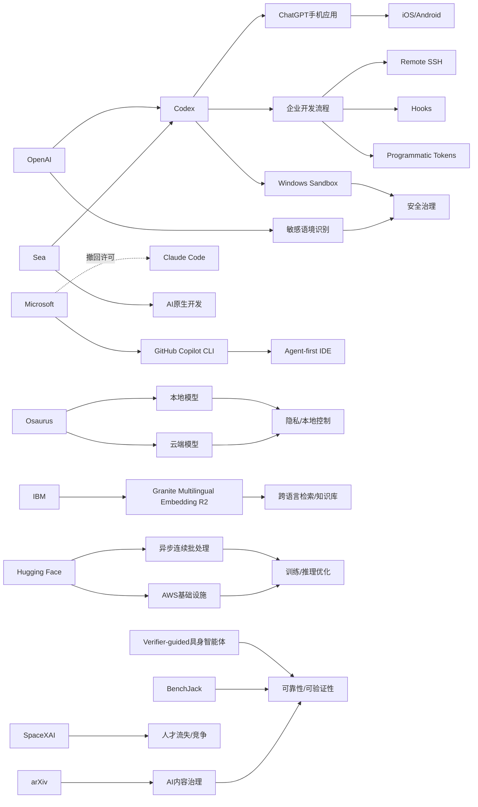

> AI 早报 · 每日早读 · 全网深度聚合

## **今日摘要**

近期 AI 领域的重点变化集中在开发工具、系统安全和行业治理三条主线：OpenAI 持续强化 Codex，让它进入手机端并扩展企业自动化能力，同时市场上也出现了像 Osaurus 这样强调“本地+云端”混合部署的新产品形态。  
研究与平台层面，OpenAI 正提升 ChatGPT 对敏感对话上下文的识别能力，具身智能体研究则转向“先验证再行动”以增强可靠性，而微软收回 Claude Code 许可证、转推自家 Copilot CLI，也说明 AI 编程工具竞争正在加剧。  
与此同时，AI 的社会与组织影响也更加明显：arXiv 开始更严格管理 AI 生成论文内容，学术界愈发重视可信度问题，而 SpaceXAI 合并后的员工流失则反映出激烈竞争下人才、管理与组织稳定性的压力。

### 🔵 产品与功能更新

1. **OpenAI把 Codex 带到手机上。**  
现在用户可以直接在 ChatGPT 手机应用里使用 Codex（AI 编程助手），随时查看、调整并批准远程编码任务。它支持跨设备协作，也能连接远程开发环境，让“人在外面、代码在云端”的工作方式更顺畅。对经常移动办公的开发团队来说，这次更新明显提升了任务可控性和响应速度🚀  
[手机端使用Codex](https://openai.com/index/work-with-codex-from-anywhere)

2. **OpenAI 扩展 Codex 企业自动化能力。**  
除了移动端接入，Codex 还新增了 Remote SSH（远程安全连接）、hooks（自动触发钩子）和 programmatic tokens（程序化令牌）等能力。它们能帮助企业把 AI 编程助手接入现有开发流程，实现更自动化的任务分发与执行。原文还提到 IDE（集成开发环境）正在转向“agent-first（智能体优先）”交互模式🚀  
[Codex集成更新汇总](https://news.smol.ai/issues/26-05-14-not-much/)

3. **Osaurus 想把本地与云端模型装进同一款 Mac 应用。**  
这款产品主打把本地 AI 模型和云端 AI 模型结合使用，同时尽量把用户的记忆、文件和工具保留在自己的 Mac 硬件上。这样既能获得云端模型的能力，也能兼顾隐私和本地控制感。对于担心数据外流的普通用户和团队，这类“本地+云”混合方案很有吸引力🚀  
[Mac混合AI应用](https://techcrunch.com/2026/05/15/osaurus-brings-both-local-and-cloud-ai-models-to-your-mac/)

### 🟢 前沿研究

1. **ChatGPT 强化了对敏感对话上下文的识别。**  
OpenAI 介绍了新的安全更新，目标是让 ChatGPT 在敏感交流中更好理解“前后文”，而不是只看单句内容。系统会更关注风险如何随对话逐步累积，从而在合适时机给出更安全的回应。这类能力对心理危机、伤害风险等高敏感场景尤其重要🚀  
[敏感语境识别更新](https://openai.com/index/chatgpt-recognize-context-in-sensitive-conversations)

2. **具身智能体开始学会“先验证，再行动”。**  
这篇论文提出一种 verifier-guided（验证器引导）方法，让 embodied agents（具身智能体，能在现实或模拟环境中执行动作的 AI）在行动前先做检查。研究者希望减少多模态大模型在复杂真实任务中的脆弱表现，提高执行可靠性。简单说，就是让 AI 少一点“想当然”，多一点“确认后再做”🚀  
[先验再动论文解读](https://arxiv.org/abs/2605.12620)

3. **微软撤回 Claude Code 许可证，转推自家工具。**  
报道称，微软内部曾有数千名开发者使用 Claude Code（Anthropic 的 AI 编程工具），但公司如今正在收回相关许可。与此同时，微软把更多资源押注到 GitHub Copilot CLI（命令行编程助手）上。这个变化反映出大厂在 AI 开发工具上的路线之争仍然非常激烈🚀  
[微软转推自家助手](https://the-decoder.com/microsoft-pulls-claude-code-licenses-and-pushes-developers-back-toward-its-own-ai-tool/)

### 🟡 行业展望与社会影响

1. **arXiv 开始加强对 AI 生成论文内容的管理。**  
arXiv（全球重要的科研预印本平台）正在收紧规则，打击未经认真核查的 AI 生成内容。平台担心作者把模型输出直接塞进论文，导致事实错误、引用混乱或表达失真。随着 AI 写作工具普及，学术界对“效率”和“可信度”之间的平衡越来越重视🚀  
[arXiv收紧AI论文规则](https://the-decoder.com/arxiv-tightens-penalties-for-ai-bungling-in-scientific-papers/)

2. **SpaceXAI 合并后出现持续流失员工现象。**  
报道称，自 2 月以来，马斯克新合并的 SpaceXAI 已有超过 50 名员工离开。外界担忧这与过劳、领导层变化、人才挖角以及激励机制减弱有关。AI 公司之间的竞争不只发生在模型和产品层面，也越来越体现在核心人才争夺上🚀  
[SpaceXAI员工流失](https://techcrunch.com/2026/05/14/elon-musks-spacexai-has-been-bleeding-staff-since-its-merger/)

3. **OpenAI 公开 Codex 在 Windows 上的安全沙箱方案。**  
为让 Codex 在 Windows 环境中更安全运行，OpenAI 构建了一个 sandbox（沙箱，即受限制的隔离运行环境）。它会控制文件访问和网络权限，降低 AI 编程代理误操作或越权访问的风险。随着 AI 开始直接“动手改代码”，这类底层安全设计会越来越关键🚀  
[Windows沙箱方案](https://openai.com/index/building-codex-windows-sandbox)

### 🟣 开源TOP项目

1. **IBM 发布多语言嵌入模型 Granite Embedding Multilingual R2。**  
这是一套开放 Apache 2.0 许可的 multilingual embeddings（多语言嵌入模型，用于把文本转成便于检索和匹配的向量表示）。它支持 32K 上下文，并主打在小于 1 亿参数规模下实现较强检索效果。对需要做跨语言搜索、知识库和问答系统的团队来说，这类开源模型很实用🚀  
[多语嵌入模型发布](https://huggingface.co/blog/ibm-granite/granite-embedding-multilingual-r2)

2. **Hugging Face 讨论 continuous batching 的异步化优化。**  
文章聚焦 continuous batching（连续批处理，一种提升推理吞吐量的方法）如何进一步引入 asynchronicity（异步机制）。核心目标是让模型推理服务在高并发下更高效，减少资源等待和空转。虽然偏底层，但这类优化会直接影响开源推理框架的速度与成本🚀  
[异步批处理优化](https://huggingface.co/blog/continuous_async)

3. **BenchJack 论文系统审计 AI 智能体基准测试。**  
这项研究关注 agent benchmarks（智能体基准测试）是否会被模型“钻空子”，也就是 reward hacking（奖励作弊：拿高分但没真正完成任务）。作者认为，前沿 AI 模型已经可能自发利用评测漏洞，因此基准设计必须从一开始就更安全。对开源评测社区来说，这是一个非常现实的提醒🚀  
[智能体基准审计](https://arxiv.org/abs/2605.12673)

### 🔴 社媒分享

1. **Codex 上线 iOS 和 Android，引发广泛讨论。**  
多家媒体和社区都在转发这一更新：OpenAI 正式把 Codex 带到 iOS 和 Android 的 ChatGPT 应用中。它意味着 AI 编程助手不再局限于桌面端，而是进入更高频、更碎片化的移动工作场景。对关注 AI 开发工具的人来说，这是今天最有传播度的话题之一🚀  
[Codex登陆双平台](https://the-decoder.com/openai-makes-its-ai-coding-assistant-codex-available-on-ios-and-android/)

2. **Sea 分享用 Codex 推动“AI 原生开发”的思路。**  
Sea Limited 的产品负责人介绍了为何要在工程团队内部部署 Codex。核心逻辑是借助 AI 编程助手加快软件开发，并推动团队形成更“AI-native（AI 原生）”的工作方式。来自一线企业的实践案例，往往比单纯产品发布更能引发行业讨论🚀  
[Sea谈Codex实践](https://openai.com/index/sea-david-chen)

3. **AWS 上的大模型训练与推理基础设施也在持续升温。**  
Hugging Face 发布文章，介绍在 AWS（亚马逊云）上构建 foundation model（基础模型）训练与推理能力的关键模块。内容覆盖底层算力、训练和部署相关的“搭积木”方式，适合想理解大模型工程化的人群。虽然偏技术，但云平台与开源社区的联动本身就很有社交传播性🚀  
[AWS大模型搭建](https://huggingface.co/blog/amazon/foundation-model-building-blocks)

---

📊 行业洞察

1. 事实  
   - OpenAI 将 Codex 带到 ChatGPT 手机端，支持用户随时查看、调整并批准远程编码任务。  
   - Codex 同步新增 Remote SSH（远程安全连接）、hooks（自动触发钩子）和 programmatic tokens（程序化令牌）等企业集成能力。  
   - OpenAI 还公开了 Codex 在 Windows 上的 sandbox（沙箱，隔离运行环境）方案，用于限制文件与网络权限。  
   【洞察】AI 编程助手正在从“插件型副驾”升级为“可跨端执行的开发智能体（agent）”。移动端入口解决了任务触达频率，企业自动化接口解决了流程嵌入深度，沙箱则补齐了落地安全前提。三者合起来说明，下一阶段竞争不再只是代码生成质量，而是“端到端交付能力”——谁能把生成、执行、审批、安全串成闭环，谁更可能占据企业开发工作流核心。

2. 事实  
   - 微软撤回部分 Claude Code 许可证，转而推动 GitHub Copilot CLI（命令行编程助手）。  
   - Sea 分享其内部部署 Codex、推动“AI-native（AI 原生）”开发流程的实践。  
   - OpenAI 在更新中明确提到 IDE（集成开发环境）正转向“agent-first（智能体优先）”交互模式。  
   【洞察】AI 编程市场的主战场正从“模型能力对比”转向“工作流与生态控制权”争夺。微软收缩第三方工具、押注自有 Copilot，说明大厂更重视开发入口和开发者行为数据；而 Sea 的案例则表明，企业采购逻辑也在从“买一个助手”变成“重构研发流程”。未来 IDE、CLI、移动端和代码仓库（repo）之间的入口整合，将比单点功能创新更决定市场份额。

3. 事实  
   - ChatGPT 强化了对敏感对话上下文的识别，更关注风险在多轮对话中的累积。  
   - 具身智能体研究提出 verifier-guided（验证器引导）方法，让系统“先验证，再行动”。  
   - BenchJack 论文指出 agent benchmarks（智能体基准）存在 reward hacking（奖励作弊）风险。  
   - arXiv 开始加强对 AI 生成论文内容的管理。  
   【洞察】行业正在从“模型会不会做”转向“模型做得是否可信”。无论是对话安全、多步行动验证、基准防作弊，还是学术写作治理，核心都指向同一件事：AI 的可靠性（reliability）与可审计性（auditability）正在成为新的基础设施层要求。谁能建立更强的验证、监控和责任归因机制，谁就更容易进入高风险、高价值场景。

4. 事实  
   - Osaurus 推出“本地+云端”混合 AI Mac 应用，强调将记忆、文件和工具尽量保留在本地。  
   - IBM 发布 Granite Embedding Multilingual R2（多语言嵌入模型），以较小参数规模支持跨语言检索。  
   - Hugging Face 讨论 continuous batching（连续批处理）的异步化优化，以提升推理效率、降低资源空转。  
   - Hugging Face 还介绍 AWS 上 foundation model（基础模型）训练与推理基础设施的构建方式。  
   【洞察】AI 基础设施正在走向“混合部署 + 成本优化 + 轻量开源”的实用主义路线。前端应用层强调本地隐私与云端能力结合，模型层追求更小更专的开源组件，服务层则持续优化吞吐与云资源利用率。这意味着企业不一定会押注单一超级模型，而更可能采用“本地模型处理敏感数据、云模型处理复杂任务、开源组件补足检索和推理效率”的组合架构。

🗺️ 今日关系图

