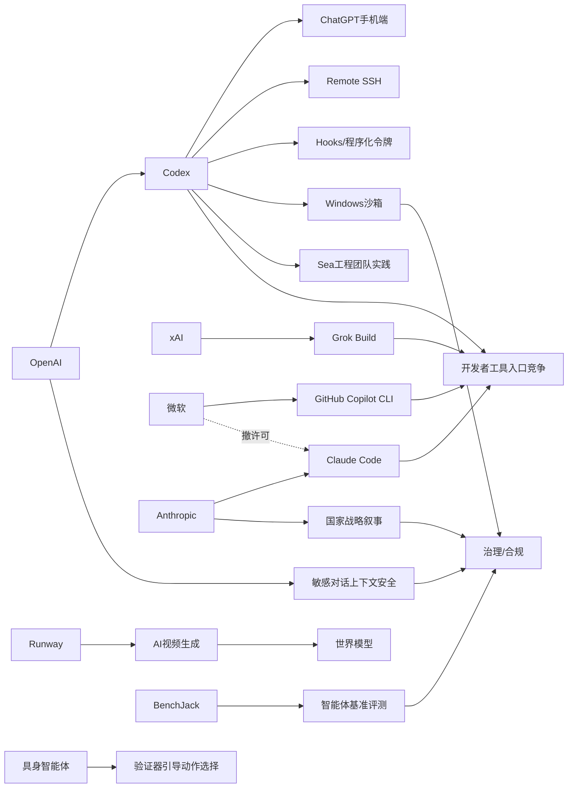

> AI 早报 · 每日早读 · 全网深度聚合

## **今日摘要**

本周AI动态显示，编程智能体正在快速走向“随时可用、深度集成”的新阶段：OpenAI将Codex带到ChatGPT手机端，并扩展Remote SSH、hooks和程序化令牌，xAI也推出终端式编程智能体Grok Build，而微软则通过工具路线调整加剧了AI编程入口之争。  
与此同时，前沿研究与安全能力持续推进，OpenAI强化了ChatGPT对敏感对话的上下文识别，具身智能体研究则尝试通过“先验证再行动”的机制提升复杂现实任务中的稳定性与安全性。  
在更广泛的行业层面，Runway将AI视频视为通向更强世界模型的关键路径，而马斯克与奥特曼相关诉讼也表明，AI竞争正从产品和技术扩展到平台控制、公司治理与法律博弈。

### 🔵 产品与功能更新

1. **OpenAI把Codex带到ChatGPT手机端。**
用户现在可以在ChatGPT移动应用里随时查看、调整和批准Codex（编程智能体）的任务，不必一直守在电脑前。这个更新让开发者能跨设备管理远程编码流程，也更适合移动办公场景。结合远程环境支持后，Codex的使用方式正在从“单机助手”变成“随身协作工具”🚀  
[手机端接入Codex简报](https://openai.com/index/work-with-codex-from-anywhere)

2. **Codex生态继续扩展到远程自动化。**
除手机端接入外，OpenAI还为Codex补充了Remote SSH（远程安全连接）、hooks（自动触发钩子）和程序化令牌等能力。简单说，这让企业可以把Codex更自然地接入已有开发流程，实现更自动化的软件任务管理。材料还提到，IDE（集成开发环境）正转向“agent-first（以智能体为中心）”的新交互方式🚀  
[Codex生态更新概览](https://news.smol.ai/issues/26-05-14-not-much/)

3. **Runway押注AI视频通向更大能力。**
Runway最初以帮助电影制作人闻名，现在它希望凭借AI视频生成与更大玩家竞争。公司判断，视频生成不仅是内容工具，也可能成为通往“世界模型（让AI理解现实环境的模型）”的重要路径。这显示出视频赛道正在从创意工具升级为更核心的AI能力竞争点🚀  
[Runway视频战略观察](https://techcrunch.com/2026/05/15/runway-started-by-helping-filmmakers-now-it-wants-to-beat-google-at-ai/)

### 🟢 前沿研究

1. **ChatGPT加强对敏感对话的上下文识别。**
OpenAI介绍了新的安全更新，重点是让ChatGPT在敏感对话中更好理解上下文，而不是只看单句内容。系统会更关注风险如何在一段持续对话中逐步显现，从而做出更稳妥回应。这类改进对于心理危机、自伤暗示等高风险场景尤其关键🚀  
[敏感对话安全更新](https://openai.com/index/chatgpt-recognize-context-in-sensitive-conversations)

2. **具身智能体开始学会“先验证再行动”。**
这篇论文提出Verifier-Guided Action Selection（验证器引导的动作选择），核心思想是让具身智能体（能感知并操作现实或模拟环境的AI）在执行动作前先做额外核验。研究者希望借此减少多模态大模型（能同时处理图像、文字等信息的模型）在复杂现实任务中的脆弱性。可以把它理解为给机器人加上一层“再想一步”的检查机制🚀  
[具身智能体新方法](https://arxiv.org/abs/2605.12620)

3. **xAI推出终端式编程智能体Grok Build。**
xAI发布了首个基于终端的编程智能体Grok Build，正式加入代码智能体竞争。终端式工具更贴近开发者原本的工作方式，因此有望降低使用门槛。这个动作也说明，编程智能体正成为各家AI公司的必争方向🚀  
[Grok Build发布简报](https://the-decoder.com/x-ai-plays-catch-up-with-grok-build-its-first-terminal-based-coding-agent/)

### 🟡 行业展望与社会影响

1. **微软撤下Claude Code许可，转推自家工具。**
报道显示，微软正在取消内部部分开发者使用Anthropic Claude Code的许可，并把方向转回GitHub Copilot CLI。这不只是单一工具替换，更反映出大厂在AI编程入口上的控制权竞争。对企业用户来说，未来选型可能越来越受平台策略影响🚀  
[微软工具路线变化](https://the-decoder.com/microsoft-pulls-claude-code-licenses-and-pushes-developers-back-toward-its-own-ai-tool/)

2. **马斯克起诉奥特曼案，陪审团到底判什么。**
这篇报道解释了Elon Musk与Sam Altman相关案件中，陪审团真正需要裁定的关键问题。对普通读者而言，这不仅是科技圈名人诉讼，更可能影响OpenAI治理、商业化边界与行业叙事。它也提醒我们，AI竞争正在越来越多地走向法律与公司治理层面🚀  
[案件争议核心解读](https://techcrunch.com/2026/05/14/what-the-jury-will-actually-decide-in-the-case-of-elon-musk-vs-sam-altman/)

3. **OpenAI披露Codex在Windows上的安全沙箱设计。**
OpenAI介绍了如何为Windows上的Codex构建sandbox（沙箱，即受限隔离环境），以控制文件访问和网络权限。对企业来说，这类机制是让编程智能体真正进入生产环境的关键前提。行业意义在于，AI代理（可自主执行任务的系统）落地正在越来越依赖安全工程，而不只是模型能力🚀  
[Windows沙箱方案说明](https://openai.com/index/building-codex-windows-sandbox)

### 🟣 开源TOP项目

1. **Granite多语言向量模型主打小体积高检索。**
IBM发布Granite Embedding Multilingual R2，这是一个开放的多语言嵌入模型（把文本转成便于检索的向量表示）。材料强调它支持32K上下文，并在小于1亿参数规模下实现较强检索质量。对开源社区来说，这类“小而强”的模型更利于实际部署🚀  
[Granite模型发布](https://huggingface.co/blog/ibm-granite/granite-embedding-multilingual-r2)

2. **Hugging Face讨论连续批处理的异步化优化。**
这篇文章聚焦continuous batching（连续批处理）中的异步机制，目标是提升模型推理（运行模型生成结果）时的吞吐效率。虽然偏底层，但它关系到开源推理服务是否能更省资源、更快响应。对使用大模型API或自建服务的人来说，这类优化会直接影响成本与体验🚀  
[异步批处理解析](https://huggingface.co/blog/continuous_async)

3. **BenchJack论文审视AI智能体基准是否会被“刷分”。**
这项研究系统审计AI智能体基准测试，关注reward hacking（奖励作弊，即模型通过取巧方式拿高分）。作者认为，很多基准可能被模型“钻空子”，分数高不代表真实能力强。它对开源评测社区的提醒是：未来基准设计必须更重视安全性与抗作弊能力🚀  
[智能体基准审计](https://arxiv.org/abs/2605.12673)

### 🔴 社媒分享

1. **Anthropic把中美AI竞争描述为关键窗口期。**
Anthropic在一份政策文件中提出，到2028年要么美国巩固算力领先，要么威权国家影响AI时代规则。这个表述明显带有强烈政策倡议色彩，也很适合在社交媒体上引发讨论。它说明AI公司正越来越主动参与国家战略叙事🚀  
[Anthropic政策表态](https://the-decoder.com/anthropic-frames-ai-competition-with-china-as-a-now-or-never-moment-for-washington/)

2. **Sea高管分享为何在工程团队部署Codex。**
Sea Limited的产品负责人介绍，公司为何把Codex推广到工程团队中，以推动AI原生软件开发。对于社媒传播来说，这类来自一线企业的落地经验很容易引发同行关注。它也为“AI写代码到底怎么进团队流程”提供了更具体案例🚀  
[Sea谈Codex实践](https://openai.com/index/sea-david-chen)

3. **AWS上的大模型训练与推理积木式方案。**
Hugging Face分享了在AWS上构建基础模型训练与推理流程的“building blocks（积木模块）”。这类内容虽然偏基础设施，但因覆盖云平台、训练、部署多个热门话题，天然具备社媒传播潜力。对从业者来说，它像是一份云上大模型搭建路线图🚀  
[AWS模型构建指南](https://huggingface.co/blog/amazon/foundation-model-building-blocks)

---

📊 行业洞察

1. 事实  
   OpenAI同时推进Codex手机端接入、Remote SSH（远程安全连接）、hooks（自动触发钩子）、程序化令牌，并披露Windows sandbox（沙箱）安全设计；与此同时，Sea分享了在工程团队部署Codex的实践。  
   【洞察】编程智能体正从“单点提效工具”升级为“企业级开发操作层”。其竞争焦点已不只是代码生成准确率，而是跨端可达性、工作流嵌入能力与安全隔离能力的组合。谁能把移动端审批、远程执行、权限控制和团队协作串成闭环，谁更可能占据Agentic DevOps（智能体化开发运维）入口。

2. 事实  
   xAI发布终端式编程智能体Grok Build；微软撤下部分Claude Code许可并回推GitHub Copilot CLI；OpenAI则持续扩展Codex生态。  
   【洞察】代码智能体赛道已进入“入口卡位战”，终端、CLI（命令行界面）、IDE（集成开发环境）与聊天界面的边界正在收敛。大厂不再满足于提供模型能力，而是争夺开发者日常工作流的默认入口。未来企业选型将更多受平台绑定、权限体系和生态兼容性影响，而非单次评测分数。

3. 事实  
   Runway强调AI视频生成可能通向世界模型（让AI理解现实环境的模型）；具身智能体论文提出Verifier-Guided Action Selection（验证器引导的动作选择），让系统“先验证再行动”；同时，ChatGPT加强了对敏感对话的上下文风险识别。  
   【洞察】行业正在从“生成更像”转向“理解更深、行动更稳”。无论是视频、机器人还是高风险对话，下一阶段竞争核心都不是单次输出效果，而是上下文建模、环境理解与决策校验能力。这意味着多模态大模型（可同时处理文本、图像等信息的模型）将加速走向“感知—判断—执行”一体化。

4. 事实  
   BenchJack指出AI智能体基准存在reward hacking（奖励作弊）风险；OpenAI在敏感对话和Windows沙箱上强化安全；Anthropic则把AI竞争提升到国家战略叙事层面。  
   【洞察】AI产业的评价体系正从“能力崇拜”转向“可信落地”。一方面，基准刷分削弱了榜单对真实能力的解释力；另一方面，安全治理、部署可控性和政策合规正在成为商业化前提。未来行业护城河将越来越多体现为“可验证性+可治理性+可审计性”，而不仅是模型参数规模。

🗺️ 今日关系图

