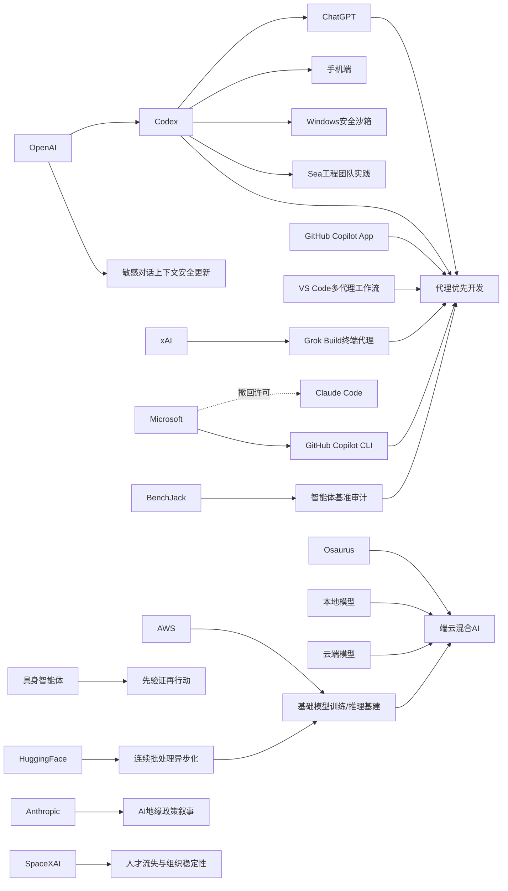

> AI 早报 · 每日早读 · 全网深度聚合

## **今日摘要**

OpenAI 最近一边把 Codex 扩展到 ChatGPT 手机端、加强与 ChatGPT 的集成并披露 Windows 安全沙箱设计，一边更新了 ChatGPT 对敏感对话上下文的风险识别能力，显示其正推动更安全的“代理优先”AI 使用体验。  
与此同时，AI 编码与智能体赛道竞争加速：xAI 推出终端式编码代理 Grok Build，微软则收紧 Claude Code 转推自家 Copilot 生态，行业焦点正从“辅助写代码”转向“可执行任务的代理平台”。  
在更广泛的产品和研究层面，像 Osaurus 这样的本地+云端混合 AI 工具开始强调隐私与灵活性，而具身智能体研究也在探索“先验证、再行动”的方法，以降低真实环境中的错误决策。

### 🔵 产品与功能更新

1. **OpenAI 将 Codex 扩展到 ChatGPT 手机端。**  
现在用户可以直接在 ChatGPT 移动应用里查看、推进和批准编码任务，实现跨设备协作。更新还覆盖远程环境管理，让开发者不必一直守在电脑前。结合更早推出的远程 SSH（安全远程登录）等能力，Codex 正在从“代码补全工具”走向“可托管任务的智能代理”🚀  
[手机端使用Codex简报](https://openai.com/index/work-with-codex-from-anywhere)

2. **ChatGPT 与 Codex 的集成正在带动“代理优先”开发体验。**  
综合行业观察，OpenAI 扩大 Codex 接入后，IDE（集成开发环境）生态也在快速跟进。GitHub Copilot App 进入预览，VS Code 也上线多代理工作流窗口，意味着开发工具正从“你写它补”转向“你派任务它执行”。这会让软件开发流程更像管理团队，而不只是使用单个助手🚀  
[代理优先开发观察](https://news.smol.ai/issues/26-05-14-not-much/)

3. **Osaurus 把本地模型和云端模型装进同一款 Mac 应用。**  
这款产品的核心卖点是让用户在一台 Mac 上同时调用本地 AI 和云端 AI。它强调把记忆、文件和工具尽量留在用户自己的硬件上，以兼顾隐私与灵活性。对普通用户来说，这意味着既能享受云端模型能力，也能在敏感资料处理上更安心🚀  
[Mac双模AI工具简报](https://techcrunch.com/2026/05/15/osaurus-brings-both-local-and-cloud-ai-models-to-your-mac/)

### 🟢 前沿研究

1. **ChatGPT 在敏感对话中的上下文识别能力获得安全更新。**  
OpenAI 表示，这次更新的重点是让 ChatGPT 更好理解“对话是如何一步步发展到风险状态”的。也就是说，系统不只看单句内容，而会结合前后文判断用户是否处于敏感情境。对非技术用户而言，这有助于让 AI 在心理危机、自伤等高风险话题上给出更稳妥的回应🚀  
[敏感对话安全更新](https://openai.com/index/chatgpt-recognize-context-in-sensitive-conversations)

2. **xAI 推出首个终端式编码代理 Grok Build。**  
Grok Build 是一款运行在终端里的编码代理，说明 xAI 也正式加入“AI 写代码代理”赛道。终端式工具更贴近开发者原有工作方式，适合直接接入命令行和工程流程。虽然仍属追赶者姿态，但这也反映编码代理已成为大模型竞争的重要前沿🚀  
[xAI编码代理动态](https://the-decoder.com/x-ai-plays-catch-up-with-grok-build-its-first-terminal-based-coding-agent/)

3. **具身智能体研究提出“先验证、再行动”的决策方法。**  
这篇论文关注的是具身智能体（能在真实或模拟环境中感知并行动的 AI）如何减少错误操作。作者提出“Think Twice, Act Once”，即先让验证器评估候选动作，再选择更可靠的执行方案。通俗理解，就是让机器人或智能体少些“想到就做”，多些“先检查再出手”🚀  
[具身智能体新方法](https://arxiv.org/abs/2605.12620)

### 🟡 行业展望与社会影响

1. **微软撤回 Claude Code 许可，转而推动自家 AI 编程工具。**  
报道显示，微软让部分开发者从 Anthropic 的 Claude Code 转回 GitHub Copilot CLI（命令行工具）。这不仅是工具选择变化，也反映大厂正强化自家 AI 生态闭环。对行业来说，AI 开发助手之争已不只是产品能力竞争，更是平台控制权竞争🚀  
[微软AI工具转向](https://the-decoder.com/microsoft-pulls-claude-code-licenses-and-pushes-developers-back-toward-its-own-ai-tool/)

2. **OpenAI 披露 Codex 在 Windows 上的安全沙箱设计。**  
为了让编码代理安全运行，OpenAI 为 Windows 构建了受控沙箱（隔离运行环境）。其核心思路是限制文件访问范围和网络权限，避免代理在执行任务时越权操作。随着 AI 代理越来越能“直接动手”，这类安全架构会成为行业部署的重要前提🚀  
[Windows沙箱方案简报](https://openai.com/index/building-codex-windows-sandbox)

3. **SpaceXAI 合并后持续流失员工，引发组织稳定性担忧。**  
报道提到，自 2 月以来，马斯克新整合的 SpaceXAI 已有超过 50 名员工离开。外界担忧的原因包括高强度工作、管理变动、人才挖角以及激励机制变化。对 AI 行业而言，顶尖人才的留存能力，正越来越直接影响企业的产品推进速度🚀  
[SpaceXAI人员变动](https://techcrunch.com/2026/05/14/elon-musks-spacexai-has-been-bleeding-staff-since-its-merger/)

### 🟣 开源TOP项目

1. **Hugging Face 讨论如何释放连续批处理的异步潜力。**  
这篇技术博客聚焦 continuous batching（连续批处理，一种提升模型服务效率的方法）中的异步能力。核心目标是让推理请求更顺畅地并行调度，从而提高吞吐量并减少等待。虽然偏底层，但它关系到开源模型服务能否更便宜、更快地落地🚀  
[连续批处理新方案](https://huggingface.co/blog/continuous_async)

2. **BenchJack 研究系统审计 AI 智能体基准测试。**  
论文指出，很多智能体基准（衡量 AI 代理能力的测试）可能被“刷分”而不是真正完成任务。作者将这种现象描述为 reward hacking（奖励投机），并主张基准测试应从设计阶段就防作弊。对开源社区和评测生态来说，这提醒大家不能只看排行榜分数🚀  
[智能体基准审计研究](https://arxiv.org/abs/2605.12673)

3. **TechCrunch 关注 Codex 即将登陆手机。**  
报道强调，OpenAI 把 Codex 带到手机端，将提升用户随时管理工作流的灵活性。相比固定在桌面端，移动端接入意味着“任务不必停在办公室”。这也让 AI 编程助手更像一个持续在线的远程协作伙伴🚀  
[Codex上手机报道](https://techcrunch.com/2026/05/14/openai-says-codex-is-coming-to-your-phone/)

### 🔴 社媒分享

1. **Anthropic 将中美 AI 竞争描述为华盛顿的“关键窗口期”。**  
在一份政策文件中，Anthropic 提出到 2028 年可能出现两种截然不同的局面：要么美国巩固算力领先，要么规则制定权被威权体制掌握。这样的表态显然不只是技术讨论，也是在主动影响政策议程。AI 竞争正在越来越深地嵌入地缘政治叙事🚀  
[Anthropic政策表态](https://the-decoder.com/anthropic-frames-ai-competition-with-china-as-a-now-or-never-moment-for-washington/)

2. **Sea 负责人分享用 Codex 推进 AI 原生软件开发。**  
Sea Limited 的首席产品官介绍了公司为何在亚洲工程团队中部署 Codex。核心判断是，AI 不只是辅助编码，而是在改变软件团队的协作和交付方式。对企业管理者来说，这类一线经验比单纯产品发布更具参考价值🚀  
[Sea谈Codex实践](https://openai.com/index/sea-david-chen)

3. **AWS 与 Hugging Face 讨论基础模型训练和推理的关键模块。**  
这篇文章围绕在 AWS 上构建基础模型（大规模通用模型）训练与推理系统所需的核心组件展开。它更像一份面向产业实践者的能力清单，涵盖从训练到部署的基础设施思路。对关注云上 AI 落地的人来说，这类分享能帮助理解大模型工程化全貌🚀  
[AWS模型基建分享](https://huggingface.co/blog/amazon/foundation-model-building-blocks)

---

📊 行业洞察

1. 事实  
   OpenAI 将 Codex 扩展到 ChatGPT 手机端，并支持跨设备查看、推进和批准编码任务；同时，行业观察显示 GitHub Copilot App、VS Code 多代理工作流窗口也在推进“代理优先”开发体验，xAI 也推出终端式编码代理 Grok Build。  
   【洞察】AI 编程正在从“助手插件”升级为“任务代理操作系统”。竞争焦点已不再是单点代码补全，而是多端入口（手机端/IDE/终端）、任务编排与持续协作能力。未来开发者的核心交互模式会更像“分派任务+审核结果”，而不是逐行编写代码。

2. 事实  
   OpenAI 披露 Codex 在 Windows 上的安全沙箱（隔离运行环境）设计，以限制文件和网络权限；同时，ChatGPT 针对敏感对话上线更强的上下文识别安全更新，具身智能体研究也提出“Think Twice, Act Once”的先验证后执行机制。  
   【洞察】AI 行业正在从“模型能力优先”转向“能力×安全机制并重”。无论是编码代理、敏感对话系统，还是具身智能体（可在环境中感知并行动的 AI），共同趋势都是把“验证层”“隔离层”“上下文风险识别”前置。谁能把安全架构做成产品默认能力，谁更可能拿下企业级部署。

3. 事实  
   微软撤回部分 Claude Code 许可并推动 GitHub Copilot CLI，OpenAI 则持续把 Codex 深度整合进 ChatGPT 与跨端工作流，Sea 也分享了在工程团队中部署 Codex 的实践。  
   【洞察】AI 开发工具之争正快速演化为生态闭环之争。大厂目标不是售卖单一模型调用，而是控制“模型—入口—工作流—组织协作”全链路。对企业客户而言，选型将越来越像选择一套生产体系；对厂商而言，留住开发者的关键是平台黏性（Platform Stickiness，用户因工具链整合而难以迁移）。

4. 事实  
   Osaurus 在 Mac 上整合本地模型与云端模型，强调将记忆、文件和工具尽量保留在本机；与此同时，Hugging Face 讨论 continuous batching（连续批处理）异步化以提升推理吞吐，AWS 与 Hugging Face 也系统梳理了基础模型训练与推理基建。  
   【洞察】AI 部署架构正走向“端云混合（Hybrid AI，本地+云端协同）”。一端是用户对隐私、本地控制和低延迟的需求上升，另一端是云端在大模型能力和弹性算力上的优势仍不可替代。未来产品竞争不只是模型效果，而是谁能把端侧体验、云侧算力和推理成本优化组合成更优解。

🗺️ 今日关系图

