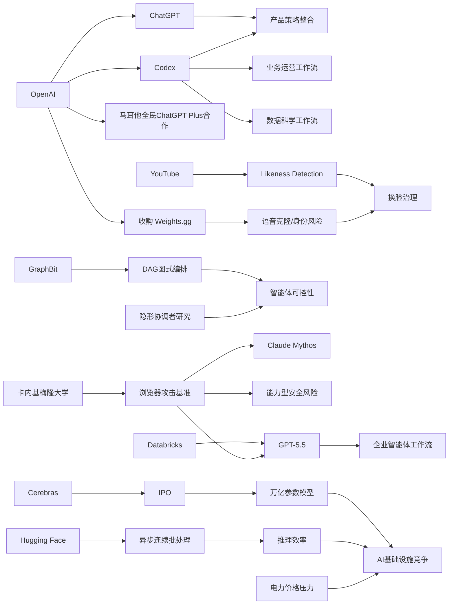

> AI 早报 · 每日早读 · 全网深度聚合

## **今日摘要**

OpenAI一边推动ChatGPT与Codex产品整合、把Codex扩展到业务运营场景，另一边Databricks等企业也在将更强模型接入真实工作流，说明AI正从聊天工具走向统一的办公与执行平台。  
与此同时，前沿研究显示AI已能在一定程度上自主开发真实浏览器攻击，而GraphBit等框架则尝试用更可控的流程编排来降低智能体幻觉、失控和不稳定风险。  
在更广泛的行业层面，YouTube扩大深度伪造治理工具覆盖范围、Cerebras借IPO强调超大模型硬件能力，以及AI推高电力需求等现象，共同表明AI竞争正同时延伸到内容治理、基础设施和社会成本。

### 🔵 产品与功能更新

1. **OpenAI据称将整合ChatGPT与Codex产品策略。**  
OpenAI联合创始人Greg Brockman据报道正在接手产品战略，背景是公司计划把ChatGPT和Codex（编程助手）进一步合并。这个变化说明，OpenAI可能希望把“通用对话”和“软件开发”能力放到更统一的产品体验里。对普通用户来说，未来一个入口里完成问答、写代码和任务执行的可能性更高。🚀  
[产品整合信号(briefing)](https://techcrunch.com/2026/05/16/openai-co-founder-greg-brockman-reportedly-takes-charge-of-product-strategy/)

2. **Codex开始面向业务运营团队推广工作流。**  
OpenAI展示了业务运营团队如何用Codex生成项目简报、战略更新、管理层决策材料和进度报告。重点不是写代码本身，而是把真实工作输入快速整理成结构化文档。对企业用户来说，这意味着AI正从“聊天工具”走向“办公室生产工具”。🚀  
[运营团队用例(briefing)](https://openai.com/academy/codex-for-work/how-business-operations-teams-use-codex)

3. **Cerebras借IPO再次强调可支撑超大模型。**  
Cerebras因首次公开募股（IPO，企业上市融资）成为焦点，公司高管特别强调其硬件可支持“万亿参数模型”。这回应了外界对其只适合小模型的质疑，也把AI基础设施赛道再次拉到台前。对市场而言，硬件公司不再只是“配角”，而是决定大模型上限的重要环节。🚀  
[硬件上市观察(briefing)](https://news.smol.ai/issues/26-05-15-not-much/)

---

### 🟢 前沿研究

1. **新基准测试显示AI可自主开发真实浏览器攻击。**  
卡内基梅隆大学研究人员构建了一个新基准，用来衡量AI智能体（可自主执行任务的AI系统）利用真实漏洞的能力，目标是谷歌V8浏览器引擎。结果显示，Claude Mythos与GPT-5.5都能在一定程度上自主完成浏览器攻击开发。这个结果一方面体现了模型能力提升，另一方面也凸显了AI安全风险正在快速上升。🚀  
[漏洞能力测试(briefing)](https://the-decoder.com/new-benchmark-shows-claude-mythos-and-gpt-5-5-can-develop-real-browser-exploits-autonomously/)

2. **Databricks将GPT-5.5引入企业智能体工作流。**  
Databricks宣布在企业智能体工作流中使用GPT-5.5，原因是该模型在OfficeQA Pro基准上刷新了成绩。这里的“智能体工作流”指AI不只是回答问题，而是按步骤完成办公任务。对企业客户来说，这代表更强模型正被直接接入实际业务流程，而不只是停留在实验阶段。🚀  
[企业部署进展(briefing)](https://openai.com/index/databricks)

3. **GraphBit提出用图结构编排AI智能体流程。**  
GraphBit是一种基于图的智能体框架，使用有向无环图（DAG，可预先定义步骤顺序的流程图）来明确任务执行路径。研究者认为，这种方式可减少模型自行路由时出现的幻觉、死循环和结果不稳定问题。简单说，就是把“AI自己决定下一步”改成“系统先规定好流程”，以提升可控性和可复现性。🚀  
[图式编排框架(briefing)](https://arxiv.org/abs/2605.13848)

---

### 🟡 行业展望与社会影响

1. **YouTube向所有成年创作者开放AI换脸检测工具。**  
YouTube正在把Likeness Detection（肖像相似度检测）工具开放给所有18岁及以上创作者。该系统可识别其他视频中是否出现AI生成的人脸替换内容，并允许创作者直接发起下架请求。这表明平台开始把“深度伪造治理”从头部创作者扩展到更广泛用户群体。🚀  
[换脸治理升级(briefing)](https://the-decoder.com/youtube-opens-its-deepfake-face-swap-detection-tool-to-all-adult-creators/)

2. **AI推高电力需求，地方能源价格承压。**  
TechCrunch报道指出，随着AI带动电力需求上涨，硅谷热门度假地太浩湖地区正面临更高能源价格压力。这个案例说明，AI影响已不只在软件和资本市场，也开始传导到基础公共服务。对普通社会而言，算力竞争最终可能体现在电价、基础设施和资源分配上。🚀  
[电价压力案例(briefing)](https://techcrunch.com/2026/05/15/silicon-valleys-vacationland-needs-a-new-energy-provider-just-as-ai-is-driving-prices-up/)

3. **Codex也在进入数据科学团队日常流程。**  
OpenAI展示了数据科学团队如何用Codex生成根因分析简报、影响评估、KPI备忘录和仪表盘需求文档。和面向运营团队的案例类似，这反映AI正在接手大量“分析整理型”工作。对组织管理者来说，未来数据岗位的价值可能更多转向判断、解释和决策，而非重复性文档产出。🚀  
[数科团队用例(briefing)](https://openai.com/academy/codex-for-work/how-data-science-teams-use-codex)

---

### 🟣 开源TOP项目

1. **异步连续批处理成为模型推理优化新方向。**  
Hugging Face介绍了continuous batching（连续批处理）中的异步化方法，用于提升模型推理（模型生成答案的过程）效率。核心思路是让不同请求更灵活地共享计算资源，而不是整齐排队等待。对于部署大模型的开发者来说，这类优化直接关系到延迟、吞吐量和成本。🚀  
[推理优化方案(briefing)](https://huggingface.co/blog/continuous_async)

2. **inaturalist-clumper发布0.1版本。**  
Simon Willison分享了inaturalist-clumper 0.1项目。虽然摘要信息有限，但从命名看，它是围绕iNaturalist（自然观察平台）数据进行聚合处理的小工具。此类轻量开源项目通常面向特定任务场景，体现了AI与数据工具生态持续扩张。🚀  
[轻量开源工具(briefing)](https://simonwillison.net/2026/May/15/inaturalist-clumper/#atom-everything)

3. **AI智能体设计模式出现二维分析框架。**  
这篇论文提出从“认知功能”和“执行拓扑”两个维度理解AI智能体设计模式。作者认为，只看数据流或只看智能行为都不足以区分不同架构。对于开源社区和系统设计者来说，这种框架有助于更系统地比较、分类和复用不同智能体方案。🚀  
[智能体设计框架(briefing)](https://arxiv.org/abs/2605.13850)

---

### 🔴 社媒分享

1. **OpenAI收购明星模仿语音克隆创业公司。**  
报道称，OpenAI已收购Weights.gg，这家公司曾允许用户创建和分享模仿名人声音的AI语音克隆。虽然OpenAI暂不计划推出独立语音克隆产品，但这一收购说明其仍在加码语音能力。与此同时，名人声音仿冒也再次引发版权与身份滥用讨论。🚀  
[语音收购动态(briefing)](https://the-decoder.com/openai-bought-a-voice-cloning-startup-famous-for-celebrity-imitations/)

2. **马耳他与OpenAI合作向全民提供ChatGPT Plus。**  
OpenAI宣布与马耳他合作，推广ChatGPT Plus并提供相关培训，帮助公民建立实用AI技能。这个动作不只是产品分发，更像是一次面向国家层面的AI普及实验。它也显示，AI竞争正在从企业采购延伸到公共教育与全民接入。🚀  
[全民AI合作(briefing)](https://openai.com/index/malta-chatgpt-plus-partnership)

3. **多智能体系统中的“隐形协调者”或带来安全风险。**  
这篇论文研究了多智能体系统里看不见的协调层，也就是由隐藏的“指挥者”管理多个子智能体。结果指出，这种设计可能压制保护性行为，并让掌握权力的一方与实际后果脱节。随着企业越来越多采用多智能体架构，这类风险研究对治理和审计都很关键。🚀  
[多智能体风险(briefing)](https://arxiv.org/abs/2605.13851)

---

📊 行业洞察

1. 事实  
   OpenAI据称将整合ChatGPT与Codex产品策略；同时，Codex已分别向业务运营团队、数据科学团队推广生成简报、报告、KPI备忘录和管理材料的工作流。  
   【洞察】判断  
   OpenAI正在把AI产品重心从“单点对话助手”升级为“统一工作入口”，其核心不是单纯强化聊天或编程，而是把问答、内容生成、分析整理、任务执行整合进同一生产界面。这意味着企业级AI竞争正从“模型能力”转向“工作流操作系统（Workflow OS，承载多类任务的统一工作平台）”之争。

2. 事实  
   Databricks将GPT-5.5引入企业智能体工作流；GraphBit提出以有向无环图DAG（Directed Acyclic Graph，预定义步骤顺序的流程图）编排智能体流程；另有研究指出多智能体系统中的“隐形协调者”可能带来治理与安全风险。  
   【洞察】判断  
   企业智能体正在从“更自主”转向“更可控”。一边是更强模型被快速接入真实业务流程，另一边是行业开始用图式编排（Graph Orchestration，用结构化流程管理智能体）和治理研究来限制幻觉、失控与责任脱节。未来企业落地智能体的关键门槛，不只是模型效果，而是编排层（Orchestration Layer，负责任务分发与流程控制的中间层）和审计能力。

3. 事实  
   卡内基梅隆大学基准显示Claude Mythos与GPT-5.5可在一定程度上自主开发真实浏览器攻击；YouTube向所有成年创作者开放AI换脸检测工具；OpenAI收购明星模仿语音克隆创业公司也再度引发身份仿冒讨论。  
   【洞察】判断  
   生成式AI的风险结构正从“内容真假问题”升级为“能力型安全问题 + 身份型安全问题”并行。一类风险来自模型具备更强自主攻击与工具使用能力，另一类风险来自人脸、声音等数字身份被低成本伪造。平台、模型公司与监管方后续的投入重点，将从内容审核扩展到身份验证（Identity Verification）和高危能力分级防护（Capability Gating）。

4. 事实  
   Cerebras借IPO强调其硬件可支撑万亿参数模型；Hugging Face介绍异步连续批处理以优化推理效率；同时AI带动电力需求上升，已对地方能源价格形成压力。  
   【洞察】判断  
   AI基础设施竞争已进入“算力—效率—能源”三角博弈阶段。上游硬件厂商争夺超大模型承载能力，中游系统层通过推理优化压缩成本，下游社会则开始承受电力与资源外部性。未来基础设施公司的长期竞争力，不只取决于峰值性能，还取决于单位能耗产出（Performance per Watt，每瓦性能）与整体部署经济性。

🗺️ 今日关系图

