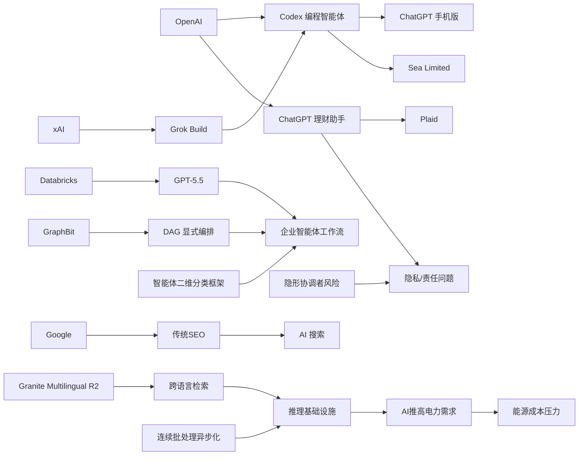

> AI 早报 · 每日早读 · 全网深度聚合

## **今日摘要**

本周动态显示，AI 正在从“回答问题”快速走向“直接执行工作”：OpenAI 把 Codex 带到 ChatGPT 手机版并增强企业集成能力，Databricks 和 Sea 则分别把 GPT-5.5、Codex 用于企业智能体工作流和工程团队开发。  
研究与搜索领域则更强调“可控落地”而非概念炒作：Google 认为 AI 搜索无需另起一套 SEO 规则，GraphBit 用图结构提升智能体流程稳定性，EMO 则探索让模型内部形成更清晰的模块分工。  
与此同时，ChatGPT 也开始进入个人理财等高敏感场景，虽然带来更主动、个性化的帮助，但也同步放大了隐私、安全与责任边界的讨论。

### 🔵 产品与功能更新

1. **OpenAI把Codex带到ChatGPT手机版。**  
现在用户可以在手机上远程查看、管理和批准 Codex（编程智能体）的任务，不必一直守在电脑前。更新还加入了 Remote SSH（远程连接服务器）、hooks（自动触发钩子）和程序化令牌，方便企业把 AI 编程流程接入内部自动化系统。原文还提到，IDE（集成开发环境）正在转向“agent-first（智能体优先）”交互，说明开发工具正越来越像“会主动干活的助手”。🚀  
[Codex移动端更新简报](https://news.smol.ai/issues/26-05-14-not-much/)

2. **Databricks将GPT-5.5用于企业智能体工作流。**  
Databricks 表示，GPT-5.5 已被用于企业级 agent workflow（智能体工作流）场景。官方给出的依据是，该模型在 OfficeQA Pro 基准测试中刷新了当前最好成绩。对非技术团队来说，这意味着 AI 在处理企业文档、办公问答和流程协作时，可能会更稳定、更适合落地。🚀  
[Databricks合作说明](https://openai.com/index/databricks)

3. **Sea在工程团队部署Codex推进AI原生开发。**  
Sea Limited 的产品负责人介绍，公司正把 Codex 部署到工程团队中，用来加速软件开发流程。核心思路是让 AI 更早参与编码、修改和协作，而不只是做简单问答。对亚洲大型互联网公司来说，这类实践也反映出“AI 原生开发”正在从概念进入团队级应用。🚀  
[Sea使用Codex案例](https://openai.com/index/sea-david-chen)

### 🟢 前沿研究

1. **Google称AI搜索并不需要一套全新的SEO。**  
Google 最新文档指出，所谓 GEO（生成式引擎优化）和 AEO（答案引擎优化），本质上仍然属于传统 SEO（搜索引擎优化）范畴。它还点名淡化了 LLMS.txt 和 content chunking（内容切块）等流行做法的重要性，强调 AI 搜索仍建立在原有排序系统上。对内容生产者来说，这意味着与其追新概念，不如继续把重点放在高质量内容和网站基础建设上。🚀  
[Google搜索规则解读](https://the-decoder.com/google-busts-the-myth-that-ai-search-needs-its-own-seo-playbook/)

2. **GraphBit提出基于图结构的智能体编排框架。**  
这篇论文指出，很多依赖大模型自己决定流程跳转的智能体系统，容易出现幻觉路由、死循环和结果难复现的问题。GraphBit 的做法是把工作流明确写成 DAG（有向无环图），由系统引擎而不是模型本身来控制执行顺序。这样做的价值在于，复杂 AI 流程会更可控、更稳定，也更适合企业场景。🚀  
[GraphBit论文摘要](https://arxiv.org/abs/2605.13848)

3. **EMO研究探索混合专家模型的“涌现模块化”。**  
EMO 是一项关于 MoE（混合专家模型）的预训练研究，关注模型是否能在训练中自然形成更清晰的功能分工。简单说，就是让不同“专家模块”逐渐擅长不同类型任务，而不是所有参数都混在一起。若这类机制成熟，未来模型可能在效率、可解释性和扩展性上更进一步。🚀  
[EMO研究介绍](https://huggingface.co/blog/allenai/emo)

### 🟡 行业展望与社会影响

1. **ChatGPT开始试水个人理财助手。**  
OpenAI 为美国 Pro 用户推出新的个人理财体验，支持通过 Plaid 连接银行账户。连接后，ChatGPT 可以基于真实交易数据分析消费、订阅、投资表现和即将到来的付款，给出更个性化建议。不过 OpenAI 也提醒，它并不是持牌金融顾问，用户仍需谨慎判断。🚀  
[ChatGPT理财功能发布](https://openai.com/index/personal-finance-chatgpt)

2. **ChatGPT理财功能引发“AI读懂钱包”讨论。**  
相关报道指出，这项功能的目标是把 ChatGPT 变成更主动的财务助手，例如识别外卖开支、追踪订阅和展示资产组合表现。对用户来说，便利性明显提升，但也会带来更强的数据隐私和建议责任问题。AI 从“聊天工具”走向“资金相关场景”，意味着其社会影响正在进一步扩大。🚀  
[媒体解读理财助手](https://techcrunch.com/2026/05/15/openai-launches-chatgpt-for-personal-finance-will-let-you-connect-bank-accounts/)

3. **AI推高用电需求，能源价格压力外溢。**  
报道提到，随着 AI 带动电力需求上升，美国 Lake Tahoe 地区正面临更高的能源价格压力。虽然这不是单一技术更新，但它反映了 AI 基础设施扩张对现实经济的连锁影响。除了算力竞争，未来“谁来供电、谁来买单”也会成为 AI 产业的重要议题。🚀  
[AI与能源成本观察](https://techcrunch.com/2026/05/15/silicon-valleys-vacationland-needs-a-new-energy-provider-just-as-ai-is-driving-prices-up/)

### 🟣 开源TOP项目

1. **Granite发布多语言向量模型R2版本。**  
IBM 在 Hugging Face 介绍了 Granite Embedding Multilingual R2，这是一款支持多语言的 embedding（向量表示）模型。它主打 Apache 2.0 开源许可、32K 上下文长度，以及在小于 1 亿参数规模下较强的检索效果。对开发者来说，这类模型适合做跨语言搜索、知识库召回和推荐系统。🚀  
[Granite向量模型介绍](https://huggingface.co/blog/ibm-granite/granite-embedding-multilingual-r2)

2. **连续批处理的异步化能力获得新解法。**  
Hugging Face 这篇文章讨论 continuous batching（连续批处理）中的 asynchronicity（异步执行）优化。简单理解，就是让模型推理服务在处理多用户请求时更高效，减少等待和资源浪费。这类底层性能改进虽然不直接面向普通用户，但会影响大模型应用的响应速度和成本。🚀  
[异步批处理技术解读](https://huggingface.co/blog/continuous_async)

3. **AI智能体设计模式被提出二维分类框架。**  
这篇 arXiv 论文提出，可从 cognitive function（认知功能）和 execution topology（执行拓扑）两个维度来理解 AI 智能体架构。作者认为，只看“它做什么”或“数据怎么流动”都不够，二者结合才能更准确区分不同系统。对于开源社区来说，这有助于整理正在快速膨胀的 agent 设计方法。🚀  
[智能体框架论文摘要](https://arxiv.org/abs/2605.13850)

### 🔴 社媒分享

1. **xAI推出终端式编程智能体Grok Build。**  
报道显示，xAI 正在进入 coding agent（编程智能体）赛道，发布首个基于 terminal（终端）的工具 Grok Build。它的定位与近期流行的 AI 编程助手相近，意味着这场围绕“谁能接管更多开发流程”的竞争还在加速。对外界而言，这也是 xAI 在产品层面追赶主流厂商的重要动作。🚀  
[Grok Build动态速览](https://the-decoder.com/x-ai-plays-catch-up-with-grok-build-its-first-terminal-based-coding-agent/)

2. **OpenAI在官网预告个人理财新体验。**  
官方表述强调，用户可以安全连接金融账户，并获得基于自身财务背景、目标和优先级的 AI 洞察。与普通预算工具不同，ChatGPT 想做的是“会结合上下文解释的理财助手”。这类产品叙事很适合在社交平台传播，也容易引发关于边界与信任的讨论。🚀  
[官方理财体验预告](https://openai.com/index/personal-finance-chatgpt)

3. **多智能体系统的隐藏协调者或带来安全风险。**  
这篇新论文研究 invisible orchestrators（隐形协调者）在多智能体系统中的影响，认为隐藏的总控角色可能抑制保护性行为，并让掌握权力的一方与实际后果产生“责任脱节”。研究通过预注册实验进行了测试，试图把企业 AI 架构中的安全问题具体化。随着多智能体越来越常见，这类风险讨论很可能在社交平台持续发酵。🚀  
[多智能体安全论文](https://arxiv.org/abs/2605.13851)

---

📊 行业洞察

1. 事实  
   OpenAI 将 Codex（编程智能体）带到 ChatGPT 手机版，并加入 Remote SSH（远程连接服务器）、hooks（自动触发钩子）和程序化令牌；Sea Limited 已在工程团队部署 Codex 推进 AI 原生开发；xAI 也推出终端式编程智能体 Grok Build。  
   【洞察】判断：AI 编程正从“辅助写代码”快速升级为“可远程执行、可接入企业流程、可跨端协作”的智能体基础设施。竞争焦点不再只是代码生成质量，而是端到端开发工作流覆盖能力，包括移动审批、服务器操作、自动化编排和团队协同，说明 coding agent（编程智能体）赛道正进入平台化竞争阶段。

2. 事实  
   Databricks 宣布将 GPT-5.5 用于企业级 agent workflow（智能体工作流）；GraphBit 论文主张用 DAG（有向无环图）显式编排智能体流程，以降低幻觉路由和死循环；另有论文提出从 cognitive function（认知功能）与 execution topology（执行拓扑）二维理解智能体架构。  
   【洞察】判断：企业智能体正在从“模型能力驱动”转向“模型+流程控制”双轮驱动。随着企业场景强调稳定性、可复现性和治理能力，未来真正能落地的不是最会自由发挥的智能体，而是被结构化编排、可审计、可监控的智能体系统。智能体编排层（orchestration layer，调度编排层）将成为企业 AI 软件栈的关键价值点。

3. 事实  
   OpenAI 为美国 Pro 用户推出可连接 Plaid 银行账户的 ChatGPT 理财功能；媒体指出其正从聊天工具走向“读懂钱包”的主动式财务助手；与此同时，多智能体“隐形协调者”研究强调隐藏控制权可能带来责任脱节与安全风险。  
   【洞察】判断：AI 正加速进入高责任数据场景，产品价值与治理风险同步上升。金融账户接入意味着大模型开始处理更敏感、更具行动后果的数据，行业竞争会从“回答得是否聪明”转向“权限边界是否清晰、建议责任是否可追溯、用户是否真正信任”。这预示着 AI 应用的下一阶段护城河，将越来越依赖安全架构、合规设计与责任分配机制。

4. 事实  
   Google 明确表示 AI 搜索并不需要一套全新的 SEO（搜索引擎优化）方法，淡化 LLMS.txt 和 content chunking（内容切块）的独立价值；IBM 发布多语言向量模型 Granite Embedding Multilingual R2，用于跨语言检索；连续批处理异步化研究则聚焦提升推理效率、降低服务成本。  
   【洞察】判断：AI 信息分发生态正在回归“内容质量 + 检索基础设施 + 推理效率”的基本面。上游内容侧不会因生成式搜索而彻底改写规则，中下游技术侧反而更重视 embedding（向量表示）、检索和推理优化等基础能力。换言之，AI 应用竞争正在从概念营销回落到工程效率与信息获取质量的硬实力比拼。

🗺️ 今日关系图

