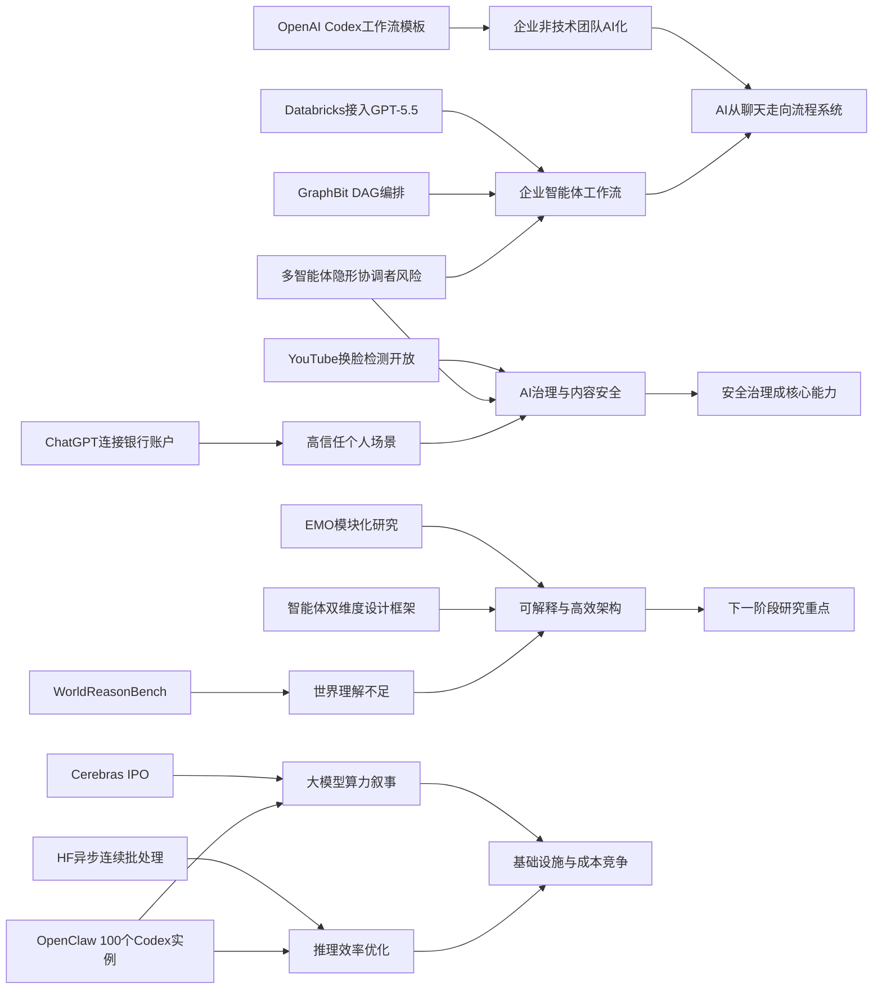

> AI 早报 · 每日早读 · 全网深度聚合

## **今日摘要**

本轮更新显示，AI产品正快速从技术演示走向真实业务场景：OpenAI用Codex服务业务运营写作整理，Databricks将GPT-5.5接入企业智能体流程，ChatGPT也开始向个人理财入口延伸。  
研究与基础设施层面，一方面Cerebras借IPO强调其硬件可支撑超大模型，另一方面GraphBit和EMO分别尝试提升智能体流程的可控性与MoE模型的自然模块化能力。  
与此同时，行业也更关注AI落地后的可靠性与治理问题，比如AI视频虽然更逼真但推理能力仍弱，YouTube则把深度伪造换脸检测工具开放给更多创作者。

### 🔵 产品与功能更新

1. **Codex开始面向业务运营团队提供工作流模板。**  
OpenAI展示了业务运营团队如何用Codex（代码与任务助手）整理项目简报、战略更新、管理层决策材料和进度汇报。它强调的是把真实工作输入快速转成结构化文档，而不是只做聊天问答。对非技术团队来说，这类功能更像“写作与整理副驾”，能减少重复汇总工作。🚀  
[业务运营用法指南](https://openai.com/academy/codex-for-work/how-business-operations-teams-use-codex)

2. **Cerebras借IPO强化“大模型也能跑”的市场叙事。**  
Cerebras因IPO（首次公开募股）成为焦点，这家公司以不同于主流的AI芯片路线著称。其首席财务官强调，Cerebras并不只适合小模型，也能承载万亿参数模型（超大规模AI模型），甚至提到内部的OpenAI 5.4和5.5模型。这个表态明显是在争取资本市场和企业客户对其硬件能力的认可。🚀  
[IPO与大模型表态](https://news.smol.ai/issues/26-05-15-not-much/)

3. **Databricks把GPT-5.5接入企业智能体工作流。**  
OpenAI介绍称，Databricks正在把GPT-5.5用于企业智能体（能自动完成多步任务的AI系统）流程。该模型此前在OfficeQA Pro基准测试中拿下新的最佳成绩，这成为其进入企业场景的重要背书。对企业用户而言，这意味着更成熟的文档处理、问答和自动化协作能力。🚀  
[企业工作流新进展](https://openai.com/index/databricks)

---

### 🟢 前沿研究

1. **GraphBit提出用“有向图”来约束AI智能体流程。**  
这篇arXiv论文提出GraphBit，用DAG（有向无环图，一种不会无限循环的流程结构）明确规定智能体每一步怎么走。作者认为，很多依赖提示词调度的智能体框架容易出现“路由幻觉”、死循环和结果难复现的问题。GraphBit的重点是让流程更可控、更稳定，适合需要可靠执行的复杂任务。🚀  
[图式编排论文摘要](https://arxiv.org/abs/2605.13848)

2. **EMO研究探索“专家混合”模型中的自然模块化。**  
AllenAI发布的EMO研究围绕MoE（专家混合，一种把不同子模型分工协作的架构）展开。它关注的是预训练后是否会出现“涌现式模块化”——也就是模型自己形成更清晰的功能分工。对于AI研究者来说，这关系到模型效率、可解释性和扩展能力。🚀  
[专家混合研究解读](https://huggingface.co/blog/allenai/emo)

3. **YouTube向成年创作者开放AI换脸检测工具。**  
YouTube的Likeness Detection（肖像相似度检测）工具现在向所有18岁及以上创作者开放，不再只限合作伙伴计划成员。系统可以识别他人视频中是否出现了AI生成的“换脸”内容，并允许用户直接在YouTube Studio提交下架请求。它反映出平台正在把“深度伪造”防护从头部创作者扩展到更广泛群体。🚀  
[换脸检测功能开放](https://the-decoder.com/youtube-opens-its-deepfake-face-swap-detection-tool-to-all-adult-creators/)

---

### 🟡 行业展望与社会影响

1. **新基准显示AI视频更好看了，但世界理解仍明显不足。**  
WorldReasonBench这个新测试不只看画面质量，而是检查视频生成模型是否符合物理和逻辑常识。结果显示，商业模型整体领先开源模型，但“逻辑推理”依然是所有模型最薄弱的部分。换句话说，AI视频正在变得更逼真，却还远未真正理解现实世界。🚀  
[视频推理基准观察](https://the-decoder.com/new-benchmark-confirms-ai-video-generators-look-stunning-but-still-cant-reason-about-the-world/)

2. **ChatGPT进入个人理财场景，计划支持连接银行账户。**  
TechCrunch报道称，OpenAI正在推出面向个人理财的ChatGPT功能，用户可连接银行账户查看投资表现、支出、订阅和待付款项。这样的产品方向意味着聊天机器人正从“信息助手”走向“资金与生活管理入口”。同时，它也会带来更高的数据隐私和金融安全关注。🚀  
[个人理财功能消息](https://techcrunch.com/2026/05/15/openai-launches-chatgpt-for-personal-finance-will-let-you-connect-bank-accounts/)

3. **AI推高用电需求，硅谷度假区也受到波及。**  
TechCrunch报道指出，随着AI带动电力需求上升，美国太浩湖地区可能面临更高能源价格。这个案例说明，AI的影响不只在软件和芯片层面，也正在传导到电网、能源基础设施和居民生活成本。AI热潮背后的现实代价，正开始被更多地方感受到。🚀  
[AI推高能源压力](https://techcrunch.com/2026/05/15/silicon-valleys-vacationland-needs-a-new-energy-provider-just-as-ai-is-driving-prices-up/)

---

### 🟣 开源TOP项目

1. **Hugging Face分享连续批处理中的异步推理优化。**  
这篇博客讨论continuous batching（连续批处理，一种提升大模型服务效率的方法）如何进一步引入asynchronicity（异步处理）。核心价值在于让推理请求更灵活地排队和执行，从而提升吞吐量并减少等待。对于部署大模型服务的团队来说，这类优化直接关系到成本和响应速度。🚀  
[异步批处理详解](https://huggingface.co/blog/continuous_async)

2. **AI智能体设计出现“双维度”框架化总结。**  
这篇arXiv论文提出一个二维框架，从认知功能和执行拓扑两个角度梳理AI智能体设计模式。作者认为，只看“数据怎么流动”或只看“智能体做什么”都不足以区分真实架构差异。这样的总结有助于开发者更系统地比较和设计智能体系统。🚀  
[智能体设计框架](https://arxiv.org/abs/2605.13850)

3. **inaturalist-clumper 0.1发布，提供新的轻量工具更新。**  
Simon Willison记录了inaturalist-clumper 0.1这一新版本发布。虽然摘要信息较少，但从命名看，它是围绕iNaturalist相关数据处理的小工具项目。对关注轻量开源工具的用户来说，这类持续更新往往意味着更顺手的数据整理能力。🚀  
[项目版本更新记录](https://simonwillison.net/2026/May/15/inaturalist-clumper/#atom-everything)

---

### 🔴 社媒分享

1. **三人团队每月烧掉130万美元，让100个AI智能体同时写代码。**  
The Decoder报道称，OpenClaw创始人Peter Steinberger让约100个Codex实例长期运行，负责写代码、审查PR（代码合并请求）和找Bug（程序错误）。他把每月130万美元的API支出视为一种研究投入，想看看“当Token（模型处理文本的计量单位）成本不设限时”，软件开发会变成什么样。这个案例非常适合社媒传播，因为它把AI自动编程的想象推到了极端。🚀  
[百个智能体开发实验](https://the-decoder.com/for-1-3-million-a-month-openclaw-founder-peter-steinberger-runs-100-ai-agents-that-code-review-prs-and-find-bugs/)

2. **马耳他与OpenAI合作，向全民提供ChatGPT Plus。**  
OpenAI宣布与马耳他合作，扩大AI普及范围，为公民提供ChatGPT Plus和相关培训。重点不只是发放工具，还包括帮助居民建立实际使用能力和负责任使用意识。这种国家层面的合作，很容易成为“AI公共服务化”的讨论样本。🚀  
[马耳他全民合作计划](https://openai.com/index/malta-chatgpt-plus-partnership)

3. **多智能体系统的“隐形协调者”可能带来安全风险。**  
这篇arXiv论文研究一种常见企业架构：由隐藏的协调者统一管理多个专业智能体。作者通过实验认为，这种“看不见的指挥层”可能压制保护性行为，并让掌权角色与实际后果脱节。随着企业越来越多采用多智能体系统，这类安全讨论很可能在社媒上持续发酵。🚀  
[多智能体安全风险](https://arxiv.org/abs/2605.13851)

---

📊 行业洞察

1. 事实  
   OpenAI将Codex（代码与任务助手）包装为业务运营团队的工作流模板工具，Databricks把GPT-5.5接入企业智能体（可自动完成多步任务的AI系统）流程，同时GraphBit论文提出用DAG（有向无环图）来约束智能体执行路径，降低“路由幻觉”和死循环。  
   【洞察】企业级AI正从“通用聊天入口”转向“流程编排平台”。这意味着竞争焦点不再只是模型能力本身，而是“模型+工作流+治理”的系统化交付能力；未来企业采购更看重可复现性、可审计性和跨部门嵌入深度。

2. 事实  
   Cerebras借IPO强调其硬件可承载万亿参数模型，Hugging Face则分享连续批处理中的异步推理优化（通过更灵活调度提升吞吐与时延表现），与此同时，OpenClaw用100个Codex实例长期并行写代码、月度API成本高达130万美元。  
   【洞察】AI产业正在同步进入“算力扩张”和“算力精细运营”双线并进阶段。一方面，超大模型继续推高高性能芯片与基础设施需求；另一方面，推理优化、并发调度和成本控制正成为商业落地的核心护城河。未来赢家未必只是拥有更大模型者，也会是单位任务成本最低、资源利用率最高者。

3. 事实  
   YouTube向所有成年创作者开放AI换脸检测工具，OpenAI被曝推进可连接银行账户的ChatGPT个人理财功能，另有研究指出多智能体系统中的“隐形协调者”可能带来安全风险。  
   【洞察】AI正加速进入“高信任场景”，平台治理与安全架构将从附属议题升级为产品主功能。无论是金融数据接入、身份肖像保护，还是多智能体决策链管理，下一阶段行业门槛将更多体现在权限控制、责任追踪和风险缓释设计，而非单纯的交互体验。

4. 事实  
   WorldReasonBench显示AI视频生成的画面质量明显提升，但世界理解和逻辑推理依然薄弱；AllenAI的EMO研究则探索MoE（专家混合）模型中是否存在自然形成的功能模块化；同时，多智能体设计开始出现“双维度”框架化总结。  
   【洞察】当前AI能力提升已进入“表面生成质量领先、深层结构理解滞后”的阶段。行业正在从盲目追求更像人，转向追求“可分工、可解释、可验证”的系统智能；这预示着未来研究热点将从单模型规模竞赛，部分转移到模块化架构、推理一致性与世界模型（对现实规则的内部表示）建设。

🗺️ 今日关系图

