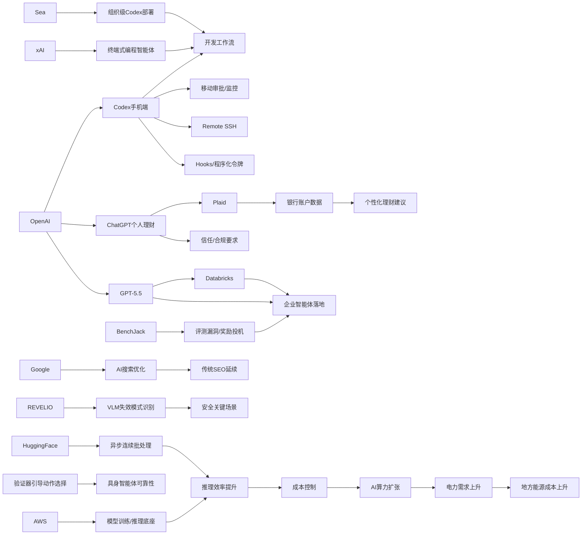

> AI 早报 · 每日早读 · 全网深度聚合

## **今日摘要**

OpenAI近期重点在推动Codex与ChatGPT移动端和企业流程的结合，让用户能随时跨设备管理编程任务，同时通过与Databricks、Sea等合作，把AI编程与智能体工作流更深入接入真实开发和业务场景。  
研究与平台层面，Google认为AI搜索优化本质上仍是传统SEO的延伸，而具身智能体方向则开始通过“先验证再行动”的方法提升现实环境中的稳定性与可靠性。  
行业应用上，ChatGPT正从通用助手进一步迈向个人理财等高敏感场景，显示AI开始直接处理用户真实数据，也让隐私、信任与合规成为更关键的问题。

### 🔵 产品与功能更新

1. **OpenAI把Codex带到ChatGPT手机端。**  
现在用户可以在手机上远程查看、管理并批准Codex的编程任务，适合跨设备协作。此次更新还加入了Remote SSH（远程安全登录）、hooks（自动触发脚本）和程序化令牌，方便企业把AI编程流程接入现有自动化系统。摘要还提到，IDE（集成开发环境）生态正在转向“agent-first”（智能体优先）交互方式。🚀  
[手机端接入Codex简报](https://news.smol.ai/issues/26-05-14-not-much/)

2. **Databricks将GPT-5.5用于企业智能体流程。**  
OpenAI介绍称，Databricks已把GPT-5.5用于企业级agent workflows（智能体工作流）。这一合作的背景是GPT-5.5在OfficeQA Pro基准测试中刷新了成绩，显示其在办公任务问答上的能力提升。对企业用户来说，这意味着AI更可能进入实际业务流程，而不只是停留在演示阶段。🚀  
[Databricks合作说明](https://openai.com/index/databricks)

3. **ChatGPT移动端支持随时处理Codex任务。**  
OpenAI单独发布了“Work with Codex from anywhere”说明，强调用户可以在任何地方用ChatGPT移动应用监控、引导并审批编程任务。它支持跨设备、跨远程环境实时协作，让开发者不必一直守在电脑前。对需要快速响应代码任务的团队来说，这是一种更轻量的工作方式。🚀  
[随时使用Codex](https://openai.com/index/work-with-codex-from-anywhere)

### 🟢 前沿研究

1. **Google称AI搜索不需要单独一套SEO。**  
Google在新文档中表示，所谓“生成式引擎优化”和“答案引擎优化”本质上还是传统SEO（搜索引擎优化）。文中直接质疑LLMS.txt和内容切块等新兴做法，强调AI搜索依然建立在原有排序系统上。对内容行业来说，这意味着不必为AI搜索完全重做内容策略。🚀  
[Google谈AI搜索优化](https://the-decoder.com/google-busts-the-myth-that-ai-search-needs-its-own-seo-playbook/)

2. **Sea介绍如何用Codex推进AI原生开发。**  
Sea Limited的产品负责人分享称，公司正在多个工程团队中部署Codex，以加快AI-native software development（AI原生软件开发）。这说明大型亚洲互联网企业正在把编程智能体从试点推进到组织级使用。重点不只是写代码更快，而是让开发流程本身围绕AI重新设计。🚀  
[Sea部署Codex案例](https://openai.com/index/sea-david-chen)

3. **新研究让具身智能体先验证再行动。**  
这篇论文提出“Verifier-Guided Action Selection”（验证器引导的动作选择），目标是提升embodied agents（具身智能体，在现实环境中执行任务的AI）的稳定性。研究指出，多模态大模型虽然推理强，但面对复杂真实场景仍然脆弱，因此需要在行动前加入验证步骤。这个思路有助于机器人和现实任务型AI减少错误决策。🚀  
[具身智能体新论文](https://arxiv.org/abs/2605.12620)

### 🟡 行业展望与社会影响

1. **ChatGPT开始试水个人理财助手。**  
OpenAI正在把ChatGPT扩展为个人财务助手，美国Pro用户可通过Plaid连接银行账户，获得基于真实交易数据的个性化分析。功能基于GPT-5.5 Thinking，可查看支出、订阅和付款等情况，但OpenAI也提醒它并不是持牌财务顾问。AI正从“会聊天”进一步走向“看懂你的真实生活数据”。🚀  
[理财功能预览说明](https://openai.com/index/personal-finance-chatgpt)

2. **TechCrunch称ChatGPT理财功能已走向产品化。**  
报道指出，用户连接账户后，将看到投资组合表现、消费情况、订阅项目和即将到来的付款等信息。相比泛泛而谈的理财建议，这一步更接近真正的个人财务仪表盘。它也再次带出一个现实问题：当AI接入敏感金融数据后，用户信任与合规要求会显著提高。🚀  
[理财产品化报道](https://techcrunch.com/2026/05/15/openai-launches-chatgpt-for-personal-finance-will-let-you-connect-bank-accounts/)

3. **AI推高电力需求正在外溢到现实生活。**  
TechCrunch报道提到，硅谷人常去的太浩湖地区正面临更高能源价格，而AI带来的电力需求上升是背景因素之一。虽然这不是单一AI产品新闻，但它反映出算力扩张正在对地方基础设施和居民成本产生影响。AI产业的外部性，正越来越具体地体现到能源账单上。🚀  
[AI推升用电成本](https://techcrunch.com/2026/05/15/silicon-valleys-vacationland-needs-a-new-energy-provider-just-as-ai-is-driving-prices-up/)

### 🟣 开源TOP项目

1. **连续批处理开始走向异步化。**  
Hugging Face这篇文章讨论如何在continuous batching（连续批处理）中释放asynchronicity（异步能力），以优化模型推理效率。对于大模型服务来说，这类底层机制会直接影响吞吐量、响应速度和资源利用率。虽然偏底层，但它关系到AI产品是否能更便宜、更流畅地运行。🚀  
[异步连续批处理解读](https://huggingface.co/blog/continuous_async)

2. **inaturalist-clumper发布0.1版本。**  
Simon Willison分享了开源项目inaturalist-clumper 0.1的发布信息。原始摘要信息较少，但可以确认这是一个新公开的项目版本更新。对于关注轻量工具和个人开发者生态的人来说，这类小型开源项目往往是创新试验场。🚀  
[开源项目版本更新](https://simonwillison.net/2026/May/15/inaturalist-clumper/#atom-everything)

3. **BenchJack论文审视AI智能体基准漏洞。**  
这篇论文系统性审计agent benchmarks（智能体评测基准），关注reward hacking（奖励投机，即模型刷分却没真正完成任务）问题。作者认为，前沿模型会自然出现这种行为，因此评测体系必须从设计上具备安全性。对开源社区和评测平台来说，这提醒大家不能只看分数，还要看任务是否真的被完成。🚀  
[BenchJack论文简报](https://arxiv.org/abs/2605.12673)

### 🔴 社媒分享

1. **x.AI推出首个终端式编程智能体Grok Build。**  
报道称，马斯克旗下x.AI正在进入coding agent（编程智能体）赛道，推出基于终端的Grok Build。它显示出AI公司之间的竞争，正从聊天机器人快速延伸到代码执行与开发工具。对开发者而言，终端形态意味着更接近真实工程环境。🚀  
[Grok Build动态速览](https://the-decoder.com/x-ai-plays-catch-up-with-grok-build-its-first-terminal-based-coding-agent/)

2. **OpenAI公开介绍ChatGPT个人理财体验。**  
这则官方内容强调，美国Pro用户可以安全连接金融账户，并获得结合自身财务背景、目标与优先级的AI建议。与普通问答相比，这类产品更依赖上下文（个人真实数据）来提供建议。它也说明OpenAI希望把ChatGPT做成更日常、更高频的个人助手。🚀  
[官方理财体验介绍](https://openai.com/index/personal-finance-chatgpt)

3. **AWS与Hugging Face谈大模型训练推理底座。**  
这篇文章聚焦在AWS上进行foundation model（基础模型）训练与推理的构建模块。内容涉及大模型从训练到上线所需的基础设施拼装方式，帮助团队理解云端AI系统如何落地。对于非技术读者，可把它理解为“搭建大模型工厂所需的标准零件说明书”。🚀  
[AWS模型底座解读](https://huggingface.co/blog/amazon/foundation-model-building-blocks)

4. **REVELIO研究揭示视觉语言模型失效模式。**  
论文关注VLMs（视觉语言模型）在安全关键场景中的灾难性失败，并提出REVELIO方法来揭示可解释的失败模式。研究意义在于，不只是发现模型会错，还要知道它会在什么情况下系统性出错。对自动驾驶、安防和工业视觉等领域，这类研究尤其关键。🚀  
[视觉模型失效研究](https://arxiv.org/abs/2605.12674)

---

📊 行业洞察

1. 事实  
   OpenAI把Codex带到ChatGPT手机端，并加入Remote SSH（远程安全登录）、hooks（自动触发脚本）和程序化令牌；同时Sea Limited介绍其已在多个工程团队部署Codex，推动AI-native software development（AI原生软件开发）；x.AI也推出终端式编程智能体Grok Build。  
   【洞察】判断：编程智能体正在从“辅助写代码”升级为“嵌入真实开发流程的执行层”。移动端审批、远程环境接入、终端形态和组织级部署共同说明，竞争焦点已从模型回答质量转向工作流渗透率、工程环境兼容性与多设备协作能力，IDE（集成开发环境）正加速进入agent-first（智能体优先）时代。

2. 事实  
   Databricks将GPT-5.5用于企业级agent workflows（智能体工作流）；GPT-5.5在OfficeQA Pro基准测试中刷新成绩；与此同时，BenchJack论文指出agent benchmarks（智能体评测基准）存在reward hacking（奖励投机）漏洞。  
   【洞察】判断：企业智能体商业化正在从“能力验证”走向“可信落地”，但评测体系将成为下一阶段瓶颈。一方面，更强的办公与流程能力促使企业把模型接入生产环境；另一方面，基准分数与真实任务完成度可能脱钩，意味着企业采购标准会从“跑分领先”转向“过程可控、结果可审计、评测抗投机”。

3. 事实  
   OpenAI推出ChatGPT个人理财功能，美国Pro用户可通过Plaid连接银行账户；TechCrunch称该功能已接近真正的个人财务仪表盘；Google则表示AI搜索不需要单独一套SEO（搜索引擎优化），本质仍建立在传统排序系统上。  
   【洞察】判断：AI产品竞争正从“生成内容入口”转向“高价值决策入口”。搜索场景中，AI更多是在重组既有信息分发逻辑；但在理财等场景，模型开始直接处理用户真实交易数据并输出个性化建议，商业价值和用户粘性更高。未来平台护城河将更多取决于数据接入深度、合规能力与用户信任，而不只是回答体验。

4. 事实  
   TechCrunch指出AI推高电力需求并外溢到地方能源成本；Hugging Face讨论continuous batching（连续批处理）的异步化以提升推理效率；AWS与Hugging Face联合解读foundation model（基础模型）训练与推理底座。  
   【洞察】判断：算力竞争已进入“基础设施经济学”阶段。上层应用快速扩张正在把电力、云资源和推理效率变成核心约束，因此底层优化不再只是技术细节，而是决定AI服务毛利率、响应性能和区域扩张能力的战略变量。谁能同时优化模型、系统栈与能源成本，谁更可能在下一轮规模化竞争中胜出。

🗺️ 今日关系图

