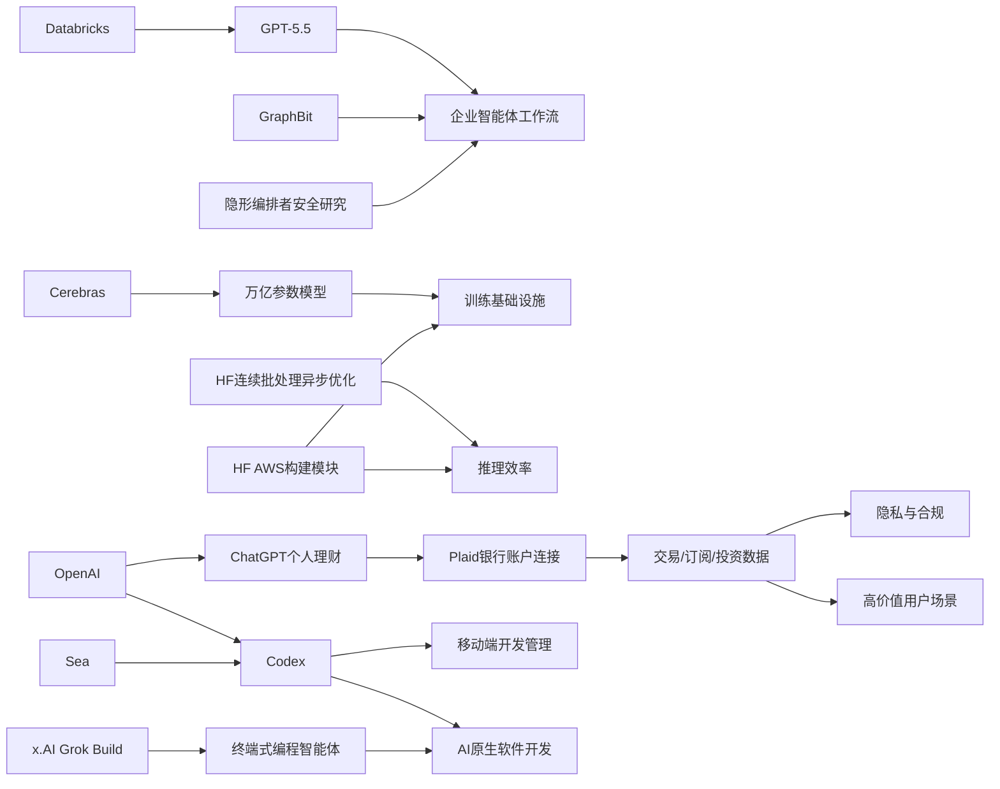

> AI 早报 · 每日早读 · 全网深度聚合

## **今日摘要**

本轮动态显示，AI正加速从“聊天工具”走向真实生产场景：Databricks将GPT-5.5接入企业智能体工作流，Sea用Codex推进AI原生开发，ChatGPT也开始测试连接银行账户的个人理财能力。  
同时，底层基础设施与方法论也在演进，Cerebras借IPO强调其可承载万亿参数模型，GraphBit则尝试用更可控的图式编排提升多智能体系统稳定性。  
另一条重要信号是，AI时代未必需要推翻原有规则——谷歌认为AI搜索优化本质仍是传统SEO，而二维码生成器这类轻量工具则说明，实用、小而精的产品依然有价值。

### 🔵 产品与功能更新

1. **Databricks把GPT-5.5接入企业智能体工作流。**
Databricks宣布在企业级智能体（Agent，可自动执行多步任务的AI系统）工作流中采用GPT-5.5，并称该模型在OfficeQA Pro基准测试上刷新了当前最好成绩。对企业用户来说，这意味着AI可更稳定地处理办公问答、流程协作和复杂任务分派。消息也显示，大模型正从“聊天工具”进一步走向正式生产环境🚀  
[企业智能体升级解读(briefing)](https://openai.com/index/databricks)

2. **Cerebras冲刺IPO，强调可承载万亿参数模型。**
Cerebras因IPO（首次公开募股）消息成为焦点，这家公司一直以“非主流”的AI芯片路线著称。其首席财务官Bob Komin特别强调，Cerebras不仅能支持小模型，也能服务万亿参数级模型，包括文中提到的OpenAI内部5.4和5.5模型。对市场而言，这既是在讲硬件能力，也是在争夺“谁能支撑下一代超大模型”的叙事权🚀  
[芯片独角兽上市看点(briefing)](https://news.smol.ai/issues/26-05-15-not-much/)

3. **二维码生成器小工具上线。**
Simon Willison分享了一个二维码生成器工具，虽然功能简单，但这类轻量化实用工具往往很适合嵌入AI应用或内容工作流。对于非技术用户来说，二维码生成是高频场景，例如分享链接、活动海报或移动端跳转。它也体现出开发者生态中“先把小工具做好”的产品思路🚀  
[轻量工具更新速览(briefing)](https://simonwillison.net/2026/May/15/qr-code-generator/#atom-everything)

### 🟢 前沿研究

1. **谷歌称AI搜索不需要一套全新的SEO方法。**
谷歌最新说明指出，所谓“生成式引擎优化”和“答案引擎优化”，本质上仍然是传统SEO（搜索引擎优化）。官方还反驳了LLMS.txt文件、内容切块等被行业热炒的特殊技巧，强调AI搜索依旧依赖原有的排序系统。对内容创作者和品牌方来说，这意味着与其追逐新概念，不如继续做好内容质量、结构与权威性🚀  
[谷歌回应AI搜索优化(briefing)](https://the-decoder.com/google-busts-the-myth-that-ai-search-needs-its-own-seo-playbook/)

2. **Sea介绍如何用Codex推进AI原生软件开发。**
Sea Limited首席产品官分享，公司正将Codex部署到工程团队中，以加速亚洲市场的软件研发。这里的“AI原生软件开发”指的是把AI直接嵌入编码、调试和协作流程，而不是只把AI当辅助插件。该案例说明，大型企业已开始系统性地把编程智能体融入研发组织🚀  
[企业部署Codex案例(briefing)](https://openai.com/index/sea-david-chen)

3. **GraphBit提出基于图的智能体编排框架。**
GraphBit是一项新研究，主张用有向无环图（DAG，可理解为预先定义好的流程图）来编排智能体任务。研究者认为，依赖提示词临时决定流程的智能体系统，容易出现幻觉式路由、死循环和结果不稳定问题。GraphBit尝试用更明确、可复现的流程设计，提升多智能体系统的可靠性🚀  
[图式智能体框架研究(briefing)](https://arxiv.org/abs/2605.13848)

### 🟡 行业展望与社会影响

1. **ChatGPT开始测试个人理财功能。**
OpenAI正在把ChatGPT扩展为个人财务助手，美国Pro用户可通过Plaid连接银行账户，获得基于真实交易数据的分析建议。系统由GPT-5.5 Thinking驱动，可展示支出、订阅和未来账单等信息。OpenAI也明确提醒，ChatGPT并不是持牌理财顾问，这让“AI给钱出主意”的边界问题再次受到关注🚀  
[ChatGPT理财功能速览(briefing)](https://openai.com/index/personal-finance-chatgpt)

2. **TechCrunch称ChatGPT可连接银行账户看消费与资产表现。**
另一则报道补充了该功能的实际使用方式：用户接入账户后，可查看投资组合表现、日常支出、订阅项目和即将到期付款。相比单纯问答，这意味着AI开始进入更敏感、更高价值的个人数据场景。它可能提升财务管理效率，但也会让隐私、安全和建议可靠性成为核心讨论点🚀  
[银行账户接入影响分析(briefing)](https://techcrunch.com/2026/05/15/openai-launches-chatgpt-for-personal-finance-will-let-you-connect-bank-accounts/)

3. **Codex支持在移动端随时处理编程任务。**
OpenAI表示，用户现在可通过ChatGPT移动应用随时使用Codex，并实时监看、调整和批准编码任务。对于分布式团队或远程工作者，这意味着编程智能体不再局限于桌面端，而是扩展到跨设备协作。AI编程工具正从“写代码”进一步演变为“随时可管理的开发执行层”🚀  
[移动端Codex新能力(briefing)](https://openai.com/index/work-with-codex-from-anywhere)

### 🟣 开源TOP项目

1. **连续批处理迎来异步化优化。**
Hugging Face介绍了连续批处理（continuous batching，可把多个请求持续拼接处理以提升效率）中的异步化改进。核心价值在于让模型推理服务更高效，减少等待和资源空转。对于开源部署者和推理平台来说，这类优化往往直接关系到成本、吞吐量和响应速度🚀  
[推理异步优化解读(briefing)](https://huggingface.co/blog/continuous_async)

2. **AI智能体设计模式出现二维分类框架。**
一篇新论文提出用“认知功能”和“执行拓扑”两个维度来理解AI智能体架构。研究者认为，现有行业框架往往只描述数据怎么流动，或只描述智能体在做什么，难以准确区分不同架构。这个二维框架有助于开发者更系统地比较和设计智能体系统🚀  
[智能体设计框架论文(briefing)](https://arxiv.org/abs/2605.13850)

3. **iNaturalist-clumper 0.1发布。**
Simon Willison分享了iNaturalist-clumper 0.1版本更新。虽然摘要信息有限，但从命名看，这是围绕自然观察平台iNaturalist数据处理的小型工具。此类开源项目往往面向明确场景，体现开发者社区持续打磨细分工具的节奏🚀  
[小型开源工具发布(briefing)](https://simonwillison.net/2026/May/15/inaturalist-clumper/#atom-everything)

### 🔴 社媒分享

1. **x.AI推出首个终端式编程智能体Grok Build。**
报道称，马斯克旗下x.AI正在进入编程智能体赛道，推出基于终端的Grok Build。终端式工具通常更贴近开发者真实工作流，可直接参与代码执行和环境操作。对外界来说，这表明主流AI公司都在争夺“开发者入口”这一关键位置🚀  
[x.AI编程工具动态(briefing)](https://the-decoder.com/x-ai-plays-catch-up-with-grok-build-its-first-terminal-based-coding-agent/)

2. **AWS上的大模型训练与推理模块被系统梳理。**
Hugging Face发布文章，介绍在AWS（亚马逊云）上进行基础模型训练和推理的关键构建模块。内容聚焦云端基础设施、训练流程和推理部署，对希望搭建AI服务的团队具有较强参考价值。它也反映出云平台与开源生态之间的协同正在加深🚀  
[AWS模型构建指南(briefing)](https://huggingface.co/blog/amazon/foundation-model-building-blocks)

3. **多智能体系统或因“隐形调度者”带来安全风险。**
一篇新论文研究“隐形编排者”（用户看不见的协调智能体）对多智能体系统安全性的影响。作者发现，当隐藏的协调层掌控任务分配时，可能抑制保护性行为，并让权力持有者与实际后果脱节。随着企业越来越多采用多智能体架构，这类安全研究的重要性正在快速上升🚀  
[多智能体安全新研究(briefing)](https://arxiv.org/abs/2605.13851)

---

📊 行业洞察

1. 事实  
   Databricks把GPT-5.5接入企业智能体工作流；GraphBit提出用DAG（有向无环图，预定义流程编排）提升多智能体可靠性；另有研究指出“隐形编排者”可能带来安全风险。  
   【洞察】企业智能体正在从“模型能力竞争”转向“流程治理竞争”。单纯提升模型效果已不够，未来企业级落地的关键会变成可编排性、可审计性与安全边界，谁能把智能体做成像工作流软件一样稳定，谁更有机会进入核心生产系统。

2. 事实  
   Cerebras冲刺IPO并强调可承载万亿参数模型；Hugging Face介绍连续批处理异步化优化以提升推理效率；Hugging Face同时系统梳理AWS上的训练与推理模块。  
   【洞察】AI基础设施市场正形成“两端并进”格局：一端是Cerebras这类专用芯片争夺超大模型训练叙事，另一端是云平台与开源社区围绕推理效率、部署成本和工程化工具链持续优化。行业竞争焦点已不只是“能不能训更大的模型”，而是“能否以更低总拥有成本（TCO，整体建设与运营成本）把模型稳定跑起来”。

3. 事实  
   OpenAI测试ChatGPT个人理财功能，支持通过Plaid连接银行账户；TechCrunch补充其可查看支出、订阅、投资组合和未来账单；OpenAI同时强调该功能并非持牌理财建议。  
   【洞察】AI正在从低风险信息助手迈向高敏感决策助手，金融数据接入标志着大模型开始深入个人“交易层”。这会显著提升用户黏性和付费潜力，但也把竞争门槛抬升到隐私合规、建议可靠性和责任界定，未来AI产品的护城河将不只来自模型，还来自数据权限管理与信任机制。

4. 事实  
   Sea将Codex系统性引入工程团队推进AI原生软件开发；Codex已支持在移动端随时处理和审批编程任务；x.AI推出终端式编程智能体Grok Build。  
   【洞察】编程智能体正在从“代码补全工具”升级为“开发执行层”（可直接参与任务分配、执行、审批的系统）。这意味着开发者入口之争已从IDE（集成开发环境）内助手扩展到终端、移动端和团队协作链路，未来赢家更可能是能够覆盖多设备、多角色和完整研发流程的平台。

🗺️ 今日关系图

