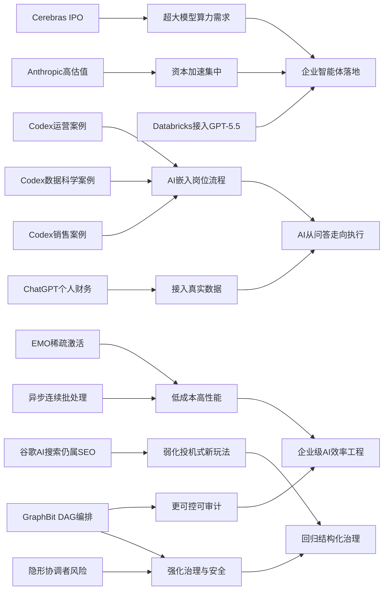

> AI 早报 · 每日早读 · 全网深度聚合

## **今日摘要**

本期更新显示，AI 产业竞争正从模型本身延伸到基础设施与办公落地：Cerebras 借 IPO 强调其芯片可支持万亿参数大模型，OpenAI 则持续展示 Codex 在业务运营和数据科学团队中的实际协作价值，同时生态里也涌现出二维码生成器等轻量实用工具。  
研究方面，EMO 证明混合专家模型只启用少量专家也能维持接近完整性能，GraphBit 则尝试用 DAG 流程提升多智能体系统的可控性、稳定性和可审计性。  
行业层面上，谷歌认为 AI 搜索并不需要全新的 SEO 体系，而 ChatGPT 接入个人银行账户等功能则表明，AI 正加速从“信息助手”演变为更深入日常工作与生活决策的“行动助手”。

### 🔵 产品与功能更新

1. **Cerebras冲刺IPO，强调可承载超大模型。**  
Cerebras 因首次公开募股（IPO，企业上市融资）成为焦点。公司高管特别强调，其硬件并不只适合“小模型”，也能支持万亿参数级别（模型规模指标）的超大模型。文中还提到其已服务类似 OpenAI 5.4、5.5 这类内部大模型，意在回应市场对其能力边界的质疑。对普通读者来说，这意味着 AI 芯片赛道的竞争正从“能不能跑”转向“能跑多大、跑多快”🚀  
[查看Cerebras动态简报](https://news.smol.ai/issues/26-05-15-not-much/)

2. **OpenAI展示Codex在业务运营团队中的用法。**  
OpenAI 发布案例，介绍 Codex 如何帮助业务运营团队整理项目简报、战略更新和管理层决策材料。它的重点不是写代码，而是把真实工作输入转成更清晰的文档输出。对非技术岗位来说，这类工具正在从“聊天助手”升级为“办公协作助手”🚀  
[查看运营团队案例](https://openai.com/academy/codex-for-work/how-business-operations-teams-use-codex)

3. **二维码生成器小工具上线。**  
开发者 Simon Willison 分享了一个二维码生成器工具。虽然功能看起来简单，但这类轻量工具很适合和 AI 工作流结合，比如快速生成活动链接、文档入口或演示页跳转码。它体现了当下 AI 生态外延的一个趋势：不仅有大模型，也有大量实用小工具在补齐最后一公里体验🚀  
[查看二维码工具说明](https://simonwillison.net/2026/May/15/qr-code-generator/#atom-everything)

### 🟢 前沿研究

1. **EMO模型只启用少量专家也能保持高性能。**  
Allen Institute for AI 和加州大学伯克利分校推出 EMO，这是一种混合专家模型（MoE，把任务分给多个“专家模块”处理）。研究称，它只使用 12.5% 的专家时，性能依然接近完整模型。简单说，就是用更少计算和内存，换来几乎不打折的效果，这对资源受限设备尤其重要🚀  
[查看EMO研究解读](https://the-decoder.com/researchers-train-ai-model-that-hits-near-full-performance-with-just-12-5-percent-of-its-experts/)

2. **OpenAI发布Codex在数据科学团队中的应用案例。**  
OpenAI 展示了数据科学团队如何用 Codex 生成问题归因简报、指标影响说明和分析范围文档。它能把分散的数据工作整理成更容易沟通的成果，对跨团队协作很有帮助。对于企业而言，这说明 AI 工具正逐渐嵌入分析、汇报和决策支持流程🚀  
[查看数据科学案例](https://openai.com/academy/codex-for-work/how-data-science-teams-use-codex)

3. **GraphBit提出更可控的智能体编排框架。**  
GraphBit 是一项新研究，主张用有向无环图（DAG，一种固定流程图）来明确规定 AI 智能体（Agent，能自动完成任务的系统）的执行路径。研究者认为，这种方式能减少“幻觉式路由”、无限循环和结果不稳定的问题。对企业用户来说，这意味着多智能体系统可能变得更可预测、更容易审计🚀  
[查看GraphBit论文摘要](https://arxiv.org/abs/2605.13848)

### 🟡 行业展望与社会影响

1. **谷歌称AI搜索并不需要一套全新的SEO玩法。**  
谷歌在新文档中表示，所谓“生成式引擎优化”或“答案引擎优化”，本质上仍是传统 SEO（搜索引擎优化）。它还点名淡化了 LLMS.txt、内容切块等热门做法的重要性。对内容创作者和品牌方来说，这释放了一个信号：AI 搜索时代虽然界面变了，但底层排序逻辑没有彻底推倒重来🚀  
[查看谷歌SEO说明](https://the-decoder.com/google-busts-the-myth-that-ai-search-needs-its-own-seo-playbook/)

2. **ChatGPT进军个人理财，可连接银行账户。**  
OpenAI 推出个人财务功能后，用户可连接银行账户查看投资表现、支出、订阅和即将到期付款。这个变化意味着聊天机器人正从“回答问题”走向“读取真实生活数据并给建议”。不过这也会带来隐私、安全和误导建议等讨论，因为 AI 并不是持牌理财顾问🚀  
[查看理财功能简报](https://techcrunch.com/2026/05/15/openai-launches-chatgpt-for-personal-finance-will-let-you-connect-bank-accounts/)

3. **Databricks把GPT-5.5接入企业智能体工作流。**  
Databricks 宣布在企业智能体工作流中使用 GPT-5.5，并提到该模型在 OfficeQA Pro 基准测试（用于评估办公场景问答能力）上创下新成绩。对企业客户而言，这说明更强模型已不只是实验室展示，而是在逐步进入日常流程自动化。未来企业软件中的“AI 同事”可能会更常见🚀  
[查看Databricks合作说明](https://openai.com/index/databricks)

### 🟣 开源TOP项目

1. **连续批处理加入异步能力，推理效率有望提升。**  
Hugging Face 介绍了连续批处理（continuous batching，一种让多个请求更高效排队执行的方法）中的异步化改进。核心价值在于让模型推理资源利用率更高，减少等待和空转。对部署 AI 服务的团队来说，这类底层优化往往比单纯换更大模型更直接影响成本和响应速度🚀  
[查看异步批处理解析](https://huggingface.co/blog/continuous_async)

2. **inaturalist-clumper 0.1发布。**  
Simon Willison 分享了 inaturalist-clumper 0.1，这是一项新开源小工具。虽然摘要没有展开太多细节，但从命名看，它与 iNaturalist（自然观察平台）数据整理有关。此类轻量开源项目常常是更大 AI 应用链路中的基础组件，适合做数据清洗和素材组织🚀  
[查看项目发布说明](https://simonwillison.net/2026/May/15/inaturalist-clumper/#atom-everything)

3. **AI智能体设计模式论文提出二维分类框架。**  
这篇论文尝试用“认知功能”和“执行拓扑”两个维度来分类 AI 智能体设计。研究指出，只按一个维度理解系统结构，容易忽略架构之间的真正差异。对关注开源 Agent 框架的人来说，这提供了一套更系统的比较方法，也有助于避免“名字不同、其实一类”的混乱🚀  
[查看设计模式论文](https://arxiv.org/abs/2605.13850)

### 🔴 社媒分享

1. **Anthropic估值或达9000亿美元，首次超过OpenAI。**  
报道称 Anthropic 正在再融资 300 亿美元，估值将升至 9000 亿美元。推动这一增长的关键是其年化收入已接近 450 亿美元，且较 2024 年底增长了约五倍。这个数字如果属实，不只是资本市场热情高，也说明头部 AI 公司正迅速变成真正的大生意🚀  
[查看Anthropic估值报道](https://the-decoder.com/anthropics-900-billion-valuation-would-make-it-more-valuable-than-openai-for-the-first-time/)

2. **OpenAI展示Codex在销售团队中的应用。**  
OpenAI 介绍销售团队如何用 Codex 生成销售漏斗简报、会议准备材料、业绩预测回顾和客户计划。它的价值在于把一线销售数据整理成更适合行动和复盘的内容。对很多企业来说，这意味着 AI 正在从“写营销文案”走向更贴近营收的核心流程🚀  
[查看销售团队案例](https://openai.com/academy/codex-for-work/how-sales-teams-use-codex)

3. **多智能体系统中的“隐形协调者”或带来安全风险。**  
一篇新论文研究了多智能体系统中“隐形协调者”（在后台分配任务的隐藏控制层）对安全行为的影响。结果显示，这种不可见编排方式可能压制保护性行为，并让掌权角色与实际后果产生脱节。随着企业越来越多部署多智能体系统，这类研究提醒大家：系统设计方式本身，也会影响 AI 是否安全可靠🚀  
[查看安全风险论文](https://arxiv.org/abs/2605.13851)

---

📊 行业洞察

1. 事实  
   - Cerebras 冲刺 IPO（首次公开募股，企业上市融资），并强调其芯片可支持万亿参数级别大模型。  
   - Databricks 将 GPT-5.5 接入企业智能体工作流，并在 OfficeQA Pro（办公场景问答基准）上强调性能。  
   - Anthropic 据报道再融资 300 亿美元、估值或达 9000 亿美元。  
   【洞察】AI 产业竞争重心正从“模型能力展示”升级为“算力-模型-商业化”三位一体竞赛：上游芯片厂商需要证明可承载超大模型，中游模型厂商需要证明性能领先，下游平台则要证明能进入企业真实流程。资本市场对头部公司的高估值，本质上是在提前定价这一整条价值链的集中度提升。

2. 事实  
   - OpenAI 连续展示 Codex 在业务运营、数据科学、销售团队中的应用。  
   - ChatGPT 新增个人财务功能，可连接银行账户读取真实交易与支出数据。  
   - Databricks 把 GPT-5.5 嵌入企业智能体工作流。  
   【洞察】AI 正从“通用问答工具”转向“流程型操作系统”：其核心不再只是生成文本，而是接入真实业务数据、嵌入岗位流程、产出可执行文档与决策支持。这意味着企业采购 AI 的评估标准会从“模型是否聪明”转向“是否能打通数据、权限、协作链路并稳定交付结果”。

3. 事实  
   - EMO（混合专家模型，MoE）仅启用 12.5% 专家时仍接近完整性能。  
   - Hugging Face 介绍连续批处理的异步化改进，以提升推理资源利用率。  
   - GraphBit 用 DAG（有向无环图）约束智能体执行路径，以减少幻觉式路由和循环。  
   【洞察】行业优化方向正在从“训练更大的模型”转向“以更低成本获得可控性能”：模型层通过稀疏激活减少算力浪费，系统层通过异步批处理提升吞吐，应用层通过图式编排增强可预测性。未来企业级 AI 的护城河，可能不只是参数规模，而是“效率工程 + 编排治理 + 成本控制”的综合能力。

4. 事实  
   - 谷歌表示 AI 搜索不需要一套全新的 SEO（搜索引擎优化）玩法，并淡化 LLMS.txt、内容切块等策略。  
   - 多智能体系统中的“隐形协调者”研究指出，隐藏控制层可能带来安全风险并削弱保护性行为。  
   - GraphBit 强调用显式流程提升智能体系统的可审计性。  
   【洞察】随着 AI 从内容分发走向任务执行，行业正在形成一个共同原则：黑箱式“魔法体验”正在让位于可解释、可审计、可治理的系统设计。无论是搜索流量获取还是多智能体部署，平台都在弱化“投机技巧”，强化长期稳定的结构化治理能力。

🗺️ 今日关系图

