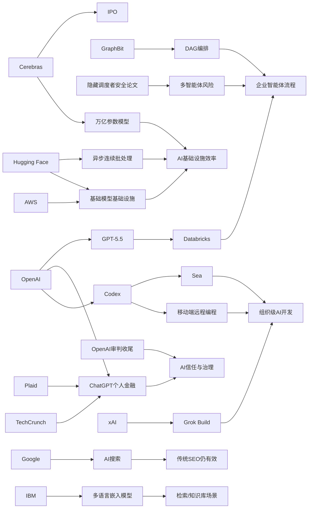

> AI 早报 · 每日早读 · 全网深度聚合

## **今日摘要**

Databricks、Cerebras 和 OpenAI 相关动态显示，AI 正同时向企业流程、底层算力和行业治理三条线加速推进：前者把 GPT-5.5 接入企业智能体工作流，后者借 IPO 强调其可支撑万亿参数模型，而 OpenAI 审判则放大了公众对 AI 领导者信任与治理的关注。  
研究与落地层面，Google 认为 AI 搜索并不需要一套全新的 SEO 规则，GraphBit 提出用 DAG 显式编排智能体以提升可复现性和稳定性，Sea 也在推动 Codex 从个人编程助手升级为组织级开发能力。  
在社会应用上，ChatGPT 已开始测试连接银行账户的个人理财功能，说明 AI 正从内容生成和办公协作进一步深入到金融等更敏感、更高频的真实决策场景。

### 🔵 产品与功能更新

1. **Databricks将GPT-5.5接入企业智能体流程。**  
Databricks 宣布在企业级智能体（Agent，能自动执行任务的AI助手）工作流中使用 GPT-5.5。官方提到，这一模型在 OfficeQA Pro 基准测试中刷新了成绩，因此被用于更复杂的办公与企业流程。对企业用户来说，这意味着AI不再只是聊天工具，而是更深地进入审批、分析、协作等日常系统。🚀  
[查看企业合作详情(briefing)](https://openai.com/index/databricks)

2. **Cerebras借IPO强调可服务万亿参数模型。**  
Cerebras 因启动 IPO（首次公开募股）成为焦点，也借此再次强调其硬件路线的差异化。公司 CFO Bob Komin 表示，Cerebras 不仅能支持小模型，也能承载万亿参数级别的大模型，包括内部的 OpenAI 5.4 与 5.5 模型。这个表态直接回应了外界对其适用范围的质疑，也让资本市场更关注AI算力基础设施。🚀  
[了解Cerebras动态(briefing)](https://news.smol.ai/issues/26-05-15-not-much/)

3. **OpenAI审判收尾，AI领导者信任问题再被放大。**  
围绕 Musk 与 Altman 的案件本周进入收尾阶段，讨论焦点始终回到一个问题：公众是否能信任掌控AI的人。虽然这更偏向行业事件，但它也影响了 OpenAI 及相关产品未来的舆论环境与治理预期。与此同时，围绕 Musk 的创业与融资机器仍在持续转动，显示AI头部公司的影响力已经溢出技术圈。🚀  
[回看案件核心讨论(briefing)](https://techcrunch.com/podcast/the-openai-trial-wraps-up-and-the-musk-founder-machine-keeps-spinning/)

### 🟢 前沿研究

1. **Google称AI搜索不需要单独的SEO新套路。**  
Google 在最新说明中表示，所谓 GEO（生成式引擎优化）和 AEO（答案引擎优化）本质上并不是全新的游戏规则。它明确反驳了 LLMS.txt、内容切块等被炒热的做法，强调AI搜索依然建立在传统搜索排序系统之上。对内容生产者来说，这意味着“为AI搜索单独重写一套策略”的必要性可能被高估了。🚀  
[查看Google说明解读(briefing)](https://the-decoder.com/google-busts-the-myth-that-ai-search-needs-its-own-seo-playbook/)

2. **GraphBit提出可复现的图式智能体编排框架。**  
GraphBit 是一套基于图结构的智能体框架，核心思路是用 DAG（有向无环图，一种不会无限循环的流程图）显式定义工作流。研究者指出，很多依赖提示词驱动的智能体系统容易出现路线幻觉、死循环和结果不可复现的问题。GraphBit 通过引擎直接控制流程，而不是让模型临场决定下一步，提升了稳定性与可验证性。🚀  
[阅读GraphBit论文(briefing)](https://arxiv.org/abs/2605.13848)

3. **Sea计划用Codex推动亚洲工程团队AI化开发。**  
Sea Limited 的产品负责人分享了公司如何在工程团队中部署 Codex，以加快 AI-native（原生围绕AI构建）软件开发。重点不只是“用AI写代码”，而是将其嵌入跨团队的软件生产流程。对于大型互联网公司，这类实践说明AI编程助手正从个人工具升级为组织能力。🚀  
[了解Sea的Codex实践(briefing)](https://openai.com/index/sea-david-chen)

### 🟡 行业展望与社会影响

1. **ChatGPT开始测试个人理财功能并连接银行账户。**  
OpenAI 正把 ChatGPT 推向个人金融助手场景，美国 Pro 用户现在可通过 Plaid（金融账户连接服务）接入银行账户。系统会基于真实交易数据，给出支出、订阅、账单和资产表现等分析。官方也提醒，这仍不是持牌理财顾问，但它预示AI正在进入更敏感、也更高频的个人决策领域。🚀  
[查看理财功能介绍(briefing)](https://openai.com/index/personal-finance-chatgpt)

2. **TechCrunch披露ChatGPT理财功能将展示财务总览。**  
据报道，用户在完成账户连接后，将看到投资组合表现、消费情况、订阅项目以及即将到来的付款。相比“问答式理财建议”，这更像一个由AI驱动的财务仪表盘。对普通用户来说，AI产品正在从提供信息，转向整理和解释个人现实数据。🚀  
[了解功能细节报道(briefing)](https://techcrunch.com/2026/05/15/openai-launches-chatgpt-for-personal-finance-will-let-you-connect-bank-accounts/)

3. **Codex支持在移动端远程处理编程任务。**  
OpenAI 宣布可以通过 ChatGPT 手机应用随时使用 Codex。用户能够跨设备监控、干预和批准编程任务，即使任务运行在远程环境中也能实时处理。这个变化让AI编程助手更像“随身项目搭档”，而不再被固定在桌面端。🚀  
[查看移动端Codex说明(briefing)](https://openai.com/index/work-with-codex-from-anywhere)

### 🟣 开源TOP项目

1. **IBM发布多语言嵌入模型Granite Embedding Multilingual R2。**  
IBM 在 Hugging Face 发布了 Granite Embedding Multilingual R2，这是一款开放、支持 Apache 2.0 许可的多语言嵌入模型。嵌入模型可以把文本转成向量（便于检索与匹配的数字表示），适合搜索、问答与知识库场景。官方强调其拥有 32K 上下文能力，并在小于1亿参数的同类模型中取得了很强的检索表现。🚀  
[查看Granite模型详情(briefing)](https://huggingface.co/blog/ibm-granite/granite-embedding-multilingual-r2)

2. **Hugging Face分享连续批处理异步化方案。**  
Hugging Face 介绍了 continuous batching（连续批处理）中的异步化改进思路。连续批处理常用于提升大模型推理吞吐量，而异步化则有助于进一步改善资源利用率与响应效率。对开发者和推理服务团队来说，这类底层优化直接关系到成本和延迟。🚀  
[阅读异步批处理解读(briefing)](https://huggingface.co/blog/continuous_async)

3. **AWS与Hugging Face总结大模型训练推理基础模块。**  
这篇文章系统梳理了在 AWS 上进行基础模型训练与推理的关键构件。内容覆盖训练、部署和基础设施配套，帮助团队理解云平台上大模型落地需要哪些底层模块。对准备搭建AI平台的企业来说，这是偏工程实践的路线图。🚀  
[查看AWS实践指南(briefing)](https://huggingface.co/blog/amazon/foundation-model-building-blocks)

### 🔴 社媒分享

1. **xAI推出首个终端式编程智能体Grok Build。**  
xAI 正式进入编程智能体赛道，发布了基于终端的工具 Grok Build。终端式意味着它更贴近开发者熟悉的命令行工作方式，而不是单纯网页聊天。虽然被形容为“追赶者”，但这也说明头部AI公司正在补齐编程助手版图。🚀  
[了解Grok Build发布(briefing)](https://the-decoder.com/x-ai-plays-catch-up-with-grok-build-its-first-terminal-based-coding-agent/)

2. **多智能体系统可能因隐藏调度者带来安全风险。**  
一篇新论文指出，在多智能体系统中，隐藏的 orchestrator（调度者，负责分配任务的核心代理）可能压制保护性行为，并让掌权角色与真实后果脱节。研究通过预注册实验测试了这种“看不见的协调者”结构的安全影响。随着企业越来越采用多智能体架构，这类风险值得产品和治理团队提前关注。🚀  
[阅读安全风险论文(briefing)](https://arxiv.org/abs/2605.13851)

3. **OpenAI再次预告ChatGPT个人金融新体验。**  
OpenAI 官方单独发文预告了 ChatGPT 的个人金融体验，强调美国 Pro 用户可安全连接金融账户，并获得结合个人目标、优先级与财务背景的AI建议。相比单纯功能上线，这类官方表述更像是在为“高信任度AI助手”定位铺路。它也反映出AI产品正在尝试进入钱包、预算和长期规划等核心生活场景。🚀  
[查看官方体验预告(briefing)](https://openai.com/index/personal-finance-chatgpt)

---

📊 行业洞察

1. 事实  
   Databricks 将 GPT-5.5 接入企业智能体（Agent，能自动执行任务的AI助手）流程；GraphBit 提出基于 DAG（有向无环图）的可复现智能体编排框架，强调用显式流程替代模型临场决策；同时，多智能体系统中的隐藏 orchestrator（调度者）被论文指出可能带来安全与责任脱节风险。  
   【洞察】企业智能体正在从“模型能力竞争”转向“流程可控竞争”。仅有更强模型已不足以支撑企业级落地，未来胜负更取决于编排框架、审计能力、权限治理和可复现性；也就是说，Agent 平台层（workflow/orchestration，工作流与调度层）正成为新的价值高地。

2. 事实  
   Cerebras 借 IPO 强调其硬件可服务万亿参数模型；Hugging Face 分享 continuous batching（连续批处理）异步化方案以提升推理吞吐；AWS 与 Hugging Face 进一步总结基础模型训练与推理基础模块。  
   【洞察】AI 基础设施竞争已从“单点算力性能”升级为“端到端效率体系”竞争。资本市场关注的不再只是芯片峰值能力，还包括训练、推理、调度、部署到云端交付的整体效率。未来基础设施厂商的护城河，将更多体现在全栈 TCO（总拥有成本）优化，而非单一硬件参数。

3. 事实  
   OpenAI 推出并多次预告 ChatGPT 个人金融功能，可通过 Plaid 连接银行账户；TechCrunch 披露其将展示投资、消费、订阅和账单等财务总览；与此同时，OpenAI 审判收尾又将“公众能否信任AI领导者”推回舆论中心。  
   【洞察】AI 正加速进入“高频+高敏感”数据场景，产品天花板开始取决于信任资本而不只是模型体验。金融助手代表着生成式 AI 从信息助手迈向“现实世界决策界面”，但一旦涉及资产、支付、预算与建议，品牌治理、合规透明度和责任边界将成为增长前提。信任，正在成为新的产品功能。

4. 事实  
   Sea 计划用 Codex 推动亚洲工程团队 AI-native（原生围绕AI构建）开发；OpenAI 又让 Codex 支持移动端远程处理任务；xAI 也推出终端式编程智能体 Grok Build，补齐编程助手版图。  
   【洞察】AI 编程助手正在从“个人提效工具”演进为“组织级软件生产基础设施”。其形态也从 IDE（集成开发环境）内插件，扩展到终端、远程执行、移动审批与跨团队协作。下一阶段竞争焦点将不是谁会写代码，而是谁能接入企业开发流程、任务流转和工程管理系统，成为默认的软件生产入口。

🗺️ 今日关系图

