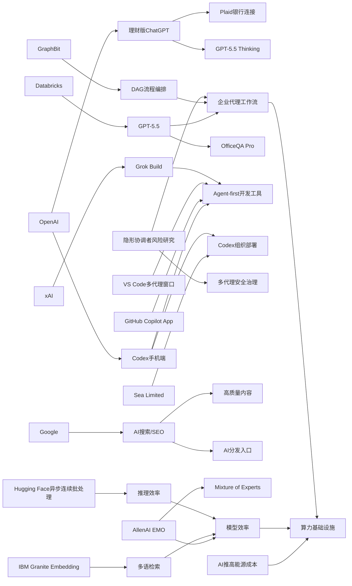

> AI 早报 · 每日早读 · 全网深度聚合

## **今日摘要**

近期更新显示，AI 产品正快速从“聊天工具”升级为“可执行任务的代理平台”：OpenAI 将 Codex 带到 ChatGPT 手机端并增强企业自动化接入，Databricks 也把 GPT-5.5 用于更复杂的企业工作流。  
同时，研究和平台侧都在强调 AI 系统要更稳定、可控、可落地，例如 Google 认为 AI 搜索仍应回归传统 SEO 基础，GraphBit 与 EMO 则分别探索更确定的代理流程和更模块化的大模型能力。  
在社会影响层面，ChatGPT 开始接入用户银行账户、走向个人金融入口，说明 AI 正更深入真实生活与业务场景，但也带来了隐私、安全与责任边界的新问题。

### 🔵 产品与功能更新

1. **OpenAI把 Codex 带到 ChatGPT 手机端。**  
现在用户可以在手机里远程查看、接管和批准编程任务，让“代码代理”（能代替人执行部分开发工作的AI助手）跨设备协同更顺手。更新还加入了 Remote SSH（远程安全登录）、hooks（自动触发机制）和程序化令牌，方便企业把AI接入自动化流程。与此同时，GitHub Copilot App 预览版和 VS Code 的多代理工作流窗口，也说明开发工具正加速转向“agent-first”（以AI代理为核心）的交互方式。🚀  
[手机端Codex更新(briefing)](https://news.smol.ai/issues/26-05-14-not-much/)

2. **Databricks把 GPT-5.5 用于企业代理工作流。**  
Databricks 宣布在企业级代理工作流中使用 GPT-5.5，重点面向更复杂的办公和业务流程自动化。官方提到，这一模型在 OfficeQA Pro 基准测试中刷新了当前最好成绩，说明其在办公问答和任务处理上更强。对企业用户来说，这意味着AI代理在文档处理、分析和执行环节可能更可靠。🚀  
[Databricks接入GPT(briefing)](https://openai.com/index/databricks)

3. **OpenAI上线个人理财版 ChatGPT。**  
美国的 Pro 用户现在可以通过 Plaid（金融账户连接服务）把银行账户接入 ChatGPT，获得基于真实交易数据的个性化分析。系统会展示投资表现、支出、订阅和待付款项目，并由 GPT-5.5 Thinking 提供建议。OpenAI 也提醒，这项功能仍不是持牌金融顾问服务，更适合作为日常理财辅助。🚀  
[ChatGPT理财功能(briefing)](https://openai.com/index/personal-finance-chatgpt)

### 🟢 前沿研究

1. **Google称 AI 搜索并不需要一套全新SEO规则。**  
Google 在新文档中表示，所谓“生成式引擎优化”与“答案引擎优化”，本质上仍是传统 SEO（搜索引擎优化）的延伸。它还点名否定了一些流行技巧，比如 LLMS.txt 文件和内容切块的神奇效果。对内容创作者来说，这意味着想被 AI 搜索引用，核心仍然是高质量内容和成熟的网站优化基础。🚀  
[Google谈AI搜索SEO(briefing)](https://the-decoder.com/google-busts-the-myth-that-ai-search-needs-its-own-seo-playbook/)

2. **GraphBit尝试用图结构管理AI代理流程。**  
这篇论文提出 GraphBit，用有向无环图（DAG，一种按固定顺序流转的流程图）来明确规定代理工作流，而不是让模型自己决定下一步。作者认为，当前很多“提示词编排”方案容易出现幻觉式路由、死循环和不可复现的问题。GraphBit 的价值在于让多代理系统的执行路径更确定、更稳定，也更适合企业环境。🚀  
[GraphBit论文速览(briefing)](https://arxiv.org/abs/2605.13848)

3. **EMO研究探索专家混合模型的模块化能力。**  
AllenAI 介绍了 EMO，这是一种 Mixture of Experts（专家混合模型：由多个子模型分工处理任务）的预训练方法。研究重点是让模型在训练中自然形成“模块化”能力，也就是不同部分逐渐擅长不同类型的问题。若这条路线成立，未来大模型可能在效率、可控性和任务分工上进一步提升。🚀  
[EMO研究解读(briefing)](https://huggingface.co/blog/allenai/emo)

### 🟡 行业展望与社会影响

1. **ChatGPT正从聊天助手走向个人金融入口。**  
OpenAI 推出银行账户接入后，ChatGPT 不再只是回答问题，而是在尝试成为“看得懂你财务状况”的助手。它能结合消费、订阅和支付记录给出更贴身的建议，这会让AI更深入个人生活场景。与此同时，隐私保护、建议准确性和责任归属，也会成为社会讨论的重点。🚀  
[银行账户接入影响(briefing)](https://the-decoder.com/chatgpt-now-wants-access-to-your-bank-account-so-it-can-tell-you-to-stop-ordering-takeout/)

2. **AI推高用电需求，连度假区也感受到压力。**  
TechCrunch 报道称，硅谷人喜爱的太浩湖地区正面临更高能源价格，而AI带来的电力需求增长是背景因素之一。随着数据中心和模型训练持续扩张，AI的资源消耗正从科技行业内部问题，外溢到普通居民和地方基础设施。能源成本、供电稳定性和区域公平性，都会成为AI时代的新议题。🚀  
[AI与能源成本(briefing)](https://techcrunch.com/2026/05/15/silicon-valleys-vacationland-needs-a-new-energy-provider-just-as-ai-is-driving-prices-up/)

3. **Sea把 Codex 大规模部署到工程团队。**  
Sea Limited 的产品负责人表示，公司正在多个工程团队中推进 Codex，以加快“AI原生软件开发”（从流程设计起就把AI纳入开发方式）。这反映出亚洲大型互联网企业也在积极验证编码代理的组织价值。对行业来说，未来竞争可能不仅是“有没有AI”，而是“能否把AI真正嵌入团队协作”。🚀  
[Sea部署Codex案例(briefing)](https://openai.com/index/sea-david-chen)

### 🟣 开源TOP项目

1. **IBM发布多语言文本向量模型 Granite Embedding Multilingual R2。**  
这是一个 Apache 2.0 开源许可的多语言 embedding（文本向量表示）模型，支持 32K 上下文，主打检索质量和多语种能力。摘要称其在 1 亿参数以下模型中达到了领先的检索表现。对开发者来说，这类轻量开源模型更容易落地到搜索、知识库和问答系统中。🚀  
[IBM多语向量模型(briefing)](https://huggingface.co/blog/ibm-granite/granite-embedding-multilingual-r2)

2. **Hugging Face 讨论连续批处理的异步化。**  
这篇文章聚焦 continuous batching（连续批处理：把不同请求动态拼接以提升推理效率）如何进一步支持异步执行。它的目标是提高模型服务吞吐量，并减少等待带来的资源浪费。对开源推理框架和模型服务平台而言，这类优化直接关系到成本与响应速度。🚀  
[异步批处理方案(briefing)](https://huggingface.co/blog/continuous_async)

3. **inaturalist-clumper 发布 0.1 版本。**  
这是一个新发布的小型开源项目，名称显示它与 iNaturalist 数据处理有关。虽然摘要信息有限，但从版本号 0.1 来看，项目仍处于早期探索阶段。对关注轻量工具链的开发者来说，这类项目往往提供了特定场景的数据整理能力。🚀  
[clumper项目更新(briefing)](https://simonwillison.net/2026/May/15/inaturalist-clumper/#atom-everything)

### 🔴 社媒分享

1. **xAI推出首个终端式编程代理 Grok Build。**  
报道称，马斯克旗下 xAI 正在进入编程代理赛道，Grok Build 采用 terminal-based（基于命令行终端）的使用方式。它表明 coding agent（编程代理）竞争已经从大模型本身，延伸到更贴近开发者工作流的工具体验。对社交平台讨论而言，这类产品很容易和 Codex、Copilot 等现有方案形成直接比较。🚀  
[Grok Build动态(briefing)](https://the-decoder.com/x-ai-plays-catch-up-with-grok-build-its-first-terminal-based-coding-agent/)

2. **AWS与 Hugging Face 讲解大模型训练和推理基础模块。**  
这篇分享围绕在 AWS 上搭建 foundation model（基础模型）训练与推理所需的关键组件。内容更偏基础设施层，帮助读者理解大模型从训练到部署需要哪些底座能力。对于关注云平台与AI结合的人来说，这是比较典型的“能力拼图”型内容。🚀  
[AWS模型基础模块(briefing)](https://huggingface.co/blog/amazon/foundation-model-building-blocks)

3. **新研究提醒多代理系统存在“隐形协调者”安全风险。**  
这篇 arXiv 论文研究 invisible orchestrators（隐形协调者：用户看不见、却在背后分配任务的代理）可能压制保护性行为，并让掌控者与执行结果脱节。作者通过多代理实验，提出企业常见的协调架构可能带来新的安全隐患。随着多代理系统进入生产环境，这类风险讨论正在社媒和研究圈快速升温。🚀  
[多代理安全风险(briefing)](https://arxiv.org/abs/2605.13851)

---

📊 行业洞察

1. 事实  
   OpenAI 把 Codex 带到 ChatGPT 手机端，并加入 Remote SSH（远程安全登录）、hooks（自动触发机制）和程序化令牌；GitHub Copilot App 预览版、VS Code 多代理工作流窗口同步出现；Sea 也在多个工程团队推进 Codex；xAI 推出终端式编程代理 Grok Build。  
   【洞察】编程助手正在从“单点补全工具”升级为“全流程代码代理（能代替人执行部分开发工作的AI助手）”，竞争焦点已从模型能力转向工作流嵌入、跨设备协同和组织级部署。未来开发者工具的护城河，将更多体现在能否接入企业真实环境、支持多人协作与审批闭环，而非仅靠代码生成准确率。

2. 事实  
   Databricks 在企业代理工作流中接入 GPT-5.5，并强调其在 OfficeQA Pro 基准测试上的表现；GraphBit 论文提出用 DAG（有向无环图）来约束代理执行路径，以降低幻觉式路由、死循环和不可复现；另有研究指出多代理系统中的 invisible orchestrators（隐形协调者）存在安全风险。  
   【洞察】企业级 Agent（代理）正在从“能不能做”转向“能不能稳定、可审计地做”。这意味着行业将进入“编排治理（orchestration governance）”阶段：模型性能仍重要，但流程确定性、权限控制、可追踪性和安全边界，才是大规模生产落地的关键采购标准。

3. 事实  
   OpenAI 上线可通过 Plaid 连接银行账户的个人理财版 ChatGPT，基于真实交易数据提供分析；相关报道指出 ChatGPT 正从聊天助手走向个人金融入口；Google 则强调 AI 搜索并不需要一套全新 SEO（搜索引擎优化）规则，本质仍依赖高质量内容与传统优化基础。  
   【洞察】AI 产品正在从“通用问答入口”转向“高价值场景入口”，其中金融是最具用户黏性与数据壁垒的方向之一。但无论是理财建议还是 AI 搜索引用，底层竞争都在回归“可信数据 + 真实上下文 + 合规责任”。谁能持续获得高质量用户数据并控制风险，谁就更有机会掌握下一代 AI 分发入口。

4. 事实  
   AllenAI 的 EMO 探索 Mixture of Experts（专家混合模型）中的模块化能力；IBM 发布轻量多语言向量模型 Granite Embedding Multilingual R2；Hugging Face 讨论 continuous batching（连续批处理）的异步化；同时，TechCrunch 报道 AI 推高地区能源成本。  
   【洞察】AI 产业正在同步追求“两种效率”——模型内部效率与系统外部效率。前者体现在模块化架构、轻量模型和更优推理机制，后者体现在算力、电力和部署成本约束。随着能源与基础设施压力上升，“更强模型”不再自动等于“更优产品”，高性价比架构与推理优化会成为下一阶段的重要竞争轴。

🗺️ 今日关系图

