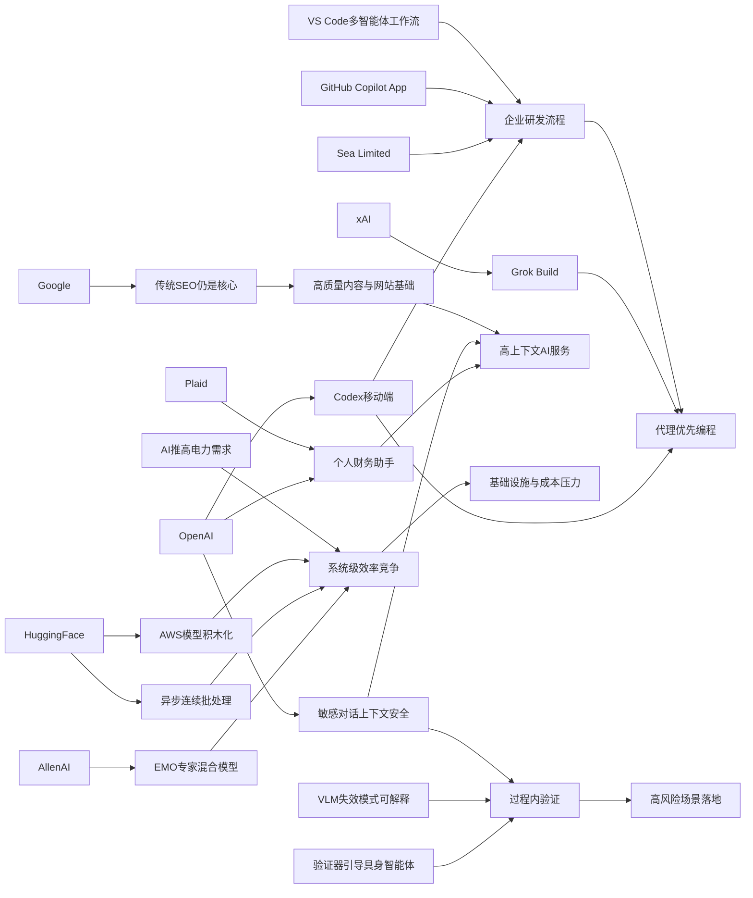

> AI 早报 · 每日早读 · 全网深度聚合

## **今日摘要**

OpenAI 正在把 Codex 从桌面工具升级为可跨设备、可远程审批和企业可集成的“持续在线编程执行层”，并已开始在 Sea 等大型团队中落地。  
研究与平台层面，一边是 Google 强调 AI 搜索优化仍应回归传统 SEO 基础，另一边学界在推进更稳健的智能体与更高效的专家混合模型。  
同时，ChatGPT 也在向更贴近真实生活与高风险场景的助手演进，比如接入个人财务数据提供分析，以及在敏感对话中更好理解上下文以提升安全性。

### 🔵 产品与功能更新

1. **OpenAI把Codex带到手机端。**  
ChatGPT 移动应用现在可以远程查看、接管和批准 Codex 的编程任务，让开发者不在电脑前也能继续推进工作。更新还包含 Remote SSH（远程安全登录）、hooks（自动触发脚本）和 programmatic tokens（程序调用令牌），更适合企业做自动化开发流程。原文还提到 GitHub Copilot App 预览版和 VS Code 的多智能体工作流窗口，说明“代理优先”的编程体验正在加速落地🚀  
[Codex移动端更新简报](https://news.smol.ai/issues/26-05-14-not-much/)

2. **ChatGPT移动端支持随时操控Codex。**  
OpenAI 官方进一步说明，用户可以在任何设备上实时监控、引导并审批 Codex 执行中的编码任务。重点不是“手机写代码”，而是把跨设备协作和远程环境管理做得更顺滑。对团队来说，这意味着 AI 编程助手开始变成可持续在线的“远程执行层”🚀  
[Codex跨端功能介绍](https://openai.com/index/work-with-codex-from-anywhere)

3. **Sea在工程团队中部署Codex。**  
Sea Limited 的产品负责人表示，公司正把 Codex 推向更多工程团队，用来加快“AI 原生”（从一开始就围绕 AI 设计）的软件开发。这个案例说明，Codex 不只是个人工具，也正在进入大型企业的正式研发流程。对于亚洲互联网公司而言，这类工具可能直接影响开发速度与协作方式🚀  
[Sea使用Codex案例](https://openai.com/index/sea-david-chen)

### 🟢 前沿研究

1. **Google称AI搜索不需要新SEO套路。**  
Google 在新文档中表示，所谓 GEO（生成式引擎优化）和 AEO（答案引擎优化）并不是全新玩法，本质上仍然建立在传统 SEO（搜索引擎优化）体系上。它还点名淡化了 LLMS.txt 和内容切块等流行做法的重要性。对内容生产者来说，这意味着与其追逐“AI 搜索秘籍”，不如继续做好高质量内容和网站基础建设🚀  
[Google谈AI搜索优化](https://the-decoder.com/google-busts-the-myth-that-ai-search-needs-its-own-seo-playbook/)

2. **具身智能体加入“先验证再行动”机制。**  
这篇论文提出一种 verifier-guided（验证器引导）方法，让具身智能体（能感知并在现实或模拟环境中行动的 AI）在执行动作前先做检查。研究针对多模态大模型在复杂场景中“会想但不一定做对”的问题，希望降低脆弱性和错误操作风险。简单说，就是让机器人或智能体少一点冲动，多一步确认🚀  
[验证器引导动作选择](https://arxiv.org/abs/2605.12620)

3. **EMO探索专家混合模型的模块化能力。**  
AllenAI 介绍的 EMO 研究聚焦 mixture of experts（专家混合模型），尝试在预训练阶段形成更自然的模块分工。目标是让模型内部不同“专家”逐渐学会处理不同类型任务，从而提升效率和泛化能力。这类工作有助于解释，未来大模型如何在更大规模下兼顾性能与成本🚀  
[EMO研究解读文章](https://huggingface.co/blog/allenai/emo)

### 🟡 行业展望与社会影响

1. **ChatGPT开始试水个人财务助手。**  
OpenAI 为美国 Pro 用户推出个人理财体验，允许通过 Plaid（金融账户连接服务）接入银行账户。接入后，ChatGPT 可以结合真实交易数据分析支出、订阅和未来账单，但官方也明确提醒它不是持牌理财顾问。这标志着聊天机器人正从“回答问题”走向“读取个人上下文并给建议”🚀  
[ChatGPT理财功能预览](https://openai.com/index/personal-finance-chatgpt)

2. **OpenAI让ChatGPT识别敏感对话的上下文。**  
OpenAI 发布新的安全更新，希望 ChatGPT 在敏感对话中能更好理解前后文，而不是只盯着单句内容。系统会尝试随着对话推进识别风险变化，并给出更安全的回应。对用户而言，这关系到心理健康、自伤风险等场景中的实际安全表现🚀  
[敏感对话安全更新](https://openai.com/index/chatgpt-recognize-context-in-sensitive-conversations)

3. **AI推高电力需求，能源价格承压。**  
报道指出，硅谷周边地区正面临新的能源供应压力，而 AI 带来的电力需求增长正在推高成本。虽然这不是单一公司的产品新闻，但它提醒行业：AI 扩张不仅是算力竞赛，也会传导到基础设施和居民生活价格。未来“谁来供电、谁来买单”会成为更现实的社会议题🚀  
[AI带动电价压力报道](https://techcrunch.com/2026/05/15/silicon-valleys-vacationland-needs-a-new-energy-provider-just-as-ai-is-driving-prices-up/)

### 🟣 开源TOP项目

1. **异步连续批处理方案被重点介绍。**  
Hugging Face 这篇文章讨论 continuous batching（连续批处理）如何进一步引入 asynchronicity（异步机制），以提升模型推理吞吐量。核心思路是让不同请求不必严格同步排队，从而减少硬件空转。对开源推理框架和部署团队来说，这类优化直接关系到成本与响应速度🚀  
[异步批处理技术解读](https://huggingface.co/blog/continuous_async)

2. **AWS上的大模型训练与推理积木化。**  
这篇 Hugging Face 博文总结了在 AWS（亚马逊云）上训练和部署基础模型所需的关键组件。它面向的是希望搭建完整模型流水线的团队，包括训练、推理和基础设施协同。对于关注开源生态的人，这类“积木式”方法有助于降低进入门槛🚀  
[AWS模型构建指南](https://huggingface.co/blog/amazon/foundation-model-building-blocks)

3. **二维码生成器小工具发布。**  
Simon Willison 分享了一个 QR code generator（二维码生成器）小工具。虽然体量不大，但这类轻量开源项目常常代表开发者对实用 AI/软件工具链的快速试验。对普通用户来说，它更像是一个即拿即用的小型生产力组件🚀  
[二维码工具项目分享](https://simonwillison.net/2026/May/15/qr-code-generator/#atom-everything)

### 🔴 社媒分享

1. **xAI推出终端式编程代理Grok Build。**  
xAI 正式进入 coding agent（编程代理）赛道，发布首个基于终端的工具 Grok Build。它的定位很直接：让 AI 能在命令行环境中协助开发任务。随着 OpenAI、GitHub、xAI 都在加码，编程代理正在成为新一轮竞争焦点🚀  
[Grok Build消息速览](https://the-decoder.com/x-ai-plays-catch-up-with-grok-build-its-first-terminal-based-coding-agent/)

2. **Simon谈“没那么锁定”了。**  
Simon Willison 的这篇短文标题是“Not so locked in any more”，传递的核心是技术生态的锁定效应正在减弱。虽然内容简短，但它呼应了当前 AI 工具链越来越开放、可替换的趋势。对开发者和用户来说，选择权增加通常意味着迁移成本下降🚀  
[生态锁定变化短评](https://simonwillison.net/2026/May/14/not-so-locked-in/#atom-everything)

3. **VLM失败模式可解释研究引发关注。**  
这篇论文关注 VLM（视觉语言模型）在安全关键场景中的失败模式，并提出 REVELIO 方法来揭示这些可解释问题。研究意义在于，不只是统计模型“错了多少”，还试图说明“为什么会这样错”。在自动驾驶、安防等高风险应用里，这类可解释性研究尤其重要🚀  
[VLM失效模式研究](https://arxiv.org/abs/2605.12674)

---

📊 行业洞察

1. 事实  
  - OpenAI 将 Codex 带到 ChatGPT 移动端，支持远程查看、接管和审批编程任务，并加入 Remote SSH（远程安全登录）、hooks（自动触发脚本）、programmatic tokens（程序调用令牌）。  
  - OpenAI 强调重点不是“手机写代码”，而是跨设备监控、引导和审批 Codex 的执行过程。  
  - Sea Limited 已在更多工程团队中部署 Codex，推动“AI 原生”研发流程。  
  - xAI 也推出终端式编程代理 Grok Build，GitHub Copilot App 与 VS Code 多智能体工作流窗口同步出现。  
  【洞察】AI 编程助手正从“IDE内插件”升级为“持续在线的远程执行层”。竞争焦点已不只是代码补全，而是能否打通终端、移动端、代码仓库和企业研发流程，形成代理优先（agent-first）的软件生产基础设施。率先占位的厂商将更容易深入企业开发工作流，提升切换成本与平台黏性。

2. 事实  
  - Hugging Face 重点介绍 asynchronous continuous batching（异步连续批处理），核心目标是提升推理吞吐量、减少硬件空转。  
  - Hugging Face 还总结了 AWS（亚马逊云）上训练与部署基础模型的“积木式”组件化路径。  
  - AllenAI 的 EMO 研究探索 mixture of experts（专家混合模型）的模块化分工，以提升效率与泛化能力。  
  - 同时，报道指出 AI 正推高电力需求与能源价格，基础设施压力上升。  
  【洞察】AI 行业已从“单纯堆模型能力”转向“系统级效率竞争”。模型架构优化、推理调度优化、云上组件化部署与能源约束正在合流，决定企业真实单位成本。未来优势不只属于模型最强者，也属于能把算力利用率、部署效率和能耗控制做得最好的平台方。

3. 事实  
  - OpenAI 为美国 Pro 用户推出个人财务助手，通过 Plaid（金融账户连接服务）接入真实银行交易数据。  
  - OpenAI 同时更新 ChatGPT 对敏感对话的上下文识别能力，希望在心理健康、自伤风险等场景中提供更安全响应。  
  - Google 表示 AI 搜索并不需要全新的 GEO（生成式引擎优化）/AEO（答案引擎优化）体系，本质仍依赖传统 SEO（搜索引擎优化）和高质量内容。  
  【洞察】生成式 AI 正加速从“通用问答层”走向“高上下文决策层”——既要读取个人金融数据，也要理解敏感语境，还要连接真实信息源。这意味着行业竞争将从模型参数规模，逐步转向上下文接入能力、风险控制能力与可信内容供给能力，安全与数据连接会成为商业化落地的关键门槛。

4. 事实  
  - verifier-guided（验证器引导）研究让具身智能体在行动前先做检查，以降低复杂环境中的错误动作。  
  - REVELIO 方法聚焦 VLM（视觉语言模型）在安全关键场景中的失败模式可解释性。  
  - OpenAI 也在对话安全中引入更强的上下文风险识别。  
  【洞察】AI 安全正在从“事后拦截”转向“过程内验证”。无论是机器人动作选择、视觉语言模型失效分析，还是聊天系统敏感对话判断，行业都在把验证、解释和动态风险识别嵌入推理流程本身。这将成为 AI 进入医疗、金融、自动驾驶、企业自动化等高风险场景的必要前提。

🗺️ 今日关系图

