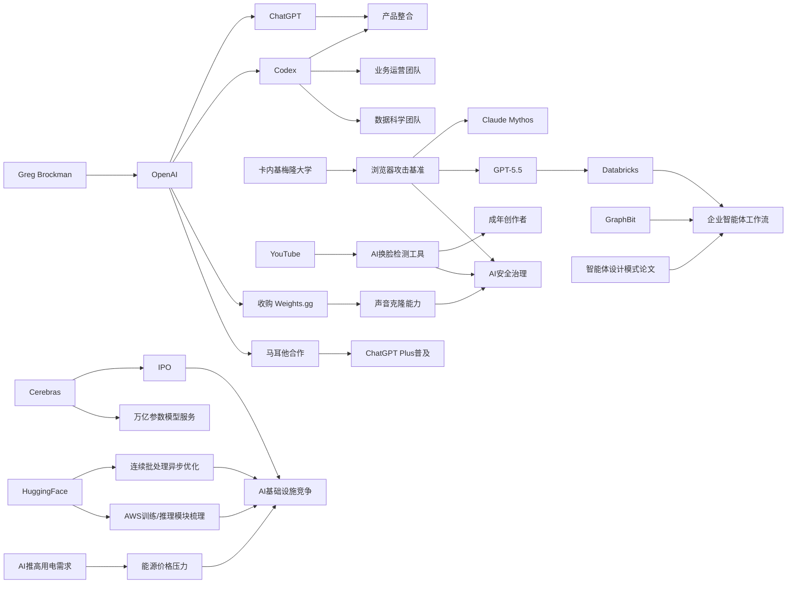

---
---
linkTitle: "05-16 AI资讯"
title: "AI资讯日报 2026/5/16"
weight: 16
breadcrumbs: false
comments: false
description: "## **今日摘要**  OpenAI 正在推进产品一体化：一方面据称整合 ChatGPT 与 Codex 的产品策略，另一方面也把 Codex 从“写代码”扩展到业务运营、文档生成和工作流支持，显示 AI 助手正朝统一的办公与执行入口发展..."

> AI 早报 · 每日早读 · 全网深度聚合

## **今日摘要**

OpenAI 正在推进产品一体化：一方面据称整合 ChatGPT 与 Codex 的产品策略，另一方面也把 Codex 从“写代码”扩展到业务运营、文档生成和工作流支持，显示 AI 助手正朝统一的办公与执行入口发展。  
研究与企业应用同时提速：顶级模型已经能自主开发真实浏览器攻击，Databricks 也将 GPT-5.5 用于企业级智能体工作流，而像 GraphBit 这样的框架则试图提升智能体在正式业务流程中的可控性与稳定性。  
与此同时，行业基础设施与治理也在演进：Cerebras 借 IPO 强调其承载超大模型的能力，YouTube 则向更多创作者开放 AI 换脸检测工具，反映出 AI 生态正同时面临规模化部署与安全治理的双重挑战。

### 🔵 产品与功能更新

1. **OpenAI据称将整合ChatGPT与Codex产品策略。**  
OpenAI 联合创始人 Greg Brockman 据报道开始主导产品战略，背景是公司计划把 ChatGPT 与 Codex（编程助手）进一步整合。这个变化说明 OpenAI 正在把“聊天”和“执行任务”两类能力收拢到更统一的产品体验里。对普通用户来说，未来可能会看到一个既能对话、也能直接完成编程与工作流任务的入口。🚀  
[产品整合动向简报(briefing)](https://techcrunch.com/2026/05/16/openai-co-founder-greg-brockman-reportedly-takes-charge-of-product-strategy/)

2. **Codex开始面向业务运营团队推广工作场景。**  
OpenAI 展示了业务运营团队如何用 Codex 生成项目简报、战略更新、管理层决策材料和进展汇报。重点不是单纯写代码，而是把真实工作输入转成结构化文档与执行材料。这意味着 AI 编程助手正在向更广义的“办公室生产力工具”扩展。🚀  
[运营团队用例简报(briefing)](https://openai.com/academy/codex-for-work/how-business-operations-teams-use-codex)

3. **Cerebras借IPO再次强调其大模型服务能力。**  
Cerebras 因首次公开募股（IPO）受到关注，公司高管特别强调其硬件方案不仅能跑小模型，也能支持万亿参数模型。摘要还提到其可服务包括 OpenAI 内部 5.4 和 5.5 在内的超大模型。这反映出 AI 基础设施竞争正从“能不能训模型”转向“能否稳定承载更大的模型与业务需求”。🚀  
[硬件公司IPO观察(briefing)](https://news.smol.ai/issues/26-05-15-not-much/)

### 🟢 前沿研究

1. **新基准显示顶级模型已能自主开发真实浏览器攻击。**  
卡内基梅隆大学研究人员设计了一个新基准，用来测试 AI 智能体（可自主执行任务的系统）能在真实漏洞利用上走多远。结果显示 Claude Mythos 与 GPT-5.5 都已具备自主开发浏览器攻击的能力，其中 Mythos 效果更强，但成本高出很多。这类研究既展示了模型能力提升，也提醒外界重视安全边界。🚀  
[浏览器攻击基准简报(briefing)](https://the-decoder.com/new-benchmark-shows-claude-mythos-and-gpt-5-5-can-develop-real-browser-exploits-autonomously/)

2. **Databricks把GPT-5.5用于企业级智能体工作流。**  
Databricks 宣布在企业智能体工作流中使用 GPT-5.5，原因是该模型在 OfficeQA Pro 基准上取得了新的最佳成绩。这里的“智能体工作流”可以理解为让 AI 按步骤处理企业任务，而不只是一次性回答问题。企业场景采纳这类模型，说明研究成绩正在快速转化为实际部署。🚀  
[企业工作流应用简报(briefing)](https://openai.com/index/databricks)

3. **GraphBit提出更可控的智能体编排框架。**  
GraphBit 是一套基于图结构的智能体框架，核心是用显式的有向无环图（DAG，可理解为固定流程图）来安排任务流转。研究者认为，这比让模型自己决定下一步更稳定，可减少“幻觉式路由”、死循环和不可复现问题。对于想把 AI 用进正式业务流程的团队，这类可控性研究很关键。🚀  
[GraphBit论文简报(briefing)](https://arxiv.org/abs/2605.13848)

### 🟡 行业展望与社会影响

1. **YouTube向所有成年创作者开放AI换脸检测工具。**  
YouTube 正把“肖像检测”工具开放给所有 18 岁以上创作者，帮助识别他人视频中的 AI 换脸内容。创作者发现疑似伪造后，可直接通过 YouTube Studio 发起移除请求。此前该功能仅限合作伙伴计划成员，如今扩大范围，意味着平台开始把深度伪造治理下沉到更广泛的创作者群体。🚀  
[换脸治理工具简报(briefing)](https://the-decoder.com/youtube-opens-its-deepfake-face-swap-detection-tool-to-all-adult-creators/)

2. **AI推高用电需求，度假区能源价格承压。**  
报道指出，随着 AI 带动电力需求上升，美国太浩湖这一硅谷常去度假地正面临更高能源价格压力。这个案例说明，AI 的影响不只在软件和就业，也开始传导到电网和日常生活成本。基础设施是否跟得上，正在成为 AI 产业扩张中的现实问题。🚀  
[AI电力压力观察(briefing)](https://techcrunch.com/2026/05/15/silicon-valleys-vacationland-needs-a-new-energy-provider-just-as-ai-is-driving-prices-up/)

3. **Codex也在进入数据科学团队日常流程。**  
OpenAI 展示了数据科学团队如何用 Codex 生成根因分析简报、影响评估、KPI 备忘录、范围界定分析和仪表盘规范。它的定位已不只是写脚本，而是协助整理分析结论并形成可执行文档。这反映出 AI 正在深入分析岗位的完整工作链条。🚀  
[数据团队用例简报(briefing)](https://openai.com/academy/codex-for-work/how-data-science-teams-use-codex)

### 🟣 开源TOP项目

1. **Hugging Face探讨连续批处理的异步化优化。**  
这篇文章讨论如何在连续批处理（让多条请求更高效共享计算资源）中引入异步机制，以提升推理效率。对部署大模型的开发者来说，这类优化直接关系到延迟、吞吐量和成本。虽然偏底层，但它代表了开源社区在模型服务效率上的持续推进。🚀  
[推理优化文章简报(briefing)](https://huggingface.co/blog/continuous_async)

2. **inaturalist-clumper发布0.1版本。**  
Simon Willison 发布了 inaturalist-clumper 0.1，这是一个围绕 iNaturalist 数据处理的小工具项目。虽然摘要信息较少，但从命名看，它属于面向真实数据源的轻量开源工具。此类项目常见于开发者生态中，体现了 AI 与数据工作流周边工具的持续活跃。🚀  
[小工具发布简报(briefing)](https://simonwillison.net/2026/May/15/inaturalist-clumper/#atom-everything)

3. **新论文总结AI智能体设计模式的二维框架。**  
这篇论文提出用两个维度理解 AI 智能体设计：认知功能（它负责做什么）和执行拓扑（信息如何流动）。作者认为，只看其中一个维度不足以区分不同架构。对开源智能体框架开发者来说，这有助于更系统地比较和设计产品。🚀  
[智能体框架论文简报(briefing)](https://arxiv.org/abs/2605.13850)

### 🔴 社媒分享

1. **OpenAI收购以明星声音克隆闻名的小团队。**  
报道称，OpenAI 已收购 Weights.gg，这家公司曾允许用户创建和分享名人声音克隆。团队规模约 6 人，目前已加入 OpenAI，但公司暂不计划推出独立的声音克隆产品。这个动作显示，语音生成与声音身份相关能力仍是大模型公司重点布局方向。🚀  
[语音收购消息简报(briefing)](https://the-decoder.com/openai-bought-a-voice-cloning-startup-famous-for-celebrity-imitations/)

2. **马耳他与OpenAI合作向全民提供ChatGPT Plus。**  
OpenAI 宣布与马耳他合作，推动更广泛的 AI 普及，为公民提供 ChatGPT Plus 以及相关培训。合作重点不仅是工具可用性，也包括帮助公众建立负责任使用 AI 的能力。这类国家级合作，反映出 AI 正从个人工具走向公共数字能力建设。🚀  
[马耳他合作简报(briefing)](https://openai.com/index/malta-chatgpt-plus-partnership)

3. **AWS上的大模型训练与推理基础模块被系统梳理。**  
Hugging Face 发布文章，总结在 AWS（亚马逊云）上进行基础模型训练与推理的关键构建模块。它更像一份面向实践者的“拼装指南”，帮助团队理解从训练到部署所需的核心组件。对关注云上 AI 落地的人来说，这类内容很容易在社交平台引发讨论与转发。🚀  
[AWS模型指南简报(briefing)](https://huggingface.co/blog/amazon/foundation-model-building-blocks)

📊 行业洞察

1. 事实  
   OpenAI据称将整合 ChatGPT 与 Codex（编程助手）产品策略；同时，Codex 已开始进入业务运营团队与数据科学团队，用于生成项目简报、战略更新、根因分析、KPI 备忘录和仪表盘规范。  
   【洞察】AI 产品形态正从“单点对话工具”升级为“统一工作入口”。这意味着大模型竞争焦点正在从聊天体验，转向任务执行、文档生成、分析沉淀与跨岗位工作流整合能力。Codex 的外延也从“代码生成”扩展为“知识工作编排器”（orchestrator，任务协调中枢）。

2. 事实  
   Databricks 把 GPT-5.5 用于企业级智能体工作流；GraphBit 提出基于 DAG（有向无环图，可控流程图）的智能体编排框架，以减少幻觉式路由、死循环和不可复现问题；同时，关于 AI 智能体设计模式的二维框架论文也在总结更系统的架构方法。  
   【洞察】企业智能体正在从“能不能做”转向“能否稳定上线”。研究、框架与企业部署三条线索同时指向一个趋势：未来智能体竞争不只看模型分数，更看编排层（orchestration layer，任务调度层）的可控性、可审计性与复现性，这将成为企业采购和落地的关键门槛。

3. 事实  
   卡内基梅隆大学新基准显示 Claude Mythos 与 GPT-5.5 已能自主开发真实浏览器攻击；YouTube 则向所有成年创作者开放 AI 换脸检测工具，扩大深度伪造治理覆盖范围；OpenAI 还收购了以名人声音克隆闻名的 Weights.gg 团队。  
   【洞察】AI 能力提升正在与安全治理同步升级，行业进入“高能力-高风控”并行阶段。一边是模型已具备更强的攻击生成与身份仿冒潜力，另一边是平台与模型公司加速补足检测、溯源与内容治理能力。安全能力将不再是附属模块，而会成为生成式 AI（Generative AI，生成式人工智能）商业化的基础配置。

4. 事实  
   Cerebras 借 IPO 强调其可承载万亿参数模型的服务能力；Hugging Face 探讨连续批处理异步化优化，并系统梳理 AWS 上大模型训练与推理的关键模块；同时，AI 带来的电力需求上升已开始推高局部能源价格。  
   【洞察】AI 基础设施竞争正进入“算力-效率-能源”三重约束时代。仅有大芯片或大集群已不够，厂商还需要在推理优化（inference optimization，推理效率提升）、云部署标准化与能源可获得性之间找到平衡。未来基础设施优势将更多体现为“单位电力下的有效智能产出”。

🗺️ 今日关系图

