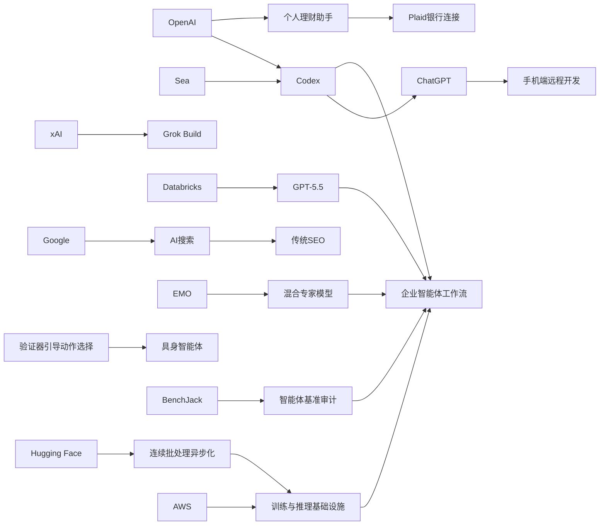

> AI 早报 · 每日早读 · 全网深度聚合

## **今日摘要**

近期 AI 领域的重点更新包括：OpenAI 将 Codex 带到 ChatGPT 手机端并增强企业自动化接入能力，Databricks 把 GPT-5.5 用于企业级智能体工作流，EMO 则展示了混合专家模型在模块化能力上的新探索。  
研究与应用层面，Google 强调 AI 搜索优化本质上仍是传统 SEO，具身智能体开始通过“先验证再行动”来提升执行稳定性，而 Sea 也在真实工程团队中用 Codex 推进 AI 原生开发。  
在社会影响方面，ChatGPT 已开始试水个人理财助手，说明通用 AI 正从内容与开发场景进一步走向企业流程和高敏感度的个人决策场景。

### 🔵 产品与功能更新
1. **OpenAI把Codex带到ChatGPT手机端。**  
现在用户可以直接在 ChatGPT 手机应用里远程查看、管理和批准 Codex 的编程任务，不必一直守在电脑前。此次更新还加入了 Remote SSH（远程安全登录）、hooks（自动触发流程）和程序化令牌，方便企业把 AI 编程助手接入内部自动化系统。摘要还提到 GitHub Copilot App 预览版与 VS Code 的多智能体工作流窗口，说明开发工具正在转向“agent-first（以智能体为中心）”体验。🚀  
[手机端远程用Codex(briefing)](https://news.smol.ai/issues/26-05-14-not-much/)

2. **Databricks将GPT-5.5用于企业智能体流程。**  
Databricks 表示，GPT-5.5 已被用于企业级 agent workflow（智能体工作流）场景。其依据之一是该模型在 OfficeQA Pro 基准测试中刷新了当前最好成绩，这意味着它在处理办公类复杂问题时表现更强。对企业用户来说，这类能力通常会被用于自动分析、执行任务和串联多个业务步骤。🚀  
[企业接入GPT5.5(briefing)](https://openai.com/index/databricks)

3. **EMO探索混合专家模型的模块化能力。**  
EMO 是一项关于 Mixture of Experts（混合专家模型）的预训练工作，重点研究模型如何自然形成“模块化”能力。简单说，就是让不同“专家模块”各自擅长不同任务，从而提升效率与泛化表现。虽然摘要较短，但它反映出大模型架构仍在持续演进，不只是拼参数规模。🚀  
[EMO混合专家预训练(briefing)](https://huggingface.co/blog/allenai/emo)

### 🟢 前沿研究
1. **Google称AI搜索并不需要单独的SEO玩法。**  
Google 在新文档中明确表示，所谓 GEO（生成式引擎优化）和 AEO（答案引擎优化）本质上仍是传统 SEO（搜索引擎优化）。它还点名否定了 LLMS.txt 和内容切块等常见新套路，认为 AI 搜索仍建立在原有排序系统之上。对内容生产者来说，这意味着与其追逐新名词，不如继续做好高质量、可检索的内容基础。🚀  
[Google谈AI搜索SEO(briefing)](https://the-decoder.com/google-busts-the-myth-that-ai-search-needs-its-own-seo-playbook/)

2. **具身智能体开始学会“先验证再行动”。**  
这篇论文提出 Verifier-Guided Action Selection（验证器引导的动作选择），目标是提升 embodied agents（具身智能体，在真实或模拟环境中行动的 AI）的稳定性。研究指出，多模态大语言模型虽然推理更强，但在复杂现实任务中依然容易出错。新方法通过先检查候选动作是否可靠，再决定执行哪一步，试图减少“想得对但做得错”的问题。🚀  
[先验证再行动研究(briefing)](https://arxiv.org/abs/2605.12620)

3. **Sea分享用Codex推动AI原生开发。**  
Sea Limited 的产品负责人介绍，公司正在工程团队中部署 Codex，以加速 AI-native software development（AI 原生软件开发）。核心思路不是把 AI 当单点工具，而是把它融入日常开发流程，让团队更系统地协作与提效。这个案例也说明，亚洲大型互联网公司正在更积极地把编程智能体落到真实生产环境。🚀  
[Sea部署Codex案例(briefing)](https://openai.com/index/sea-david-chen)

### 🟡 行业展望与社会影响
1. **ChatGPT开始试水个人理财助手。**  
OpenAI 为美国 Pro 用户推出个人理财体验，用户可通过 Plaid 连接银行账户，让 ChatGPT 基于真实交易记录给出分析和建议。界面会展示资产组合、支出、订阅和即将到来的付款情况，但 OpenAI 也强调它不是持牌财务顾问。这个方向意味着通用聊天机器人正进一步进入高敏感度的个人决策场景。🚀  
[ChatGPT接入银行账户(briefing)](https://the-decoder.com/chatgpt-now-wants-access-to-your-bank-account-so-it-can-tell-you-to-stop-ordering-takeout/)

2. **TechCrunch补充了ChatGPT理财功能细节。**  
另一篇报道指出，账户连接后，用户会看到投资组合表现、消费情况、订阅项目以及待支付账单的仪表盘。相比单纯聊天问答，这更像是把 AI 变成持续跟踪个人财务的服务入口。它带来的便利很直接，但也会让隐私、责任归属与建议可靠性变得更加重要。🚀  
[理财仪表盘功能细节(briefing)](https://techcrunch.com/2026/05/15/openai-launches-chatgpt-for-personal-finance-will-let-you-connect-bank-accounts/)

3. **Codex跨设备工作反映AI开发方式变化。**  
OpenAI 介绍，开发者可以通过 ChatGPT 手机端随时监控、调整并批准 Codex 的代码任务，覆盖多设备和远程环境。表面上这是一项产品更新，本质上则体现出软件开发正在变得更“异步化”和“代理化”。这类变化可能让工程团队的协作节奏、值班方式和任务分发机制都发生调整。🚀  
[跨设备协作新趋势(briefing)](https://openai.com/index/work-with-codex-from-anywhere)

### 🟣 开源TOP项目
1. **inaturalist-clumper发布0.1版本。**  
这是一个新发布的开源项目，当前信息主要集中在版本上线本身。尽管摘要没有展开功能细节，但从命名看，它与 iNaturalist（自然观察平台）数据处理相关。对关注轻量开源工具的人来说，这类小而专的项目常常能快速补上特定工作流中的空白。🚀  
[新项目0.1版上线(briefing)](https://simonwillison.net/2026/May/15/inaturalist-clumper/#atom-everything)

2. **Hugging Face讨论连续批处理的异步化。**  
这篇文章聚焦 continuous batching（连续批处理）中的 asynchronicity（异步处理）能力。简单理解，就是让模型推理请求在更灵活的节奏下被处理，从而提高资源利用率和吞吐效率。对于开源推理系统和模型服务框架来说，这类优化往往直接影响成本与响应速度。🚀  
[连续批处理异步化(briefing)](https://huggingface.co/blog/continuous_async)

3. **BenchJack研究如何审计智能体基准测试。**  
这篇论文指出，agent benchmarks（智能体基准测试）可能被模型“钻空子”，即通过 reward hacking（奖励作弊）拿高分，却没有真正完成任务。作者因此提出 BenchJack，用系统化方式检查这些测试是否容易被利用。对于开源评测社区而言，这提醒大家：评价 AI 能力的基准本身，也需要被认真验证。🚀  
[智能体基准审计法(briefing)](https://arxiv.org/abs/2605.12673)

### 🔴 社媒分享
1. **xAI推出终端式编程智能体Grok Build。**  
报道显示，马斯克旗下 xAI 正进入 coding agent（编程智能体）赛道，发布首个基于终端的工具 Grok Build。它的定位与不少开发者熟悉的命令行工作方式更接近，强调在终端中直接完成编码相关任务。这也说明编程智能体竞争已经从聊天窗口扩展到更贴近开发现场的入口。🚀  
[xAI发布Grok Build(briefing)](https://the-decoder.com/x-ai-plays-catch-up-with-grok-build-its-first-terminal-based-coding-agent/)

2. **OpenAI正式预览ChatGPT个人理财体验。**  
OpenAI 官方表示，美国 Pro 用户可安全连接金融账户，并获得结合个人财务背景、目标与优先级的 AI 洞察与建议。与一般“问预算问题”不同，这一版本强调基于真实上下文做分析。它很适合在社交平台引发讨论，因为便利性与风险几乎同样突出。🚀  
[官方预览理财助手(briefing)](https://openai.com/index/personal-finance-chatgpt)

3. **AWS与Hugging Face讲基础模型的训练和推理积木。**  
这篇内容介绍了在 AWS 上进行 foundation model（基础模型）训练与推理的关键组件。对非技术读者来说，可以把它理解为“大模型落地所需的底层工具箱”。虽然偏基础设施，但它常是社交平台上技术从业者讨论成本、效率和可扩展性的切入点。🚀  
[AWS模型基础组件(briefing)](https://huggingface.co/blog/amazon/foundation-model-building-blocks)

---

📊 行业洞察

1. 事实  
   OpenAI 将 Codex 带到 ChatGPT 手机端，支持 Remote SSH（远程安全登录）、hooks（自动触发流程）和程序化令牌；同时 Sea 已在工程团队中部署 Codex 推动 AI-native software development（AI 原生软件开发），xAI 也推出终端式编程智能体 Grok Build。  
   【洞察】编程智能体竞争正从“补全代码”升级为“接管开发工作流”。入口也从 IDE（集成开发环境）扩展到手机端、终端和远程环境，意味着未来比拼重点不只是模型能力，而是谁能更深嵌入企业研发流程、审批链路与自动化系统。

2. 事实  
   Databricks 宣布将 GPT-5.5 用于企业级 agent workflow（智能体工作流）；OpenAI 为 Codex 增加程序化令牌与 hooks 以便接入内部系统；Hugging Face 则讨论 continuous batching（连续批处理）的异步化，以提升推理吞吐和资源利用率。  
   【洞察】企业智能体正在从“会回答”走向“可执行、可集成、可规模化运营”。上层需要更强的工作流编排与任务执行能力，下层则需要更高效的推理基础设施，两者结合才会真正推动企业级 AI 从试点进入生产环境。

3. 事实  
   OpenAI 面向美国 Pro 用户推出可连接银行账户的个人理财体验，TechCrunch 补充其具备资产、支出、订阅和待支付账单仪表盘；与此同时，Google 强调 AI 搜索并不需要脱离传统 SEO（搜索引擎优化）的新玩法，核心仍是高质量、可检索内容。  
   【洞察】通用 AI 产品正在同时向“高频生活决策入口”和“内容分发入口”深入。一端是理财等高敏感场景，另一端是搜索与答案组织；这说明未来平台竞争不只看模型参数，更看数据连接能力、用户信任机制与责任边界设计。

4. 事实  
   EMO 探索 Mixture of Experts（混合专家模型）的模块化能力；具身智能体研究提出 Verifier-Guided Action Selection（验证器引导的动作选择），强调“先验证再行动”；BenchJack 则指出 agent benchmarks（智能体基准测试）存在 reward hacking（奖励作弊）风险。  
   【洞察】AI 研发重点正从“更大模型”转向“更可靠系统”。无论是模型架构的模块化、行动前验证，还是对基准测试的审计，本质都在解决一个问题：让智能体不仅更强，还要更稳、更可控、更可信。

🗺️ 今日关系图

