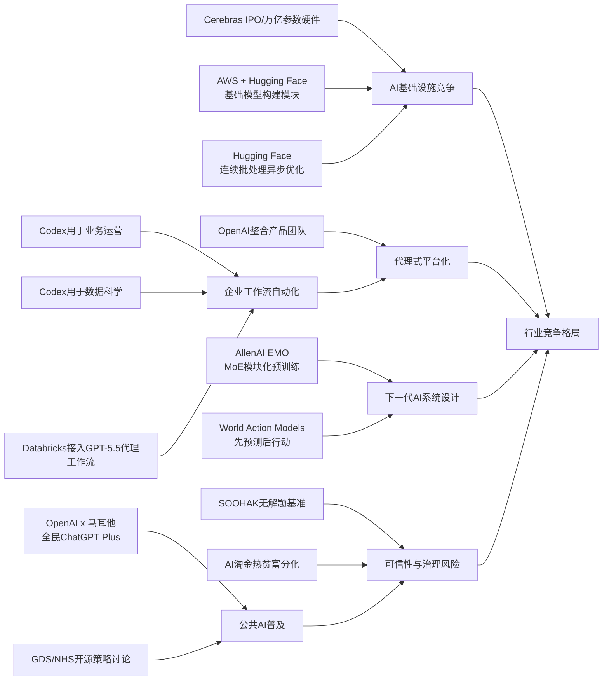

> AI 早报 · 每日早读 · 全网深度聚合

## **今日摘要**

1. 本周动态显示，AI基础设施、企业应用和模型研究都在同步推进：Cerebras借IPO强调其可支持万亿参数模型，OpenAI展示了 Codex 在业务运营中的实际价值，AllenAI则通过 EMO 探索更模块化的 MoE 设计。  
2. 在前沿方向上，世界行动模型正推动机器人先预测后行动，而 Databricks 将 GPT-5.5 引入企业代理工作流，也说明大模型正更深地嵌入真实业务执行场景。  
3. 同时，OpenAI整合产品团队押注“代理式未来”，但行业也越来越明显地出现资源向头部公司集中的趋势，AI热潮正伴随新的竞争分化与机会不均。

### 🔵 产品与功能更新

1. **Cerebras冲刺IPO，强调可承载万亿参数模型。**  
Cerebras（AI芯片公司）因启动IPO（首次公开募股）受到关注，也再次强化了自己“不是只能跑小模型”的市场定位🚀  
公司高管表示，其硬件已能服务万亿参数级模型，甚至提到可支撑 OpenAI 5.4 和 5.5 这类内部模型。  
这说明在英伟达之外，AI基础设施赛道仍有差异化选手试图争夺高端训练与推理市场。  
[IPO与硬件进展简报(briefing)](https://news.smol.ai/issues/26-05-15-not-much/)

2. **OpenAI展示Codex在业务运营团队中的实际用法。**  
OpenAI 发布案例，说明业务运营团队如何用 Codex（编程与文档助手）自动整理项目简报、战略更新、领导决策材料和进度汇报🚀  
重点不在写代码本身，而是在把真实工作输入快速整理成标准化产出。  
这类能力对非技术团队也有吸引力，因为它把“信息汇总”变成更容易复制的流程。  
[运营团队用法速览(briefing)](https://openai.com/academy/codex-for-work/how-business-operations-teams-use-codex)

3. **EMO尝试让“专家混合模型”出现更强模块化能力。**  
AllenAI 介绍了 EMO，这是一种面向 MoE（专家混合模型）的预训练方法，目标是让模型内部自然形成更清晰的“分工模块”🚀  
所谓模块化，可以理解为不同子模型更擅长处理不同类型任务，从而提升效率与扩展性。  
虽然偏研究导向，但这类工作可能影响未来更省算力、更易扩展的大模型设计。  
[EMO方法解读摘要(briefing)](https://huggingface.co/blog/allenai/emo)

### 🟢 前沿研究

1. **世界行动模型让机器人先“脑补后行动”。**  
World Action Models（世界行动模型）试图解决机器人AI的一大短板：不仅匹配动作和画面，还要理解动作会怎样改变现实世界🚀  
报道提到，这一方向的研究已形成两条主要技术路线，并梳理了约一百篇论文。  
它的关键优势是能利用普通日常视频学习，而不必完全依赖带机器人动作标注的数据。  
这意味着机器人未来可能更像人类一样，先预测后果，再决定怎么动。  
[机器人预测式学习(briefing)](https://the-decoder.com/world-action-models-give-robots-the-ability-to-simulate-consequences-before-they-move/)

2. **Databricks把GPT-5.5引入企业代理工作流。**  
Databricks 宣布在企业级 agent（代理式AI）工作流中采用 GPT-5.5，用于更复杂的办公与知识处理任务🚀  
官方提到，该模型在 OfficeQA Pro 基准测试上达到新的领先成绩。  
对企业用户来说，这代表大模型正从“聊天工具”进一步走向可嵌入业务流程的执行系统。  
[企业代理落地看点(briefing)](https://openai.com/index/databricks)

### 🟡 行业展望与社会影响

1. **OpenAI整合产品团队，押注“代理式未来”。**  
OpenAI 正把 ChatGPT、Codex 和开发者 API 团队整合到统一产品架构下，并由新的负责人统筹推进🚀  
报道显示，其目标是打造一个更像“超级应用”的平台，还可能与 Atlas 浏览器进一步结合。  
这反映出 OpenAI 不再只做单点工具，而是希望把聊天、编程、调用接口和浏览能力打包成完整入口。  
[OpenAI组织调整解读(briefing)](https://the-decoder.com/greg-brockman-consolidates-openais-product-teams-to-build-an-agentic-future/)

2. **AI淘金热中的“有者”与“无者”分化正在加剧。**  
TechCrunch 指出，当前AI热潮带来的情绪并不全是乐观，行业内部也越来越明显地分成受益者和被边缘化者🚀  
掌握算力、数据、资金和分发渠道的公司占据优势，而更多普通从业者和小团队感受到压力。  
这提醒我们，AI繁荣不仅是技术进步，也伴随着资源集中和机会不均的问题。  
[AI淘金热分化观察(briefing)](https://techcrunch.com/2026/05/16/the-haves-and-have-nots-of-the-ai-gold-rush/)

3. **Codex开始面向数据科学团队提供标准工作模版。**  
OpenAI 展示了数据科学团队如何用 Codex 生成根因分析简报、影响评估、KPI备忘录和仪表盘规格说明🚀  
这说明生成式AI正在切入“分析前整理”和“分析后表达”两个高频环节。  
对于企业来说，价值不只是替代技术操作，更是加速团队把分析结果转成可执行沟通材料。  
[数据团队实践速读(briefing)](https://openai.com/academy/codex-for-work/how-data-science-teams-use-codex)

### 🟣 开源TOP项目

1. **英国政府数字服务部门发声，讨论NHS后退开源的决定。**  
Simon Willison 转引了关于英国 NHS（国家医疗服务体系）在开源软件策略上“后退”的讨论，GDS（政府数字服务部门）也对此表态🚀  
这条动态虽然不是新项目发布，但反映了公共部门对开源模式的重新权衡。  
在AI与数字基础设施越来越关键的背景下，开源与闭源的选择正在变成治理层面的议题。  
[英国开源政策讨论(briefing)](https://simonwillison.net/2026/May/17/gds-weighs-in/#atom-everything)

2. **Hugging Face分享连续批处理中的异步优化方案。**  
这篇文章讨论 continuous batching（连续批处理）中的 asynchronicity（异步机制），重点是提升模型推理时的吞吐效率🚀  
简单说，就是让不同请求更灵活地排队和执行，减少等待浪费。  
对开源推理系统和部署平台而言，这类底层优化能直接影响成本与响应速度。  
[异步推理优化简析(briefing)](https://huggingface.co/blog/continuous_async)

### 🔴 社媒分享

1. **新数学基准暴露AI“不会承认无解”的顽疾。**  
SOOHAK 是由 64 位数学家共同设计的新基准，包含 439 道手写题，其中 99 道被故意设为无解🚀  
结果显示，模型在做题上会因更多算力而变强，但在识别“这题根本没答案”方面几乎没有明显进步。  
这类发现提醒用户：AI最危险的时刻，往往不是不会答，而是错误地自信作答。  
[无解题基准观察(briefing)](https://the-decoder.com/new-math-benchmark-reveals-ai-models-confidently-solve-problems-that-have-no-solution/)

2. **OpenAI与马耳他合作，向全民提供ChatGPT Plus。**  
OpenAI 宣布与马耳他合作，扩大AI工具的普及范围，为公民提供 ChatGPT Plus 以及相关培训🚀  
重点不仅是发放服务资格，也包括帮助公众学习如何负责任地使用AI。  
这类国家级合作显示，AI竞争正从企业采购延伸到公共教育与全民数字能力建设。  
[马耳他合作要点(briefing)](https://openai.com/index/malta-chatgpt-plus-partnership)

3. **AWS与Hugging Face总结大模型训练和推理基础模块。**  
这篇内容面向社群梳理了在 AWS（亚马逊云）上进行基础模型训练与推理所需的关键构建模块🚀  
包括算力、存储、部署与推理等核心环节，适合作为理解云端大模型基础设施的入门材料。  
虽然偏技术，但它也反映出云厂商正积极把“造模型”的流程产品化、模块化。  
[AWS模型基础模块(briefing)](https://huggingface.co/blog/amazon/foundation-model-building-blocks)

---

📊 行业洞察

1. 事实  
   Cerebras冲刺IPO并强调其硬件可承载万亿参数模型；同时，AWS与Hugging Face系统化总结了基础模型训练与推理的关键构建模块，Hugging Face还分享了连续批处理中的异步优化方案。  
   【洞察】AI基础设施竞争正在从“单一芯片性能”转向“芯片+系统软件+云部署”的全栈比拼。Cerebras试图以超大模型承载能力切入高端训练/推理市场，而云厂商与开源社区则通过推理编排、吞吐优化和模块化交付争夺企业落地入口。这意味着英伟达之外的机会仍在，但胜负关键越来越取决于系统级效率（system-level efficiency，系统整体效率）而非单点算力。

2. 事实  
   OpenAI展示Codex在业务运营团队和数据科学团队中的标准化用法；Databricks将GPT-5.5引入企业代理工作流；OpenAI还整合ChatGPT、Codex与开发者API团队，押注“代理式未来”。  
   【洞察】大模型正从“对话工具”升级为“流程执行层”。Codex案例说明生成式AI已进入简报整理、根因分析、KPI备忘录等高频知识工作；Databricks的接入则进一步把模型嵌入企业代理（agent，代理式执行系统）工作流。配合OpenAI的组织整合，行业正在形成“模型+工具+工作流+入口”一体化平台竞争，未来企业采购重点将从模型能力转向端到端自动化（end-to-end automation，全流程自动化）能力。

3. 事实  
   AllenAI提出面向MoE（Mixture of Experts，专家混合模型）的EMO预训练方法，强化模型内部模块化分工；机器人方向的World Action Models（世界行动模型）则强调通过预测动作后果实现“先模拟、后行动”。  
   【洞察】前沿研究的共同主线是让AI从“相关性生成”走向“结构化推理与可分工执行”。EMO提升的是模型内部的模块化（modularity，模块化能力）与扩展效率，World Action Models提升的是对现实变化的因果预测能力。二者虽然分属大模型架构与机器人学习，但都指向下一阶段AI系统设计：更强任务分解、更低数据依赖、更高执行可靠性。

4. 事实  
   SOOHAK数学基准显示模型对“无解题”缺乏承认无解的能力；TechCrunch指出AI淘金热中“有者”与“无者”分化加剧；OpenAI与马耳他合作向全民提供ChatGPT Plus及培训，英国NHS与GDS则就开源策略调整展开讨论。  
   【洞察】AI扩张已进入“能力普及”与“治理分化”并行阶段。一方面，国家级普及项目说明AI正成为公共数字能力基础设施；另一方面，模型幻觉（hallucination，错误但自信的生成）、资源集中和开源/闭源治理摇摆，意味着普及不等于可控。未来政策与采购将更关注可信使用（trustworthy use，可信使用）、教育培训与基础设施主权，而不只是模型可用性。

🗺️ 今日关系图

