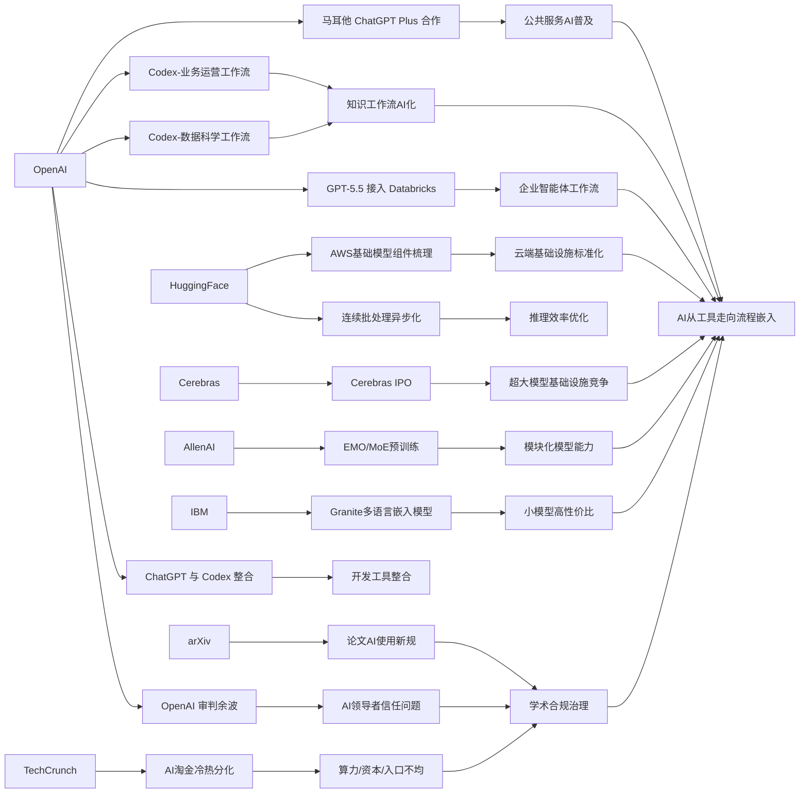

> AI 早报 · 每日早读 · 全网深度聚合

## **今日摘要**

OpenAI 与马耳他合作向更多公民提供 ChatGPT Plus，并配套培训，显示 AI 正加速走向公共服务和全民技能普及。  
与此同时，从 AWS 上标准化的大模型训练与推理组件、到 Cerebras 冲击 IPO、再到 EMO 等研究探索模块化 MoE，行业竞争正围绕“更大模型、更强基础设施、更高效分工”全面展开。  
在应用与治理层面，Codex 和 GPT-5.5 正深入企业工作流，但 arXiv 也开始严管“AI 包办论文”，说明 AI 的价值落地与合规边界正在同步成为焦点。

### 🔵 产品与功能更新

1. **马耳他向全民提供 ChatGPT Plus。**  
OpenAI 与马耳他达成合作，计划让更多公民获得 ChatGPT Plus 的使用权限，并配套提供培训资源。重点不只是“能用上”，还包括帮助民众建立实用的 AI 技能，以及理解如何负责任地使用 AI。对于普通用户来说，这类全国级合作意味着 AI 工具正从少数人尝鲜，走向更广泛的公共服务场景。🚀  
[马耳他合作计划(briefing)](https://openai.com/index/malta-chatgpt-plus-partnership)

2. **AWS 上的基础模型训练与推理组件被系统梳理。**  
Hugging Face 发布文章，介绍了在 AWS 上搭建基础模型训练与推理（模型生成结果的过程）所需的关键模块。内容更像是一份“积木清单”，帮助团队理解从算力、存储到部署的大致路径。对非技术读者来说，这说明云平台正在把大模型相关能力做成更标准化、可组合的服务。🚀  
[AWS模型积木解读(briefing)](https://huggingface.co/blog/amazon/foundation-model-building-blocks)

3. **Cerebras 以 IPO 再次进入市场焦点。**  
Cerebras 因 IPO（首次公开募股）受到关注，这家公司一直以不同于主流路线的 AI 硬件策略闻名。其首席财务官表示，公司不仅能支持小模型，还能服务万亿参数级别的大模型，并提到内部 OpenAI 5.4 和 5.5 模型相关能力。对行业来说，这传递出一个信号：AI 基础设施竞争正在从“谁有芯片”走向“谁能稳定支撑更大模型”。🚀  
[Cerebras上市观察(briefing)](https://news.smol.ai/issues/26-05-15-not-much/)

### 🟢 前沿研究

1. **EMO 尝试让专家混合模型自然形成模块化能力。**  
AllenAI 介绍了 EMO，这是一种面向专家混合模型（MoE，多个“子模型”分工协作的架构）的预训练方法。它关注“涌现式模块化”，也就是模型在训练过程中逐渐形成不同专家各司其职的能力。简单理解，就是让模型不只更大，还能更有条理地分工。🚀  
[EMO研究速览(briefing)](https://huggingface.co/blog/allenai/emo)

2. **Codex 被用于业务运营团队的日常分析与汇报。**  
OpenAI 展示了业务运营团队如何使用 Codex，把真实工作材料转成项目简报、战略更新和管理决策文件。虽然它更偏应用案例，但也反映出生成式 AI（可自动生成文本的 AI）正在深入知识工作流程。对研究趋势的意义在于，模型价值正越来越多地通过“工作流整合能力”体现出来。🚀  
[运营团队用Codex(briefing)](https://openai.com/academy/codex-for-work/how-business-operations-teams-use-codex)

3. **AI 热潮中的“有与无”成为新的讨论焦点。**  
TechCrunch 这篇文章讨论了 AI 淘金热下资源分配不均的问题，指出即便在科技行业内部，当前氛围也并不轻松。话题核心不是模型性能，而是谁拥有算力、资本与平台入口。对于前沿研究生态而言，这会直接影响哪些团队能参与下一轮技术竞赛。🚀  
[AI淘金冷热分化(briefing)](https://techcrunch.com/2026/05/16/the-haves-and-have-nots-of-the-ai-gold-rush/)

### 🟡 行业展望与社会影响

1. **arXiv 将严查“让 AI 包办论文”的作者。**  
研究论文平台 arXiv 表示，如果作者让大语言模型（能生成文本的 AI）完成几乎全部工作，可能面临一年禁投。平台正在加强对科研写作中草率使用 AI 的管理。此举反映出学术界开始从“是否能用 AI”转向“怎样用才合规”。🚀  
[arXiv新规解读(briefing)](https://techcrunch.com/2026/05/16/research-repository-arxiv-will-ban-authors-for-a-year-if-they-let-ai-do-all-the-work/)

2. **Databricks 将 GPT-5.5 引入企业智能体工作流。**  
OpenAI 介绍称，Databricks 正把 GPT-5.5 用于企业智能体工作流，也就是让 AI 参与更复杂的企业任务协作。文章提到该模型在 OfficeQA Pro 基准测试中取得了新的领先成绩。对企业用户来说，这说明更强模型正被更快地导入生产流程，而不再只是演示工具。🚀  
[Databricks接入GPT-5.5(briefing)](https://openai.com/index/databricks)

3. **OpenAI 审判收尾，AI 领导者信任问题再被放大。**  
TechCrunch 播客总结了 OpenAI 相关审判的尾声讨论，其中反复回到一个核心问题：公众是否还能信任掌握 AI 权力的人。与此同时，围绕马斯克与其创业生态的商业叙事仍在持续升温。它所折射的，不只是公司纠纷，更是 AI 行业治理与公众信心的长期议题。🚀  
[OpenAI审判余波(briefing)](https://techcrunch.com/podcast/the-openai-trial-wraps-up-and-the-musk-founder-machine-keeps-spinning/)

### 🟣 开源TOP项目

1. **Granite 多语言嵌入模型主打小体量高检索质量。**  
IBM Granite 发布多语言嵌入模型 R2，采用 Apache 2.0 开源许可，并支持 32K 上下文（一次可处理更长文本）。文章强调它在 1 亿参数以下模型中取得了很强的检索表现。对开发者而言，这类模型适合做搜索、知识库问答和文档匹配。🚀  
[Granite嵌入模型(briefing)](https://huggingface.co/blog/ibm-granite/granite-embedding-multilingual-r2)

2. **Codex 被扩展到数据科学团队工作流。**  
OpenAI 展示了数据科学团队如何利用 Codex 生成问题归因简报、影响分析、KPI 备忘录和仪表盘需求说明。它体现的不是单点写代码，而是把 AI 融入分析协作链路。对于开源与工具生态观察者来说，这说明开发类助手正进一步覆盖数据工作场景。🚀  
[数据团队用Codex(briefing)](https://openai.com/academy/codex-for-work/how-data-science-teams-use-codex)

3. **OpenAI 产品战略或进一步向整合靠拢。**  
据报道，OpenAI 联合创始人 Greg Brockman 正负责产品战略，公司还计划整合 ChatGPT 与编程产品 Codex。虽然这不是传统意义上的开源项目，但它会影响开发工具生态的产品方向。尤其对依赖 AI 编程助手的用户来说，统一入口可能提升使用连贯性。🚀  
[OpenAI产品整合(briefing)](https://techcrunch.com/2026/05/16/openai-co-founder-greg-brockman-reportedly-takes-charge-of-product-strategy/)

### 🔴 社媒分享

1. **连续批处理中的“异步化”被拿出来重点讲解。**  
Hugging Face 分享了 continuous batching（连续批处理）里的 asynchronicity（异步化）思路，核心是提升模型服务时的吞吐效率。简单说，就是让不同请求更灵活地排队和执行，减少资源空转。虽然偏技术，但这类优化会直接影响 AI 产品响应速度和成本。🚀  
[异步批处理讲解(briefing)](https://huggingface.co/blog/continuous_async)

2. **OpenClaw 更名话题被社媒记录。**  
Simon Willison 转发记录了 “Warelay -> OpenClaw” 的命名变化。虽然信息量不大，但这类更名动态常常反映项目定位、品牌方向或社区沟通策略的调整。对关注开源与 AI 工具圈的人来说，名字变化有时也是产品路线变化的前奏。🚀  
[OpenClaw更名记录(briefing)](https://simonwillison.net/2026/May/16/openclaw-names/#atom-everything)

3. **Julia Evans 的一句引用也引发了关注。**  
Simon Willison 分享了一则与 Julia Evans 相关的引用内容。尽管摘要信息有限，但这类引用传播往往说明某个观点在技术社区中引起共鸣。对社媒观察来说，它更多反映的是讨论热度与话题扩散，而非正式发布。🚀  
[Julia引用分享(briefing)](https://simonwillison.net/2026/May/16/julia-evans/#atom-everything)

---

📊 行业洞察

1. 事实：马耳他与 OpenAI 合作向更多公民开放 ChatGPT Plus，并配套 AI 培训；OpenAI 同时展示 Codex 已进入业务运营团队与数据科学团队的日常分析、汇报、备忘录和决策支持流程；Databricks 还将 GPT-5.5 引入企业智能体（Agent，能自主执行多步任务的系统）工作流。  
  【洞察】AI 正从“工具可用性”阶段走向“流程嵌入”阶段：一端是国家级普惠部署，另一端是企业级工作流深度集成，说明竞争焦点已不只是模型能力，而是“培训+场景+组织采纳”的完整落地体系。

2. 事实：Hugging Face 系统梳理了 AWS 上基础模型训练与推理所需的标准组件；Hugging Face 又讨论了连续批处理中的异步化（Asynchronicity，通过非阻塞调度提升吞吐）；Cerebras 因 IPO 受到关注，并强调其可支撑万亿参数级大模型。  
  【洞察】AI 基础设施（Infrastructure，支撑模型训练/部署的底层系统）正在进入“标准化云服务”与“差异化硬件”并行竞争的新阶段：云厂商通过模块化积木降低搭建门槛，硬件公司则通过超大模型承载能力争夺高端市场，最终比拼的是单位成本、稳定性与规模化交付能力。

3. 事实：AllenAI 推出 EMO 以促进专家混合模型（MoE，多个子模型分工协作）形成涌现式模块化能力；IBM Granite 发布小体量多语言嵌入模型，强调在 1 亿参数以下仍具强检索表现；Databricks 接入 GPT-5.5 并推动其进入企业智能体工作流。  
  【洞察】模型创新路线正在从“单纯堆参数”转向“结构效率+任务效率”双优化：前沿研究追求更好的模块化分工，开源模型追求更强的小模型性价比，企业部署则优先选择能直接转化为业务产出的模型形态，这意味着未来胜出的不一定是最大模型，而是最适配工作流的模型组合。

4. 事实：arXiv 表示若作者让大语言模型包办论文，可能面临一年禁投；TechCrunch 讨论 AI 淘金热中算力、资本与平台入口分配不均；OpenAI 审判余波则再次放大了公众对 AI 领导者信任与治理的关注。  
  【洞察】AI 产业正在同步进入“治理收紧期”：无论是学术合规、资源分配还是平台领导者公信力，行业约束都在快速增强。未来影响竞争格局的，不仅是技术领先，还包括合规治理（Compliance，符合规则与责任要求）能力、资源分发权和社会信任资本。

🗺️ 今日关系图

