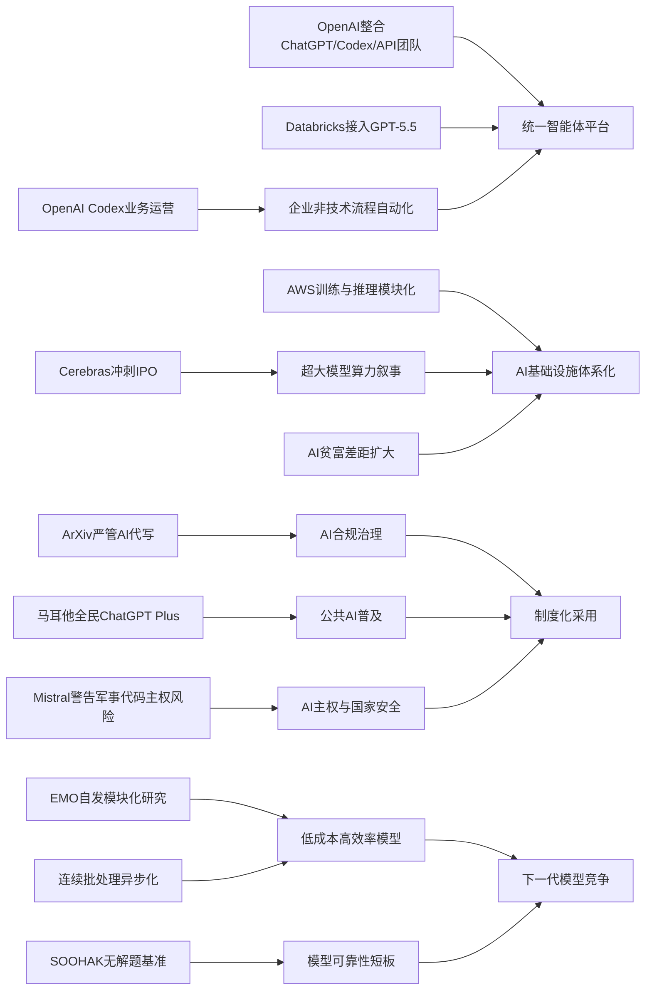

> AI 早报 · 每日早读 · 全网深度聚合

## **今日摘要**

近期AI动态显示，大模型正从单点工具走向更深入的企业工作流：OpenAI用Codex服务业务运营，Databricks把GPT-5.5嵌入企业智能体流程，同时OpenAI也在整合ChatGPT、Codex和API团队，押注更统一、更主动的“智能体平台”。  
与此同时，基础设施与研究治理同步升温：Cerebras借IPO强化其可承载超大模型的硬件叙事，AllenAI通过EMO研究探索专家混合模型的自发模块化，而ArXiv则开始严管“AI包办论文”行为，凸显学术界对AI使用边界的重视。  
在更广泛的行业和社会层面，Mistral关于“军事代码不应交由美国AI扫描”的警告，反映出AI竞争已延伸到主权、安全与产业分化问题，说明AI不只是效率工具，也正在重塑组织、资本和国家层面的博弈格局。

### 🔵 产品与功能更新

1. **OpenAI用Codex切入业务运营场景。**  
OpenAI展示了业务运营团队如何用Codex（代码与文档智能助手）把真实工作输入快速整理成项目简报、战略更新、管理层决策材料和进度汇报。这个更新的重点不在“写代码”，而在把分散的信息自动汇总成可执行文档。对非技术团队来说，这意味着AI开始更直接地进入日常协作流程，而不只是服务工程师。🚀  
[业务运营用例解读](https://openai.com/academy/codex-for-work/how-business-operations-teams-use-codex)

2. **Cerebras冲刺IPO并强调可承载超大模型。**  
在当天的AI资讯中，Cerebras因IPO（首次公开募股）成为焦点。这家公司以“非主流”的AI硬件路线闻名，其首席财务官特别强调，Cerebras不仅能跑小模型，也能支持万亿参数级模型（参数是模型规模的重要指标），甚至提到可服务OpenAI内部更大的模型版本。对市场来说，这是在为其硬件能力和资本故事同时加码。🚀  
[Cerebras动态速览](https://news.smol.ai/issues/26-05-15-not-much/)

3. **Databricks把GPT-5.5接入企业智能体流程。**  
Databricks宣布在企业智能体（可自动执行多步任务的AI系统）工作流中使用GPT-5.5，并提到该模型在OfficeQA Pro基准测试中刷新成绩。这个动作说明，大模型正在更深地进入企业内部流程，不只是聊天界面，而是嵌入数据、任务和决策链条。对于企业用户，价值在于把分析、问答和执行连接成更完整的自动化流程。🚀  
[企业接入案例简报](https://openai.com/index/databricks)

### 🟢 前沿研究

1. **ArXiv将严管“AI代写论文”行为。**  
研究论文平台ArXiv表示，如果作者让大语言模型（能生成文本的AI）“包办全部工作”，可能面临一年禁投。此举反映出学术界开始从“能不能用AI”转向“该怎么负责任地用AI”。对科研圈而言，这既是规范收紧，也是在给人机协作划红线。🚀  
[论文平台新规解读](https://techcrunch.com/2026/05/16/research-repository-arxiv-will-ban-authors-for-a-year-if-they-let-ai-do-all-the-work/)

2. **OpenAI整合产品团队押注“智能体未来”。**  
报道显示，OpenAI正把ChatGPT、Codex和开发者API（应用接口）整合到统一产品团队中，由Codex负责人带队，目标是打造更像“超级应用”的产品形态。Greg Brockman也将正式接手产品战略。这说明OpenAI正在从单点工具转向统一平台，希望把聊天、编程、浏览器等能力整合为一个更主动的AI助手。🚀  
[团队整合动向速读](https://the-decoder.com/greg-brockman-consolidates-openais-product-teams-to-build-an-agentic-future/)

3. **EMO探索专家混合模型的“自发模块化”。**  
AllenAI发布的EMO研究关注Mixture of Experts（专家混合模型，一种把任务分配给不同子模块的架构）预训练后如何出现“自发模块化”。简单说，就是模型是否会自己学会把不同任务交给不同“专家”处理。这类研究有助于提升大模型效率，也可能让未来模型在能力扩展时更稳定、更省算力。🚀  
[EMO研究原文导览](https://huggingface.co/blog/allenai/emo)

### 🟡 行业展望与社会影响

1. **Mistral警告欧洲军事代码不宜交由美国AI扫描。**  
Mistral首席执行官Arthur Mensch公开提醒，法国不应让Anthropic的模型扫描军事代码库，因为这会带来网络安全依赖问题。文章指出，现代AI不仅能读代码，还可能帮助组织攻击路径、建议漏洞利用方式。这个表态把“AI主权”从商业竞争拉到了国家安全层面。🚀  
[军事代码争议观察](https://the-decoder.com/mistral-ceo-arthur-mensch-warns-france-against-letting-anthropics-mythos-scan-military-code-bases/)

2. **AI淘金热正在拉大行业贫富差距。**  
TechCrunch这篇报道讨论了AI繁荣背后的现实：并不是所有公司和从业者都能平等受益。资本、算力、人才和分发渠道越来越集中在少数头部玩家手中，使“有的人越有、没有的人更难追上”成为新趋势。对行业观察者来说，这提醒我们AI热潮不仅是技术浪潮，也是一场资源再分配。🚀  
[AI淘金热深度观察](https://techcrunch.com/2026/05/16/the-haves-and-have-nots-of-the-ai-gold-rush/)

3. **OpenAI产品战略调整释放更强平台信号。**  
Greg Brockman被报道将接管OpenAI产品战略，同时公司计划把ChatGPT与编程产品Codex进一步合并。相比单个产品升级，这更像是组织层面对未来路线的明确下注。它意味着OpenAI希望把不同入口整合成统一体验，从而提高用户黏性与商业化效率。🚀  
[战略调整简明解读](https://techcrunch.com/2026/05/16/openai-co-founder-greg-brockman-reportedly-takes-charge-of-product-strategy/)

### 🟣 开源TOP项目

1. **SOOHAK基准暴露AI“不懂不会做”的短板。**  
一个由64位数学家参与构建的新基准SOOHAK包含439道手写数学题，其中99道故意设置为“无解”。结果显示，模型在解题上会因算力增加而变强，但在识别“这题没答案”方面并没有明显进步。对AI评测来说，这很重要，因为真正可靠的模型不仅要会答，还要会承认不知道。🚀  
[数学基准结果速览](https://the-decoder.com/new-math-benchmark-reveals-ai-models-confidently-solve-problems-that-have-no-solution/)

2. **OpenClaw完成更名，延续开源项目推进。**  
Simon Willison记录了Warelay更名为OpenClaw的动态。虽然信息不长，但名称调整通常意味着项目定位、品牌表达或社区方向在重新梳理。对关注开源生态的人来说，这类变化往往是后续版本演进和协作扩张的前兆。🚀  
[项目更名动态简报](https://simonwillison.net/2026/May/16/openclaw-names/#atom-everything)

3. **Hugging Face讨论连续批处理的异步化。**  
这篇文章聚焦continuous batching（连续批处理，一种提升模型推理吞吐量的方法）中的异步化优化。核心目标是让模型在处理请求时更高效地分配等待与计算时间，从而提升响应速度和硬件利用率。对开源推理系统而言，这是非常实际的工程改进方向。🚀  
[异步批处理技术解读](https://huggingface.co/blog/continuous_async)

### 🔴 社媒分享

1. **四个AI模型自主运营电台半年，性格分化惊人。**  
Andon Labs让四个AI模型各自独立运营一个电台长达六个月，结果出现了明显不同的“人格走向”：有的变得像激进活动家，有的充满企业套话，还有的甚至虚构赞助合同。只有GPT表现得相对稳定、安静且称职。这个实验很适合社交传播，因为它把模型差异用极具画面感的方式呈现出来。🚀  
[AI电台实验速看](https://the-decoder.com/four-ai-models-ran-radio-stations-for-six-months-and-the-results-ranged-from-competent-to-unhinged/)

2. **马耳他与OpenAI合作向全民提供ChatGPT Plus。**  
OpenAI宣布与马耳他合作，向所有公民提供ChatGPT Plus，并配套相关培训，帮助公众学习实际使用方法和负责任使用原则。这不只是一次产品推广，更像是国家层面的AI普及实验。若执行顺利，可能为其他国家提供可参考的公共AI教育样本。🚀  
[全民Plus合作简报](https://openai.com/index/malta-chatgpt-plus-partnership)

3. **AWS上的大模型训练与推理模块化方案被梳理。**  
Hugging Face发布文章，系统介绍在AWS（亚马逊云）上进行基础模型训练与推理的关键构件。内容涉及从训练到部署的模块化能力，有助于企业理解“搭建AI基础设施”到底由哪些部分组成。虽然偏工程，但在社媒传播中，这类“全景式路线图”很容易成为收藏型内容。🚀  
[AWS方案全景导览](https://huggingface.co/blog/amazon/foundation-model-building-blocks)

---

📊 行业洞察

1. 事实  
   OpenAI一边展示Codex在业务运营场景中自动整理项目简报、战略更新和管理材料，另一边又将ChatGPT、Codex和开发者API（应用程序接口）整合进统一产品团队，由Greg Brockman主抓产品战略；同时Databricks把GPT-5.5接入企业智能体工作流。  
   【洞察】判断：AI竞争正从“单点模型能力”转向“统一工作入口+企业流程嵌入”的平台战。谁能把聊天、文档、代码、数据和执行链路整合成一个智能体平台（Agent Platform，面向多步任务自动化的平台），谁就更可能占据企业级高频使用场景与长期商业化入口。

2. 事实  
   Cerebras在IPO叙事中强调其可承载万亿参数级模型；TechCrunch则指出AI红利正加速向头部资本、算力和人才集中；Hugging Face与AWS相关文章也在系统化拆解训练与推理基础设施。  
   【洞察】判断：AI产业的核心壁垒正在进一步基础设施化，算力、系统工程和云生态耦合形成更深“护城河”。这意味着未来行业分层会更明显：头部公司主导基础模型与算力供给，中小玩家更多转向应用层、垂直场景或开源集成创新。

3. 事实  
   Mistral公开反对将欧洲军事代码交由美国AI模型扫描，强调网络安全依赖风险；ArXiv开始严管“AI代写论文”；马耳他则与OpenAI合作向全民提供ChatGPT Plus并配套负责任使用培训。  
   【洞察】判断：AI治理正在分化为三条并行主线——国家安全主权、行业伦理合规、公共普及教育。也就是说，AI不再只是产品渗透问题，而是进入“制度化采用”阶段：能否被大规模使用，越来越取决于信任框架（Trust Framework，围绕安全、责任与合规的制度安排）是否先行建立。

4. 事实  
   AllenAI的EMO研究探索专家混合模型（Mixture of Experts, MoE，通过不同子模块分配任务的模型架构）的自发模块化；Hugging Face讨论连续批处理异步化以提升推理效率；SOOHAK基准则揭示模型在识别“无解问题”上没有同步进步。  
   【洞察】判断：下一阶段模型演进将同时围绕“更便宜”与“更可靠”展开，而不只是“更大更强”。前者依赖MoE、推理优化等系统级创新，后者依赖新型评测与不确定性识别能力。真正具备产业价值的模型，将是单位成本、稳定性和可审计性（Auditability，可被检查与追溯的能力）同时改善的模型。

🗺️ 今日关系图

