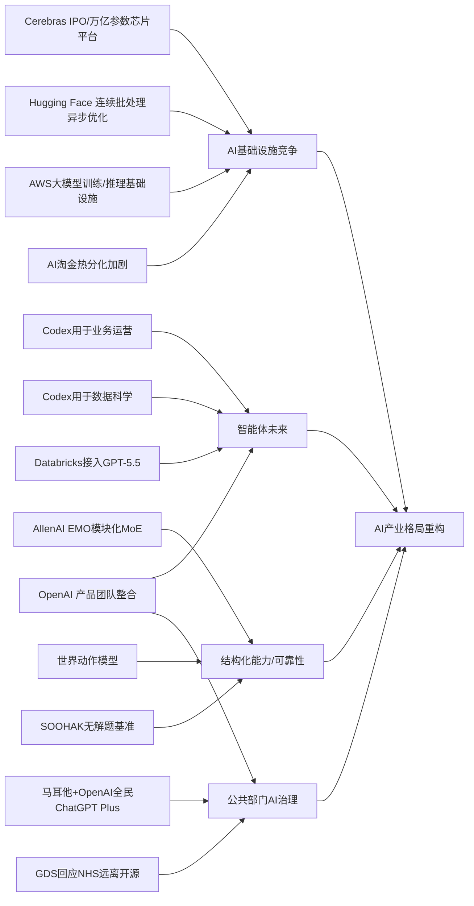

> AI 早报 · 每日早读 · 全网深度聚合

## **今日摘要**

近期AI行业一边在强化底层能力，一边把AI更深地接入真实工作：Cerebras借IPO强调其芯片可支撑万亿参数模型，OpenAI和Databricks则展示了Codex与GPT-5.5如何进入企业运营和智能体流程。  
在研究前沿，EMO和世界动作模型分别探索让模型自动形成更清晰的“专家分工”以及让机器人先模拟后行动，反映出AI正朝着更高效、更可泛化的方向演进。  
同时，OpenAI整合产品团队押注“智能体未来”，而行业也在资本、算力和机会分配上出现更明显分化，说明AI竞争已从单纯比模型能力转向比产品体系与资源掌控力。

### 🔵 产品与功能更新

1. **Cerebras推进IPO，并强调可承载万亿参数模型。**  
Cerebras因启动IPO（首次公开募股）再次成为焦点。这家公司以“非主流”AI芯片路线闻名，其高管特别强调，平台并不只适合小模型，也能服务万亿参数级别的大模型。报道还提到其可支持内部版本的OpenAI 5.4、5.5模型，意在回应外界对其能力边界的质疑。对普通用户来说，这意味着AI底层算力竞争正在变得更激烈🚀  
[IPO与芯片能力解读(briefing)](https://news.smol.ai/issues/26-05-15-not-much/)

2. **OpenAI展示Codex在业务运营团队中的用法。**  
OpenAI发布了面向业务运营团队的Codex使用案例。它可以根据真实工作材料生成项目说明、战略更新、管理层决策材料和进度汇报，帮助团队减少文档整理与重复沟通。这里的Codex可理解为面向工作流程的AI编程与协作助手，不只服务工程师，也开始深入运营场景。对于企业来说，这类工具正从“写代码”扩展到“推进业务”🚀  
[运营团队Codex指南(briefing)](https://openai.com/academy/codex-for-work/how-business-operations-teams-use-codex)

3. **EMO尝试让“专家混合模型”自然长出模块化能力。**  
AllenAI介绍了EMO，这是一种专家混合模型（Mixture of Experts，指把任务分配给不同“专家”子模块）的预训练方法。核心目标是让模型在训练过程中涌现出更清晰的模块分工，而不是所有能力都混在一起。对于非技术读者来说，这有点像让一个团队自动形成“有人擅长写作、有人擅长计算”的协作结构。若效果稳定，未来模型可能更高效、更易扩展🚀  
[EMO方法速览(briefing)](https://huggingface.co/blog/allenai/emo)

### 🟢 前沿研究

1. **世界动作模型让机器人先“想后动”。**  
World Action Models（世界动作模型）试图补足机器人AI的核心短板：不仅学会“看到什么该怎么动”，还要理解“动了之后世界会怎样变化”。相关综述整理了约一百篇论文，并指出这类模型可从普通日常视频中学习，而不必依赖大量机器人动作标注。简单说，就是让机器人先在“脑内模拟”后果，再决定是否行动。若继续成熟，机器人在复杂环境中的安全性和泛化能力都有望提升🚀  
[机器人先模拟后行动(briefing)](https://the-decoder.com/world-action-models-give-robots-the-ability-to-simulate-consequences-before-they-move/)

2. **Databricks将GPT-5.5接入企业智能体流程。**  
Databricks宣布在企业智能体（agent，指可自动执行多步任务的AI系统）工作流中采用GPT-5.5。官方提到，该模型在OfficeQA Pro基准测试上刷新了当前最佳成绩，因此被用于更复杂的企业场景。对企业用户而言，这意味着AI不再只是回答问题，而是逐步进入“代办、分析、协调”的工作模式。企业级AI应用正在从试点走向更深层整合🚀  
[Databricks接入GPT-5.5(briefing)](https://openai.com/index/databricks)

### 🟡 行业展望与社会影响

1. **OpenAI整合产品团队，押注“智能体未来”。**  
OpenAI正在把ChatGPT、编程助手Codex和开发者API整合到一个统一产品团队中，并计划进一步结合Atlas浏览器。报道显示，OpenAI联合创始人Greg Brockman将正式接手产品战略，目标是打造一个更像“超级应用”的统一入口。这里的“智能体未来”指AI不只是聊天工具，而是能主动完成任务的平台。此举说明AI公司的竞争焦点，正从单点模型能力转向完整产品体系🚀  
[OpenAI产品整合观察(briefing)](https://the-decoder.com/greg-brockman-consolidates-openais-product-teams-to-build-an-agentic-future/)

2. **AI淘金热中的分化正在加剧。**  
TechCrunch文章指出，当前AI热潮带来的并不只是乐观情绪，行业内部也出现了明显的“有”和“没有”分层。一部分公司与人才掌握了资金、算力和市场话语权，另一部分则更难分享到增长红利。对普通读者来说，这和每次技术浪潮相似：机会很多，但收益往往先集中在少数头部玩家手中。AI产业的下一阶段，可能不只是创新竞赛，也是资源分配竞赛🚀  
[AI淘金热分化解析(briefing)](https://techcrunch.com/2026/05/16/the-haves-and-have-nots-of-the-ai-gold-rush/)

3. **Codex开始进入数据科学团队日常工作。**  
OpenAI展示了数据科学团队如何使用Codex完成问题归因、影响评估、KPI备忘录和分析范围设计等任务。也就是说，AI不仅能辅助建模，还能帮助整理分析思路、撰写汇报材料、定义看板需求。对很多公司而言，这会降低部分分析工作的时间成本，让团队把精力更多放在判断与决策上。数据科学与生成式AI（可自动生成文本、代码等内容的AI）的融合正在加速🚀  
[数据团队Codex案例(briefing)](https://openai.com/academy/codex-for-work/how-data-science-teams-use-codex)

### 🟣 开源TOP项目

1. **英国政府数字服务部门发声，回应NHS远离开源。**  
围绕NHS（英国国家医疗服务体系）减少开源采用的决定，GDS（英国政府数字服务部门）给出了回应。虽然原文偏向政策与治理讨论，但核心仍是一个老问题：公共系统是否应继续依赖开源软件。对非技术读者来说，开源意味着代码公开、可被更多人检查和复用，通常也有利于透明度。医疗和政府系统如何在安全、成本与可控性之间取舍，仍是长期争议点🚀  
[英国开源政策回应(briefing)](https://simonwillison.net/2026/May/17/gds-weighs-in/#atom-everything)

2. **Hugging Face介绍连续批处理中的异步优化。**  
这篇文章聚焦continuous batching（连续批处理，一种提升模型服务效率的推理调度方式）中的异步能力释放。它讨论的是如何让模型在处理不同请求时更灵活地安排计算资源，从而减少等待、提高吞吐量。对普通读者来说，这类优化虽然不直接可见，但会影响AI产品是否更快、更省钱。推理效率正成为开源社区的重要竞争方向🚀  
[异步批处理优化解读(briefing)](https://huggingface.co/blog/continuous_async)

### 🔴 社媒分享

1. **新数学基准显示，AI会自信回答“无解题”。**  
一个由64位数学家组成的团队推出SOOHAK基准测试，其中包含439道手写题目，故意加入了99道无解题。结果显示，模型在解题上会因更多算力而提升，但在承认“这题没有答案”方面几乎没有明显进步。简单说，AI不仅会犯错，还可能非常自信地犯错。这对教育、科研和专业决策场景都是重要提醒🚀  
[AI无解题失误观察(briefing)](https://the-decoder.com/new-math-benchmark-reveals-ai-models-confidently-solve-problems-that-have-no-solution/)

2. **马耳他与OpenAI合作，向全民提供ChatGPT Plus。**  
OpenAI与马耳他达成合作，计划向公民提供ChatGPT Plus，并配套培训以提升实用AI技能与负责任使用意识。这不仅是产品推广，也是一种国家层面的AI普及实验。对普通用户来说，重点不只是“能不能用上更高级版本”，而是政府是否开始把AI当作基础数字能力的一部分。未来可能会有更多国家跟进类似模式🚀  
[马耳他全民AI计划(briefing)](https://openai.com/index/malta-chatgpt-plus-partnership)

3. **AWS上的大模型训练与推理基础设施被系统梳理。**  
Hugging Face发布文章，介绍在AWS（亚马逊云）上进行基础模型训练与推理的关键构件。内容覆盖从训练到部署的一系列基础能力，帮助团队理解如何搭建完整的大模型工作流。对非技术读者来说，这类文章反映出一个趋势：AI竞争不只是模型本身，也包括云平台和底层工程体系。谁能把训练、部署、成本控制做得更顺，谁就更容易承接AI落地需求🚀  
[AWS大模型基础设施(briefing)](https://huggingface.co/blog/amazon/foundation-model-building-blocks)

---

📊 行业洞察

1. 事实  
   - Cerebras推进IPO（首次公开募股），并强调其芯片平台可承载万亿参数模型。  
   - Hugging Face同步讨论连续批处理（continuous batching，推理调度优化）异步能力释放，以及AWS上的大模型训练与推理基础设施。  
   - TechCrunch指出AI淘金热中的资源分化正在加剧。  
   【洞察】AI竞争正在从“模型能力比拼”升级为“算力资本开支+推理工程效率+云基础设施整合”的三维竞争。Cerebras借IPO强化“重资产算力平台”叙事，而开源社区与云厂商则在推理效率和部署栈上加速补位；这意味着行业门槛正从单纯算法创新，转向芯片、资金、系统工程协同能力，头部集中度可能进一步上升。

2. 事实  
   - OpenAI展示Codex在业务运营团队中的用法，可生成项目说明、战略更新和管理层材料。  
   - OpenAI还展示了Codex进入数据科学团队日常，用于问题归因、影响评估、KPI备忘录和分析范围设计。  
   - Databricks宣布将GPT-5.5接入企业智能体（agent，可自动执行多步任务的AI系统）工作流。  
   - OpenAI整合ChatGPT、Codex和开发者API团队，押注“智能体未来”。  
   【洞察】企业AI正从“问答助手”转向“工作流操作系统（workflow OS，承载任务流转与协作的统一平台）”。Codex跨运营、数据科学的落地，说明生成式AI（可自动生成文本、代码等内容的AI）已突破研发部门边界；而Databricks与OpenAI的动作则进一步表明，未来竞争核心不是单次回答质量，而是谁能嵌入企业真实流程、调度多步任务并沉淀组织知识。

3. 事实  
   - AllenAI推出EMO预训练方法，试图让专家混合模型（Mixture of Experts, MoE，把任务分配给不同“专家”子模块）自然形成更清晰的模块分工。  
   - 世界动作模型（World Action Models）研究强调机器人可先模拟行动后果，再决定动作，并且可从日常视频学习。  
   - SOOHAK数学基准显示，模型在面对“无解题”时仍会自信给出错误答案。  
   【洞察】下一阶段模型研发重点，正在从“更大会不会更强”转向“结构化认知与可靠性控制”。EMO和世界动作模型代表模型内部开始追求模块化分工与因果模拟能力，而SOOHAK则暴露了当前大模型在不确定性表达和边界感知上的缺陷。换言之，行业正在从扩规模逻辑，转入“让模型知道何时该推理、何时该拒答、何时该先模拟”的能力建设阶段。

4. 事实  
   - 马耳他与OpenAI合作，向公民提供ChatGPT Plus，并配套培训与负责任使用教育。  
   - 英国政府数字服务部门回应NHS远离开源的争议，反映公共部门在开源、安全、成本与可控性之间的权衡。  
   - OpenAI正强化统一产品入口和平台化战略。  
   【洞察】AI正在从企业工具采购议题，升级为国家级数字基础设施与公共服务能力议题。一方面，马耳他模式说明政府开始把通用AI视为“全民数字能力”组成部分；另一方面，NHS开源争议说明公共系统在主权、安全、成本和供应商锁定（vendor lock-in，过度依赖单一厂商）之间的博弈会更加突出。未来各国AI政策重点，可能从“鼓励使用”转向“选择哪类生态、如何治理依赖”。

🗺️ 今日关系图

