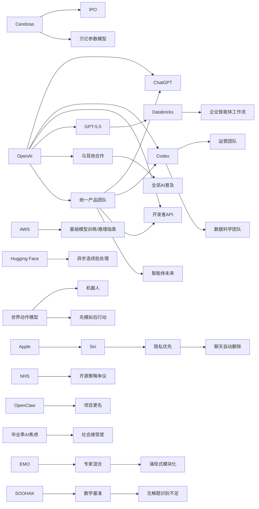

> AI 早报 · 每日早读 · 全网深度聚合

## **今日摘要**

苹果、OpenAI、Cerebras 等公司的最新动态显示，AI 竞争正在从单点模型能力转向更重视隐私、安全、产品整合以及支撑超大规模模型的基础设施。  
研究与企业应用两端也在同步推进：一方面机器人开始探索“先模拟后行动”的世界动作模型、MoE 模型出现更自然分工，另一方面 GPT-5.5、Codex 正更深地进入企业运营和智能体工作流。  
与此同时，AI 的社会影响也更复杂了——行业持续押注“智能体未来”，但公众尤其年轻人对 AI 的态度，正从早期兴奋转向夹杂就业焦虑与不确定感的谨慎关注。

### 🔵 产品与功能更新

1. **苹果或为新版 Siri 加入聊天自动删除。**
新版 Siri 的重点之一将是“隐私优先”，其中可能包含对话自动删除功能。对普通用户来说，这意味着和语音助手的聊天记录不必长期保留，能降低隐私泄露担忧。苹果显然希望把“更安全地使用 AI”作为这次升级的重要卖点。🚀  
[苹果隐私版Siri前瞻(briefing)](https://techcrunch.com/2026/05/17/apples-siri-revamp-could-include-auto-deleting-chats/)

2. **OpenAI 展示运营团队如何使用 Codex。**
OpenAI 发布案例，说明业务运营团队如何用 Codex（编程与文档智能助手）处理真实工作输入。它可以生成项目简报、战略更新、管理层决策材料和进度汇报等内容。对非技术部门而言，这代表 AI 正从“写代码”扩展到日常协作与管理流程。🚀  
[运营团队用Codex案例(briefing)](https://openai.com/academy/codex-for-work/how-business-operations-teams-use-codex)

3. **Cerebras 借 IPO 强调可支持万亿参数模型。**
Cerebras 在上市（IPO，首次公开募股）话题下再次强调，其硬件并不只适合小模型。公司高管表示，平台已经能够服务万亿参数级别的大模型，包括文中提到的 OpenAI 内部模型。对市场来说，这释放出一个信号：AI 基础设施竞争正在从“能不能跑”转向“能否支撑更大规模”。🚀  
[Cerebras上市与能力表态(briefing)](https://news.smol.ai/issues/26-05-15-not-much/)

### 🟢 前沿研究

1. **世界动作模型让机器人先“想后动”。**
世界动作模型（World Action Models）试图补上机器人 AI 的关键短板：不仅学动作和画面的对应关系，还要理解动作会如何改变现实世界。相关综述整理了近百篇论文，并指出这类方法还能利用日常视频学习，不必完全依赖带机器人动作标注的数据。简单说，机器人未来可能更像是在“脑内预演”后再行动。🚀  
[机器人先模拟再行动(briefing)](https://the-decoder.com/world-action-models-give-robots-the-ability-to-simulate-consequences-before-they-move/)

2. **Databricks 将 GPT-5.5 引入企业智能体流程。**
Databricks 宣布把 GPT-5.5 用于企业智能体（Agent，可自动执行多步任务的 AI 系统）工作流。根据介绍，这一模型在 OfficeQA Pro 基准测试上取得了新的领先成绩。对企业用户而言，这意味着更复杂的问答、办公和流程自动化正在加速落地。🚀  
[GPT5.5进入企业工作流(briefing)](https://openai.com/index/databricks)

3. **EMO 探索专家混合模型的“自然分工”。**
EMO 研究关注专家混合（Mixture of Experts，一种让多个子模型分工协作的架构）在预训练阶段如何形成“涌现式模块化”。通俗理解，就是让模型内部不同部分更自然地各司其职，而不是一锅煮。这样的方向有望提升大模型效率，也可能让模型在复杂任务上更稳定。🚀  
[EMO模块化训练解读(briefing)](https://huggingface.co/blog/allenai/emo)

### 🟡 行业展望与社会影响

1. **OpenAI 整合产品团队，押注“智能体未来”。**
OpenAI 正把 ChatGPT、Codex 和开发者 API 团队整合为统一产品团队，并由 Codex 负责人领导。目标是打造一个更像“超级应用”的体系，未来还可能整合 Atlas 浏览器。这个动作说明，AI 公司竞争正从单一模型能力转向产品整合与生态入口之争。🚀  
[OpenAI产品线大整合(briefing)](https://the-decoder.com/greg-brockman-consolidates-openais-product-teams-to-build-an-agentic-future/)

2. **毕业演讲谈 AI，越来越难鼓舞年轻人。**
TechCrunch 这篇评论指出，在 2026 年的毕业演讲里提 AI，未必还能让毕业生感到兴奋。原因在于，许多年轻人对 AI 带来的就业压力和未来不确定性更敏感。它反映出社会舆论正在从“技术乐观”转向“机会与焦虑并存”。🚀  
[毕业季里的AI焦虑(briefing)](https://techcrunch.com/2026/05/17/if-youre-giving-a-commencement-speech-in-2026-maybe-dont-mention-ai/)

3. **OpenAI 展示数据科学团队如何使用 Codex。**
OpenAI 介绍了数据科学团队使用 Codex 的场景，包括问题归因简报、影响分析、KPI 备忘录和仪表盘规范等。也就是说，AI 不只是帮程序员写代码，还在进入分析、汇报和决策支持环节。对企业组织来说，这会进一步改变知识工作的分工方式。🚀  
[数据团队用Codex案例(briefing)](https://openai.com/academy/codex-for-work/how-data-science-teams-use-codex)

### 🟣 开源TOP项目

1. **连续批处理的异步化优化迎来新实践。**
这篇 Hugging Face 博文讨论如何在连续批处理（continuous batching，一种提升模型推理吞吐量的方法）中引入异步机制。核心目标是让模型服务在处理不同请求时更高效，减少等待与资源浪费。对于开源部署社区而言，这类优化直接关系到大模型运行成本和响应速度。🚀  
[异步连续批处理实践(briefing)](https://huggingface.co/blog/continuous_async)

2. **NHS 退回非开源路线，引发开源讨论。**
这篇文章围绕英国 NHS 在开源策略上的退缩展开，GDS 也给出了自己的看法。它反映出公共部门在开源软件、可控性和采购现实之间仍在拉扯。对开源社区来说，这不仅是技术选择，更是治理与长期依赖问题。🚀  
[NHS开源策略再争议(briefing)](https://simonwillison.net/2026/May/17/gds-weighs-in/#atom-everything)

3. **AWS 发布基础模型训练与推理构建指南。**
这篇 Hugging Face 内容聚焦 AWS 上基础模型（Foundation Model，大规模通用模型）的训练与推理基础组件。它更像一份面向开发者和团队的“搭积木”说明，帮助理解云平台上如何组织模型训练、部署与服务。对开源实践者来说，这类指南有助于降低上手门槛。🚀  
[AWS模型构建模块指南(briefing)](https://huggingface.co/blog/amazon/foundation-model-building-blocks)

### 🔴 社媒分享

1. **新数学基准发现：AI 会自信解答“无解题”。**
SOOHAK 是由 64 位数学家共同构建的新基准，包含 439 道手写题，其中 99 道被故意设计为无解。结果显示，模型算力更强后，解题能力会上升，但识别“这题根本没答案”的能力并没有同步变好。这非常适合社交媒体传播，因为它直击一个公众很容易理解的问题：AI 不是只会犯错，它还可能“很自信地犯错”。🚀  
[AI自信答错无解题(briefing)](https://the-decoder.com/new-math-benchmark-reveals-ai-models-confidently-solve-problems-that-have-no-solution/)

2. **OpenAI 与马耳他合作，向全民提供 ChatGPT Plus。**
OpenAI 与马耳他达成合作，要把 ChatGPT Plus 和相关培训带给所有公民。除了扩大 AI 工具使用范围，这项合作也强调负责任使用与实用技能培养。它很容易在社媒上引发讨论：未来会不会有更多国家把高级 AI 服务当作公共数字能力的一部分。🚀  
[马耳他全民ChatGPT Plus(briefing)](https://openai.com/index/malta-chatgpt-plus-partnership)

3. **OpenClaw 更名动态引发关注。**
这则内容记录了项目从 Warelay 到 OpenClaw 的名称变化。虽然信息量不算大，但开源项目改名往往会影响社区认知、搜索传播和品牌延续性。对于长期关注开发者生态的人来说，这类“小事”常常也会在社媒上形成讨论。🚀  
[OpenClaw改名记录(briefing)](https://simonwillison.net/2026/May/16/openclaw-names/#atom-everything)

📊 行业洞察

1. 事实  
   OpenAI 正把 ChatGPT、Codex 和开发者 API 团队整合为统一产品团队，并由 Codex 负责人领导；同时，OpenAI 又分别展示了运营团队、数据科学团队如何使用 Codex 处理简报、分析、汇报和决策材料；Databricks 也宣布把 GPT-5.5 引入企业智能体（Agent，可自动执行多步任务的 AI 系统）工作流。  
   【洞察】AI 竞争正在从“单点模型能力”转向“工作流级产品整合”。模型厂商不再只卖推理能力，而是在构建覆盖知识生产、流程执行与协同入口的“超级应用”与企业操作层（Operating Layer，承载业务流程的统一智能平台）。谁能把模型、工具链和组织内使用场景打通，谁就更可能形成高粘性分发优势。

2. 事实  
   苹果计划为新版 Siri 加入聊天自动删除，强调“隐私优先”；马耳他与 OpenAI 合作，向全民提供 ChatGPT Plus 和相关培训；毕业演讲评论则反映年轻人对 AI 的就业焦虑正在上升。  
   【洞察】AI 正进入“大众基础设施化”阶段，但普及门槛已不只是可用性，而是“信任—治理—社会接受度”三重约束。苹果押注隐私设计，OpenAI通过国家级合作推进普惠使用，说明未来消费级 AI 的核心竞争力将不仅是能力领先，还包括数据治理（Data Governance，对数据使用和保存的制度化管理）、公众教育和风险沟通能力。

3. 事实  
   Cerebras 借 IPO 强调其硬件已可支持万亿参数模型；Hugging Face 讨论了连续批处理（continuous batching，一种提升推理吞吐的方法）的异步化优化；AWS 也发布基础模型训练与推理构建指南。  
   【洞察】AI 基础设施竞争正在从“堆算力”升级为“算力 + 系统效率 + 工程工具”的复合竞争。前端看是更大模型，后端看则是训练、推理、调度、部署全链路优化。未来基础设施厂商的护城河，不只是芯片峰值性能，还包括吞吐优化、成本控制和开发者可组合性（Composability，模块化拼装能力）。

4. 事实  
   世界动作模型（World Action Models）强调机器人在行动前先模拟后果；EMO 研究探索专家混合（Mixture of Experts, MoE，一种多子模型分工协作架构）的自然分工；SOOHAK 数学基准显示模型即便更强，也未同步提升识别“无解题”的能力。  
   【洞察】下一阶段模型演进重点将从“更大会答题”转向“更会分工、规划与校验”。一方面，机器人和智能体需要世界模型（World Model，对环境和后果的内部表征）来支持多步决策；另一方面，MoE 和新基准暴露出，模型若缺乏不确定性识别（Uncertainty Awareness，对未知和无解状态的判断能力），就难以安全进入高价值任务场景。能力提升正从“生成质量”转向“认知结构质量”。

🗺️ 今日关系图

